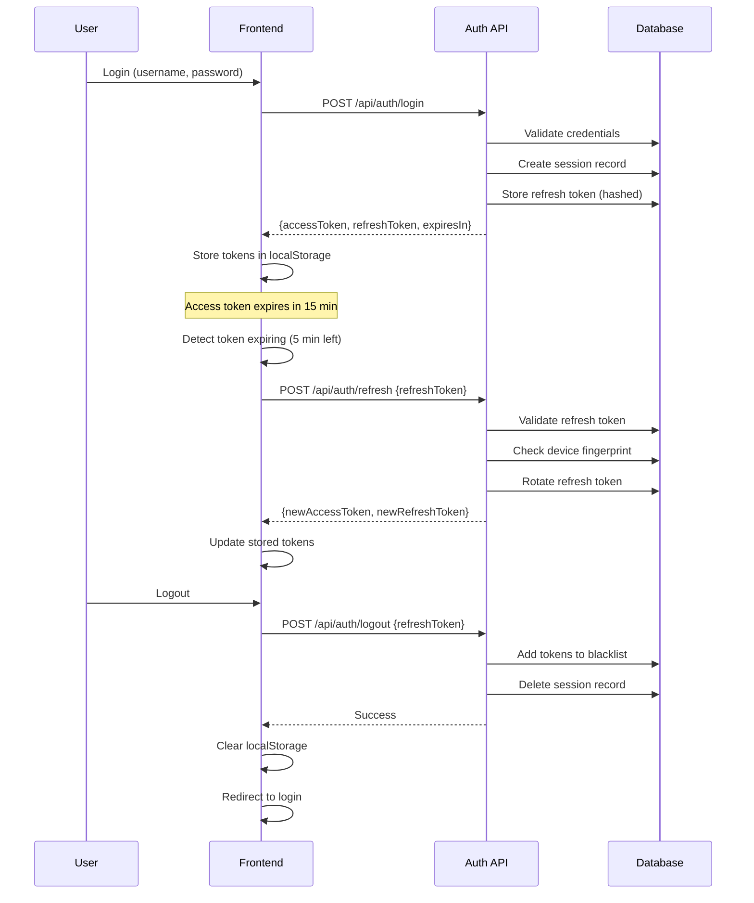
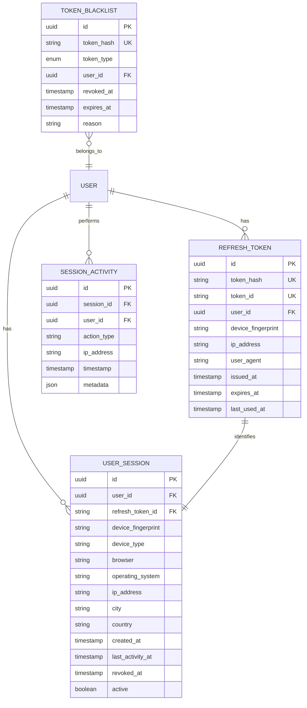

# Design Document: Enhanced Session Management

## Overview

This design document specifies the implementation of enhanced session management for the Urban Cleaning Management System. The enhancement introduces refresh tokens, token revocation, multi-device session management, automatic token renewal, and comprehensive session tracking to improve both security and user experience.

### Current State

The existing system uses:
- Simple JWT access tokens with 24-hour expiration
- No refresh token mechanism
- Basic logout that only clears localStorage
- No session tracking or management
- No token revocation capability

### Target State

The enhanced system will provide:
- Dual-token system: short-lived access tokens (15 min) + long-lived refresh tokens (7 days)
- Token revocation with blacklist
- Multi-device session management (up to 5 concurrent sessions)
- Automatic token refresh before expiration
- Session activity tracking and history
- Device fingerprinting for security
- Admin session introspection capabilities

### Technology Stack

- **Backend**: Spring Boot (Java) with Spring Security
- **Database**: PostgreSQL for session and blacklist storage
- **Frontend**: React with Context API for session state
- **Security**: JWT with HS512, BCrypt for token hashing
- **Caching**: Redis (optional) for blacklist performance

## Architecture

### High-Level Architecture

```mermaid
graph TB
    subgraph "Frontend Layer"
        A[React App]
        A1[AuthContext]
        A2[TokenRefreshService]
        A3[SessionManager]
    end
    
    subgraph "API Layer"
        B[Auth Controller]
        B1[/api/auth/login]
        B2[/api/auth/refresh]
        B3[/api/auth/logout]
        B4[/api/auth/logout-all]
        B5[/api/auth/sessions]
    end
    
    subgraph "Service Layer"
        C[TokenService]
        C1[RefreshTokenService]
        C2[SessionService]
        C3[TokenRevocationService]
        C4[DeviceFingerprintService]
    end
    
    subgraph "Data Layer"
        D[(PostgreSQL)]
        D1[refresh_tokens]
        D2[token_blacklist]
        D3[user_sessions]
        D4[session_activity]
    end
    
    A --> B
    B --> C
    C --> D
    A2 -.automatic refresh.-> B2
    A3 -.session tracking.-> B5
```


### Token Flow Diagram



## Components and Interfaces

### Backend Components

#### 1. Token Service

**TokenService.java**
```java
@Service
public class TokenService {
    
    /**
     * Generate access and refresh token pair
     */
    public TokenPair generateTokenPair(User user, String deviceFingerprint) {
        String accessToken = generateAccessToken(user);
        String refreshToken = generateRefreshToken(user, deviceFingerprint);
        
        return TokenPair.builder()
            .accessToken(accessToken)
            .refreshToken(refreshToken)
            .accessTokenExpiresIn(ACCESS_TOKEN_EXPIRATION)
            .refreshTokenExpiresIn(REFRESH_TOKEN_EXPIRATION)
            .build();
    }
    
    /**
     * Generate short-lived access token (15 minutes)
     */
    private String generateAccessToken(User user) {
        return Jwts.builder()
            .setSubject(user.getUsername())
            .claim("userId", user.getId())
            .claim("role", user.getRole())
            .claim("tokenType", "ACCESS")
            .setIssuedAt(new Date())
            .setExpiration(new Date(System.currentTimeMillis() + ACCESS_TOKEN_EXPIRATION))
            .signWith(SignatureAlgorithm.HS512, jwtSecret)
            .compact();
    }
    
    /**
     * Generate long-lived refresh token (7 days)
     */
    private String generateRefreshToken(User user, String deviceFingerprint) {
        String tokenId = UUID.randomUUID().toString();
        
        return Jwts.builder()
            .setId(tokenId)
            .setSubject(user.getUsername())
            .claim("userId", user.getId())
            .claim("deviceFingerprint", deviceFingerprint)
            .claim("tokenType", "REFRESH")
            .setIssuedAt(new Date())
            .setExpiration(new Date(System.currentTimeMillis() + REFRESH_TOKEN_EXPIRATION))
            .signWith(SignatureAlgorithm.HS512, jwtSecret)
            .compact();
    }
    
    /**
     * Validate and extract claims from token
     */
    public Claims validateToken(String token) throws TokenValidationException {
        try {
            return Jwts.parser()
                .setSigningKey(jwtSecret)
                .parseClaimsJws(token)
                .getBody();
        } catch (ExpiredJwtException e) {
            throw new TokenValidationException("TOKEN_EXPIRED", e);
        } catch (JwtException e) {
            throw new TokenValidationException("INVALID_TOKEN", e);
        }
    }
    
    /**
     * Check if token is in blacklist
     */
    public boolean isTokenRevoked(String token) {
        String tokenHash = hashToken(token);
        return tokenBlacklistRepository.existsByTokenHash(tokenHash);
    }
    
    /**
     * Hash token for storage (one-way hash)
     */
    private String hashToken(String token) {
        return DigestUtils.sha256Hex(token);
    }
}
```


#### 2. Refresh Token Service

**RefreshTokenService.java**
```java
@Service
public class RefreshTokenService {
    
    /**
     * Store refresh token in database
     */
    @Transactional
    public RefreshToken storeRefreshToken(String token, User user, String deviceFingerprint, 
                                          String ipAddress, String userAgent) {
        String tokenHash = hashToken(token);
        Claims claims = tokenService.validateToken(token);
        
        RefreshToken refreshToken = RefreshToken.builder()
            .tokenHash(tokenHash)
            .tokenId(claims.getId())
            .user(user)
            .deviceFingerprint(deviceFingerprint)
            .ipAddress(ipAddress)
            .userAgent(userAgent)
            .issuedAt(claims.getIssuedAt().toInstant().atZone(ZoneId.systemDefault()).toLocalDateTime())
            .expiresAt(claims.getExpiration().toInstant().atZone(ZoneId.systemDefault()).toLocalDateTime())
            .lastUsedAt(LocalDateTime.now())
            .build();
        
        return refreshTokenRepository.save(refreshToken);
    }
    
    /**
     * Validate refresh token and check device fingerprint
     */
    public RefreshToken validateRefreshToken(String token, String deviceFingerprint) 
            throws TokenValidationException {
        // Validate JWT structure and signature
        Claims claims = tokenService.validateToken(token);
        
        // Check if token is revoked
        if (tokenService.isTokenRevoked(token)) {
            throw new TokenValidationException("TOKEN_REVOKED");
        }
        
        // Find token in database
        String tokenHash = hashToken(token);
        RefreshToken refreshToken = refreshTokenRepository.findByTokenHash(tokenHash)
            .orElseThrow(() -> new TokenValidationException("REFRESH_TOKEN_NOT_FOUND"));
        
        // Verify device fingerprint matches
        String storedFingerprint = claims.get("deviceFingerprint", String.class);
        if (!storedFingerprint.equals(deviceFingerprint)) {
            // Suspicious activity detected - revoke token
            revokeToken(refreshToken);
            throw new TokenValidationException("DEVICE_MISMATCH");
        }
        
        // Update last used timestamp
        refreshToken.setLastUsedAt(LocalDateTime.now());
        refreshTokenRepository.save(refreshToken);
        
        return refreshToken;
    }
    
    /**
     * Rotate refresh token (invalidate old, create new)
     */
    @Transactional
    public TokenPair rotateRefreshToken(RefreshToken oldToken, String deviceFingerprint) {
        // Revoke old refresh token
        revokeToken(oldToken);
        
        // Generate new token pair
        TokenPair newTokenPair = tokenService.generateTokenPair(oldToken.getUser(), deviceFingerprint);
        
        // Store new refresh token
        storeRefreshToken(newTokenPair.getRefreshToken(), oldToken.getUser(), 
                         deviceFingerprint, oldToken.getIpAddress(), oldToken.getUserAgent());
        
        return newTokenPair;
    }
    
    /**
     * Revoke a refresh token
     */
    @Transactional
    public void revokeToken(RefreshToken refreshToken) {
        // Add to blacklist
        TokenBlacklist blacklistEntry = TokenBlacklist.builder()
            .tokenHash(refreshToken.getTokenHash())
            .tokenType(TokenType.REFRESH)
            .userId(refreshToken.getUser().getId())
            .revokedAt(LocalDateTime.now())
            .expiresAt(refreshToken.getExpiresAt())
            .build();
        
        tokenBlacklistRepository.save(blacklistEntry);
        
        // Delete from refresh tokens table
        refreshTokenRepository.delete(refreshToken);
    }
    
    /**
     * Revoke all refresh tokens for a user
     */
    @Transactional
    public int revokeAllUserTokens(User user) {
        List<RefreshToken> userTokens = refreshTokenRepository.findByUser(user);
        
        for (RefreshToken token : userTokens) {
            revokeToken(token);
        }
        
        return userTokens.size();
    }
    
    /**
     * Clean up expired tokens (scheduled task)
     */
    @Scheduled(cron = "0 0 2 * * *") // Run at 2 AM daily
    @Transactional
    public void cleanupExpiredTokens() {
        LocalDateTime now = LocalDateTime.now();
        
        // Delete expired refresh tokens
        refreshTokenRepository.deleteByExpiresAtBefore(now);
        
        // Delete old blacklist entries (30 days after expiration)
        LocalDateTime cutoff = now.minusDays(30);
        tokenBlacklistRepository.deleteByExpiresAtBefore(cutoff);
    }
}
```


#### 3. Session Service

**SessionService.java**
```java
@Service
public class SessionService {
    
    private static final int MAX_SESSIONS_PER_USER = 5;
    
    /**
     * Create new session record
     */
    @Transactional
    public UserSession createSession(User user, String deviceFingerprint, 
                                     String ipAddress, String userAgent, String refreshTokenId) {
        // Check if user has too many sessions
        List<UserSession> activeSessions = userSessionRepository.findByUserAndActiveTrue(user);
        
        if (activeSessions.size() >= MAX_SESSIONS_PER_USER) {
            // Revoke oldest session
            UserSession oldestSession = activeSessions.stream()
                .min(Comparator.comparing(UserSession::getCreatedAt))
                .orElseThrow();
            
            revokeSession(oldestSession);
        }
        
        // Parse device information
        DeviceInfo deviceInfo = deviceFingerprintService.parseDeviceInfo(userAgent);
        GeoLocation location = geoLocationService.getLocation(ipAddress);
        
        UserSession session = UserSession.builder()
            .user(user)
            .refreshTokenId(refreshTokenId)
            .deviceFingerprint(deviceFingerprint)
            .deviceType(deviceInfo.getDeviceType())
            .browser(deviceInfo.getBrowser())
            .operatingSystem(deviceInfo.getOperatingSystem())
            .ipAddress(ipAddress)
            .city(location.getCity())
            .country(location.getCountry())
            .createdAt(LocalDateTime.now())
            .lastActivityAt(LocalDateTime.now())
            .active(true)
            .build();
        
        return userSessionRepository.save(session);
    }
    
    /**
     * Update session activity timestamp
     */
    @Transactional
    public void updateSessionActivity(String refreshTokenId) {
        userSessionRepository.findByRefreshTokenId(refreshTokenId)
            .ifPresent(session -> {
                session.setLastActivityAt(LocalDateTime.now());
                userSessionRepository.save(session);
            });
    }
    
    /**
     * Get all active sessions for a user
     */
    public List<SessionResponse> getUserSessions(User user) {
        return userSessionRepository.findByUserAndActiveTrue(user).stream()
            .map(this::toSessionResponse)
            .collect(Collectors.toList());
    }
    
    /**
     * Revoke a specific session
     */
    @Transactional
    public void revokeSession(UserSession session) {
        session.setActive(false);
        session.setRevokedAt(LocalDateTime.now());
        userSessionRepository.save(session);
        
        // Revoke associated refresh token
        refreshTokenRepository.findByTokenId(session.getRefreshTokenId())
            .ifPresent(refreshTokenService::revokeToken);
    }
    
    /**
     * Revoke all sessions except current
     */
    @Transactional
    public int revokeAllOtherSessions(User user, String currentRefreshTokenId) {
        List<UserSession> otherSessions = userSessionRepository
            .findByUserAndActiveTrue(user).stream()
            .filter(s -> !s.getRefreshTokenId().equals(currentRefreshTokenId))
            .collect(Collectors.toList());
        
        otherSessions.forEach(this::revokeSession);
        
        return otherSessions.size();
    }
}
```

#### 4. Device Fingerprint Service

**DeviceFingerprintService.java**
```java
@Service
public class DeviceFingerprintService {
    
    /**
     * Generate device fingerprint from request
     */
    public String generateFingerprint(HttpServletRequest request) {
        String userAgent = request.getHeader("User-Agent");
        String acceptLanguage = request.getHeader("Accept-Language");
        String acceptEncoding = request.getHeader("Accept-Encoding");
        
        // Combine headers to create unique fingerprint
        String combined = String.format("%s|%s|%s", 
            userAgent != null ? userAgent : "",
            acceptLanguage != null ? acceptLanguage : "",
            acceptEncoding != null ? acceptEncoding : ""
        );
        
        return DigestUtils.sha256Hex(combined);
    }
    
    /**
     * Parse device information from User-Agent
     */
    public DeviceInfo parseDeviceInfo(String userAgent) {
        UserAgentParser parser = new UserAgentParser();
        return parser.parse(userAgent);
    }
}
```


## Data Models

### Entity Relationship Diagram



### Domain Entities

#### RefreshToken Entity
```java
@Entity
@Table(name = "refresh_tokens", indexes = {
    @Index(name = "idx_token_hash", columnList = "token_hash"),
    @Index(name = "idx_token_id", columnList = "token_id"),
    @Index(name = "idx_user_id", columnList = "user_id"),
    @Index(name = "idx_expires_at", columnList = "expires_at")
})
@Data
@Builder
@NoArgsConstructor
@AllArgsConstructor
public class RefreshToken {
    
    @Id
    @GeneratedValue
    private UUID id;
    
    @Column(name = "token_hash", unique = true, nullable = false, length = 64)
    private String tokenHash; // SHA-256 hash of the token
    
    @Column(name = "token_id", unique = true, nullable = false)
    private String tokenId; // JWT ID claim
    
    @ManyToOne(fetch = FetchType.LAZY)
    @JoinColumn(name = "user_id", nullable = false)
    private User user;
    
    @Column(name = "device_fingerprint", nullable = false)
    private String deviceFingerprint;
    
    @Column(name = "ip_address", nullable = false)
    private String ipAddress;
    
    @Column(name = "user_agent", nullable = false, length = 500)
    private String userAgent;
    
    @Column(name = "issued_at", nullable = false)
    private LocalDateTime issuedAt;
    
    @Column(name = "expires_at", nullable = false)
    private LocalDateTime expiresAt;
    
    @Column(name = "last_used_at", nullable = false)
    private LocalDateTime lastUsedAt;
}
```

#### TokenBlacklist Entity
```java
@Entity
@Table(name = "token_blacklist", indexes = {
    @Index(name = "idx_blacklist_token_hash", columnList = "token_hash"),
    @Index(name = "idx_blacklist_expires_at", columnList = "expires_at")
})
@Data
@Builder
@NoArgsConstructor
@AllArgsConstructor
public class TokenBlacklist {
    
    @Id
    @GeneratedValue
    private UUID id;
    
    @Column(name = "token_hash", unique = true, nullable = false, length = 64)
    private String tokenHash;
    
    @Enumerated(EnumType.STRING)
    @Column(name = "token_type", nullable = false)
    private TokenType tokenType; // ACCESS or REFRESH
    
    @Column(name = "user_id", nullable = false)
    private UUID userId;
    
    @Column(name = "revoked_at", nullable = false, updatable = false)
    private LocalDateTime revokedAt;
    
    @Column(name = "expires_at", nullable = false)
    private LocalDateTime expiresAt;
    
    @Column(name = "reason", length = 255)
    private String reason;
}
```

#### UserSession Entity
```java
@Entity
@Table(name = "user_sessions", indexes = {
    @Index(name = "idx_session_user_id", columnList = "user_id"),
    @Index(name = "idx_session_refresh_token_id", columnList = "refresh_token_id"),
    @Index(name = "idx_session_active", columnList = "active")
})
@Data
@Builder
@NoArgsConstructor
@AllArgsConstructor
public class UserSession {
    
    @Id
    @GeneratedValue
    private UUID id;
    
    @ManyToOne(fetch = FetchType.LAZY)
    @JoinColumn(name = "user_id", nullable = false)
    private User user;
    
    @Column(name = "refresh_token_id", nullable = false)
    private String refreshTokenId;
    
    @Column(name = "device_fingerprint", nullable = false)
    private String deviceFingerprint;
    
    @Column(name = "device_type", length = 50)
    private String deviceType; // Mobile, Desktop, Tablet
    
    @Column(name = "browser", length = 50)
    private String browser;
    
    @Column(name = "operating_system", length = 50)
    private String operatingSystem;
    
    @Column(name = "ip_address", nullable = false)
    private String ipAddress;
    
    @Column(name = "city", length = 100)
    private String city;
    
    @Column(name = "country", length = 100)
    private String country;
    
    @Column(name = "created_at", nullable = false, updatable = false)
    private LocalDateTime createdAt;
    
    @Column(name = "last_activity_at", nullable = false)
    private LocalDateTime lastActivityAt;
    
    @Column(name = "revoked_at")
    private LocalDateTime revokedAt;
    
    @Column(name = "active", nullable = false)
    private Boolean active;
}
```


## Correctness Properties

*A property is a characteristic or behavior that should hold true across all valid executions of a system—essentially, a formal statement about what the system should do. Properties serve as the bridge between human-readable specifications and machine-verifiable correctness guarantees.*

### Token Generation and Lifecycle Properties

**Property 1: Dual token generation on authentication**
*For any* successful authentication with valid credentials, the system should return both an access token with 15-minute expiration and a refresh token with 7-day expiration.
**Validates: Requirements 1.1**

**Property 2: Refresh token database persistence**
*For any* generated refresh token, querying the database should return a record with user association, expiration time, device fingerprint, IP address, and user agent.
**Validates: Requirements 1.3**

**Property 3: Token rotation invalidates old token**
*For any* refresh token used to obtain new tokens, the old refresh token should become invalid and a new refresh token should be issued.
**Validates: Requirements 1.6, 6.3**

**Property 4: Expired refresh token requires re-authentication**
*For any* refresh token with expiration time in the past, attempting to use it should result in rejection and require full re-authentication.
**Validates: Requirements 1.5**

### Token Revocation Properties

**Property 5: Logout revokes both tokens**
*For any* logout operation, both the access token and refresh token should be added to the token blacklist.
**Validates: Requirements 2.1**

**Property 6: Revoked token rejection**
*For any* token in the blacklist, attempting to use it should result in rejection with error code "TOKEN_REVOKED".
**Validates: Requirements 2.3**

**Property 7: Blacklist cleanup after 30 days**
*For any* blacklist entry with expiration date more than 30 days in the past, it should be automatically removed from the database.
**Validates: Requirements 2.4**

**Property 8: Admin bulk revocation**
*For any* user with multiple active refresh tokens, when an administrator revokes all sessions, all refresh tokens for that user should be invalidated.
**Validates: Requirements 2.6**

### Session Management Properties

**Property 9: Session creation with complete metadata**
*For any* login operation, a session record should be created containing device fingerprint, IP address, user agent, device type, browser, OS, location, and login timestamp.
**Validates: Requirements 3.1**

**Property 10: Maximum 5 concurrent sessions**
*For any* user, the system should allow up to 5 active sessions, and attempting to create a 6th session should automatically revoke the oldest session.
**Validates: Requirements 3.2, 3.3**

**Property 11: Session revocation invalidates refresh token**
*For any* session revocation request, the associated refresh token should be invalidated and added to the blacklist.
**Validates: Requirements 3.6**

**Property 12: Revoke all except current**
*For any* user with multiple active sessions, revoking "all other sessions" should invalidate all refresh tokens except the one associated with the current session.
**Validates: Requirements 3.7**

### Security Properties

**Property 13: Device fingerprint binding**
*For any* refresh token, it should be bound to a device fingerprint, and attempting to use it from a different device fingerprint should result in rejection and revocation.
**Validates: Requirements 6.1, 6.2**

**Property 14: Refresh tokens stored as hashes**
*For any* refresh token in the database, the stored value should be a SHA-256 hash, not the plaintext token.
**Validates: Requirements 6.6**

**Property 15: Suspicious activity detection**
*For any* user with multiple failed refresh attempts from different IP addresses within a short time window, the system should detect suspicious activity and revoke all sessions.
**Validates: Requirements 6.4, 6.5**

### Automatic Refresh Properties

**Property 16: Automatic refresh at 5 minutes remaining**
*For any* access token with 5 minutes or less remaining before expiration, the frontend should automatically trigger a refresh request.
**Validates: Requirements 5.1**

**Property 17: Silent token update**
*For any* successful automatic refresh, the new tokens should be stored in localStorage without user interaction or page reload.
**Validates: Requirements 5.2, 5.3**

**Property 18: Retry on network failure**
*For any* automatic refresh that fails due to network error, the system should retry up to 3 times with exponential backoff before giving up.
**Validates: Requirements 5.5**

**Property 19: No refresh during inactivity**
*For any* user with no mouse or keyboard activity for 10 minutes, automatic token refresh should not be triggered.
**Validates: Requirements 5.6**

### Session Activity Tracking Properties

**Property 20: Activity logging on login**
*For any* login operation, an activity record should be created with timestamp, IP address, device information, and location.
**Validates: Requirements 7.1**

**Property 21: Last activity timestamp update**
*For any* authenticated API request, the associated session's last activity timestamp should be updated to the current time.
**Validates: Requirements 7.2**

**Property 22: Activity history retention**
*For any* activity record older than 90 days, it should be automatically deleted from the database.
**Validates: Requirements 7.5**

### API Endpoint Properties

**Property 23: Refresh endpoint returns new token pair**
*For any* valid refresh token sent to POST /api/auth/refresh, the response should contain a new access token and a new refresh token.
**Validates: Requirements 8.2**

**Property 24: Invalid refresh token error code**
*For any* invalid or expired refresh token sent to the refresh endpoint, the response should have error code "INVALID_REFRESH_TOKEN".
**Validates: Requirements 8.3**

**Property 25: Revoked token error code**
*For any* revoked refresh token sent to the refresh endpoint, the response should have error code "TOKEN_REVOKED".
**Validates: Requirements 8.4**

**Property 26: Refresh endpoint rate limiting**
*For any* user making more than 10 refresh requests within 1 minute, subsequent requests should be rejected with rate limit error.
**Validates: Requirements 8.5**

### Configuration Properties

**Property 27: Access token shorter than refresh token**
*For any* configuration update, if the access token expiration is greater than or equal to the refresh token expiration, the update should be rejected.
**Validates: Requirements 9.3**

**Property 28: Expiration time range validation**
*For any* configuration update, access token expiration must be between 5-60 minutes and refresh token expiration must be between 1-30 days, otherwise the update should be rejected.
**Validates: Requirements 9.4**

**Property 29: Configuration applies to new tokens only**
*For any* configuration change, existing tokens should retain their original expiration times, and only newly issued tokens should use the new configuration.
**Validates: Requirements 9.5**

### Logout All Devices Properties

**Property 30: Logout all revokes all refresh tokens**
*For any* user requesting logout from all devices, all active refresh tokens for that user should be revoked and added to the blacklist.
**Validates: Requirements 10.2, 10.3**

**Property 31: Logout all confirmation message**
*For any* logout-all operation, the response should include the count of sessions that were revoked.
**Validates: Requirements 10.4**

### Session Persistence Properties

**Property 32: Browser restart uses stored refresh token**
*For any* valid refresh token stored in localStorage, when the browser is closed and reopened, the frontend should automatically use it to obtain new access tokens.
**Validates: Requirements 11.2, 11.3**

### Token Expiration Handling Properties

**Property 33: Expired token returns TOKEN_EXPIRED**
*For any* API request with an expired access token, the response should have HTTP status 401 and error code "TOKEN_EXPIRED".
**Validates: Requirements 13.1**

**Property 34: Automatic refresh on TOKEN_EXPIRED**
*For any* API response with error code "TOKEN_EXPIRED", the frontend should automatically attempt to refresh the token using the stored refresh token.
**Validates: Requirements 13.2**

**Property 35: Request retry after successful refresh**
*For any* API request that failed with "TOKEN_EXPIRED", if the automatic refresh succeeds, the original request should be retried with the new access token.
**Validates: Requirements 13.3**

**Property 36: URL preservation on session expiration**
*For any* session expiration that requires re-authentication, the current page URL should be preserved and the user should be redirected back after successful login.
**Validates: Requirements 13.6**


## Error Handling

### Error Categories

1. **Token Validation Errors**
   - TOKEN_EXPIRED (401): Access token has expired
   - INVALID_TOKEN (401): Token signature invalid or malformed
   - TOKEN_REVOKED (401): Token is in blacklist
   - INVALID_REFRESH_TOKEN (401): Refresh token invalid or expired
   - DEVICE_MISMATCH (403): Refresh token used from different device

2. **Session Management Errors**
   - SESSION_LIMIT_EXCEEDED (400): User has too many active sessions
   - SESSION_NOT_FOUND (404): Session ID not found
   - SESSION_ALREADY_REVOKED (400): Attempting to revoke already revoked session

3. **Configuration Errors**
   - INVALID_EXPIRATION_CONFIG (400): Invalid token expiration configuration
   - EXPIRATION_OUT_OF_RANGE (400): Expiration time outside acceptable range
   - ACCESS_LONGER_THAN_REFRESH (400): Access token expiration >= refresh token expiration

4. **Rate Limiting Errors**
   - RATE_LIMIT_EXCEEDED (429): Too many refresh requests
   - TOO_MANY_LOGIN_ATTEMPTS (429): Too many failed login attempts

5. **Security Errors**
   - SUSPICIOUS_ACTIVITY_DETECTED (403): Anomalous behavior detected
   - SESSIONS_REVOKED_FOR_SECURITY (403): All sessions revoked due to security concern

### Error Response Format

```java
@Data
@Builder
public class ErrorResponse {
    private String errorCode;
    private String message;
    private LocalDateTime timestamp;
    private Map<String, Object> details;
}
```

### Global Exception Handler Extensions

```java
@RestControllerAdvice
public class SessionManagementExceptionHandler {
    
    @ExceptionHandler(TokenValidationException.class)
    public ResponseEntity<ErrorResponse> handleTokenValidation(TokenValidationException ex) {
        ErrorResponse error = ErrorResponse.builder()
            .errorCode(ex.getErrorCode())
            .message(ex.getMessage())
            .timestamp(LocalDateTime.now())
            .details(ex.getDetails())
            .build();
        
        return ResponseEntity.status(HttpStatus.UNAUTHORIZED).body(error);
    }
    
    @ExceptionHandler(SessionLimitExceededException.class)
    public ResponseEntity<ErrorResponse> handleSessionLimit(SessionLimitExceededException ex) {
        ErrorResponse error = ErrorResponse.builder()
            .errorCode("SESSION_LIMIT_EXCEEDED")
            .message("Maximum number of active sessions reached")
            .timestamp(LocalDateTime.now())
            .details(Map.of("maxSessions", 5, "currentSessions", ex.getCurrentCount()))
            .build();
        
        return ResponseEntity.status(HttpStatus.BAD_REQUEST).body(error);
    }
    
    @ExceptionHandler(RateLimitExceededException.class)
    public ResponseEntity<ErrorResponse> handleRateLimit(RateLimitExceededException ex) {
        ErrorResponse error = ErrorResponse.builder()
            .errorCode("RATE_LIMIT_EXCEEDED")
            .message("Too many requests. Please try again later.")
            .timestamp(LocalDateTime.now())
            .details(Map.of("retryAfter", ex.getRetryAfterSeconds()))
            .build();
        
        HttpHeaders headers = new HttpHeaders();
        headers.add("Retry-After", String.valueOf(ex.getRetryAfterSeconds()));
        
        return ResponseEntity.status(HttpStatus.TOO_MANY_REQUESTS)
            .headers(headers)
            .body(error);
    }
}
```

## Testing Strategy

### Dual Testing Approach

The system will employ both unit testing and property-based testing:

- **Unit tests**: Verify specific examples, edge cases, and error conditions
- **Property tests**: Verify universal properties across all inputs

### Property-Based Testing Framework

**Framework**: JUnit-QuickCheck for Java, fast-check for JavaScript

**Configuration**:
- Minimum 100 iterations per property test
- Each test tagged with feature name and property number
- Tag format: `@Tag("Feature: enhanced-session-management, Property N: [property text]")`

### Test Organization

#### Backend Unit Tests

**TokenServiceTest**
- Test access token generation with correct expiration (15 minutes)
- Test refresh token generation with correct expiration (7 days)
- Test token validation with valid and invalid tokens
- Test token hashing for storage
- Test blacklist checking

**RefreshTokenServiceTest**
- Test refresh token storage with all metadata
- Test refresh token validation with device fingerprint
- Test token rotation (old token invalidated, new token created)
- Test revocation adds to blacklist
- Test bulk revocation for user
- Test cleanup of expired tokens

**SessionServiceTest**
- Test session creation with complete metadata
- Test session limit enforcement (max 5)
- Test oldest session removal when limit exceeded
- Test session activity timestamp updates
- Test session revocation
- Test revoke all except current

**DeviceFingerprintServiceTest**
- Test fingerprint generation from request headers
- Test device info parsing from User-Agent
- Test fingerprint consistency for same device
- Test fingerprint difference for different devices

#### Backend Property-Based Tests

```java
@Property
@Tag("Feature: enhanced-session-management, Property 1: Dual token generation")
public void authenticationGeneratesBothTokens(
    @ForAll @AlphaChars @StringLength(min = 5, max = 20) String username,
    @ForAll @AlphaChars @StringLength(min = 8, max = 30) String password) {
    
    // Create user
    User user = createUser(username, password, UserRole.ROLE_CIUDADANO);
    
    // Authenticate
    TokenPair tokens = tokenService.generateTokenPair(user, "test-fingerprint");
    
    // Verify both tokens present
    assertThat(tokens.getAccessToken()).isNotNull();
    assertThat(tokens.getRefreshToken()).isNotNull();
    
    // Verify expiration times
    Claims accessClaims = tokenService.validateToken(tokens.getAccessToken());
    Claims refreshClaims = tokenService.validateToken(tokens.getRefreshToken());
    
    long accessExpiration = accessClaims.getExpiration().getTime() - accessClaims.getIssuedAt().getTime();
    long refreshExpiration = refreshClaims.getExpiration().getTime() - refreshClaims.getIssuedAt().getTime();
    
    assertThat(accessExpiration).isEqualTo(15 * 60 * 1000); // 15 minutes
    assertThat(refreshExpiration).isEqualTo(7 * 24 * 60 * 60 * 1000); // 7 days
}

@Property
@Tag("Feature: enhanced-session-management, Property 3: Token rotation")
public void tokenRotationInvalidatesOldToken(
    @ForAll User user,
    @ForAll @AlphaChars String deviceFingerprint) {
    
    // Generate initial token pair
    TokenPair initialTokens = tokenService.generateTokenPair(user, deviceFingerprint);
    RefreshToken storedToken = refreshTokenService.storeRefreshToken(
        initialTokens.getRefreshToken(), user, deviceFingerprint, "127.0.0.1", "Test Agent");
    
    // Rotate token
    TokenPair newTokens = refreshTokenService.rotateRefreshToken(storedToken, deviceFingerprint);
    
    // Verify old token is revoked
    assertThat(tokenService.isTokenRevoked(initialTokens.getRefreshToken())).isTrue();
    
    // Verify new token is valid
    assertThat(tokenService.isTokenRevoked(newTokens.getRefreshToken())).isFalse();
    
    // Verify old token cannot be used
    assertThrows(TokenValidationException.class, () -> {
        refreshTokenService.validateRefreshToken(initialTokens.getRefreshToken(), deviceFingerprint);
    });
}

@Property
@Tag("Feature: enhanced-session-management, Property 10: Maximum 5 sessions")
public void userCannotExceedFiveSessions(
    @ForAll User user,
    @ForAll @Size(min = 6, max = 10) List<String> deviceFingerprints) {
    
    // Create 6+ sessions
    for (int i = 0; i < deviceFingerprints.size(); i++) {
        String fingerprint = deviceFingerprints.get(i);
        TokenPair tokens = tokenService.generateTokenPair(user, fingerprint);
        RefreshToken refreshToken = refreshTokenService.storeRefreshToken(
            tokens.getRefreshToken(), user, fingerprint, "127.0.0.1", "Test Agent");
        sessionService.createSession(user, fingerprint, "127.0.0.1", "Test Agent", 
            refreshToken.getTokenId());
    }
    
    // Verify only 5 active sessions
    List<UserSession> activeSessions = sessionService.getUserSessions(user);
    assertThat(activeSessions).hasSize(5);
    
    // Verify oldest sessions were revoked
    List<UserSession> allSessions = userSessionRepository.findByUser(user);
    long revokedCount = allSessions.stream().filter(s -> !s.getActive()).count();
    assertThat(revokedCount).isEqualTo(deviceFingerprints.size() - 5);
}

@Property
@Tag("Feature: enhanced-session-management, Property 13: Device fingerprint binding")
public void refreshTokenRejectedFromDifferentDevice(
    @ForAll User user,
    @ForAll @AlphaChars String originalFingerprint,
    @ForAll @AlphaChars String differentFingerprint) {
    
    assume(!originalFingerprint.equals(differentFingerprint));
    
    // Generate token with original fingerprint
    TokenPair tokens = tokenService.generateTokenPair(user, originalFingerprint);
    refreshTokenService.storeRefreshToken(tokens.getRefreshToken(), user, 
        originalFingerprint, "127.0.0.1", "Test Agent");
    
    // Attempt to use from different fingerprint
    assertThrows(TokenValidationException.class, () -> {
        refreshTokenService.validateRefreshToken(tokens.getRefreshToken(), differentFingerprint);
    });
    
    // Verify token was revoked
    assertThat(tokenService.isTokenRevoked(tokens.getRefreshToken())).isTrue();
}
```

#### Frontend Unit Tests

**TokenRefreshService.test.js**
- Test automatic refresh triggered at 5 minutes remaining
- Test token update in localStorage after refresh
- Test retry logic on network failure
- Test no refresh during user inactivity
- Test redirect to login on expired refresh token

**SessionManager.test.js**
- Test session list retrieval
- Test session revocation
- Test revoke all other sessions
- Test session activity display

**AuthContext.test.jsx**
- Test token storage in localStorage
- Test token retrieval on app load
- Test automatic token refresh
- Test logout clears tokens
- Test redirect after session expiration

#### Frontend Property-Based Tests

```javascript
test('Property 17: Silent token update', () => {
  fc.assert(
    fc.property(
      fc.string(), // access token
      fc.string(), // refresh token
      (accessToken, refreshToken) => {
        // Store initial tokens
        localStorage.setItem('accessToken', accessToken);
        localStorage.setItem('refreshToken', refreshToken);
        
        // Simulate automatic refresh
        const newAccessToken = 'new-' + accessToken;
        const newRefreshToken = 'new-' + refreshToken;
        
        tokenRefreshService.updateTokens(newAccessToken, newRefreshToken);
        
        // Verify tokens updated without page reload
        expect(localStorage.getItem('accessToken')).toBe(newAccessToken);
        expect(localStorage.getItem('refreshToken')).toBe(newRefreshToken);
        expect(window.location.href).not.toContain('reload');
      }
    ),
    { numRuns: 100 }
  );
});

test('Property 18: Retry on network failure', () => {
  fc.assert(
    fc.property(
      fc.integer({ min: 1, max: 5 }), // number of failures before success
      async (failureCount) => {
        let attempts = 0;
        const mockRefresh = jest.fn(() => {
          attempts++;
          if (attempts < failureCount) {
            throw new Error('Network error');
          }
          return { accessToken: 'new-token', refreshToken: 'new-refresh' };
        });
        
        // Should retry up to 3 times
        if (failureCount <= 3) {
          const result = await tokenRefreshService.refreshWithRetry(mockRefresh);
          expect(result).toBeDefined();
          expect(attempts).toBe(failureCount);
        } else {
          await expect(tokenRefreshService.refreshWithRetry(mockRefresh)).rejects.toThrow();
          expect(attempts).toBe(3); // Max retries
        }
      }
    ),
    { numRuns: 100 }
  );
});
```

### Integration Tests

**End-to-End Session Management Flow**
```java
@SpringBootTest(webEnvironment = WebEnvironment.RANDOM_PORT)
@AutoConfigureTestDatabase
public class SessionManagementE2ETest {
    
    @Test
    public void completeSessionLifecycle() {
        // 1. User logs in
        LoginRequest loginReq = new LoginRequest("testuser", "password123");
        ResponseEntity<LoginResponse> loginResp = restTemplate.postForEntity(
            "/api/auth/login", loginReq, LoginResponse.class);
        
        String accessToken = loginResp.getBody().getAccessToken();
        String refreshToken = loginResp.getBody().getRefreshToken();
        
        // 2. Verify session created
        HttpHeaders headers = new HttpHeaders();
        headers.setBearerAuth(accessToken);
        ResponseEntity<SessionResponse[]> sessionsResp = restTemplate.exchange(
            "/api/auth/sessions", HttpMethod.GET, new HttpEntity<>(headers), SessionResponse[].class);
        assertThat(sessionsResp.getBody()).hasSize(1);
        
        // 3. Refresh token
        RefreshRequest refreshReq = new RefreshRequest(refreshToken);
        ResponseEntity<TokenPair> refreshResp = restTemplate.postForEntity(
            "/api/auth/refresh", refreshReq, TokenPair.class);
        
        String newAccessToken = refreshResp.getBody().getAccessToken();
        String newRefreshToken = refreshResp.getBody().getRefreshToken();
        
        // 4. Verify old refresh token is revoked
        ResponseEntity<TokenPair> oldTokenResp = restTemplate.postForEntity(
            "/api/auth/refresh", refreshReq, TokenPair.class);
        assertThat(oldTokenResp.getStatusCode()).isEqualTo(HttpStatus.UNAUTHORIZED);
        
        // 5. Logout
        headers.setBearerAuth(newAccessToken);
        LogoutRequest logoutReq = new LogoutRequest(newRefreshToken);
        ResponseEntity<Void> logoutResp = restTemplate.exchange(
            "/api/auth/logout", HttpMethod.POST, new HttpEntity<>(logoutReq, headers), Void.class);
        assertThat(logoutResp.getStatusCode()).isEqualTo(HttpStatus.OK);
        
        // 6. Verify tokens are revoked
        ResponseEntity<TokenPair> revokedResp = restTemplate.postForEntity(
            "/api/auth/refresh", new RefreshRequest(newRefreshToken), TokenPair.class);
        assertThat(revokedResp.getStatusCode()).isEqualTo(HttpStatus.UNAUTHORIZED);
    }
}
```

### Test Coverage Goals

- **Line Coverage**: Minimum 85%
- **Branch Coverage**: Minimum 80%
- **Property Test Coverage**: All 36 correctness properties implemented
- **Integration Test Coverage**: All critical user flows

### Continuous Testing

- Run unit tests on every commit
- Run property tests on every pull request
- Run integration tests before deployment
- Monitor test execution time and optimize slow tests
- Track property test failure rates and investigate patterns

