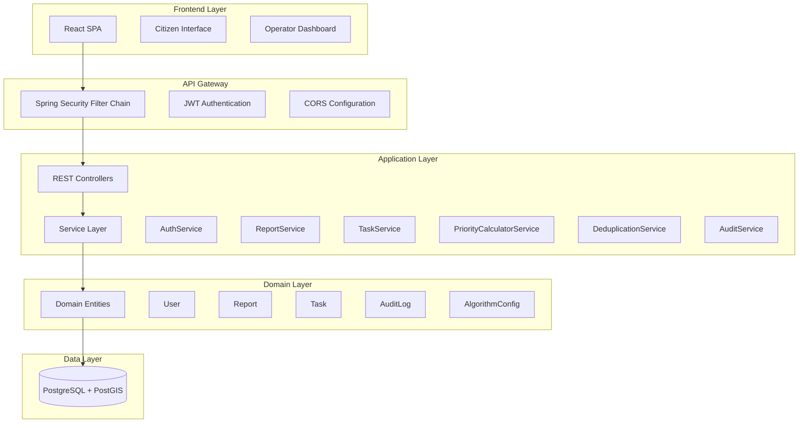
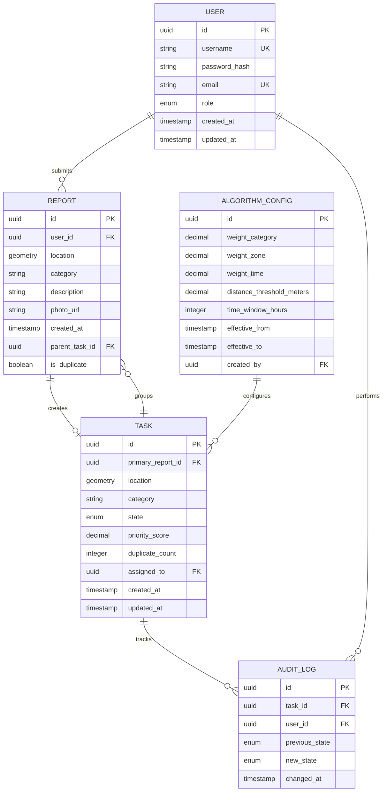

# Design Document: Urban Cleaning Management System

## Overview

The Urban Cleaning Management System is a full-stack web application that enables citizens to report urban cleaning incidents and provides municipal operators with an intelligent task management system. The system automatically prioritizes tasks using a configurable scoring algorithm, deduplicates similar reports, and maintains comprehensive audit trails.

### Technology Stack

- **Frontend**: React (Single Page Application)
- **Backend**: Spring Boot (Java)
- **Database**: PostgreSQL with PostGIS extension
- **Authentication**: JWT with Spring Security
- **Password Hashing**: BCrypt
- **Deployment**: Docker containers

### Key Features

1. Role-based access control (Citizens, Operators, Administrators)
2. Geolocated incident reporting with photo uploads
3. Automated task prioritization using weighted scoring algorithm
4. Intelligent deduplication based on spatial and temporal proximity
5. State machine-based task workflow
6. Immutable audit logging
7. Operator dashboard with filtering and sorting

## Architecture

### High-Level Architecture



### Architectural Patterns

- **Layered Architecture**: Clear separation between presentation, application, domain, and data layers
- **Repository Pattern**: Data access abstraction through JPA repositories
- **Service Layer Pattern**: Business logic encapsulation in service classes
- **DTO Pattern**: Data transfer objects to decouple API contracts from domain entities
- **Strategy Pattern**: Configurable priority calculation algorithm

## Components and Interfaces

### Backend Components

#### 1. Authentication & Authorization Module

**AuthController**
```java
@RestController
@RequestMapping("/api/auth")
public class AuthController {
    POST /login
    POST /register
    POST /refresh
}
```

**AuthService**
- Validates user credentials
- Generates JWT tokens with role claims
- Manages token refresh logic
- Integrates with BCryptPasswordEncoder

**JwtTokenProvider**
- Creates JWT tokens with user identity and roles
- Validates token signatures and expiration
- Extracts claims from tokens

#### 2. Report Management Module

**ReportController**
```java
@RestController
@RequestMapping("/api/reports")
public class ReportController {
    POST /          // Submit new report (multipart)
    GET /{id}       // Get report details
    GET /           // List reports (admin/operator)
}
```

**ReportService**
- Validates report data and geofencing
- Stores report with photo reference
- Triggers deduplication check
- Triggers priority calculation

**GeofencingService**
- Validates coordinates against configured boundaries
- Uses PostGIS spatial queries

**FileStorageService**
- Handles photo upload and storage
- Validates file type and size
- Generates unique file references

#### 3. Task Management Module

**TaskController**
```java
@RestController
@RequestMapping("/api/tasks")
public class TaskController {
    GET /                    // List tasks with filters
    GET /{id}                // Get task details
    PATCH /{id}/state        // Update task state
    GET /{id}/audit-history  // Get audit trail
}
```

**TaskService**
- Creates tasks from reports
- Manages task state transitions
- Enforces state machine rules
- Coordinates with audit service

**PriorityCalculatorService**
- Calculates priority scores using formula: P = (Wc * Category) + (Wz * Zone) + (Wt * Time)
- Retrieves weight configuration from database
- Recalculates scores when weights change
- Maps categories to severity values
- Determines zone risk indices from coordinates

**DeduplicationService**
- Searches for spatially proximate reports using PostGIS
- Checks temporal proximity within configurable window
- Groups duplicate reports under parent task
- Selects highest priority score for parent

#### 4. Audit Module

**AuditService**
- Creates immutable audit log entries
- Records user identity, timestamp, and state changes
- Prevents modification/deletion of logs
- Provides chronological query interface

#### 5. Configuration Module

**ConfigController**
```java
@RestController
@RequestMapping("/api/admin/config")
@PreAuthorize("hasRole('ADMIN')")
public class ConfigController {
    GET /algorithm-weights
    PUT /algorithm-weights
    GET /algorithm-weights/history
}
```

**ConfigService**
- Manages algorithm weight parameters
- Validates weight value ranges
- Triggers priority recalculation on changes
- Maintains historical configurations

### Frontend Components

#### 1. Citizen Interface

**ReportForm Component**
- Geolocation capture using browser API
- Photo upload with preview
- Category selection
- Description input
- Form validation

**MapView Component**
- Displays user location
- Shows geofencing boundaries
- Confirms report location

#### 2. Operator Dashboard

**TaskList Component**
- Displays tasks ordered by priority score
- Filters by state and zone
- Shows task details (ID, location, category, state, score)
- Action buttons for state transitions

**TaskMap Component**
- Visualizes task locations on map
- Color-coded by priority
- Clickable markers for details

**TaskDetail Component**
- Shows full task information
- Displays merged duplicate count
- Shows audit history
- State transition controls

**AuditTimeline Component**
- Chronological display of state changes
- Shows user and timestamp for each change

#### 3. Admin Interface

**ConfigPanel Component**
- Weight parameter configuration
- Real-time validation
- Historical configuration view

## Data Models

### Entity Relationship Diagram



### Domain Entities

#### User Entity
```java
@Entity
@Table(name = "users")
public class User {
    @Id
    @GeneratedValue
    private UUID id;
    
    @Column(unique = true, nullable = false)
    private String username;
    
    @Column(nullable = false)
    private String passwordHash;
    
    @Column(unique = true, nullable = false)
    private String email;
    
    @Enumerated(EnumType.STRING)
    @Column(nullable = false)
    private UserRole role; // ROLE_CIUDADANO, ROLE_TECNICO, ROLE_ADMIN
    
    private LocalDateTime createdAt;
    private LocalDateTime updatedAt;
}
```

#### Report Entity
```java
@Entity
@Table(name = "reportes")
public class Report {
    @Id
    @GeneratedValue
    private UUID id;
    
    @ManyToOne
    @JoinColumn(name = "user_id", nullable = false)
    private User submitter;
    
    @Column(columnDefinition = "geometry(Point,4326)", nullable = false)
    private Point location; // PostGIS geometry type
    
    @Column(nullable = false)
    private String category;
    
    @Column(nullable = false, length = 1000)
    private String description;
    
    @Column(nullable = false)
    private String photoUrl;
    
    private LocalDateTime createdAt;
    
    @ManyToOne
    @JoinColumn(name = "parent_task_id")
    private Task parentTask;
    
    private Boolean isDuplicate = false;
}
```

#### Task Entity
```java
@Entity
@Table(name = "tareas")
public class Task {
    @Id
    @GeneratedValue
    private UUID id;
    
    @OneToOne
    @JoinColumn(name = "primary_report_id", nullable = false)
    private Report primaryReport;
    
    @OneToMany(mappedBy = "parentTask")
    private List<Report> duplicateReports;
    
    @Column(columnDefinition = "geometry(Point,4326)", nullable = false)
    private Point location;
    
    @Column(nullable = false)
    private String category;
    
    @Enumerated(EnumType.STRING)
    @Column(nullable = false)
    private TaskState state; // PENDIENTE, ASIGNADO, EN_PROGRESO, RESUELTO
    
    @Column(nullable = false, precision = 10, scale = 2)
    private BigDecimal priorityScore;
    
    @Column(nullable = false)
    private Integer duplicateCount = 0;
    
    @ManyToOne
    @JoinColumn(name = "assigned_to")
    private User assignedOperator;
    
    private LocalDateTime createdAt;
    private LocalDateTime updatedAt;
}
```

#### AuditLog Entity
```java
@Entity
@Table(name = "historial_cambios")
public class AuditLog {
    @Id
    @GeneratedValue
    private UUID id;
    
    @ManyToOne
    @JoinColumn(name = "task_id", nullable = false, updatable = false)
    private Task task;
    
    @ManyToOne
    @JoinColumn(name = "user_id", nullable = false, updatable = false)
    private User user;
    
    @Enumerated(EnumType.STRING)
    @Column(nullable = false, updatable = false)
    private TaskState previousState;
    
    @Enumerated(EnumType.STRING)
    @Column(nullable = false, updatable = false)
    private TaskState newState;
    
    @Column(nullable = false, updatable = false)
    private LocalDateTime changedAt;
}
```

#### AlgorithmConfig Entity
```java
@Entity
@Table(name = "configuracion_algoritmo")
public class AlgorithmConfig {
    @Id
    @GeneratedValue
    private UUID id;
    
    @Column(nullable = false, precision = 5, scale = 2)
    private BigDecimal weightCategory; // Wc
    
    @Column(nullable = false, precision = 5, scale = 2)
    private BigDecimal weightZone; // Wz
    
    @Column(nullable = false, precision = 5, scale = 2)
    private BigDecimal weightTime; // Wt
    
    @Column(nullable = false)
    private Double distanceThresholdMeters;
    
    @Column(nullable = false)
    private Integer timeWindowHours;
    
    private LocalDateTime effectiveFrom;
    private LocalDateTime effectiveTo;
    
    @ManyToOne
    @JoinColumn(name = "created_by")
    private User createdBy;
}
```

### DTOs (Data Transfer Objects)

#### LoginRequest
```java
public class LoginRequest {
    private String username;
    private String password;
}
```

#### LoginResponse
```java
public class LoginResponse {
    private String token;
    private String tokenType = "Bearer";
    private Long expiresIn;
    private UserRole role;
}
```

#### ReportSubmissionRequest
```java
public class ReportSubmissionRequest {
    private Double latitude;
    private Double longitude;
    private String category;
    private String description;
    // MultipartFile photo handled separately
}
```

#### TaskResponse
```java
public class TaskResponse {
    private UUID id;
    private LocationDTO location;
    private String category;
    private TaskState state;
    private BigDecimal priorityScore;
    private Integer duplicateCount;
    private String assignedOperatorName;
    private LocalDateTime createdAt;
}
```

#### AuditLogResponse
```java
public class AuditLogResponse {
    private UUID id;
    private String userName;
    private TaskState previousState;
    private TaskState newState;
    private LocalDateTime changedAt;
}
```

## Correctness Properties

*A property is a characteristic or behavior that should hold true across all valid executions of a system—essentially, a formal statement about what the system should do. Properties serve as the bridge between human-readable specifications and machine-verifiable correctness guarantees.*

### Authentication Properties

**Property 1: Valid credentials generate valid JWT tokens**
*For any* valid user credentials, when submitted to the authentication endpoint, the system should return a JWT token that contains the correct user identity and role claims.
**Validates: Requirements 1.1**

**Property 2: Invalid credentials are rejected**
*For any* invalid user credentials (wrong password, non-existent user), when submitted to the authentication endpoint, the system should reject the request and return an error message.
**Validates: Requirements 1.2**

**Property 3: Password storage uses BCrypt**
*For any* user password, when stored in the database, the stored value should match BCrypt hash format and should validate correctly against the original password.
**Validates: Requirements 1.3**

**Property 4: Expired tokens require re-authentication**
*For any* expired JWT token, when used to access protected endpoints, the system should reject the request and require re-authentication.
**Validates: Requirements 1.4**

### Authorization Properties

**Property 5: Role-based access control enforcement**
*For any* citizen user token and any operator-only endpoint, when the citizen attempts to access the endpoint, the system should deny access and return an authorization error.
**Validates: Requirements 2.1**

**Property 6: Admin endpoint protection**
*For any* non-admin user token and any admin endpoint, when the user attempts to access the endpoint, the system should deny access.
**Validates: Requirements 2.2**

**Property 7: Token role validation on all protected endpoints**
*For any* protected endpoint and any token with invalid or missing role claims, the system should reject the request.
**Validates: Requirements 2.3**

**Property 8: Role changes require new tokens**
*For any* user whose role has changed, when using an old JWT token, the system should not reflect the new role permissions until a new token is issued.
**Validates: Requirements 2.4**

### Report Submission Properties

**Property 9: Multipart report acceptance**
*For any* valid multipart request containing JSON metadata and binary photo data, the system should accept and process the report.
**Validates: Requirements 3.1**

**Property 10: Geofencing validation**
*For any* report coordinates, the system should accept coordinates inside configured boundaries and reject coordinates outside boundaries.
**Validates: Requirements 3.2, 3.3**

**Property 11: Report data completeness**
*For any* submitted report, when stored in the database, all required fields (timestamp, location, category, description, photo reference, submitter identity) should be present.
**Validates: Requirements 3.4**

**Property 12: Required field validation**
*For any* report submission missing required fields (latitude, longitude, category, or description), the system should reject the submission.
**Validates: Requirements 3.5**

**Property 13: Photo file validation**
*For any* uploaded photo file, the system should validate file type and size, rejecting files that don't meet constraints.
**Validates: Requirements 3.6**

### Priority Calculation Properties

**Property 14: Priority score formula correctness**
*For any* report with known category value, zone value, and time elapsed, the calculated priority score should exactly match: P = (Wc * Category) + (Wz * Zone) + (Wt * Time).
**Validates: Requirements 4.1**

**Property 15: Category mapping completeness**
*For any* valid report category, the system should map it to a valid numeric severity value.
**Validates: Requirements 4.3**

**Property 16: Zone calculation from location**
*For any* geographic location within boundaries, the system should calculate a valid zone priority value.
**Validates: Requirements 4.4**

**Property 17: Time-based urgency increase**
*For any* two reports with identical category and zone, the older report should have a higher or equal time component value.
**Validates: Requirements 4.5**

**Property 18: Priority score persistence**
*For any* calculated priority score, when a task is created, the score should be stored and retrievable from the database.
**Validates: Requirements 4.6**

**Property 19: Priority recalculation on weight changes**
*For any* change to algorithm weight parameters, all pending tasks should have their priority scores recalculated using the new weights.
**Validates: Requirements 4.7**

### Deduplication Properties

**Property 20: Spatial proximity detection**
*For any* new report and any existing report within the configured distance threshold, the system should identify them as spatially proximate.
**Validates: Requirements 5.1**

**Property 21: Duplicate marking with spatial and temporal constraints**
*For any* new report that is spatially proximate to an existing report within the configured time window, the system should mark the new report as a duplicate.
**Validates: Requirements 5.2**

**Property 22: Duplicate grouping under parent task**
*For any* set of reports identified as duplicates, the system should group them all under a single parent task.
**Validates: Requirements 5.3**

**Property 23: Child report reference storage**
*For any* parent task with duplicate reports, all child report references should be stored and retrievable.
**Validates: Requirements 5.4**

**Property 24: Duplicate count accuracy**
*For any* task with merged duplicates, the displayed duplicate count should equal the actual number of child reports.
**Validates: Requirements 5.5**

**Property 25: Maximum priority score selection**
*For any* set of duplicate reports with different priority scores, the parent task should use the highest score among them.
**Validates: Requirements 5.6**

### Task State Management Properties

**Property 26: Initial state is PENDIENTE**
*For any* newly created task, the initial state should be PENDIENTE.
**Validates: Requirements 6.1**

**Property 27: State machine enforcement**
*For any* task state transition attempt, the system should only allow transitions that follow the state machine: PENDIENTE → ASIGNADO → EN_PROGRESO → RESUELTO.
**Validates: Requirements 6.2, 6.3, 6.4, 6.6**

**Property 28: Invalid transition rejection**
*For any* invalid state transition attempt (e.g., PENDIENTE → RESUELTO), the system should reject the request and return an error.
**Validates: Requirements 6.5**

### Audit Trail Properties

**Property 29: Audit log creation on state change**
*For any* task state change, the system should immediately create an audit log entry.
**Validates: Requirements 7.1**

**Property 30: Audit log completeness**
*For any* audit log entry, it should contain user identity, timestamp with millisecond precision, previous state, and new state.
**Validates: Requirements 7.2, 7.3, 7.4**

**Property 31: Audit log immutability**
*For any* audit log entry, attempts to modify or delete it should be prevented by the system.
**Validates: Requirements 7.5**

**Property 32: Chronological audit query ordering**
*For any* audit history query, entries should be returned in chronological order by timestamp.
**Validates: Requirements 7.6**

### Dashboard Properties

**Property 33: Task ordering by priority**
*For any* dashboard query, tasks should be returned ordered by priority score in descending order.
**Validates: Requirements 8.1**

**Property 34: Task display completeness**
*For any* task in the dashboard response, it should include task identifier, location, category, current state, and priority score.
**Validates: Requirements 8.2**

**Property 35: State filter correctness**
*For any* dashboard query with a state filter, only tasks matching the selected state should be returned.
**Validates: Requirements 8.3**

**Property 36: Geographic zone filter correctness**
*For any* dashboard query with a zone filter, only tasks within that geographic zone should be returned.
**Validates: Requirements 8.4**

### API Response Properties

**Property 37: Success status codes**
*For any* successful API request, the system should return a 2xx status code.
**Validates: Requirements 9.5**

**Property 38: Client error status codes**
*For any* API request that fails due to client error (invalid input, unauthorized access), the system should return a 4xx status code with a descriptive message.
**Validates: Requirements 9.6**

**Property 39: Server error status codes**
*For any* API request that fails due to server error, the system should return a 5xx status code.
**Validates: Requirements 9.7**

### Data Integrity Properties

**Property 40: Referential integrity enforcement**
*For any* attempt to create a reference to a non-existent entity (e.g., task referencing non-existent report), the system should reject the operation.
**Validates: Requirements 10.7**

### Security Properties

**Property 41: CORS origin validation**
*For any* API request from an unauthorized origin, the system should block the request based on CORS policy.
**Validates: Requirements 12.1**

**Property 42: Security headers presence**
*For any* API response, it should include required security headers (X-Content-Type-Options, X-Frame-Options, X-XSS-Protection).
**Validates: Requirements 12.2**

**Property 43: Input sanitization**
*For any* user input containing potentially malicious content (SQL injection, XSS), the system should sanitize or reject the input.
**Validates: Requirements 12.4**

**Property 44: Authentication rate limiting**
*For any* series of authentication requests exceeding the configured rate limit, the system should throttle or reject subsequent requests.
**Validates: Requirements 12.5**

### Configuration Properties

**Property 45: Weight parameter validation**
*For any* algorithm weight update with values outside acceptable ranges, the system should reject the update.
**Validates: Requirements 13.2**

**Property 46: Weight change triggers recalculation**
*For any* change to algorithm weights, the system should trigger priority score recalculation for all pending tasks.
**Validates: Requirements 13.3**

**Property 47: Weight configuration history**
*For any* algorithm weight change, the system should store the historical configuration with timestamp and user.
**Validates: Requirements 13.4**

## Error Handling

### Error Categories

1. **Authentication Errors**
   - Invalid credentials (401 Unauthorized)
   - Expired token (401 Unauthorized)
   - Missing token (401 Unauthorized)

2. **Authorization Errors**
   - Insufficient permissions (403 Forbidden)
   - Invalid role for endpoint (403 Forbidden)

3. **Validation Errors**
   - Missing required fields (400 Bad Request)
   - Invalid coordinate format (400 Bad Request)
   - Coordinates outside geofencing (400 Bad Request)
   - Invalid file type/size (400 Bad Request)
   - Invalid state transition (400 Bad Request)
   - Invalid weight parameter values (400 Bad Request)

4. **Resource Errors**
   - Task not found (404 Not Found)
   - Report not found (404 Not Found)
   - User not found (404 Not Found)

5. **Server Errors**
   - Database connection failure (500 Internal Server Error)
   - File storage failure (500 Internal Server Error)
   - Unexpected exceptions (500 Internal Server Error)

### Global Exception Handler

```java
@RestControllerAdvice
public class GlobalExceptionHandler {
    
    @ExceptionHandler(AuthenticationException.class)
    public ResponseEntity<ErrorResponse> handleAuthenticationException(AuthenticationException ex) {
        return ResponseEntity.status(HttpStatus.UNAUTHORIZED)
            .body(new ErrorResponse("AUTHENTICATION_FAILED", ex.getMessage()));
    }
    
    @ExceptionHandler(AccessDeniedException.class)
    public ResponseEntity<ErrorResponse> handleAccessDeniedException(AccessDeniedException ex) {
        return ResponseEntity.status(HttpStatus.FORBIDDEN)
            .body(new ErrorResponse("ACCESS_DENIED", ex.getMessage()));
    }
    
    @ExceptionHandler(ValidationException.class)
    public ResponseEntity<ErrorResponse> handleValidationException(ValidationException ex) {
        return ResponseEntity.status(HttpStatus.BAD_REQUEST)
            .body(new ErrorResponse("VALIDATION_ERROR", ex.getMessage()));
    }
    
    @ExceptionHandler(ResourceNotFoundException.class)
    public ResponseEntity<ErrorResponse> handleResourceNotFoundException(ResourceNotFoundException ex) {
        return ResponseEntity.status(HttpStatus.NOT_FOUND)
            .body(new ErrorResponse("RESOURCE_NOT_FOUND", ex.getMessage()));
    }
    
    @ExceptionHandler(Exception.class)
    public ResponseEntity<ErrorResponse> handleGenericException(Exception ex) {
        return ResponseEntity.status(HttpStatus.INTERNAL_SERVER_ERROR)
            .body(new ErrorResponse("INTERNAL_ERROR", "An unexpected error occurred"));
    }
}
```

### Error Response Format

```java
public class ErrorResponse {
    private String errorCode;
    private String message;
    private LocalDateTime timestamp;
    private Map<String, String> details;
}
```

## Testing Strategy

### Dual Testing Approach

The system will employ both unit testing and property-based testing to ensure comprehensive coverage:

- **Unit tests**: Verify specific examples, edge cases, and error conditions
- **Property tests**: Verify universal properties across all inputs

Both testing approaches are complementary and necessary. Unit tests catch concrete bugs in specific scenarios, while property tests verify general correctness across a wide range of inputs.

### Property-Based Testing Framework

**Framework**: JUnit-QuickCheck for Java

**Configuration**:
- Minimum 100 iterations per property test
- Each test tagged with feature name and property number
- Tag format: `@Tag("Feature: urban-cleaning-management, Property N: [property text]")`

### Test Organization

#### Unit Tests

**Authentication Tests**
- Test successful login with valid credentials
- Test login failure with invalid credentials
- Test token expiration handling
- Test password hashing with BCrypt
- Test role extraction from JWT

**Report Submission Tests**
- Test successful report submission
- Test geofencing boundary validation
- Test missing required fields rejection
- Test invalid file type rejection
- Test file size limit enforcement

**Priority Calculation Tests**
- Test priority formula with known inputs
- Test category mapping for all categories
- Test zone calculation for various locations
- Test time component increases with age
- Test recalculation on weight changes

**Deduplication Tests**
- Test duplicate detection within distance threshold
- Test duplicate detection within time window
- Test grouping of duplicates under parent
- Test maximum priority selection

**State Machine Tests**
- Test valid state transitions
- Test invalid state transition rejection
- Test initial state is PENDIENTE
- Test state machine enforcement

**Audit Trail Tests**
- Test audit log creation on state change
- Test audit log immutability
- Test chronological ordering
- Test completeness of audit data

#### Property-Based Tests

**Property Test Examples**:

```java
@Property
@Tag("Feature: urban-cleaning-management, Property 1: Valid credentials generate valid JWT tokens")
public void validCredentialsGenerateValidTokens(
    @ForAll @AlphaChars @StringLength(min = 5, max = 20) String username,
    @ForAll @AlphaChars @StringLength(min = 8, max = 30) String password) {
    
    // Create user with credentials
    User user = createUser(username, password, UserRole.ROLE_CIUDADANO);
    
    // Attempt login
    LoginResponse response = authService.login(username, password);
    
    // Verify token contains correct claims
    assertThat(jwtTokenProvider.getUsernameFromToken(response.getToken()))
        .isEqualTo(username);
    assertThat(jwtTokenProvider.getRoleFromToken(response.getToken()))
        .isEqualTo(UserRole.ROLE_CIUDADANO);
}

@Property
@Tag("Feature: urban-cleaning-management, Property 14: Priority score formula correctness")
public void priorityScoreMatchesFormula(
    @ForAll @InRange(min = "1", max = "10") int categoryValue,
    @ForAll @InRange(min = "1", max = "10") int zoneValue,
    @ForAll @InRange(min = "0", max = "168") int hoursElapsed) {
    
    // Get current weights
    AlgorithmConfig config = configService.getCurrentConfig();
    
    // Calculate expected priority
    BigDecimal expected = config.getWeightCategory().multiply(BigDecimal.valueOf(categoryValue))
        .add(config.getWeightZone().multiply(BigDecimal.valueOf(zoneValue)))
        .add(config.getWeightTime().multiply(BigDecimal.valueOf(hoursElapsed)));
    
    // Create report and calculate priority
    Report report = createReportWithValues(categoryValue, zoneValue, hoursElapsed);
    BigDecimal actual = priorityCalculatorService.calculatePriority(report);
    
    // Verify formula correctness
    assertThat(actual).isEqualByComparingTo(expected);
}

@Property
@Tag("Feature: urban-cleaning-management, Property 27: State machine enforcement")
public void onlyValidTransitionsAllowed(
    @ForAll TaskState fromState,
    @ForAll TaskState toState) {
    
    Task task = createTaskWithState(fromState);
    
    boolean isValidTransition = isValidStateTransition(fromState, toState);
    
    if (isValidTransition) {
        // Should succeed
        assertDoesNotThrow(() -> taskService.updateState(task.getId(), toState));
    } else {
        // Should fail
        assertThrows(InvalidStateTransitionException.class,
            () -> taskService.updateState(task.getId(), toState));
    }
}
```

### Integration Tests

- Test end-to-end report submission flow
- Test complete task lifecycle (creation → assignment → progress → resolution)
- Test authentication and authorization integration
- Test database transactions and rollbacks
- Test file upload and storage integration

### Test Data Generators

Custom generators for property-based testing:

```java
public class ReportGenerator implements ArbitraryGenerator<Report> {
    @Override
    public Report generate(SourceOfRandomness random, GenerationStatus status) {
        return Report.builder()
            .location(generateValidLocation(random))
            .category(generateCategory(random))
            .description(generateDescription(random))
            .build();
    }
    
    private Point generateValidLocation(SourceOfRandomness random) {
        // Generate coordinates within geofencing boundaries
        double lat = random.nextDouble(MIN_LAT, MAX_LAT);
        double lon = random.nextDouble(MIN_LON, MAX_LON);
        return geometryFactory.createPoint(new Coordinate(lon, lat));
    }
}
```

### Test Coverage Goals

- **Line Coverage**: Minimum 80%
- **Branch Coverage**: Minimum 75%
- **Property Test Coverage**: All 47 correctness properties implemented
- **Unit Test Coverage**: All critical paths and edge cases

### Continuous Testing

- Run unit tests on every commit
- Run property tests on every pull request
- Run integration tests before deployment
- Monitor test execution time and optimize slow tests
