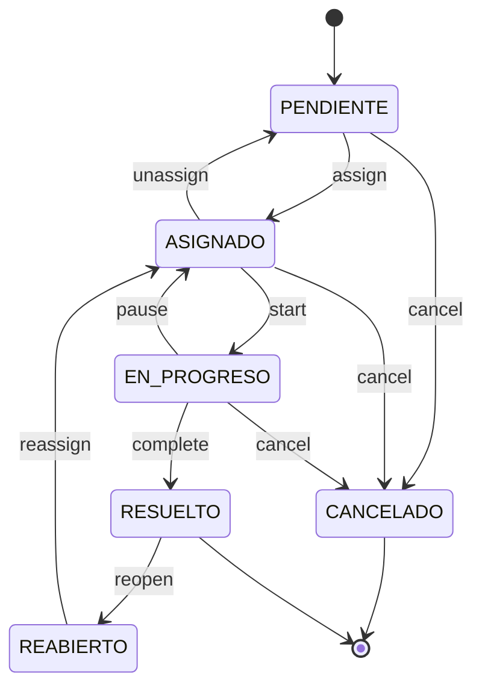

# Análisis y Mejoras Propuestas - Urban Cleaning Management System

**Fecha**: 9 de febrero de 2026  
**Revisión de**: Requirements.md y Design.md

## 📊 Resumen Ejecutivo

Después de revisar los documentos de requerimientos y diseño, el proyecto tiene una base sólida con:
- ✅ 13 requerimientos bien definidos con criterios de aceptación EARS
- ✅ 47 propiedades de correctitud identificadas
- ✅ Arquitectura en capas clara
- ✅ Estrategia de testing dual (unit + property-based)

Sin embargo, hay áreas de mejora en:
1. **Requerimientos faltantes** para funcionalidades críticas
2. **Detalles de implementación** que necesitan clarificación
3. **Propiedades de correctitud** que pueden ser más específicas
4. **Casos de borde** no cubiertos explícitamente

---

## 🔍 Análisis Detallado

### 1. Requerimientos Faltantes o Incompletos

#### 1.1 Gestión de Sesiones y Tokens

**Problema**: El sistema menciona JWT pero no especifica:
- ¿Qué pasa si un usuario inicia sesión desde múltiples dispositivos?
- ¿Hay un mecanismo de revocación de tokens?
- ¿Cómo se manejan los tokens refresh?

**Mejora Propuesta**:
```markdown
### Requirement 14: Token Lifecycle Management

**User Story:** As a system user, I want secure token management, so that my sessions are properly controlled.

#### Acceptance Criteria

1. WHEN a user logs in, THE System SHALL generate both an access token (24h) and a refresh token (7 days)
2. WHEN an access token expires, THE System SHALL allow renewal using a valid refresh token
3. WHEN a user logs out, THE System SHALL invalidate the refresh token
4. THE System SHALL support multiple concurrent sessions per user
5. WHEN an administrator revokes a user's access, THE System SHALL invalidate all active tokens for that user
```

#### 1.2 Notificaciones a Ciudadanos

**Problema**: No hay requerimientos sobre cómo los ciudadanos reciben actualizaciones sobre sus reportes.

**Mejora Propuesta**:
```markdown
### Requirement 15: Report Status Notifications

**User Story:** As a Citizen, I want to receive updates about my reports, so that I know when they are being addressed.

#### Acceptance Criteria

1. WHEN a task state changes to ASIGNADO, THE System SHALL notify the original reporter
2. WHEN a task state changes to RESUELTO, THE System SHALL notify all reporters of merged duplicates
3. THE System SHALL provide notification preferences (email, in-app, none)
4. WHEN a report is marked as duplicate, THE System SHALL notify the reporter with the parent task ID
```

#### 1.3 Búsqueda y Filtrado Avanzado

**Problema**: El dashboard tiene filtros básicos, pero falta búsqueda por texto, rango de fechas, etc.

**Mejora Propuesta**:
```markdown
### Requirement 16: Advanced Search and Filtering

**User Story:** As an Operator, I want advanced search capabilities, so that I can find specific tasks quickly.

#### Acceptance Criteria

1. WHEN an Operator searches by text, THE System SHALL return tasks matching description or category
2. WHEN an Operator filters by date range, THE System SHALL return tasks created within that range
3. WHEN an Operator filters by priority range, THE System SHALL return tasks within the specified score range
4. THE System SHALL support combining multiple filters (AND logic)
5. THE System SHALL provide pagination for large result sets
```

#### 1.4 Exportación de Datos

**Problema**: No hay forma de exportar reportes o estadísticas para análisis externo.

**Mejora Propuesta**:
```markdown
### Requirement 17: Data Export

**User Story:** As an Administrator, I want to export system data, so that I can perform external analysis.

#### Acceptance Criteria

1. WHERE ROLE_ADMIN is assigned, THE System SHALL provide endpoints to export task data
2. THE System SHALL support export formats: CSV, JSON, Excel
3. WHEN exporting, THE System SHALL allow filtering by date range, state, and zone
4. THE System SHALL include audit trail data in exports when requested
5. THE System SHALL limit export size to prevent performance issues
```

#### 1.5 Métricas y Estadísticas

**Problema**: No hay requerimientos para dashboards analíticos o KPIs.

**Mejora Propuesta**:
```markdown
### Requirement 18: Analytics and Metrics

**User Story:** As an Administrator, I want to view system metrics, so that I can monitor performance and efficiency.

#### Acceptance Criteria

1. THE System SHALL calculate and display average resolution time per category
2. THE System SHALL display task distribution by state (pie chart)
3. THE System SHALL display task distribution by zone (heat map)
4. THE System SHALL track operator performance metrics (tasks completed, average time)
5. THE System SHALL display duplicate detection rate
6. THE System SHALL provide time-series graphs for task creation and resolution trends
```

---

### 2. Mejoras al Diseño

#### 2.1 Algoritmo de Priorización - Detalles Faltantes

**Problema**: La fórmula está definida, pero faltan detalles sobre:
- ¿Cómo se mapean las categorías a valores numéricos?
- ¿Cómo se calcula el índice de riesgo de zona?
- ¿Cómo se normaliza el componente de tiempo?

**Mejora Propuesta**:

```markdown
### Priority Calculation - Detailed Specification

#### Category Mapping
```java
public enum CategorySeverity {
    BASURA_ACUMULADA(10),      // Accumulated trash - highest priority
    GRAFITI(7),                 // Graffiti - medium-high
    MOBILIARIO_DAÑADO(8),       // Damaged furniture - high
    VEGETACION_EXCESIVA(5),     // Excessive vegetation - medium
    OTROS(3);                   // Other - low
    
    private final int severityValue;
}
```

#### Zone Risk Index Calculation
```java
public class ZoneRiskCalculator {
    /**
     * Calculates zone risk based on:
     * - Historical incident density (40%)
     * - Population density (30%)
     * - Proximity to critical infrastructure (30%)
     * 
     * Returns value between 1-10
     */
    public int calculateZoneRisk(Point location) {
        double incidentDensity = getHistoricalIncidentDensity(location);
        double populationDensity = getPopulationDensity(location);
        double infrastructureProximity = getCriticalInfrastructureProximity(location);
        
        double risk = (incidentDensity * 0.4) + 
                      (populationDensity * 0.3) + 
                      (infrastructureProximity * 0.3);
        
        return (int) Math.ceil(risk * 10);
    }
}
```

#### Time Component Normalization
```java
public class TimeComponentCalculator {
    /**
     * Calculates time urgency:
     * - 0-24 hours: linear growth from 1 to 5
     * - 24-72 hours: linear growth from 5 to 8
     * - 72+ hours: capped at 10
     */
    public double calculateTimeComponent(LocalDateTime reportTime) {
        long hoursElapsed = ChronoUnit.HOURS.between(reportTime, LocalDateTime.now());
        
        if (hoursElapsed <= 24) {
            return 1 + (hoursElapsed / 24.0) * 4; // 1 to 5
        } else if (hoursElapsed <= 72) {
            return 5 + ((hoursElapsed - 24) / 48.0) * 3; // 5 to 8
        } else {
            return Math.min(10, 8 + ((hoursElapsed - 72) / 24.0) * 0.5); // 8 to 10, capped
        }
    }
}
```
```

#### 2.2 Deduplicación - Casos de Borde

**Problema**: ¿Qué pasa si hay múltiples reportes duplicados simultáneos? ¿Cómo se maneja la concurrencia?

**Mejora Propuesta**:

```markdown
### Deduplication - Concurrency Handling

#### Race Condition Prevention
```java
@Service
public class DeduplicationService {
    
    @Transactional(isolation = Isolation.SERIALIZABLE)
    public Task processReportWithDeduplication(Report report) {
        // Lock on geographic area to prevent race conditions
        String lockKey = generateGeographicLockKey(report.getLocation());
        
        return distributedLockService.executeWithLock(lockKey, () -> {
            Optional<Task> existingTask = findExistingParentTask(report);
            
            if (existingTask.isPresent()) {
                // Mark as duplicate and link to parent
                report.setIsDuplicate(true);
                report.setParentTask(existingTask.get());
                reportRepository.save(report);
                
                // Update parent task
                Task parent = existingTask.get();
                parent.setDuplicateCount(parent.getDuplicateCount() + 1);
                
                // Recalculate priority if new report has higher score
                recalculatePriorityIfNeeded(parent, report);
                
                return taskRepository.save(parent);
            } else {
                // Create new task
                return createNewTask(report);
            }
        });
    }
    
    private String generateGeographicLockKey(Point location) {
        // Create lock key based on geographic grid cell
        int gridX = (int) (location.getX() / GRID_SIZE);
        int gridY = (int) (location.getY() / GRID_SIZE);
        return String.format("dedup:grid:%d:%d", gridX, gridY);
    }
}
```
```

#### 2.3 Máquina de Estados - Transiciones Adicionales

**Problema**: ¿Qué pasa si una tarea necesita ser reabierta? ¿Se puede cancelar una tarea?

**Mejora Propuesta**:

```markdown
### Extended State Machine



#### New States
- **CANCELADO**: Task cancelled (duplicate of another, invalid report, etc.)
- **REABIERTO**: Task reopened after being marked as resolved

#### New Transitions
- PENDIENTE → CANCELADO
- ASIGNADO → PENDIENTE (unassign)
- ASIGNADO → CANCELADO
- EN_PROGRESO → ASIGNADO (pause)
- EN_PROGRESO → CANCELADO
- RESUELTO → REABIERTO
- REABIERTO → ASIGNADO
```

#### 2.4 Validación de Geofencing - Múltiples Zonas

**Problema**: El diseño asume una sola zona de geofencing. ¿Qué pasa si hay múltiples municipios?

**Mejora Propuesta**:

```markdown
### Multi-Zone Geofencing

```java
@Entity
@Table(name = "zonas_servicio")
public class ServiceZone {
    @Id
    @GeneratedValue
    private UUID id;
    
    @Column(nullable = false)
    private String name; // e.g., "Madrid Centro", "Madrid Norte"
    
    @Column(columnDefinition = "geometry(Polygon,4326)", nullable = false)
    private Polygon boundary;
    
    @Column(nullable = false)
    private Integer riskIndex; // Base risk for this zone
    
    @Column(nullable = false)
    private Boolean active;
}

@Service
public class GeofencingService {
    
    public Optional<ServiceZone> findZoneForLocation(Point location) {
        return serviceZoneRepository.findActiveZoneContaining(location);
    }
    
    public boolean isLocationInServiceArea(Point location) {
        return findZoneForLocation(location).isPresent();
    }
    
    public int getZoneRiskIndex(Point location) {
        return findZoneForLocation(location)
            .map(ServiceZone::getRiskIndex)
            .orElse(DEFAULT_RISK_INDEX);
    }
}
```
```

---

### 3. Propiedades de Correctitud - Mejoras

#### 3.1 Propiedades Más Específicas

Algunas propiedades son demasiado generales. Aquí hay versiones mejoradas:

**Original**:
> Property 10: Geofencing validation
> *For any* report coordinates, the system should accept coordinates inside configured boundaries and reject coordinates outside boundaries.

**Mejorada**:
```markdown
**Property 10a: Coordinates inside boundaries are accepted**
*For any* point (lat, lon) where MIN_LAT ≤ lat ≤ MAX_LAT AND MIN_LON ≤ lon ≤ MAX_LON, when submitted as report coordinates, the system should accept them.
**Validates: Requirements 3.2**

**Property 10b: Coordinates outside boundaries are rejected**
*For any* point (lat, lon) where lat < MIN_LAT OR lat > MAX_LAT OR lon < MIN_LON OR lon > MAX_LON, when submitted as report coordinates, the system should reject them with error code "GEOFENCING_VIOLATION".
**Validates: Requirements 3.3**

**Property 10c: Boundary edge cases**
*For any* point exactly on the boundary (lat = MIN_LAT or lat = MAX_LAT or lon = MIN_LON or lon = MAX_LON), the system should accept it as valid.
**Validates: Requirements 3.2**
```

#### 3.2 Propiedades Faltantes

**Nuevas propiedades sugeridas**:

```markdown
**Property 48: Deduplication is idempotent**
*For any* report that is already marked as duplicate, running the deduplication process again should not change its parent task or duplicate status.
**Validates: Requirements 5.2, 5.3**

**Property 49: Priority recalculation preserves task ordering**
*For any* two tasks where task A has higher priority than task B before weight changes, if both are recalculated with the same new weights, task A should still have higher or equal priority than task B (assuming their underlying values haven't changed).
**Validates: Requirements 4.7**

**Property 50: Audit log completeness for all state changes**
*For any* task, the number of audit log entries should equal the number of state transitions that task has undergone.
**Validates: Requirements 7.1**

**Property 51: Photo storage and retrieval round-trip**
*For any* valid photo file uploaded with a report, retrieving the photo using the stored photo URL should return the exact same file content.
**Validates: Requirements 3.1, 3.6**

**Property 52: Concurrent report submissions don't create duplicate tasks**
*For any* two reports submitted simultaneously at the same location, the system should create only one parent task and mark one report as duplicate.
**Validates: Requirements 5.1, 5.2, 5.3**

**Property 53: Token expiration is enforced**
*For any* JWT token with expiration timestamp T, when used at time T+1 second, the system should reject it with error code "TOKEN_EXPIRED".
**Validates: Requirements 1.4**

**Property 54: Password hash uniqueness**
*For any* two users with the same password, their stored password hashes should be different (due to BCrypt salt).
**Validates: Requirements 1.3**

**Property 55: State transition atomicity**
*For any* task state transition, either all related changes (state update, audit log creation, notification) succeed together, or all fail together (no partial updates).
**Validates: Requirements 6.2, 7.1**
```

---

### 4. Casos de Borde No Cubiertos

#### 4.1 Límites del Sistema

**Problema**: No hay especificaciones sobre límites de escala.

**Mejora Propuesta**:
```markdown
### Requirement 19: System Limits and Quotas

**User Story:** As a system architect, I want defined system limits, so that the system remains stable under load.

#### Acceptance Criteria

1. THE System SHALL limit report submissions to 100 per user per day
2. THE System SHALL limit photo file size to 5MB
3. THE System SHALL limit description text to 1000 characters
4. THE System SHALL limit API requests to 1000 per hour per user
5. THE System SHALL limit concurrent task state updates to prevent race conditions
6. WHEN limits are exceeded, THE System SHALL return error code "RATE_LIMIT_EXCEEDED" with retry-after header
```

#### 4.2 Manejo de Datos Históricos

**Problema**: ¿Qué pasa con tareas muy antiguas? ¿Se archivan?

**Mejora Propuesta**:
```markdown
### Requirement 20: Data Archival and Retention

**User Story:** As a system administrator, I want automatic data archival, so that the database remains performant.

#### Acceptance Criteria

1. WHEN a task has been in RESUELTO state for 90 days, THE System SHALL mark it for archival
2. WHEN a task is archived, THE System SHALL move it to an archive table but keep audit trail accessible
3. THE System SHALL provide endpoints to search archived tasks
4. THE System SHALL retain audit logs indefinitely for compliance
5. THE System SHALL automatically delete uploaded photos after 1 year for resolved tasks
```

#### 4.3 Recuperación de Errores

**Problema**: ¿Qué pasa si falla el cálculo de prioridad? ¿Si falla la subida de foto?

**Mejora Propuesta**:
```markdown
### Requirement 21: Error Recovery and Resilience

**User Story:** As a system operator, I want automatic error recovery, so that temporary failures don't lose data.

#### Acceptance Criteria

1. WHEN priority calculation fails, THE System SHALL retry up to 3 times with exponential backoff
2. WHEN photo upload fails, THE System SHALL still create the report and mark photo as "upload_failed"
3. WHEN deduplication check fails, THE System SHALL create a standalone task and log the error
4. THE System SHALL provide admin endpoints to manually trigger failed operations
5. THE System SHALL send alerts when critical operations fail repeatedly
```

---

### 5. Mejoras a la Estrategia de Testing

#### 5.1 Generadores de Datos Más Robustos

**Mejora Propuesta**:

```java
/**
 * Generator for valid geographic coordinates within Madrid boundaries
 */
public class MadridCoordinateGenerator implements ArbitraryGenerator<Point> {
    private static final double MADRID_MIN_LAT = 40.3;
    private static final double MADRID_MAX_LAT = 40.6;
    private static final double MADRID_MIN_LON = -3.9;
    private static final double MADRID_MAX_LON = -3.5;
    
    @Override
    public Point generate(SourceOfRandomness random, GenerationStatus status) {
        double lat = random.nextDouble(MADRID_MIN_LAT, MADRID_MAX_LAT);
        double lon = random.nextDouble(MADRID_MIN_LON, MADRID_MAX_LON);
        
        GeometryFactory factory = new GeometryFactory(new PrecisionModel(), 4326);
        return factory.createPoint(new Coordinate(lon, lat));
    }
}

/**
 * Generator for realistic report descriptions
 */
public class ReportDescriptionGenerator implements ArbitraryGenerator<String> {
    private static final List<String> TEMPLATES = Arrays.asList(
        "Hay basura acumulada en %s desde hace %d días",
        "Contenedor desbordado en %s",
        "Grafiti en %s que necesita limpieza",
        "Mobiliario urbano dañado en %s"
    );
    
    private static final List<String> LOCATIONS = Arrays.asList(
        "la esquina de la calle", "el parque", "la plaza", "la parada de autobús"
    );
    
    @Override
    public String generate(SourceOfRandomness random, GenerationStatus status) {
        String template = random.choose(TEMPLATES);
        String location = random.choose(LOCATIONS);
        int days = random.nextInt(1, 30);
        
        return String.format(template, location, days);
    }
}
```

#### 5.2 Tests de Integración End-to-End

**Mejora Propuesta**:

```java
@SpringBootTest(webEnvironment = WebEnvironment.RANDOM_PORT)
@AutoConfigureTestDatabase
public class ReportSubmissionE2ETest {
    
    @Test
    public void completeReportSubmissionFlow() {
        // 1. Citizen registers
        RegisterRequest registerReq = new RegisterRequest("citizen1", "password123", 
            "citizen1@test.com", UserRole.ROLE_CIUDADANO);
        ResponseEntity<User> registerResp = restTemplate.postForEntity(
            "/api/auth/register", registerReq, User.class);
        assertThat(registerResp.getStatusCode()).isEqualTo(HttpStatus.CREATED);
        
        // 2. Citizen logs in
        LoginRequest loginReq = new LoginRequest("citizen1", "password123");
        ResponseEntity<LoginResponse> loginResp = restTemplate.postForEntity(
            "/api/auth/login", loginReq, LoginResponse.class);
        String token = loginResp.getBody().getToken();
        
        // 3. Citizen submits report with photo
        MultiValueMap<String, Object> body = new LinkedMultiValueMap<>();
        body.add("data", new ReportSubmissionRequest(40.4168, -3.7038, 
            "BASURA_ACUMULADA", "Contenedor desbordado"));
        body.add("photo", new FileSystemResource("test-photo.jpg"));
        
        HttpHeaders headers = new HttpHeaders();
        headers.setBearerAuth(token);
        headers.setContentType(MediaType.MULTIPART_FORM_DATA);
        
        HttpEntity<MultiValueMap<String, Object>> requestEntity = 
            new HttpEntity<>(body, headers);
        
        ResponseEntity<ReportResponse> reportResp = restTemplate.postForEntity(
            "/api/reports", requestEntity, ReportResponse.class);
        assertThat(reportResp.getStatusCode()).isEqualTo(HttpStatus.CREATED);
        
        // 4. Verify task was created
        UUID reportId = reportResp.getBody().getId();
        Task task = taskRepository.findByPrimaryReportId(reportId).orElseThrow();
        assertThat(task.getState()).isEqualTo(TaskState.PENDIENTE);
        assertThat(task.getPriorityScore()).isGreaterThan(BigDecimal.ZERO);
        
        // 5. Operator logs in and views task
        LoginRequest opLoginReq = new LoginRequest("operator1", "password123");
        ResponseEntity<LoginResponse> opLoginResp = restTemplate.postForEntity(
            "/api/auth/login", opLoginReq, LoginResponse.class);
        String opToken = opLoginResp.getBody().getToken();
        
        HttpHeaders opHeaders = new HttpHeaders();
        opHeaders.setBearerAuth(opToken);
        HttpEntity<Void> opRequestEntity = new HttpEntity<>(opHeaders);
        
        ResponseEntity<TaskResponse[]> tasksResp = restTemplate.exchange(
            "/api/tasks", HttpMethod.GET, opRequestEntity, TaskResponse[].class);
        assertThat(tasksResp.getBody()).hasSizeGreaterThan(0);
        assertThat(tasksResp.getBody()[0].getId()).isEqualTo(task.getId());
        
        // 6. Operator updates task state
        StateUpdateRequest stateReq = new StateUpdateRequest(TaskState.ASIGNADO);
        HttpEntity<StateUpdateRequest> stateRequestEntity = 
            new HttpEntity<>(stateReq, opHeaders);
        
        ResponseEntity<TaskResponse> stateResp = restTemplate.exchange(
            "/api/tasks/" + task.getId() + "/state", 
            HttpMethod.PATCH, stateRequestEntity, TaskResponse.class);
        assertThat(stateResp.getBody().getState()).isEqualTo(TaskState.ASIGNADO);
        
        // 7. Verify audit log was created
        List<AuditLog> auditLogs = auditLogRepository.findByTaskId(task.getId());
        assertThat(auditLogs).hasSize(1);
        assertThat(auditLogs.get(0).getPreviousState()).isEqualTo(TaskState.PENDIENTE);
        assertThat(auditLogs.get(0).getNewState()).isEqualTo(TaskState.ASIGNADO);
    }
}
```

---

## 📋 Resumen de Mejoras Prioritarias

### Alta Prioridad (Implementar Primero)

1. **Requirement 14**: Token Lifecycle Management (refresh tokens, revocación)
2. **Requirement 19**: System Limits and Quotas (prevenir abuso)
3. **Requirement 21**: Error Recovery and Resilience (robustez)
4. **Property 52**: Concurrent report submissions (prevenir race conditions)
5. **Property 55**: State transition atomicity (integridad de datos)
6. **Deduplication Concurrency Handling**: Locks distribuidos para prevenir duplicados

### Media Prioridad (Implementar Después)

7. **Requirement 15**: Report Status Notifications
8. **Requirement 16**: Advanced Search and Filtering
9. **Requirement 18**: Analytics and Metrics
10. **Extended State Machine**: Estados CANCELADO y REABIERTO
11. **Multi-Zone Geofencing**: Soporte para múltiples municipios
12. **Properties 48-54**: Propiedades adicionales de correctitud

### Baja Prioridad (Nice to Have)

13. **Requirement 17**: Data Export
14. **Requirement 20**: Data Archival and Retention
15. **Priority Calculation Details**: Especificaciones detalladas de mapeo
16. **E2E Integration Tests**: Tests end-to-end completos

---

## 🎯 Próximos Pasos Recomendados

1. **Revisar y aprobar** las mejoras propuestas con el equipo
2. **Actualizar** requirements.md con los nuevos requerimientos
3. **Actualizar** design.md con los detalles de implementación
4. **Crear tareas** en tasks.md para implementar las mejoras prioritarias
5. **Implementar** las mejoras de alta prioridad primero
6. **Escribir tests** para las nuevas propiedades de correctitud
7. **Documentar** las decisiones de diseño en el código

---

## 💡 Observaciones Adicionales

### Fortalezas del Diseño Actual

- ✅ Uso de EARS para criterios de aceptación
- ✅ Propiedades de correctitud bien definidas
- ✅ Arquitectura en capas clara
- ✅ Uso de PostGIS para queries geoespaciales
- ✅ Estrategia de testing dual (unit + property-based)
- ✅ Audit trail inmutable
- ✅ Deduplicación inteligente

### Áreas de Atención

- ⚠️ Manejo de concurrencia en deduplicación
- ⚠️ Falta de especificación de límites del sistema
- ⚠️ Notificaciones a usuarios no especificadas
- ⚠️ Recuperación de errores no detallada
- ⚠️ Archivado de datos históricos no considerado
- ⚠️ Métricas y analytics no especificadas

---

**Conclusión**: El proyecto tiene una base sólida, pero necesita mejoras en áreas de robustez, escalabilidad y experiencia de usuario. Las mejoras propuestas están priorizadas y listas para implementación.
