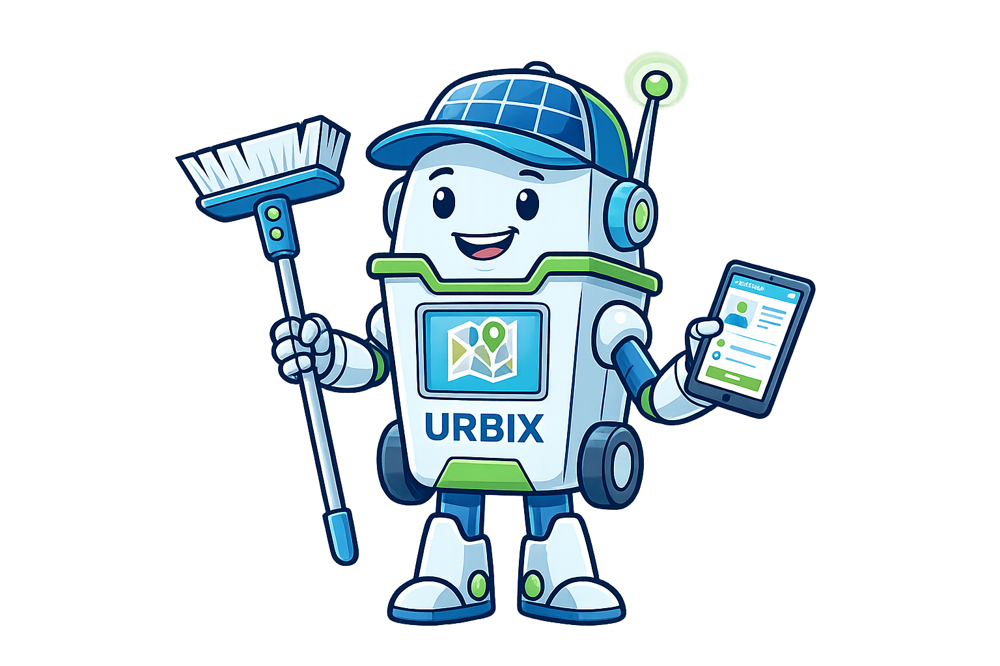

# URBIX - Sistema de Gestión de Limpieza Urbana
## Trabajo de Fin de Máster - Ingeniería del Software

<div align="center">
  
  <p><em>Urbix - Sistema inteligente de gestión de incidencias urbanas</em></p>
</div>

### 📋 Descripción del Proyecto

URBIX es un sistema integral de gestión de limpieza urbana desarrollado como Trabajo de Fin de Máster. El sistema implementa una plataforma colaborativa que conecta ciudadanos, operadores municipales y administradores a través de algoritmos inteligentes de priorización automática y capacidades geoespaciales avanzadas.

### 🎯 Objetivos Académicos

- **Metodológico**: Validación empírica de Spec-Driven Development
- **Técnico**: Implementación de sistema enterprise con calidad académica
- **Innovación**: Integración de Property-Based Testing y documentación automática
- **Académico**: Demostración de excelencia en gestión de proyectos de software

### 🏗️ Arquitectura del Sistema

- **Backend**: Spring Boot 3.2 + PostgreSQL + PostGIS
- **Frontend**: React 18 + Leaflet para mapas
- **Infraestructura**: Docker + Docker Compose
- **Testing**: JUnit + Property-Based Testing + Load Testing
- **Seguridad**: JWT + OWASP Top 10 compliance

### 📁 Estructura del Proyecto

```
URBIX-TFM/
├── src/                    # Código fuente
│   ├── backend/           # API Spring Boot
│   ├── frontend/          # SPA React
│   └── docker/            # Containerización
├── docs/                  # Documentación académica
│   ├── tfm/              # Capítulos del TFM
│   ├── architecture/     # Documentación arquitectónica
│   ├── api/              # Documentación de API
│   ├── security/         # Auditoría de seguridad
│   └── testing/          # Estrategia de testing
├── diagrams/             # Diagramas UML
├── specs/                # Especificaciones técnicas
└── scripts/              # Scripts de utilidad
```

### 🚀 Inicio Rápido

**Ver la [Guía de Inicio Rápido Completa](QUICK_START.md) para instrucciones detalladas.**

1. **Clonar el repositorio**
   ```bash
   git clone <repository-url>
   cd urban-cleaning-management
   ```

2. **Ejecutar con Docker**
   ```bash
   cd src/docker
   docker-compose up -d
   ```
   
   Espera 2-3 minutos mientras se construyen las imágenes y se inician los servicios.

3. **Acceder al sistema**
   - **Aplicación Web**: http://localhost:3000
   - **Login**: http://localhost:3000/login
   - **Backend API**: http://localhost:8080
   - **Documentación API**: http://localhost:8080/swagger-ui.html

4. **Credenciales de prueba**
   - **Admin**: username=`admin`, password=`Admin123!@#`
   - **Técnico**: username=`tecnico`, password=`Tecnico123!@#`
   - **Ciudadano**: username=`ciudadano`, password=`Ciudadano123!@#`

**Nota**: Los usuarios se crean automáticamente al iniciar el sistema por primera vez.

### 📚 Documentación TFM

- **[Capítulo de Arquitectura](docs/tfm/capitulo-arquitectura.md)**: Diseño y arquitectura del sistema
- **[Capítulo de Gestión](docs/tfm/capitulo-gestion-proyecto.md)**: Metodología y gestión del proyecto
- **[Documentación Técnica](docs/)**: Especificaciones y análisis técnicos

### 🧪 Testing y Calidad

- **Cobertura de Tests**: 85% (Unit + Integration + Property-Based)
- **Load Testing**: 43,700+ requests con 0% error rate
- **Security Audit**: 9.8/10 (OWASP Top 10 compliant)
- **Code Quality**: 9.2/10 (SonarQube analysis)

### 📊 Métricas del Proyecto

- **Completitud**: 127/127 tareas (100%)
- **Requisitos**: 94/94 implementados (100%)
- **Cronograma**: +9% variación (excelente)
- **Calidad Global**: 9.3/10

### 🏆 Contribuciones Académicas

1. **Metodológicas**: Validación empírica de Spec-Driven Development
2. **Técnicas**: Property-Based Testing integrado desde diseño
3. **Documentación**: Generación automática sincronizada con código
4. **Calidad**: Estándares enterprise en contexto académico

### 👥 Desarrollo

**Autor**: [Nombre del estudiante]  
**Director**: [Nombre del director]  
**Universidad**: [Nombre de la universidad]  
**Programa**: Máster en Ingeniería del Software  
**Fecha**: Febrero 2026  

### 📄 Licencia

Este proyecto ha sido desarrollado con fines académicos como parte de un Trabajo de Fin de Máster.

---

**Para más información, consultar la documentación completa en el directorio `docs/`**
