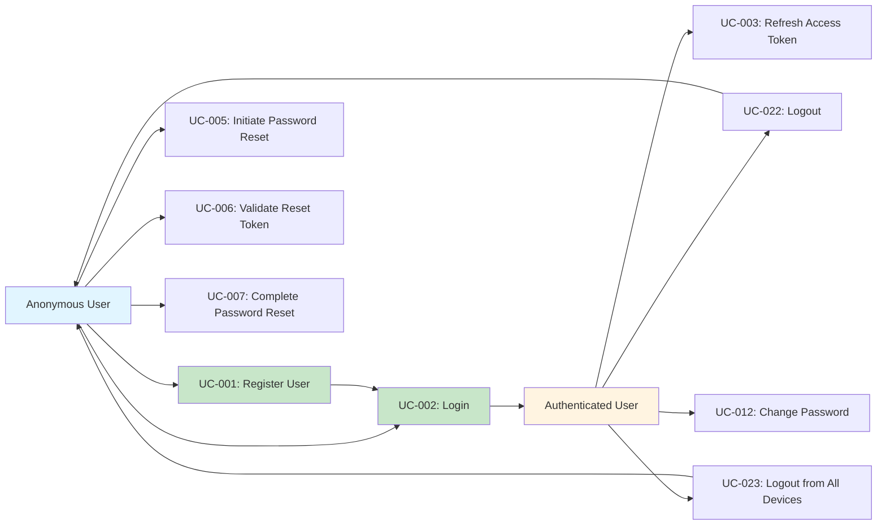
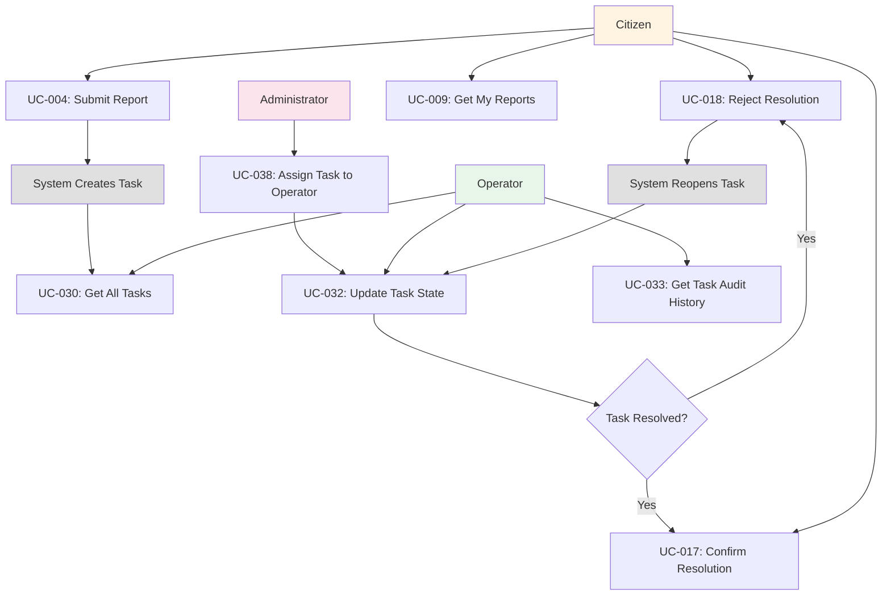
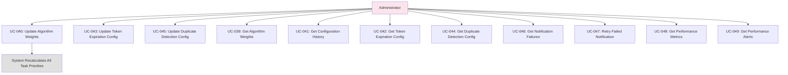
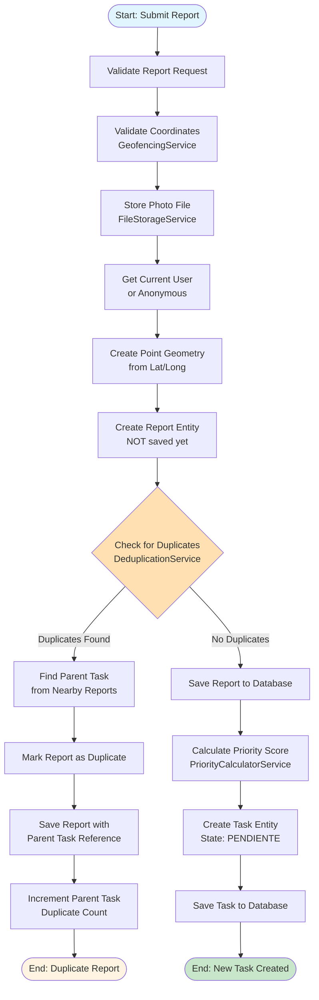
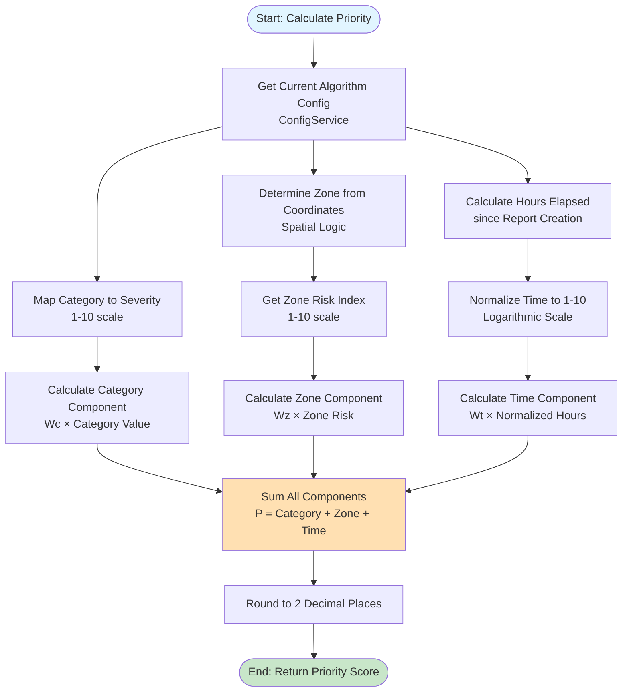
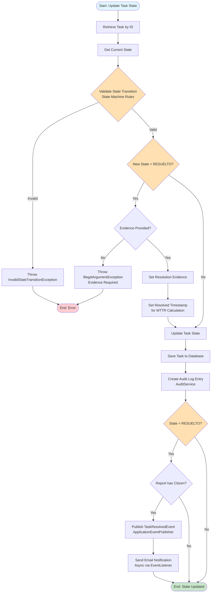
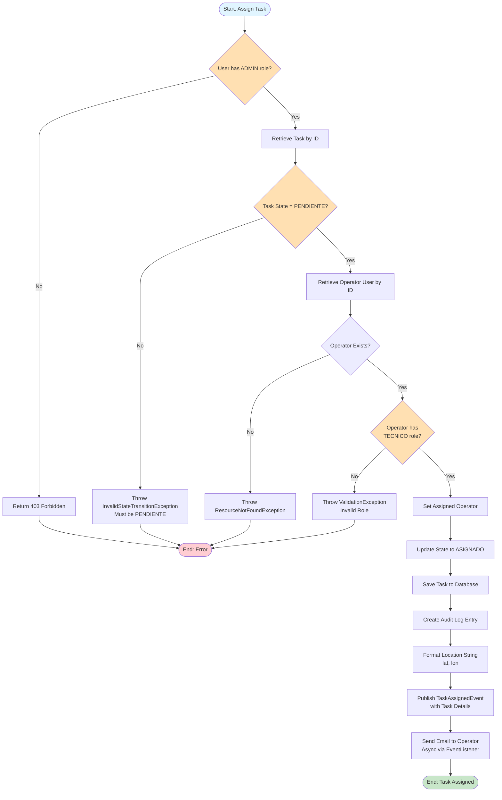
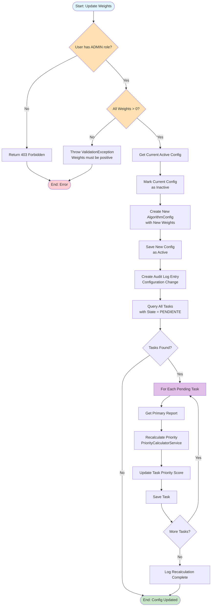

# Use Case View

## Overview

This document describes the functional capabilities of the Urban Cleaning Management System from the perspective of external actors. It identifies all actors, their roles, and the use cases they can perform within the system.

## Cross-References

This view is closely related to other architectural views:

- **[Logical View - Sequence Diagrams](02-logical-view.md#sequence-diagrams)**: Detailed implementation flows for use cases are shown as sequence diagrams
- **[MVC View - Controller Layer](04-mvc-view.md#controller-layer)**: REST endpoints that implement use cases are documented in the Controller Layer
- **[Process View](05-process-view.md)**: Complex use cases correspond to business processes
- **[Design Decisions - Security Architecture](08-design-decisions.md#security-architecture)**: Actor roles and authorization are explained in the security architecture section

## Table of Contents

1. [Actor Identification](#actor-identification)
2. [Use Case Catalog](#use-case-catalog)
3. [Use Case Specifications](#use-case-specifications)
4. [Use Case Diagrams](#use-case-diagrams)
5. [Activity Diagrams](#activity-diagrams)

---

## Actor Identification

This section documents all actors identified from the codebase by analyzing the `UserRole` enum and `@PreAuthorize` annotations in controller classes.

### Actors

| Actor | Role | Description | Source Reference |
|-------|------|-------------|------------------|
| **Citizen** | `ROLE_CIUDADANO` | End users who submit reports about urban cleaning issues and track their status. Can manage their profile, provide feedback on tasks, and control notification preferences. | `UserRole.java` enum value |
| **Operator** | `ROLE_TECNICO` | Field workers responsible for executing cleaning tasks. Can view all reports/tasks, update task states with evidence, and access analytics. Inherits all Citizen capabilities. | `UserRole.java` enum value |
| **Administrator** | `ROLE_ADMIN` | System administrators with full access. Can assign tasks, configure system parameters (algorithm weights, token expiration, duplicate detection), manage notification failures, and access performance metrics. Inherits all Operator and Citizen capabilities. | `UserRole.java` enum value |
| **Anonymous User** | (Unauthenticated) | Users who have not logged in. Can register, login, reset password, and unsubscribe from email notifications. | Public endpoints without `@PreAuthorize` |

### Role Hierarchy

The system implements a hierarchical role structure where higher-level roles inherit capabilities from lower-level roles:

```
Administrator (ROLE_ADMIN)
    ↓ (inherits all capabilities)
Operator (ROLE_TECNICO)
    ↓ (inherits all capabilities)
Citizen (ROLE_CIUDADANO)
```

This hierarchy is implemented through Spring Security's `@PreAuthorize` annotations using `hasAnyRole()` expressions. For example:
- `@PreAuthorize("hasAnyRole('CIUDADANO', 'TECNICO', 'ADMIN')")` - Accessible by all authenticated users
- `@PreAuthorize("hasAnyRole('TECNICO', 'ADMIN')")` - Accessible by Operators and Administrators
- `@PreAuthorize("hasRole('ADMIN')")` - Accessible only by Administrators

### Actor Capabilities Summary

#### Citizen Capabilities
- Submit reports with photos and geolocation
- View own submitted reports
- Provide feedback on task resolution (confirm/reject)
- Manage user profile (update, change password, delete account)
- Manage notification preferences
- Export personal data (GDPR compliance)
- Manage active sessions across devices

#### Operator Capabilities (includes all Citizen capabilities)
- View all reports and tasks in the system
- Update task states with evidence photos
- View detailed task information and audit history
- Access analytics dashboards
- Filter and search tasks by various criteria

#### Administrator Capabilities (includes all Operator capabilities)
- Assign tasks to specific operators
- Configure priority calculation algorithm weights
- Configure JWT token expiration settings
- Configure duplicate detection parameters
- View and retry failed email notifications
- Access system performance metrics and alerts
- View configuration change history
- Manage system-wide settings

#### Anonymous User Capabilities
- Register for new account
- Login to existing account
- Initiate password reset via email
- Validate password reset tokens
- Complete password reset process
- Unsubscribe from email notifications via link

---

## Use Case Catalog

This section lists all use cases extracted from REST API endpoints in controller classes. Each use case is derived from a controller method with HTTP mapping annotations (`@GetMapping`, `@PostMapping`, `@PutMapping`, `@PatchMapping`, `@DeleteMapping`).

### Use Cases by Actor

#### Anonymous User Use Cases

| ID | Use Case Name | HTTP Method | Endpoint | Controller | Description |
|----|---------------|-------------|----------|------------|-------------|
| UC-001 | Register User | POST | `/api/auth/register` | AuthController | Create a new user account with username, email, password, and role |
| UC-002 | Login | POST | `/api/auth/login` | AuthController | Authenticate user and receive access/refresh tokens |
| UC-003 | Refresh Access Token | POST | `/api/auth/refresh` | AuthController | Obtain new access token using valid refresh token |
| UC-004 | Submit Report | POST | `/api/reports` | ReportController | Submit incident report with photo (anonymous allowed) |
| UC-005 | Initiate Password Reset | POST | `/api/auth/password-reset/initiate` | PasswordResetController | Request password reset email |
| UC-006 | Validate Reset Token | GET | `/api/auth/password-reset/validate/{token}` | PasswordResetController | Verify password reset token validity |
| UC-007 | Complete Password Reset | POST | `/api/auth/password-reset/complete` | PasswordResetController | Reset password using valid token |
| UC-008 | Unsubscribe from Notifications | GET | `/api/notifications/unsubscribe` | UnsubscribeController | Unsubscribe from email notifications via link |

#### Citizen Use Cases (ROLE_CIUDADANO)

| ID | Use Case Name | HTTP Method | Endpoint | Controller | Description |
|----|---------------|-------------|----------|------------|-------------|
| UC-009 | Get My Reports | GET | `/api/reports/my` | ReportController | View all reports submitted by current user |
| UC-010 | Get User Profile | GET | `/api/user/profile` | UserController | Retrieve current user's profile information |
| UC-011 | Update User Profile | PUT | `/api/user/profile` | UserController | Update profile (name, email, phone) |
| UC-012 | Change Password | POST | `/api/user/change-password` | UserController | Change account password |
| UC-013 | Get User Reports | GET | `/api/user/reports` | UserController | Get list of user's submitted reports |
| UC-014 | Request Account Deletion | POST | `/api/user/delete-account` | UserController | Request account deletion (GDPR) |
| UC-015 | Cancel Account Deletion | POST | `/api/user/cancel-deletion` | UserController | Cancel pending account deletion |
| UC-016 | Export User Data | GET | `/api/user/export` | UserController | Export all personal data (GDPR) |
| UC-017 | Confirm Task Resolution | POST | `/api/tasks/{taskId}/feedback/confirm` | FeedbackController | Confirm that task was resolved satisfactorily |
| UC-018 | Reject Task Resolution | POST | `/api/tasks/{taskId}/feedback/reject` | FeedbackController | Reject task resolution with reason |
| UC-019 | Get Task Feedback | GET | `/api/tasks/{taskId}/feedback` | FeedbackController | View feedback for a specific task |
| UC-020 | Get Notification Preferences | GET | `/api/notifications/preferences` | NotificationPreferenceController | View current notification settings |
| UC-021 | Update Notification Preferences | PUT | `/api/notifications/preferences` | NotificationPreferenceController | Update notification preferences |
| UC-022 | Logout | POST | `/api/auth/logout` | AuthController | Logout from current session |
| UC-023 | Logout from All Devices | POST | `/api/auth/logout-all` | AuthController | Invalidate all sessions |
| UC-024 | Get Active Sessions | GET | `/api/sessions` | SessionController | View all active sessions |
| UC-025 | Get All Sessions | GET | `/api/sessions/all` | SessionController | View complete session history |
| UC-026 | Revoke Specific Session | DELETE | `/api/sessions/{sessionId}` | SessionController | Terminate specific session |
| UC-027 | Revoke Other Sessions | POST | `/api/sessions/revoke-others` | SessionController | Logout from all other devices |

#### Operator Use Cases (ROLE_TECNICO) - Includes all Citizen use cases

| ID | Use Case Name | HTTP Method | Endpoint | Controller | Description |
|----|---------------|-------------|----------|------------|-------------|
| UC-028 | Get All Reports | GET | `/api/reports` | ReportController | View all incident reports in system |
| UC-029 | Get Report by ID | GET | `/api/reports/{id}` | ReportController | View detailed report information |
| UC-030 | Get All Tasks | GET | `/api/tasks` | TaskController | View all tasks with optional filters |
| UC-031 | Get Task by ID | GET | `/api/tasks/{id}` | TaskController | View detailed task information |
| UC-032 | Update Task State | PATCH | `/api/tasks/{id}/state` | TaskController | Update task state with evidence photo |
| UC-033 | Get Task Audit History | GET | `/api/tasks/{id}/audit-history` | TaskController | View complete audit trail for task |
| UC-034 | Get Analytics - Task Distribution | GET | `/api/analytics/task-distribution` | AnalyticsController | View task distribution by category/state |
| UC-035 | Get Analytics - Heatmap | GET | `/api/analytics/heatmap` | AnalyticsController | View geographic heatmap of reports |
| UC-036 | Get Analytics - MTTR | GET | `/api/analytics/mttr` | AnalyticsController | View mean time to resolution metrics |
| UC-037 | Get Analytics - Operator Performance | GET | `/api/analytics/operator-performance` | AnalyticsController | View operator performance statistics |

#### Administrator Use Cases (ROLE_ADMIN) - Includes all Operator use cases

| ID | Use Case Name | HTTP Method | Endpoint | Controller | Description |
|----|---------------|-------------|----------|------------|-------------|
| UC-038 | Assign Task to Operator | POST | `/api/tasks/{id}/assign` | TaskController | Assign task to specific operator |
| UC-039 | Get Algorithm Weights | GET | `/api/admin/config/algorithm-weights` | ConfigController | View current priority algorithm weights |
| UC-040 | Update Algorithm Weights | PUT | `/api/admin/config/algorithm-weights` | ConfigController | Update priority calculation weights |
| UC-041 | Get Configuration History | GET | `/api/admin/config/algorithm-weights/history` | ConfigController | View weight configuration change history |
| UC-042 | Get Token Expiration Config | GET | `/api/admin/config/token-expiration` | ConfigController | View JWT token expiration settings |
| UC-043 | Update Token Expiration Config | PUT | `/api/admin/config/token-expiration` | ConfigController | Update token expiration times |
| UC-044 | Get Duplicate Detection Config | GET | `/api/admin/config/duplicate-detection` | ConfigController | View duplicate detection parameters |
| UC-045 | Update Duplicate Detection Config | PUT | `/api/admin/config/duplicate-detection` | ConfigController | Update duplicate detection settings |
| UC-046 | Get Notification Failures | GET | `/api/admin/notifications/failures` | NotificationFailureController | View failed email notifications |
| UC-047 | Retry Failed Notification | POST | `/api/admin/notifications/failures/{id}/retry` | NotificationFailureController | Retry sending failed notification |
| UC-048 | Get Performance Metrics | GET | `/api/admin/performance` | PerformanceMetricsController | View system performance metrics |
| UC-049 | Get Performance Alerts | GET | `/api/admin/alerts` | PerformanceMetricsController | Check for performance threshold alerts |

### Use Cases by Functional Area

#### Authentication & Authorization (9 use cases)
UC-001, UC-002, UC-003, UC-005, UC-006, UC-007, UC-022, UC-023

#### Report Management (5 use cases)
UC-004, UC-009, UC-013, UC-028, UC-029

#### Task Management (7 use cases)
UC-030, UC-031, UC-032, UC-033, UC-038, UC-017, UC-018, UC-019

#### User Profile & Account Management (8 use cases)
UC-010, UC-011, UC-012, UC-014, UC-015, UC-016

#### Session Management (5 use cases)
UC-024, UC-025, UC-026, UC-027

#### Notification Management (4 use cases)
UC-008, UC-020, UC-021, UC-046, UC-047

#### Analytics & Reporting (4 use cases)
UC-034, UC-035, UC-036, UC-037

#### System Configuration (8 use cases)
UC-039, UC-040, UC-041, UC-042, UC-043, UC-044, UC-045, UC-048, UC-049

### Total Use Cases: 49

---

## Use Case Specifications

This section provides detailed specifications for key use cases, including name, actor, description, preconditions, main flow, alternative flows, and postconditions. Specifications are derived from controller method implementations, service layer logic, and exception handling patterns.

### UC-001: Register User

**Actor**: Anonymous User

**Description**: Create a new user account in the system with username, email, password, and role selection.

**Preconditions**:
- User is not authenticated
- Username must be unique
- Email must be unique and valid format
- Password must meet complexity requirements (min 8 chars, uppercase, lowercase, digit, special char)

**Main Flow**:
1. User provides registration data (username, email, password, full name, phone, role)
2. System validates input data format
3. System checks username uniqueness
4. System checks email uniqueness
5. System hashes password using BCrypt
6. System creates user entity with PENDING status
7. System saves user to database
8. System returns created user object (201 Created)

**Alternative Flows**:
- **AF-1 (Validation Error)**: If input validation fails, return 400 Bad Request with validation errors
- **AF-2 (Username Exists)**: If username already exists, return 400 Bad Request with "Username already exists" message
- **AF-3 (Email Exists)**: If email already exists, return 400 Bad Request with "Email already exists" message
- **AF-4 (Weak Password)**: If password doesn't meet requirements, return 400 Bad Request with password policy details

**Postconditions**:
- New user account created in database
- Password stored as BCrypt hash
- User can login with credentials
- Audit log entry created

**Related Endpoints**:
- `POST /api/auth/register`

**Source Reference**: `AuthController.register()`, `AuthService.register()`

---

### UC-002: Login

**Actor**: Anonymous User

**Description**: Authenticate user with username and password, receiving access token (15 min) and refresh token (7 days).

**Preconditions**:
- User has registered account
- User is not currently authenticated
- Account is not locked due to failed login attempts

**Main Flow**:
1. User provides username and password
2. System validates credentials against database
3. System checks if account is active
4. System generates device fingerprint from request
5. System creates new user session
6. System generates JWT access token (15 min expiration)
7. System generates refresh token (7 days expiration)
8. System saves refresh token to database
9. System returns LoginResponse with both tokens (200 OK)

**Alternative Flows**:
- **AF-1 (Invalid Credentials)**: If username/password incorrect, increment failed login counter, return 401 Unauthorized
- **AF-2 (Account Locked)**: If too many failed attempts, lock account temporarily, return 401 Unauthorized
- **AF-3 (Account Inactive)**: If account marked for deletion, return 401 Unauthorized

**Postconditions**:
- User session created in database
- Access token and refresh token issued
- Failed login counter reset to 0
- Audit log entry created with IP address
- User can access protected endpoints

**Related Endpoints**:
- `POST /api/auth/login`

**Source Reference**: `AuthController.login()`, `AuthService.login()`, `JwtTokenProvider.generateToken()`

---

### UC-004: Submit Report

**Actor**: Anonymous User (or any authenticated user)

**Description**: Submit a new urban cleaning incident report with photo and geolocation. System automatically checks for duplicates within configured radius and time window.

**Preconditions**:
- Photo file size ≤ 5MB
- Photo format is JPEG, PNG, or GIF
- Coordinates are within geofencing boundaries
- User has geolocation permission (frontend)

**Main Flow**:
1. User provides report data (category, description, latitude, longitude) and photo
2. System validates input data
3. System validates coordinates are within geofence
4. System validates photo file size and format
5. System saves photo to file storage
6. System checks for duplicate reports within radius/time window
7. System creates Report entity
8. System creates associated Task entity
9. System calculates task priority using algorithm
10. System saves report and task to database
11. System returns ReportResponse with isDuplicate flag (201 Created)

**Alternative Flows**:
- **AF-1 (Validation Error)**: If validation fails, return 400 Bad Request
- **AF-2 (Outside Geofence)**: If coordinates outside boundaries, return 400 Bad Request with "Coordinates outside geofencing boundaries"
- **AF-3 (File Too Large)**: If photo > 5MB, return 413 Payload Too Large
- **AF-4 (Duplicate Detected)**: If duplicate found, mark report as duplicate, link to original task, return 201 Created with isDuplicate=true
- **AF-5 (File Storage Error)**: If photo save fails, return 500 Internal Server Error

**Postconditions**:
- Report entity created in database
- Photo file saved to uploads directory
- Task entity created with calculated priority
- If duplicate, linked to existing task
- If not duplicate, new task created
- Notification sent to operators (if configured)

**Related Endpoints**:
- `POST /api/reports`

**Source Reference**: `ReportController.submitReport()`, `ReportService.createReport()`, `DeduplicationService.checkForDuplicates()`, `PriorityCalculatorService.calculatePriority()`

---

### UC-030: Get All Tasks

**Actor**: Operator, Administrator

**Description**: Retrieve all tasks in the system with optional filtering by state, category, assigned operator, and date range.

**Preconditions**:
- User is authenticated
- User has TECNICO or ADMIN role

**Main Flow**:
1. User requests task list with optional filters
2. System validates user authentication and authorization
3. System applies filters to task query
4. System retrieves tasks from database
5. System converts tasks to TaskResponse DTOs
6. System returns list of tasks (200 OK)

**Alternative Flows**:
- **AF-1 (Unauthorized)**: If not authenticated, return 401 Unauthorized
- **AF-2 (Forbidden)**: If user lacks TECNICO/ADMIN role, return 403 Forbidden
- **AF-3 (No Tasks)**: If no tasks match filters, return empty list (200 OK)

**Postconditions**:
- Task list returned to user
- No state changes in system

**Related Endpoints**:
- `GET /api/tasks`

**Source Reference**: `TaskController.getTasks()`, `TaskService.getTasks()`

---

### UC-032: Update Task State

**Actor**: Operator, Administrator

**Description**: Update task state (e.g., PENDIENTE → EN_PROGRESO → RESUELTO) with optional evidence photo. System validates state transitions and creates audit log entries.

**Preconditions**:
- User is authenticated with TECNICO or ADMIN role
- Task exists
- State transition is valid according to state machine rules
- If transitioning to RESUELTO, evidence photo required

**Main Flow**:
1. User provides task ID, new state, and optional evidence photo
2. System validates user authentication and authorization
3. System retrieves task from database
4. System validates state transition is allowed
5. System saves evidence photo (if provided)
6. System updates task state
7. System updates task timestamps (resolvedAt if RESUELTO)
8. System creates audit log entry
9. System publishes state change event
10. System sends notifications based on new state
11. System returns updated TaskResponse (200 OK)

**Alternative Flows**:
- **AF-1 (Invalid Transition)**: If transition not allowed, return 400 Bad Request with "Invalid state transition"
- **AF-2 (Missing Evidence)**: If transitioning to RESUELTO without photo, return 400 Bad Request
- **AF-3 (Task Not Found)**: If task doesn't exist, return 404 Not Found
- **AF-4 (Unauthorized)**: If not authenticated, return 401 Unauthorized
- **AF-5 (Forbidden)**: If user lacks required role, return 403 Forbidden

**Postconditions**:
- Task state updated in database
- Evidence photo saved (if provided)
- Audit log entry created
- Event published (TaskResolvedEvent, TaskReopenedEvent, etc.)
- Notifications sent to relevant users
- Task metrics updated

**Related Endpoints**:
- `PATCH /api/tasks/{id}/state`

**Source Reference**: `TaskController.updateTaskState()`, `TaskService.updateTaskState()`, `TaskService.validateStateTransition()`, `AuditService.logTaskStateChange()`

---

### UC-038: Assign Task to Operator

**Actor**: Administrator

**Description**: Assign a specific task to an operator. System validates operator role and creates audit trail.

**Preconditions**:
- User is authenticated with ADMIN role
- Task exists
- Target operator exists and has TECNICO role
- Task is in assignable state (PENDIENTE)

**Main Flow**:
1. Administrator provides task ID and operator ID
2. System validates admin authentication and authorization
3. System retrieves task from database
4. System validates task is in PENDIENTE state
5. System retrieves operator user
6. System validates operator has TECNICO role
7. System assigns task to operator
8. System updates task state to ASIGNADO
9. System creates audit log entry
10. System publishes TaskAssignedEvent
11. System sends notification to operator
12. System returns updated TaskResponse (200 OK)

**Alternative Flows**:
- **AF-1 (Not Admin)**: If user lacks ADMIN role, return 403 Forbidden
- **AF-2 (Task Not Found)**: If task doesn't exist, return 404 Not Found
- **AF-3 (Operator Not Found)**: If operator doesn't exist, return 404 Not Found
- **AF-4 (Invalid Operator Role)**: If target user not TECNICO, return 400 Bad Request
- **AF-5 (Invalid Task State)**: If task not PENDIENTE, return 400 Bad Request with "Task must be in PENDIENTE state"

**Postconditions**:
- Task assigned to operator
- Task state changed to ASIGNADO
- Audit log entry created
- TaskAssignedEvent published
- Email notification sent to operator
- Task visible in operator's task list

**Related Endpoints**:
- `POST /api/tasks/{id}/assign`

**Source Reference**: `TaskController.assignTask()`, `TaskService.assignTask()`, `TaskEventListener.handleTaskAssigned()`

---

### UC-040: Update Algorithm Weights

**Actor**: Administrator

**Description**: Update the weights used in priority calculation algorithm (category weight, zone weight, time weight). System validates weights and recalculates priorities for all pending tasks.

**Preconditions**:
- User is authenticated with ADMIN role
- All weights must be positive numbers
- Weights typically sum to 1.0 (not enforced but recommended)

**Main Flow**:
1. Administrator provides new weight values
2. System validates admin authentication and authorization
3. System validates weight values are positive
4. System creates new AlgorithmConfig entity
5. System saves configuration to database
6. System marks previous config as inactive
7. System triggers priority recalculation for all pending tasks
8. System creates audit log entry
9. System returns updated configuration (200 OK)

**Alternative Flows**:
- **AF-1 (Not Admin)**: If user lacks ADMIN role, return 403 Forbidden
- **AF-2 (Invalid Weights)**: If any weight ≤ 0, return 400 Bad Request
- **AF-3 (Recalculation Error)**: If priority recalculation fails, log error but return success (async operation)

**Postconditions**:
- New algorithm configuration saved
- Previous configuration marked inactive
- All pending task priorities recalculated
- Configuration change logged in audit trail
- System uses new weights for future reports

**Related Endpoints**:
- `PUT /api/admin/config/algorithm-weights`

**Source Reference**: `ConfigController.updateWeights()`, `ConfigService.updateAlgorithmWeights()`, `PriorityCalculatorService.recalculateAllPriorities()`

---

### UC-017: Confirm Task Resolution

**Actor**: Citizen, Operator, Administrator

**Description**: Provide positive feedback confirming that a task was resolved satisfactorily. System records feedback and keeps task in RESUELTO state.

**Preconditions**:
- User is authenticated
- Task exists
- Task is in RESUELTO state
- No feedback has been provided yet for this task

**Main Flow**:
1. User confirms task resolution for specific task ID
2. System validates user authentication
3. System retrieves task from database
4. System validates task is in RESUELTO state
5. System creates CitizenFeedback entity with type=CONFIRMACION
6. System saves feedback to database
7. System returns FeedbackResponse (200 OK)

**Alternative Flows**:
- **AF-1 (Task Not Found)**: If task doesn't exist, return 404 Not Found
- **AF-2 (Invalid State)**: If task not RESUELTO, return 400 Bad Request
- **AF-3 (Feedback Exists)**: If feedback already provided, return 400 Bad Request
- **AF-4 (Unauthorized)**: If not authenticated, return 401 Unauthorized

**Postconditions**:
- Feedback entity created with type CONFIRMACION
- Task remains in RESUELTO state
- Feedback visible in task details
- Operator performance metrics updated

**Related Endpoints**:
- `POST /api/tasks/{taskId}/feedback/confirm`

**Source Reference**: `FeedbackController.confirmResolution()`, `FeedbackService.confirmResolution()`

---

### UC-018: Reject Task Resolution

**Actor**: Citizen, Operator, Administrator

**Description**: Provide negative feedback rejecting task resolution with reason. System reopens task and notifies operator.

**Preconditions**:
- User is authenticated
- Task exists
- Task is in RESUELTO state
- No feedback has been provided yet for this task
- Rejection reason provided

**Main Flow**:
1. User rejects task resolution with reason
2. System validates user authentication
3. System retrieves task from database
4. System validates task is in RESUELTO state
5. System creates CitizenFeedback entity with type=RECHAZO
6. System updates task state to REABIERTO
7. System creates audit log entry
8. System publishes TaskReopenedEvent
9. System sends notification to assigned operator
10. System returns FeedbackResponse (200 OK)

**Alternative Flows**:
- **AF-1 (Task Not Found)**: If task doesn't exist, return 404 Not Found
- **AF-2 (Invalid State)**: If task not RESUELTO, return 400 Bad Request
- **AF-3 (Feedback Exists)**: If feedback already provided, return 400 Bad Request
- **AF-4 (Missing Reason)**: If reason not provided, return 400 Bad Request
- **AF-5 (Unauthorized)**: If not authenticated, return 401 Unauthorized

**Postconditions**:
- Feedback entity created with type RECHAZO
- Task state changed to REABIERTO
- Audit log entry created
- TaskReopenedEvent published
- Email notification sent to operator
- Task appears in operator's pending tasks

**Related Endpoints**:
- `POST /api/tasks/{taskId}/feedback/reject`

**Source Reference**: `FeedbackController.rejectResolution()`, `FeedbackService.rejectResolution()`, `TaskService.reopenTask()`

---

### UC-034: Get Analytics - Task Distribution

**Actor**: Operator, Administrator

**Description**: Retrieve task distribution statistics grouped by category and state for specified time period.

**Preconditions**:
- User is authenticated with TECNICO or ADMIN role
- Optional date range filters provided

**Main Flow**:
1. User requests task distribution with optional filters
2. System validates user authentication and authorization
3. System applies date range filters
4. System queries database for task counts grouped by category and state
5. System calculates percentages
6. System returns TaskDistributionResponse (200 OK)

**Alternative Flows**:
- **AF-1 (Unauthorized)**: If not authenticated, return 401 Unauthorized
- **AF-2 (Forbidden)**: If user lacks TECNICO/ADMIN role, return 403 Forbidden
- **AF-3 (No Data)**: If no tasks in period, return empty distribution (200 OK)

**Postconditions**:
- Analytics data returned
- No state changes in system

**Related Endpoints**:
- `GET /api/analytics/task-distribution`

**Source Reference**: `AnalyticsController.getTaskDistribution()`, `AnalyticsService.getTaskDistribution()`

---

### UC-048: Get Performance Metrics

**Actor**: Administrator

**Description**: Retrieve comprehensive system performance metrics including response times, throughput, error rates, and resource utilization.

**Preconditions**:
- User is authenticated with ADMIN role
- Metrics collection is enabled

**Main Flow**:
1. Administrator requests performance metrics
2. System validates admin authentication and authorization
3. System retrieves metrics from Spring Boot Actuator
4. System calculates aggregated statistics
5. System returns PerformanceMetricsResponse (200 OK)

**Alternative Flows**:
- **AF-1 (Not Admin)**: If user lacks ADMIN role, return 403 Forbidden
- **AF-2 (Metrics Disabled)**: If metrics not enabled, return 503 Service Unavailable

**Postconditions**:
- Performance metrics returned
- No state changes in system

**Related Endpoints**:
- `GET /api/admin/performance`

**Source Reference**: `PerformanceMetricsController.getPerformanceMetrics()`, `PerformanceMetricsService.getMetrics()`

---

## Use Case Diagrams

This section contains Mermaid use case diagrams showing actors and their use cases, grouped by functional area.

### Diagram Notation Legend

**Use Case Diagram Symbols**:
- **Oval/Rectangle**: Use case (system functionality)
- **Stick figure**: Actor (external entity)
- **Arrow**: Association (actor performs use case)
- **Dashed box**: System boundary
- **Nested boxes**: Functional grouping

**Use Case Format**:
- `UC-XXX: Name`: Use case identifier and descriptive name
- Use cases are grouped by functional area for clarity

**Actor Types**:
- **Anonymous User**: Unauthenticated users
- **Citizen**: Authenticated users with CIUDADANO role
- **Operator**: Authenticated users with TECNICO role
- **Administrator**: Authenticated users with ADMIN role

**Relationship Indicators**:
- Direct arrow: Actor can perform use case
- Grouped use cases: Related functionality in same domain

---

### System Use Case Diagram - Complete Overview

```mermaid
graph TB
    subgraph System["Urban Cleaning Management System"]
        subgraph Auth["Authentication & Authorization"]
            UC001[UC-001: Register User]
            UC002[UC-002: Login]
            UC003[UC-003: Refresh Access Token]
            UC005[UC-005: Initiate Password Reset]
            UC006[UC-006: Validate Reset Token]
            UC007[UC-007: Complete Password Reset]
            UC022[UC-022: Logout]
            UC023[UC-023: Logout from All Devices]
        end
        
        subgraph Reports["Report Management"]
            UC004[UC-004: Submit Report]
            UC009[UC-009: Get My Reports]
            UC028[UC-028: Get All Reports]
            UC029[UC-029: Get Report by ID]
        end
        
        subgraph Tasks["Task Management"]
            UC030[UC-030: Get All Tasks]
            UC031[UC-031: Get Task by ID]
            UC032[UC-032: Update Task State]
            UC033[UC-033: Get Task Audit History]
            UC038[UC-038: Assign Task to Operator]
        end
        
        subgraph Feedback["Feedback Management"]
            UC017[UC-017: Confirm Task Resolution]
            UC018[UC-018: Reject Task Resolution]
            UC019[UC-019: Get Task Feedback]
        end
        
        subgraph Profile["User Profile & Account"]
            UC010[UC-010: Get User Profile]
            UC011[UC-011: Update User Profile]
            UC012[UC-012: Change Password]
            UC014[UC-014: Request Account Deletion]
            UC015[UC-015: Cancel Account Deletion]
            UC016[UC-016: Export User Data]
        end
        
        subgraph Sessions["Session Management"]
            UC024[UC-024: Get Active Sessions]
            UC025[UC-025: Get All Sessions]
            UC026[UC-026: Revoke Specific Session]
            UC027[UC-027: Revoke Other Sessions]
        end
        
        subgraph Notifications["Notification Management"]
            UC008[UC-008: Unsubscribe from Notifications]
            UC020[UC-020: Get Notification Preferences]
            UC021[UC-021: Update Notification Preferences]
            UC046[UC-046: Get Notification Failures]
            UC047[UC-047: Retry Failed Notification]
        end
        
        subgraph Analytics["Analytics & Reporting"]
            UC034[UC-034: Get Task Distribution]
            UC035[UC-035: Get Heatmap]
            UC036[UC-036: Get MTTR]
            UC037[UC-037: Get Operator Performance]
        end
        
        subgraph Config["System Configuration"]
            UC039[UC-039: Get Algorithm Weights]
            UC040[UC-040: Update Algorithm Weights]
            UC041[UC-041: Get Configuration History]
            UC042[UC-042: Get Token Expiration Config]
            UC043[UC-043: Update Token Expiration Config]
            UC044[UC-044: Get Duplicate Detection Config]
            UC045[UC-045: Update Duplicate Detection Config]
            UC048[UC-048: Get Performance Metrics]
            UC049[UC-049: Get Performance Alerts]
        end
    end
    
    Anonymous[Anonymous User] --> UC001
    Anonymous --> UC002
    Anonymous --> UC003
    Anonymous --> UC004
    Anonymous --> UC005
    Anonymous --> UC006
    Anonymous --> UC007
    Anonymous --> UC008
    
    Citizen[Citizen<br/>ROLE_CIUDADANO] --> UC009
    Citizen --> UC010
    Citizen --> UC011
    Citizen --> UC012
    Citizen --> UC014
    Citizen --> UC015
    Citizen --> UC016
    Citizen --> UC017
    Citizen --> UC018
    Citizen --> UC019
    Citizen --> UC020
    Citizen --> UC021
    Citizen --> UC022
    Citizen --> UC023
    Citizen --> UC024
    Citizen --> UC025
    Citizen --> UC026
    Citizen --> UC027
    
    Operator[Operator<br/>ROLE_TECNICO] --> UC028
    Operator --> UC029
    Operator --> UC030
    Operator --> UC031
    Operator --> UC032
    Operator --> UC033
    Operator --> UC034
    Operator --> UC035
    Operator --> UC036
    Operator --> UC037
    
    Admin[Administrator<br/>ROLE_ADMIN] --> UC038
    Admin --> UC039
    Admin --> UC040
    Admin --> UC041
    Admin --> UC042
    Admin --> UC043
    Admin --> UC044
    Admin --> UC045
    Admin --> UC046
    Admin --> UC047
    Admin --> UC048
    Admin --> UC049
    
    style Anonymous fill:#e1f5ff
    style Citizen fill:#fff4e1
    style Operator fill:#e8f5e9
    style Admin fill:#fce4ec
```



**Description**: 

This comprehensive use case diagram shows all 49 use cases in the Urban Cleaning Management System, organized by functional area and mapped to their respective actors. The diagram illustrates the hierarchical nature of the role-based access control system:

- **Anonymous Users** (blue) can access 8 public use cases related to authentication and report submission
- **Citizens** (yellow) inherit no capabilities from anonymous users but have 19 authenticated use cases for managing their profile, reports, and feedback
- **Operators** (green) have 10 additional use cases beyond citizen capabilities, focused on task management and analytics
- **Administrators** (pink) have 12 exclusive use cases for system configuration and management

The functional groupings show clear separation of concerns:
- **Authentication & Authorization**: User identity and session management
- **Report Management**: Incident report submission and viewing
- **Task Management**: Task lifecycle and assignment
- **Feedback Management**: Citizen feedback on task resolution
- **User Profile & Account**: Personal data and GDPR compliance
- **Session Management**: Multi-device session control
- **Notification Management**: Email notification preferences and failure handling
- **Analytics & Reporting**: System metrics and performance data
- **System Configuration**: Administrative settings and algorithm tuning

### Use Case Diagram - Authentication Flow



**Description**: This diagram shows the authentication lifecycle, from anonymous user registration through login, token management, and logout. It illustrates the state transitions between anonymous and authenticated states.

### Use Case Diagram - Report and Task Lifecycle



**Description**: This diagram illustrates the complete lifecycle of a report from submission through task creation, assignment, resolution, and feedback. It shows how different actors interact at each stage and how rejected resolutions trigger task reopening.

### Use Case Diagram - Administrative Configuration



**Description**: This diagram shows administrative configuration capabilities, including algorithm tuning, system settings, notification management, and performance monitoring. The diagram highlights that updating algorithm weights triggers automatic priority recalculation for all pending tasks.

### Legend

- **Blue Actors**: Anonymous/Unauthenticated users
- **Yellow Actors**: Citizens (ROLE_CIUDADANO)
- **Green Actors**: Operators (ROLE_TECNICO)
- **Pink Actors**: Administrators (ROLE_ADMIN)
- **Gray Boxes**: System-triggered actions (not direct user actions)
- **Arrows**: Actor-to-use-case relationships (actor can perform use case)

---

## Activity Diagrams

This section contains activity diagrams for the 5 most complex workflows in the system, identified by analyzing service method complexity, method call depth, and business logic intricacy.

### Diagram Notation Legend

**Activity Diagram Symbols**:
- **Rounded rectangle**: Activity/action step
- **Diamond**: Decision point (conditional logic)
- **Circle with arrow**: Start node
- **Circle with border**: End node
- **Arrow**: Flow direction
- **Parallel bars**: Parallel/concurrent activities

**Decision Nodes**:
- Diamond shape with question
- Multiple outgoing arrows labeled with conditions (Yes/No, True/False)

**Activity Types**:
- **Validation**: Input checking and constraint verification
- **Business Logic**: Core processing steps
- **Database Operations**: Data persistence and retrieval
- **External Calls**: Service-to-service communication
- **Event Publishing**: Asynchronous notifications

---

### Activity Diagram 1: Submit Report with Duplicate Detection

**Workflow**: `ReportService.createReport()` → `DeduplicationService.checkForDuplicatesBeforeSave()` → `TaskService.createTask()`

**Complexity Factors**:
- Multiple service orchestration (ReportService, DeduplicationService, TaskService, FileStorageService, GeofencingService)
- Spatial database queries for duplicate detection
- Conditional task creation based on duplicate status
- Transaction management across multiple entities



**Description**: This workflow handles report submission with automatic duplicate detection. The system validates input, stores the photo, creates a report entity (without saving), checks for spatial and temporal duplicates within configured thresholds, and either links to an existing task or creates a new one. The duplicate detection uses PostGIS spatial queries to find nearby reports within a configurable radius and time window.

**Source Reference**: `ReportController.submitReport()`, `ReportService.createReport()`, `DeduplicationService.checkForDuplicatesBeforeSave()`, `TaskService.createTask()`

---

### Activity Diagram 2: Calculate Task Priority

**Workflow**: `PriorityCalculatorService.calculatePriority()`

**Complexity Factors**:
- Multi-factor calculation with configurable weights
- Category severity mapping (9 categories, 1-10 scale)
- Zone risk index calculation (spatial logic)
- Time-based urgency with logarithmic scaling
- Dynamic weight retrieval from configuration



**Description**: This workflow implements the priority calculation algorithm using the formula P = (Wc × Category) + (Wz × Zone) + (Wt × Time). Each component is calculated independently: category severity is mapped from predefined values (1-10), zone risk is determined from spatial coordinates, and time urgency uses logarithmic scaling to prevent time from dominating the score. The weights (Wc, Wz, Wt) are retrieved from the current algorithm configuration and can be adjusted by administrators.

**Source Reference**: `PriorityCalculatorService.calculatePriority()`, `PriorityCalculatorService.calculateCategoryComponent()`, `PriorityCalculatorService.calculateZoneComponent()`, `PriorityCalculatorService.calculateTimeComponent()`

---

### Activity Diagram 3: Update Task State with Evidence

**Workflow**: `TaskService.updateStateWithEvidence()` → Event Publishing → Notification Sending

**Complexity Factors**:
- State machine validation (5 states, 4 valid transitions)
- Evidence requirement validation
- Event-driven architecture (TaskResolvedEvent, TaskReopenedEvent)
- Asynchronous notification sending
- Audit trail creation
- Timestamp management for MTTR calculation



**Description**: This workflow manages task state transitions according to strict state machine rules. Valid transitions are: PENDIENTE→ASIGNADO, ASIGNADO→EN_PROGRESO, EN_PROGRESO→RESUELTO, REABIERTO→EN_PROGRESO. When transitioning to RESUELTO, evidence (photo) is required. The system sets the resolved timestamp for MTTR metrics, creates an audit log entry, publishes a TaskResolvedEvent, and asynchronously sends email notifications to the citizen who submitted the report.

**Source Reference**: `TaskController.updateTaskState()`, `TaskService.updateStateWithEvidence()`, `TaskService.validateStateTransition()`, `TaskEventListener.handleTaskResolved()`

---

### Activity Diagram 4: Assign Task to Operator

**Workflow**: `TaskService.assignTask()` → Event Publishing → Notification Sending

**Complexity Factors**:
- Role validation (operator must have TECNICO role)
- State validation (task must be PENDIENTE)
- Event-driven notification system
- Audit trail creation
- Automatic state transition to ASIGNADO



**Description**: This workflow handles task assignment to operators by administrators. The system validates that the user has ADMIN role, the task is in PENDIENTE state, the operator exists and has TECNICO role. Upon successful validation, it assigns the operator, transitions the task to ASIGNADO state, creates an audit log entry, publishes a TaskAssignedEvent, and asynchronously sends an email notification to the assigned operator with task details including location, category, and priority.

**Source Reference**: `TaskController.assignTask()`, `TaskService.assignTask()`, `TaskEventListener.handleTaskAssigned()`, `EmailService.sendTaskAssignedEmail()`

---

### Activity Diagram 5: Update Algorithm Weights and Recalculate Priorities

**Workflow**: `ConfigService.updateAlgorithmWeights()` → `TaskService.recalculatePendingTasksPriority()`

**Complexity Factors**:
- Configuration versioning (mark old config inactive)
- Bulk priority recalculation for all pending tasks
- Transaction management across multiple entities
- Audit trail for configuration changes
- Asynchronous recalculation to avoid blocking



**Description**: This workflow handles administrator updates to the priority calculation algorithm weights. The system validates admin role and weight values (must be positive), marks the current configuration as inactive, creates a new active configuration, and triggers recalculation of all pending task priorities. The recalculation iterates through all PENDIENTE tasks, retrieves their primary reports, recalculates priorities using the new weights, and updates the task entities. This ensures that priority changes take effect immediately for all unassigned tasks.

**Source Reference**: `ConfigController.updateWeights()`, `ConfigService.updateAlgorithmWeights()`, `TaskService.recalculatePendingTasksPriority()`, `PriorityCalculatorService.recalculatePriority()`

---

## Complexity Analysis Summary

The five workflows were selected based on the following complexity metrics:

1. **Submit Report with Duplicate Detection** (Highest Complexity)
   - 5 service dependencies
   - Spatial database queries
   - Conditional branching based on duplicate detection
   - Transaction spanning multiple entities

2. **Calculate Task Priority** (High Complexity)
   - Multi-factor mathematical calculation
   - Dynamic configuration retrieval
   - Spatial zone determination
   - Logarithmic time scaling

3. **Update Task State with Evidence** (High Complexity)
   - State machine validation
   - Event-driven architecture
   - Asynchronous notification system
   - Audit trail management

4. **Assign Task to Operator** (Medium-High Complexity)
   - Multiple validation steps
   - Role-based access control
   - Event publishing
   - Email notification system

5. **Update Algorithm Weights** (Medium-High Complexity)
   - Configuration versioning
   - Bulk entity updates
   - Transaction management
   - System-wide impact

These workflows represent the core business logic of the Urban Cleaning Management System and demonstrate the system's capabilities in spatial analysis, event-driven architecture, state management, and configuration management.

---

## Notes

- All use cases are extracted from actual controller endpoints
- Security requirements are derived from @PreAuthorize annotations
- Activity diagrams focus on the most complex service orchestration methods
- This document will be populated during the analysis phase
