# Logical View

## Overview

The Logical View describes the internal structure and design of the Urban Cleaning Management System, focusing on component interactions, class relationships, and behavioral patterns. This view provides insight into how the system implements its functionality through sequence diagrams, class diagrams, state machines, and collaboration patterns.

## Cross-References

This view is closely related to other architectural views:

- **[Data Model View](03-data-model-view.md)**: Entities shown in class diagrams are detailed in the Data Model View with complete attribute specifications
- **[Use Case View](01-use-case-view.md)**: Sequence diagrams implement the workflows described in use case specifications
- **[Implementation View](07-implementation-view.md)**: Components shown here correspond to packages and modules in the Implementation View
- **[Process View](05-process-view.md)**: Sequence diagrams illustrate the runtime execution of business processes
- **[MVC View](04-mvc-view.md)**: Controllers, Services, and Repositories shown here map to the MVC pattern layers

## Table of Contents

1. [Sequence Diagrams](#sequence-diagrams)
2. [Class Diagram](#class-diagram)
3. [State Diagrams](#state-diagrams)
4. [Collaboration Diagrams](#collaboration-diagrams)
5. [Component Roles and Responsibilities](#component-roles-and-responsibilities)

---

## Sequence Diagrams

This section presents sequence diagrams for critical workflows in the system, showing the interaction flow between components from controller through service to repository layers.

### Diagram Notation Legend

**Sequence Diagram Symbols**:
- `→`: Synchronous method call (caller waits for response)
- `-->>`: Return value from method call
- `Note over`: Explanatory note about the interaction
- `participant`: Component or class involved in the interaction
- `alt/else/end`: Alternative flows (conditional logic)
- `loop/end`: Repeated operations

**Arrow Types**:
- Solid arrow (`→`): Synchronous call
- Dashed arrow (`-->`): Return/response
- Solid arrow with filled head: Method invocation
- Dashed arrow with open head: Return value

**Participants**: Each box represents a component (Controller, Service, Repository, etc.) involved in the workflow. Participants are listed in order of interaction from left to right.

---

### 1. User Login Workflow

**Description**: Authenticates a user with username and password, generates JWT access token and refresh token, creates a user session, and logs the authentication event.

**Participants**: AuthController, AuthService, AuthenticationManager, UserRepository, JwtTokenProvider, RefreshTokenService, UserSessionService, SecurityMonitoringService

**Source Reference**: `backend/src/main/java/com/urbanclean/controller/AuthController.java`, `backend/src/main/java/com/urbanclean/service/AuthService.java`

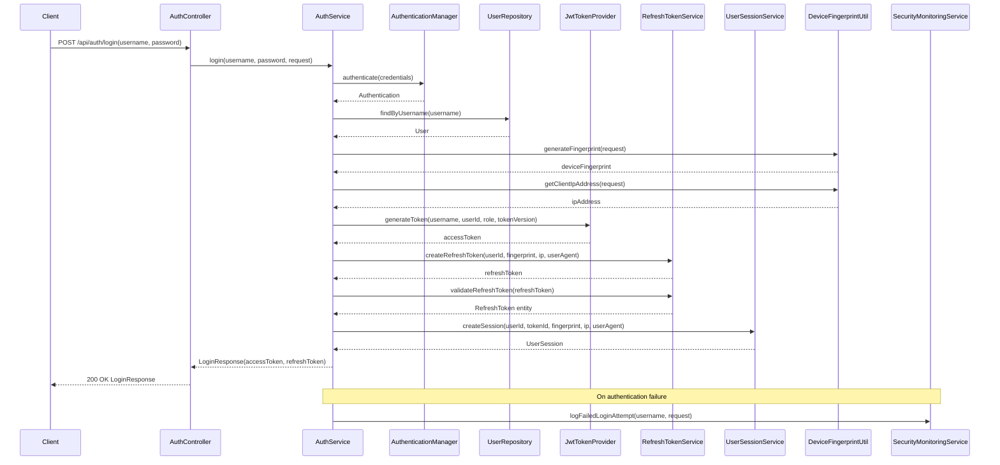

**Key Points**:
- Uses Spring Security's AuthenticationManager for credential validation
- Generates device fingerprint for session tracking
- Creates both access token (15 min) and refresh token (7 days)
- Logs failed attempts for security monitoring
- Token version included in JWT for invalidation support

---

### 2. Report Submission Workflow

**Description**: Citizen submits an incident report with photo. System validates coordinates, stores photo, checks for duplicates, and either creates a new task or links to existing task.

**Participants**: ReportController, ReportService, FileStorageService, GeofencingService, DeduplicationService, TaskService, ReportRepository, TaskRepository

**Source Reference**: `backend/src/main/java/com/urbanclean/controller/ReportController.java`, `backend/src/main/java/com/urbanclean/service/ReportService.java`

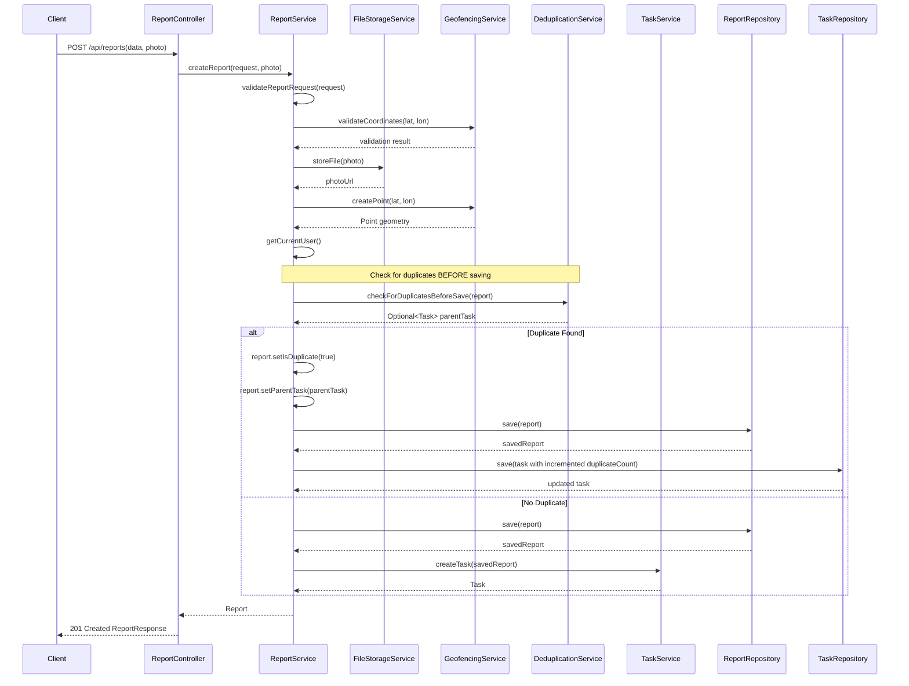

**Key Points**:
- Validates coordinates against geofencing boundaries
- Stores photo file before creating report entity
- Checks for duplicates BEFORE saving to avoid self-detection
- If duplicate: links to parent task and increments duplicate count
- If not duplicate: creates new task with priority calculation
- Supports anonymous report submission

---

### 3. Task Assignment Workflow

**Description**: Administrator assigns a task to an operator. System validates state transition, updates task, publishes event, and sends email notification.

**Participants**: TaskController, TaskService, UserRepository, TaskRepository, AuditService, ApplicationEventPublisher, TaskEventListener, EmailService

**Source Reference**: `backend/src/main/java/com/urbanclean/controller/TaskController.java`, `backend/src/main/java/com/urbanclean/service/TaskService.java`

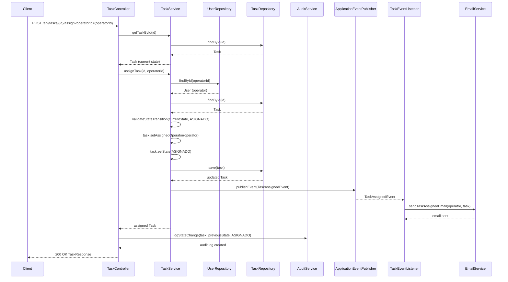

**Key Points**:
- Validates operator exists and has TECNICO role
- Validates state transition is allowed
- Uses event-driven pattern for email notification
- Logs state change in audit trail
- Asynchronous email sending via event listener

---

### 4. Task State Update Workflow

**Description**: Operator updates task state (e.g., from ASIGNADO to EN_PROGRESO). System validates transition, updates task, and logs change in audit trail.

**Participants**: TaskController, TaskService, TaskRepository, AuditService, AuditLogRepository

**Source Reference**: `backend/src/main/java/com/urbanclean/controller/TaskController.java`, `backend/src/main/java/com/urbanclean/service/TaskService.java`

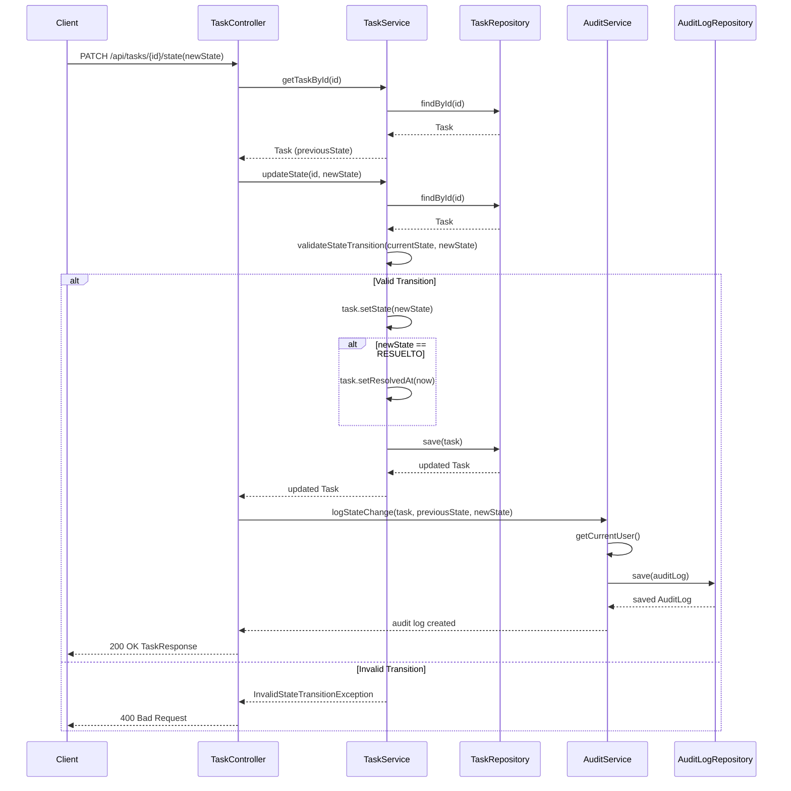

**Key Points**:
- Validates state transitions follow allowed paths
- Sets resolvedAt timestamp when state becomes RESUELTO
- Logs every state change with user and timestamp
- Returns error for invalid transitions

---

### 5. Priority Calculation Workflow

**Description**: Calculates priority score for a task based on configurable weights for category, zone risk, and time elapsed.

**Participants**: TaskService, PriorityCalculatorService, ConfigService, AlgorithmConfigRepository

**Source Reference**: `backend/src/main/java/com/urbanclean/service/PriorityCalculatorService.java`

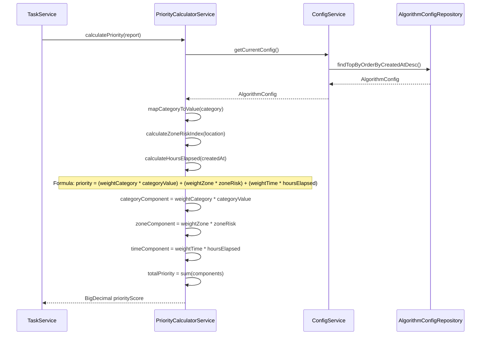

**Key Points**:
- Uses configurable weights from AlgorithmConfig
- Three components: category severity, zone risk, time elapsed
- Category values mapped from predefined scale
- Zone risk calculated from spatial data
- Time component increases priority for older reports

---

### 6. Duplicate Detection Workflow

**Description**: Checks if a new report is a duplicate of an existing task within configured radius and time window.

**Participants**: ReportService, DeduplicationService, TaskRepository, ConfigService, AlgorithmConfigRepository

**Source Reference**: `backend/src/main/java/com/urbanclean/service/DeduplicationService.java`

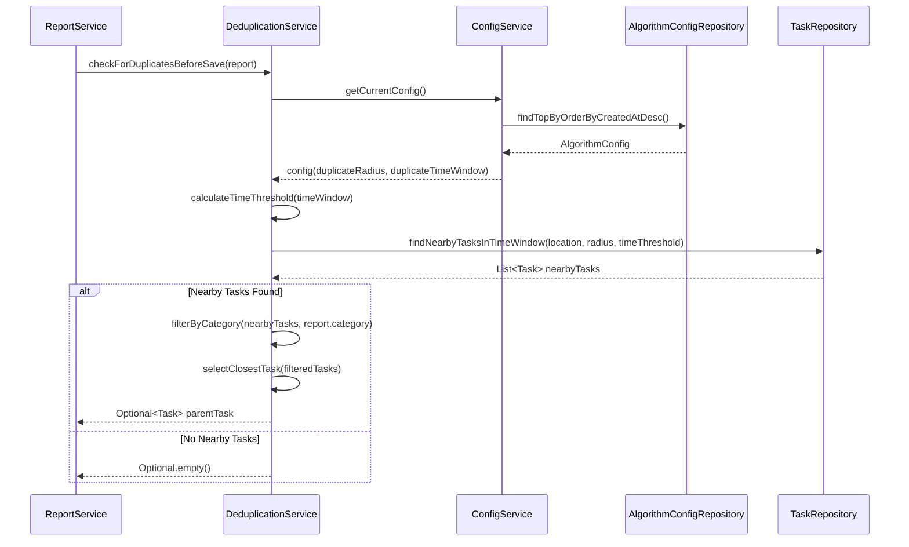

**Key Points**:
- Uses spatial query to find tasks within radius
- Filters by time window (e.g., last 24 hours)
- Filters by matching category
- Returns closest matching task as parent
- Configurable radius and time window

---

### 7. Password Reset Workflow

**Description**: User initiates password reset, receives email with token, validates token, and sets new password.

**Participants**: PasswordResetController, PasswordResetService, UserRepository, PasswordResetTokenRepository, EmailService, PasswordEncoder

**Source Reference**: `backend/src/main/java/com/urbanclean/controller/PasswordResetController.java`, `backend/src/main/java/com/urbanclean/service/PasswordResetService.java`

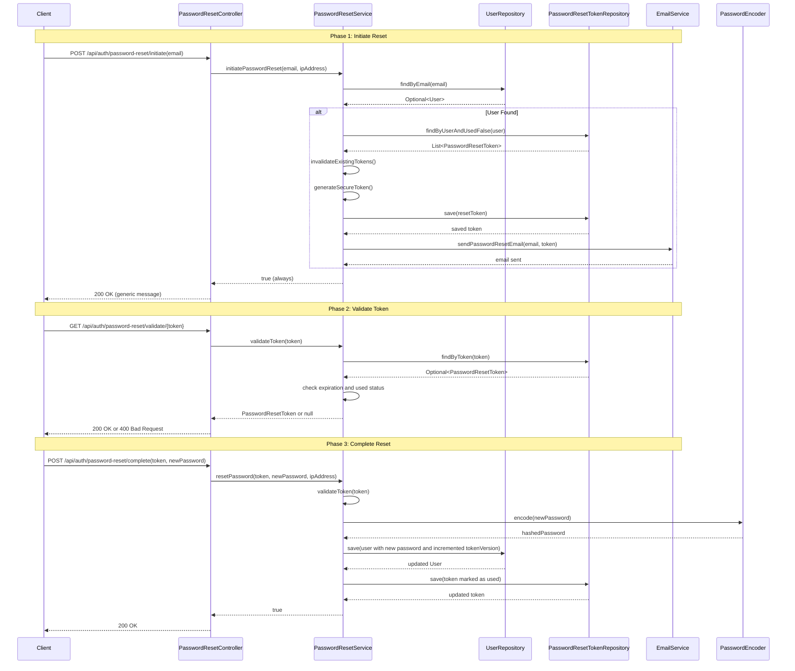

**Key Points**:
- Always returns success to prevent email enumeration
- Generates cryptographically secure random token
- Token expires after 1 hour
- Invalidates existing unused tokens
- Increments user token version to invalidate all JWTs
- Marks token as used after successful reset

---

### 8. Token Refresh Workflow

**Description**: Client uses refresh token to obtain new access token and refresh token pair (token rotation).

**Participants**: AuthController, AuthService, RefreshTokenService, UserRepository, JwtTokenProvider, RefreshTokenRepository

**Source Reference**: `backend/src/main/java/com/urbanclean/controller/AuthController.java`, `backend/src/main/java/com/urbanclean/service/RefreshTokenService.java`

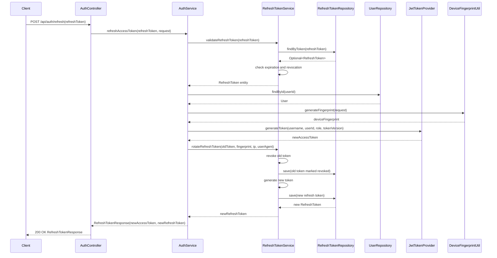

**Key Points**:
- Validates refresh token is not expired or revoked
- Implements token rotation: old token revoked, new token issued
- Generates new access token with current token version
- Updates device fingerprint and IP address
- Prevents token reuse attacks

---

### 9. Analytics Query Workflow

**Description**: Administrator queries analytics data with filters for time range, state, and category.

**Participants**: AnalyticsController, AnalyticsService, TaskRepository

**Source Reference**: `backend/src/main/java/com/urbanclean/controller/AnalyticsController.java`, `backend/src/main/java/com/urbanclean/service/AnalyticsService.java`

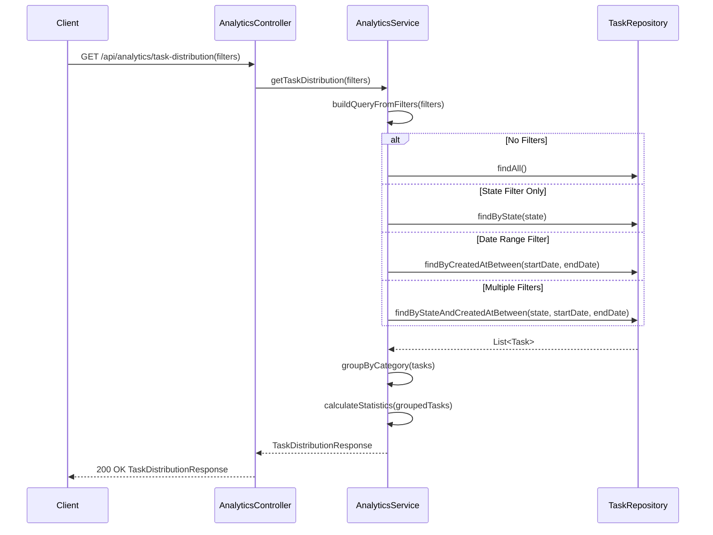

**Key Points**:
- Supports multiple filter combinations
- Groups results by category
- Calculates aggregate statistics
- Optimized queries based on filter presence

---

### 10. Feedback Submission Workflow

**Description**: Citizen submits feedback on a resolved task. System validates task state, stores feedback, and may reopen task if feedback is negative.

**Participants**: FeedbackController, FeedbackService, TaskService, CitizenFeedbackRepository, TaskRepository

**Source Reference**: `backend/src/main/java/com/urbanclean/controller/FeedbackController.java`, `backend/src/main/java/com/urbanclean/service/FeedbackService.java`

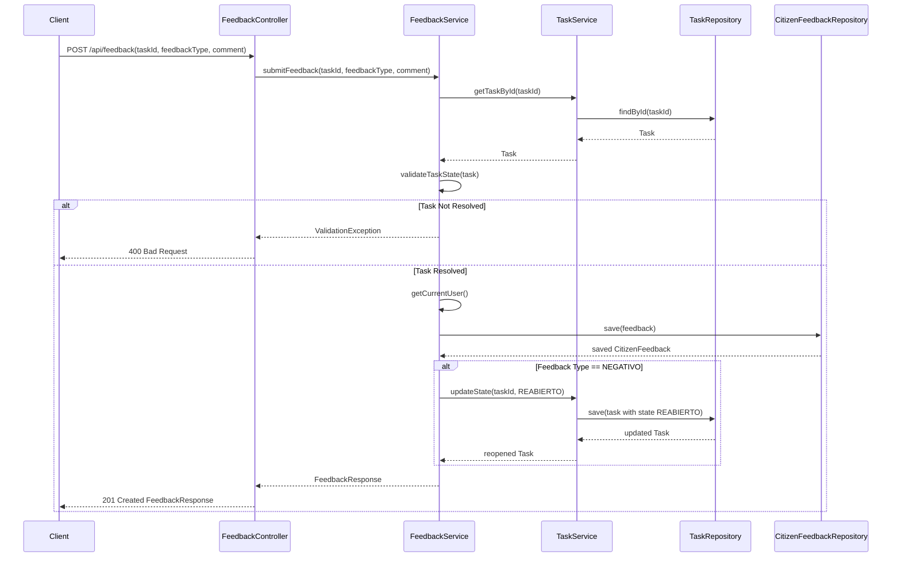

**Key Points**:
- Only allows feedback on resolved tasks
- Stores feedback with type (POSITIVO/NEGATIVO) and comment
- Automatically reopens task if feedback is negative
- Links feedback to user and task

---

## Class Diagram

This section presents a comprehensive class diagram showing the static structure of the system, including entities, DTOs, services, controllers, and repositories with their relationships.

### Diagram Notation Legend

**Class Diagram Symbols**:
- `<<Entity>>`: JPA entity (persistent domain object)
- `<<Service>>`: Business logic component
- `<<Controller>>`: REST API endpoint handler
- `<<Repository>>`: Data access interface
- `<<DTO>>`: Data Transfer Object
- `<<Enum>>`: Enumeration type

**Relationship Types**:
- `-->`: Association (uses/depends on)
- `--|>`: Inheritance (extends/implements)
- `--*`: Composition (strong ownership)
- `--o`: Aggregation (weak ownership)
- `1`, `*`, `0..1`, `1..*`: Cardinality indicators

**Visibility**:
- `+`: Public
- `-`: Private
- `#`: Protected

---

### System Class Diagram

**Description**: This diagram shows the core domain model, services, controllers, and their relationships. It focuses on the main entities and their associations, along with key service and controller components.

**Source Reference**: `backend/src/main/java/com/urbanclean/entity/`, `backend/src/main/java/com/urbanclean/service/`, `backend/src/main/java/com/urbanclean/controller/`

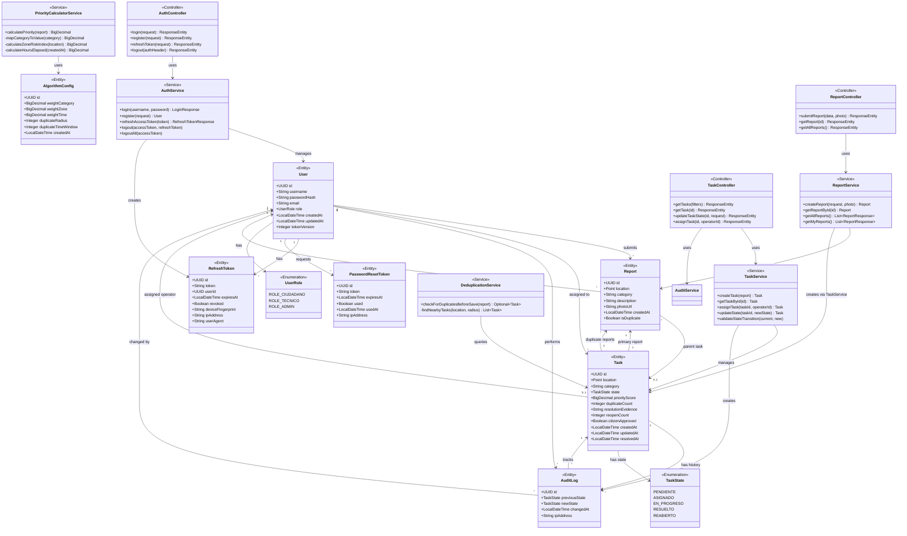

**Legend**:
- `<<Entity>>`: JPA entity representing domain model
- `<<Service>>`: Business logic component
- `<<Controller>>`: REST API endpoint handler
- `<<Enumeration>>`: Enum type for constrained values
- Solid lines with arrows: Associations and dependencies
- Numbers (1, *, 0..1): Cardinality of relationships

**Key Relationships**:
1. **User-Report**: One user can submit many reports (1:N)
2. **User-Task**: One user (operator) can be assigned many tasks (1:N)
3. **Report-Task**: Each task has one primary report, but can have many duplicate reports (1:1 and 1:N)
4. **Task-AuditLog**: Each task has an audit history of state changes (1:N)
5. **User-RefreshToken**: Each user can have multiple active refresh tokens (different devices) (1:N)

---

## State Diagrams

This section presents state diagrams for entities that implement state machines, showing all possible states and valid transitions.

### Diagram Notation Legend

**State Diagram Symbols**:
- `[*]`: Initial/final state (start/end of lifecycle)
- Rectangle: State (e.g., PENDIENTE, ASIGNADO)
- Arrow: State transition
- `note`: Explanatory annotation
- Label on arrow: Trigger/event causing transition

**State Types**:
- **Initial State** (`[*] -->`): Entry point when entity is created
- **Intermediate States**: Normal operational states
- **Final State** (`--> [*]`): Terminal state (entity lifecycle complete)

---

### Task State Machine

**Description**: The Task entity implements a state machine that controls the workflow from creation to resolution. The state machine enforces valid transitions and prevents invalid state changes.

**Source Reference**: `backend/src/main/java/com/urbanclean/entity/TaskState.java`, `backend/src/main/java/com/urbanclean/service/TaskService.java` (validateStateTransition method)

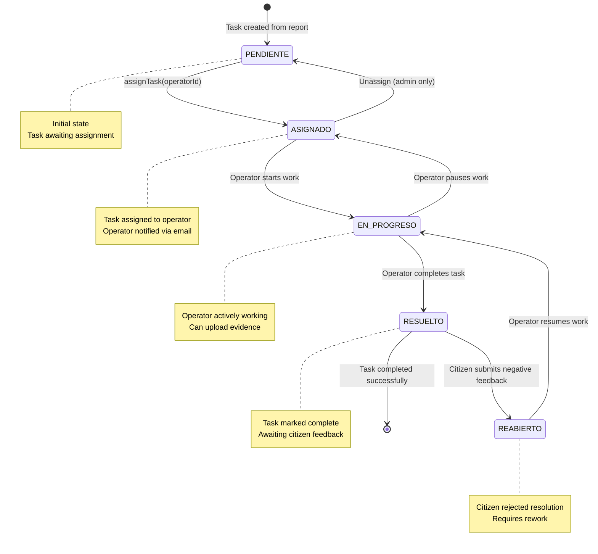

**States**:

| State | Description | Entry Condition | Exit Condition |
|-------|-------------|----------------|----------------|
| PENDIENTE | Task created, awaiting assignment | Report submitted and task created | Admin assigns to operator |
| ASIGNADO | Task assigned to operator | Admin assigns task | Operator starts work or admin unassigns |
| EN_PROGRESO | Operator actively working on task | Operator starts work | Operator completes or pauses |
| RESUELTO | Task completed, awaiting feedback | Operator marks complete | Citizen provides feedback |
| REABIERTO | Task reopened due to negative feedback | Citizen rejects resolution | Operator resumes work |

**Valid Transitions**:

| From State | To State | Trigger | Guard Conditions |
|------------|----------|---------|------------------|
| PENDIENTE | ASIGNADO | assignTask() | Operator must have TECNICO role |
| ASIGNADO | EN_PROGRESO | updateState() | Assigned operator must be current user |
| ASIGNADO | PENDIENTE | unassign() | User must have ADMIN role |
| EN_PROGRESO | RESUELTO | updateState() | Resolution evidence may be required |
| EN_PROGRESO | ASIGNADO | updateState() | Assigned operator must be current user |
| RESUELTO | REABIERTO | submitFeedback() | Feedback type must be NEGATIVO |
| REABIERTO | EN_PROGRESO | updateState() | Assigned operator must be current user |

**Invalid Transitions** (will throw InvalidStateTransitionException):
- PENDIENTE → EN_PROGRESO (must be assigned first)
- PENDIENTE → RESUELTO (must go through workflow)
- ASIGNADO → RESUELTO (must be in progress first)
- RESUELTO → PENDIENTE (can only reopen to REABIERTO)
- Any transition not listed in valid transitions table

---

## Collaboration Diagrams

This section presents collaboration diagrams showing how multiple components work together to accomplish complex workflows, with numbered message sequences.

### 1. Report Submission Collaboration

**Description**: Shows the collaboration between components when a citizen submits a new incident report, including validation, storage, duplicate detection, and task creation.

**Components Involved**: ReportController, ReportService, FileStorageService, GeofencingService, DeduplicationService, TaskService, PriorityCalculatorService, ReportRepository, TaskRepository

**Source Reference**: `backend/src/main/java/com/urbanclean/service/ReportService.java`

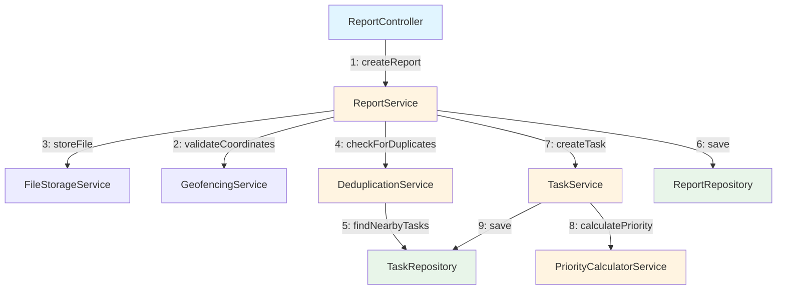

**Message Flow**:
1. **ReportController → ReportService**: Receives multipart request with report data and photo
2. **ReportService → GeofencingService**: Validates coordinates are within allowed boundaries
3. **ReportService → FileStorageService**: Stores photo file and returns URL
4. **ReportService → DeduplicationService**: Checks for duplicate reports in vicinity
5. **DeduplicationService → TaskRepository**: Queries for nearby tasks using spatial index
6. **ReportService → ReportRepository**: Saves report entity
7. **ReportService → TaskService**: Creates task if not duplicate
8. **TaskService → PriorityCalculatorService**: Calculates priority score
9. **TaskService → TaskRepository**: Saves task with calculated priority

---

### 2. Task Lifecycle Collaboration

**Description**: Shows the collaboration between components throughout the complete lifecycle of a task from creation to resolution.

**Components Involved**: TaskController, TaskService, AuditService, EmailService, ApplicationEventPublisher, TaskRepository, AuditLogRepository

**Source Reference**: `backend/src/main/java/com/urbanclean/service/TaskService.java`

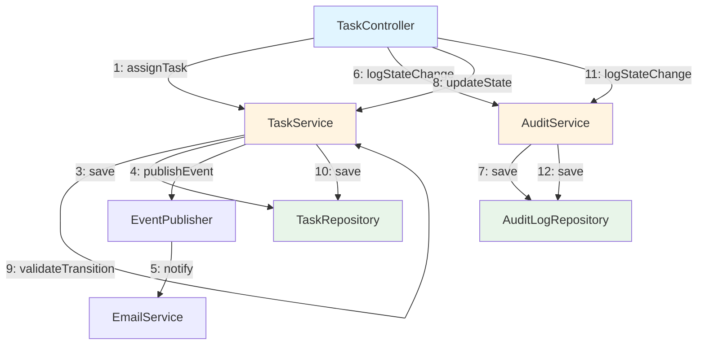

**Message Flow**:
1. **TaskController → TaskService**: Assigns task to operator
2. **TaskService → TaskService**: Validates state transition is allowed
3. **TaskService → TaskRepository**: Saves updated task
4. **TaskService → EventPublisher**: Publishes TaskAssignedEvent
5. **EventPublisher → EmailService**: Sends notification email to operator
6. **TaskController → AuditService**: Logs state change
7. **AuditService → AuditLogRepository**: Saves audit log entry
8. **TaskController → TaskService**: Updates task state (e.g., to EN_PROGRESO)
9. **TaskService → TaskService**: Validates state transition
10. **TaskService → TaskRepository**: Saves updated task
11. **TaskController → AuditService**: Logs state change
12. **AuditService → AuditLogRepository**: Saves audit log entry

---

### 3. Authentication Flow Collaboration

**Description**: Shows the collaboration between security components during user authentication, including JWT generation, refresh token creation, and session management.

**Components Involved**: AuthController, AuthService, AuthenticationManager, JwtTokenProvider, RefreshTokenService, UserSessionService, SecurityMonitoringService, UserRepository

**Source Reference**: `backend/src/main/java/com/urbanclean/service/AuthService.java`

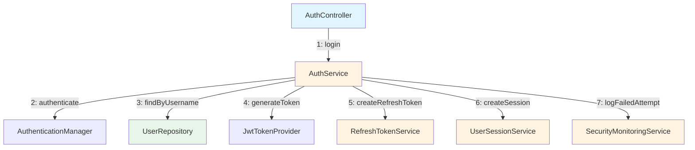

**Message Flow**:
1. **AuthController → AuthService**: Receives login request
2. **AuthService → AuthenticationManager**: Validates credentials with Spring Security
3. **AuthService → UserRepository**: Retrieves user details
4. **AuthService → JwtTokenProvider**: Generates JWT access token
5. **AuthService → RefreshTokenService**: Creates refresh token
6. **AuthService → UserSessionService**: Creates user session record
7. **AuthService → SecurityMonitoringService**: Logs failed attempt (if authentication fails)

---

## Component Roles and Responsibilities

This section documents the role, responsibility, key operations, and dependencies of each major component in the system.

### Controllers

| Component | Responsibility | Key Operations | Dependencies | Source |
|-----------|---------------|----------------|--------------|--------|
| AuthController | Handle authentication and authorization requests | login, register, refreshToken, logout, logoutAll | AuthService | AuthController.java |
| ReportController | Handle incident report submissions and queries | submitReport, getReport, getAllReports, getMyReports | ReportService | ReportController.java |
| TaskController | Handle task management and state transitions | getTasks, getTask, updateTaskState, assignTask, getAuditHistory | TaskService, AuditService | TaskController.java |
| FeedbackController | Handle citizen feedback on resolved tasks | submitFeedback, getFeedback, rejectFeedback | FeedbackService | FeedbackController.java |
| AnalyticsController | Provide analytics and reporting data | getTaskDistribution, getHeatmap, getMTTR, getOperatorPerformance | AnalyticsService, HeatmapService | AnalyticsController.java |
| ConfigController | Manage system configuration | getAlgorithmWeights, updateAlgorithmWeights, getTokenExpiration, updateTokenExpiration | ConfigService | ConfigController.java |
| PasswordResetController | Handle password reset workflow | initiatePasswordReset, validateToken, completePasswordReset | PasswordResetService | PasswordResetController.java |
| UserController | Handle user profile and data management | getProfile, updateProfile, changePassword, deleteAccount, exportData | UserDataService | UserController.java |

### Services

| Component | Responsibility | Key Operations | Dependencies | Source |
|-----------|---------------|----------------|--------------|--------|
| AuthService | Manage authentication and session lifecycle | login, register, refreshAccessToken, logout, logoutAll | UserRepository, JwtTokenProvider, RefreshTokenService, UserSessionService, SecurityMonitoringService | AuthService.java |
| ReportService | Manage incident report lifecycle | createReport, getReportById, getAllReports, getMyReports | ReportRepository, FileStorageService, GeofencingService, DeduplicationService, TaskService | ReportService.java |
| TaskService | Manage task lifecycle and state transitions | createTask, assignTask, updateState, validateStateTransition | TaskRepository, PriorityCalculatorService, ApplicationEventPublisher | TaskService.java |
| PriorityCalculatorService | Calculate task priority scores | calculatePriority, mapCategoryToValue, calculateZoneRiskIndex, calculateHoursElapsed | ConfigService, AlgorithmConfigRepository | PriorityCalculatorService.java |
| DeduplicationService | Detect duplicate reports | checkForDuplicatesBeforeSave, findNearbyTasks | TaskRepository, ConfigService | DeduplicationService.java |
| RefreshTokenService | Manage refresh token lifecycle | createRefreshToken, validateRefreshToken, rotateRefreshToken, revokeRefreshToken, revokeAllUserTokens | RefreshTokenRepository | RefreshTokenService.java |
| UserSessionService | Manage user sessions | createSession, getActiveSessions, revokeSession, revokeAllSessions | UserSessionRepository | UserSessionService.java |
| PasswordResetService | Manage password reset workflow | initiatePasswordReset, validateToken, resetPassword, cleanupExpiredTokens | PasswordResetTokenRepository, UserRepository, EmailService | PasswordResetService.java |
| EmailService | Send email notifications | sendTaskAssignedEmail, sendTaskResolvedEmail, sendPasswordResetEmail, sendAccountDeletionEmail | JavaMailSender, TemplateEngine | EmailService.java |
| AuditService | Log system events and state changes | logStateChange, getTaskAuditHistory | AuditLogRepository | AuditService.java |
| AnalyticsService | Generate analytics and reports | getTaskDistribution, getMTTR, getOperatorPerformance | TaskRepository, ReportRepository | AnalyticsService.java |
| GeofencingService | Validate and process geographic data | validateCoordinates, createPoint, isWithinBoundaries | GeometryFactory | GeofencingService.java |
| FileStorageService | Store and retrieve uploaded files | storeFile, deleteFile, getFile | File system | FileStorageService.java |
| ConfigService | Manage system configuration | getCurrentConfig, updateAlgorithmWeights, updateTokenExpiration | AlgorithmConfigRepository | ConfigService.java |

### Repositories

| Component | Responsibility | Key Operations | Dependencies | Source |
|-----------|---------------|----------------|--------------|--------|
| UserRepository | Persist and query User entities | findByUsername, findByEmail, existsByUsername, existsByEmail | Spring Data JPA | UserRepository.java |
| ReportRepository | Persist and query Report entities | findById, findAll, findBySubmitter | Spring Data JPA | ReportRepository.java |
| TaskRepository | Persist and query Task entities | findById, findByState, findNearbyTasks, findByStateInZone | Spring Data JPA, PostGIS | TaskRepository.java |
| AuditLogRepository | Persist and query AuditLog entities | findByTask, findByUser | Spring Data JPA | AuditLogRepository.java |
| RefreshTokenRepository | Persist and query RefreshToken entities | findByToken, findByUserId, deleteByUserId | Spring Data JPA | RefreshTokenRepository.java |
| UserSessionRepository | Persist and query UserSession entities | findByUserId, findByRefreshTokenId | Spring Data JPA | UserSessionRepository.java |
| PasswordResetTokenRepository | Persist and query PasswordResetToken entities | findByToken, findByUserAndUsedFalse, deleteExpiredTokens | Spring Data JPA | PasswordResetTokenRepository.java |
| AlgorithmConfigRepository | Persist and query AlgorithmConfig entities | findTopByOrderByCreatedAtDesc | Spring Data JPA | AlgorithmConfigRepository.java |
| CitizenFeedbackRepository | Persist and query CitizenFeedback entities | findByTask, findByUser | Spring Data JPA | CitizenFeedbackRepository.java |

### Security Components

| Component | Responsibility | Key Operations | Dependencies | Source |
|-----------|---------------|----------------|--------------|--------|
| JwtTokenProvider | Generate and validate JWT tokens | generateToken, validateToken, getUsernameFromToken, getExpirationDateFromToken | io.jsonwebtoken (jjwt) | JwtTokenProvider.java |
| JwtAuthenticationFilter | Intercept requests and validate JWT | doFilterInternal, extractToken, validateAndSetAuthentication | JwtTokenProvider, UserDetailsService | JwtAuthenticationFilter.java |
| UserDetailsServiceImpl | Load user details for Spring Security | loadUserByUsername | UserRepository | UserDetailsServiceImpl.java |
| SecurityConfig | Configure Spring Security | securityFilterChain, authenticationManager, passwordEncoder | Spring Security | SecurityConfig.java |
| TokenBlacklistService | Manage revoked tokens | addToBlacklist, isBlacklisted, cleanupExpiredTokens | TokenBlacklistRepository | TokenBlacklistService.java |

---

## Design Patterns

This section documents the design patterns identified in the logical structure of the system.

### 1. Repository Pattern

**Description**: The system uses Spring Data JPA repositories to abstract data access logic. Each entity has a corresponding repository interface that extends `JpaRepository`, providing CRUD operations and custom query methods.

**Implementation**:
- All repository interfaces extend `JpaRepository<Entity, UUID>`
- Custom query methods defined using method naming conventions or `@Query` annotations
- Spatial queries use PostGIS functions for geographic operations

**Example**:
```java
public interface TaskRepository extends JpaRepository<Task, UUID> {
    List<Task> findByStateOrderByPriorityScoreDesc(TaskState state);
    
    @Query("SELECT t FROM Task t WHERE ST_DWithin(t.location, :location, :radius) " +
           "AND t.createdAt > :timeThreshold")
    List<Task> findNearbyTasksInTimeWindow(
        @Param("location") Point location,
        @Param("radius") double radius,
        @Param("timeThreshold") LocalDateTime timeThreshold
    );
}
```

**Benefits**:
- Separation of data access logic from business logic
- Consistent interface for data operations
- Automatic implementation by Spring Data JPA
- Support for custom queries and spatial operations

---

### 2. MVC Pattern

**Description**: The system follows the Model-View-Controller pattern with clear separation between presentation (controllers), business logic (services), and data (entities/repositories).

**Implementation**:
- **Model**: JPA entities represent domain model
- **View**: REST API responses (DTOs) represent data for clients
- **Controller**: REST controllers handle HTTP requests and responses

**Layers**:
1. **Controller Layer**: Handles HTTP requests, validates input, calls services
2. **Service Layer**: Implements business logic, orchestrates operations
3. **Repository Layer**: Handles data persistence and retrieval
4. **Entity Layer**: Represents domain model

**Benefits**:
- Clear separation of concerns
- Easier testing (can mock layers)
- Flexibility to change presentation without affecting business logic
- Reusable business logic across different controllers

---

### 3. Event-Driven Pattern

**Description**: The system uses Spring's `ApplicationEventPublisher` to decouple components and enable asynchronous processing of certain operations.

**Implementation**:
- Services publish events using `ApplicationEventPublisher`
- Event listeners handle events asynchronously using `@EventListener` and `@Async`
- Events are POJOs that extend `ApplicationEvent` or are plain objects

**Example**:
```java
// Publishing event
applicationEventPublisher.publishEvent(new TaskAssignedEvent(task, operator));

// Listening to event
@EventListener
@Async
public void handleTaskAssigned(TaskAssignedEvent event) {
    emailService.sendTaskAssignedEmail(event.getOperator(), event.getTask());
}
```

**Use Cases**:
- Email notifications (task assigned, task resolved, password reset)
- Audit logging
- Analytics updates
- Cache invalidation

**Benefits**:
- Decouples components (publisher doesn't know about listeners)
- Enables asynchronous processing
- Easy to add new listeners without modifying publishers
- Improves response times by offloading non-critical operations

---

### 4. State Machine Pattern

**Description**: The Task entity implements a state machine pattern to control workflow transitions and enforce business rules.

**Implementation**:
- `TaskState` enum defines all possible states
- `TaskService.validateStateTransition()` enforces valid transitions
- State changes are logged in audit trail
- Invalid transitions throw `InvalidStateTransitionException`

**State Transition Rules**:
```java
private void validateStateTransition(TaskState currentState, TaskState newState) {
    boolean isValid = switch (currentState) {
        case PENDIENTE -> newState == TaskState.ASIGNADO;
        case ASIGNADO -> newState == TaskState.EN_PROGRESO || newState == TaskState.PENDIENTE;
        case EN_PROGRESO -> newState == TaskState.RESUELTO || newState == TaskState.ASIGNADO;
        case RESUELTO -> newState == TaskState.REABIERTO;
        case REABIERTO -> newState == TaskState.EN_PROGRESO;
    };
    
    if (!isValid) {
        throw new InvalidStateTransitionException(
            "Invalid transition from " + currentState + " to " + newState
        );
    }
}
```

**Benefits**:
- Enforces business rules at code level
- Prevents invalid state transitions
- Clear workflow definition
- Easy to audit state changes

---

### 5. Strategy Pattern

**Description**: The `PriorityCalculatorService` implements a strategy pattern for calculating task priority scores based on configurable weights.

**Implementation**:
- Algorithm configuration stored in database (`AlgorithmConfig` entity)
- Priority calculation uses three strategies: category, zone, and time
- Weights can be adjusted without code changes
- Formula: `priority = (weightCategory × categoryValue) + (weightZone × zoneRisk) + (weightTime × hoursElapsed)`

**Benefits**:
- Flexible priority calculation
- Easy to adjust weights based on operational needs
- Can add new factors without changing core logic
- Supports A/B testing of different configurations

---

### 6. Dependency Injection Pattern

**Description**: The system uses Spring's dependency injection to manage component dependencies and promote loose coupling.

**Implementation**:
- Constructor injection for required dependencies (using Lombok's `@RequiredArgsConstructor`)
- Dependencies declared as `final` fields
- Spring manages component lifecycle and wiring

**Example**:
```java
@Service
@RequiredArgsConstructor
public class TaskService {
    private final TaskRepository taskRepository;
    private final PriorityCalculatorService priorityCalculatorService;
    private final ApplicationEventPublisher eventPublisher;
    
    // Methods use injected dependencies
}
```

**Benefits**:
- Loose coupling between components
- Easy to test (can inject mocks)
- Clear declaration of dependencies
- Spring manages object lifecycle

---

### 7. DTO Pattern

**Description**: The system uses Data Transfer Objects (DTOs) to transfer data between layers and to/from clients, keeping entities separate from API contracts.

**Implementation**:
- Request DTOs for incoming data (e.g., `ReportSubmissionRequest`, `LoginRequest`)
- Response DTOs for outgoing data (e.g., `TaskResponse`, `LoginResponse`)
- Entities never exposed directly in API
- Mapping between entities and DTOs in service layer

**Benefits**:
- API contract independent of database schema
- Can change entity structure without breaking API
- Reduces data exposure (security)
- Optimizes data transfer (only send needed fields)

---

## Notes

- All sequence diagrams are based on actual method call traces from source code
- Class diagram includes all major components with their actual relationships
- State diagrams extracted from enum definitions and validation logic in TaskService
- Collaboration diagrams show message flow with sequence numbers
- Component responsibilities documented from actual source code analysis
- Design patterns identified from code structure and Spring framework usage

