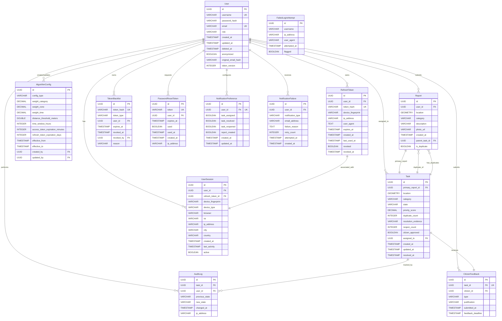

# Data Model View

## Overview

This document provides a comprehensive view of the Urban Cleaning Management System's data model, extracted from the JPA entities in the backend codebase. The system uses PostgreSQL 15 with PostGIS 3.3 extension for spatial data management.

## Cross-References

This view is closely related to other architectural views:

- **[Logical View - Class Diagram](02-logical-view.md#class-diagram)**: Entities documented here appear as classes in the comprehensive class diagram
- **[Implementation View](07-implementation-view.md)**: Entity classes are located in the `com.urbanclean.entity` package
- **[Process View](05-process-view.md)**: Entities are created, updated, and queried during business process execution
- **[Design Decisions - Data Persistence](08-design-decisions.md#data-persistence-architecture)**: Explains the JPA/Hibernate and PostGIS technology choices

## Entity Catalog

The system contains 16 JPA entities organized into the following functional areas:

### Core Domain Entities
- **User**: System users with role-based access control
- **Report**: Citizen-submitted cleaning incident reports
- **Task**: Work items created from reports for operator assignment

### Security & Authentication
- **RefreshToken**: Long-lived tokens for session management
- **TokenBlacklist**: Revoked tokens that cannot be used
- **UserSession**: Active user sessions across devices
- **PasswordResetToken**: Time-limited tokens for password reset
- **FailedLoginAttempt**: Security monitoring for brute force detection

### Configuration & Audit
- **AlgorithmConfig**: Prioritization algorithm parameters and system settings
- **AuditLog**: Immutable tracking of task state changes

### Feedback & Notifications
- **CitizenFeedback**: Citizen feedback on task resolution
- **NotificationPreference**: User notification settings
- **NotificationFailure**: Failed notification delivery tracking

### Enumerations
- **UserRole**: User role types (CIUDADANO, TECNICO, ADMIN)
- **TaskState**: Task workflow states
- **FeedbackType**: Citizen feedback types (CONFIRMED, REJECTED)

---

## Detailed Entity Documentation

### 1. User Entity

**Table Name**: `users`

**Description**: Represents system users with different roles for role-based access control.

**Primary Key**: `id` (UUID)

**Attributes**:

| Column Name | Data Type | Constraints | Description |
|-------------|-----------|-------------|-------------|
| id | UUID | PRIMARY KEY, NOT NULL | Unique identifier |
| username | VARCHAR(50) | UNIQUE, NOT NULL | User login name |
| password_hash | VARCHAR | NOT NULL | BCrypt hashed password |
| email | VARCHAR(100) | UNIQUE, NOT NULL | User email address |
| role | VARCHAR(20) | NOT NULL | User role (enum) |
| created_at | TIMESTAMP | NOT NULL, IMMUTABLE | Account creation timestamp |
| updated_at | TIMESTAMP | | Last update timestamp |
| deleted_at | TIMESTAMP | | Soft delete timestamp |
| anonymized | BOOLEAN | NOT NULL, DEFAULT false | GDPR anonymization flag |
| original_email_hash | VARCHAR(64) | | SHA-256 hash of original email |
| token_version | INTEGER | NOT NULL, DEFAULT 0 | JWT invalidation version |

**Relationships**:
- One-to-Many with Report (as submitter)
- One-to-Many with Task (as assignedOperator)
- One-to-Many with AuditLog (as user)
- One-to-Many with AlgorithmConfig (as createdBy, updatedBy)
- One-to-Many with RefreshToken
- One-to-Many with UserSession
- One-to-Many with TokenBlacklist
- One-to-Many with PasswordResetToken
- One-to-Many with CitizenFeedback (as citizen)
- One-to-Many with NotificationPreference
- One-to-Many with NotificationFailure

**Indexes**: None explicitly defined (database default on primary key and unique constraints)

---

### 2. Report Entity

**Table Name**: `reportes`

**Description**: Citizen-submitted cleaning incident reports with geospatial location.

**Primary Key**: `id` (UUID)

**Attributes**:

| Column Name | Data Type | Constraints | Description |
|-------------|-----------|-------------|-------------|
| id | UUID | PRIMARY KEY, NOT NULL | Unique identifier |
| user_id | UUID | FOREIGN KEY | Submitter (nullable for anonymous) |
| location | geometry(Point,4326) | NOT NULL | PostGIS point geometry (WGS84) |
| category | VARCHAR(50) | NOT NULL | Incident category |
| description | VARCHAR(1000) | NOT NULL | Incident description |
| photo_url | VARCHAR | | URL to uploaded photo |
| created_at | TIMESTAMP | NOT NULL, IMMUTABLE | Report submission timestamp |
| parent_task_id | UUID | FOREIGN KEY | Parent task if duplicate |
| is_duplicate | BOOLEAN | NOT NULL, DEFAULT false | Duplicate flag |

**Relationships**:
- Many-to-One with User (submitter) - nullable
- Many-to-One with Task (parentTask) - for duplicate reports
- One-to-One with Task (as primaryReport) - inverse relationship

**Indexes**:
- `idx_report_location` on `location` (GIST spatial index)

**Foreign Keys**:
- `user_id` → `users.id`
- `parent_task_id` → `tareas.id`

---

### 3. Task Entity

**Table Name**: `tareas`

**Description**: Work items created from reports, assigned to operators for resolution.

**Primary Key**: `id` (UUID)

**Attributes**:

| Column Name | Data Type | Constraints | Description |
|-------------|-----------|-------------|-------------|
| id | UUID | PRIMARY KEY, NOT NULL | Unique identifier |
| primary_report_id | UUID | FOREIGN KEY, NOT NULL | Original report |
| location | geometry(Point,4326) | NOT NULL | PostGIS point geometry (WGS84) |
| category | VARCHAR(50) | NOT NULL | Task category |
| state | VARCHAR(20) | NOT NULL | Current state (enum) |
| priority_score | DECIMAL(10,2) | NOT NULL | Calculated priority |
| duplicate_count | INTEGER | NOT NULL, DEFAULT 0 | Number of duplicate reports |
| resolution_evidence | VARCHAR(1000) | | Evidence of resolution |
| reopen_count | INTEGER | DEFAULT 0 | Times task was reopened |
| citizen_approved | BOOLEAN | DEFAULT false | Citizen approval flag |
| assigned_to | UUID | FOREIGN KEY | Assigned operator |
| created_at | TIMESTAMP | NOT NULL, IMMUTABLE | Task creation timestamp |
| updated_at | TIMESTAMP | | Last update timestamp |
| resolved_at | TIMESTAMP | | Resolution timestamp |

**Relationships**:
- One-to-One with Report (primaryReport)
- One-to-Many with Report (duplicateReports via parentTask)
- Many-to-One with User (assignedOperator)
- One-to-Many with AuditLog
- One-to-One with CitizenFeedback

**Indexes**:
- `idx_task_location` on `location` (GIST spatial index)
- `idx_task_state` on `state`
- `idx_task_priority` on `priority_score`

**Foreign Keys**:
- `primary_report_id` → `reportes.id`
- `assigned_to` → `users.id`

---

### 4. AlgorithmConfig Entity

**Table Name**: `configuracion_algoritmo`

**Description**: Stores prioritization algorithm parameters and system configuration settings.

**Primary Key**: `id` (UUID)

**Attributes**:

| Column Name | Data Type | Constraints | Description |
|-------------|-----------|-------------|-------------|
| id | UUID | PRIMARY KEY, NOT NULL | Unique identifier |
| config_type | VARCHAR(50) | NOT NULL | Configuration type |
| weight_category | DECIMAL(5,2) | NOT NULL | Category weight (Wc) |
| weight_zone | DECIMAL(5,2) | NOT NULL | Zone weight (Wz) |
| weight_time | DECIMAL(5,2) | NOT NULL | Time weight (Wt) |
| distance_threshold_meters | DOUBLE | NOT NULL | Duplicate detection distance |
| time_window_hours | INTEGER | NOT NULL | Duplicate detection time window |
| access_token_expiration_minutes | INTEGER | | Access token TTL |
| refresh_token_expiration_days | INTEGER | | Refresh token TTL |
| effective_from | TIMESTAMP | | Configuration start date |
| effective_to | TIMESTAMP | | Configuration end date |
| created_by | UUID | FOREIGN KEY | Creator user |
| updated_by | UUID | FOREIGN KEY | Last updater user |

**Relationships**:
- Many-to-One with User (createdBy)
- Many-to-One with User (updatedBy)

**Indexes**:
- `idx_config_effective` on `(effective_from, effective_to)`
- `idx_config_type` on `config_type`
- `idx_config_effective_from` on `effective_from`

**Foreign Keys**:
- `created_by` → `users.id`
- `updated_by` → `users.id`

---

### 5. AuditLog Entity

**Table Name**: `historial_cambios`

**Description**: Immutable audit trail of task state transitions for compliance and tracking.

**Primary Key**: `id` (UUID)

**Attributes**:

| Column Name | Data Type | Constraints | Description |
|-------------|-----------|-------------|-------------|
| id | UUID | PRIMARY KEY, NOT NULL | Unique identifier |
| task_id | UUID | FOREIGN KEY, NOT NULL, IMMUTABLE | Related task |
| user_id | UUID | FOREIGN KEY, NOT NULL, IMMUTABLE | User who made change |
| previous_state | VARCHAR(20) | NOT NULL, IMMUTABLE | State before change |
| new_state | VARCHAR(20) | NOT NULL, IMMUTABLE | State after change |
| changed_at | TIMESTAMP | NOT NULL, IMMUTABLE | Change timestamp |
| ip_address | VARCHAR(45) | IMMUTABLE | User IP address |

**Relationships**:
- Many-to-One with Task
- Many-to-One with User

**Indexes**:
- `idx_audit_task` on `task_id`
- `idx_audit_timestamp` on `changed_at`

**Foreign Keys**:
- `task_id` → `tareas.id`
- `user_id` → `users.id`

---

### 6. RefreshToken Entity

**Table Name**: `refresh_tokens`

**Description**: Long-lived tokens (7 days) for session management with token rotation security.

**Primary Key**: `id` (UUID)

**Attributes**:

| Column Name | Data Type | Constraints | Description |
|-------------|-----------|-------------|-------------|
| id | UUID | PRIMARY KEY, NOT NULL | Unique identifier |
| user_id | UUID | NOT NULL | Token owner |
| token_hash | VARCHAR(64) | UNIQUE, NOT NULL | SHA-256 hash of token |
| device_fingerprint | VARCHAR(255) | | Device identifier |
| ip_address | VARCHAR(45) | | Client IP address |
| user_agent | TEXT | | Client user agent |
| expires_at | TIMESTAMP | NOT NULL | Expiration timestamp |
| created_at | TIMESTAMP | NOT NULL, IMMUTABLE | Creation timestamp |
| last_used_at | TIMESTAMP | | Last usage timestamp |
| revoked | BOOLEAN | NOT NULL, DEFAULT false | Revocation flag |
| revoked_at | TIMESTAMP | | Revocation timestamp |

**Relationships**:
- Many-to-One with User
- One-to-One with UserSession

**Indexes**: None explicitly defined (database default on unique constraint)

**Foreign Keys**:
- `user_id` → `users.id`

---

### 7. TokenBlacklist Entity

**Table Name**: `token_blacklist`

**Description**: Blacklisted tokens that cannot be used for authentication after revocation.

**Primary Key**: `id` (UUID)

**Attributes**:

| Column Name | Data Type | Constraints | Description |
|-------------|-----------|-------------|-------------|
| id | UUID | PRIMARY KEY, NOT NULL | Unique identifier |
| token_hash | VARCHAR(64) | UNIQUE, NOT NULL | SHA-256 hash of token |
| token_type | VARCHAR(20) | NOT NULL | ACCESS or REFRESH |
| user_id | UUID | | Token owner |
| expires_at | TIMESTAMP | NOT NULL | Original expiration |
| revoked_at | TIMESTAMP | NOT NULL, IMMUTABLE | Revocation timestamp |
| revoked_by | UUID | | User who revoked |
| reason | VARCHAR(100) | | Revocation reason |

**Relationships**:
- Many-to-One with User (user)
- Many-to-One with User (revokedByUser)

**Indexes**: None explicitly defined (database default on unique constraint)

**Foreign Keys**:
- `user_id` → `users.id`
- `revoked_by` → `users.id`

---

### 8. UserSession Entity

**Table Name**: `user_sessions`

**Description**: Tracks active user sessions across devices for multi-device management.

**Primary Key**: `id` (UUID)

**Attributes**:

| Column Name | Data Type | Constraints | Description |
|-------------|-----------|-------------|-------------|
| id | UUID | PRIMARY KEY, NOT NULL | Unique identifier |
| user_id | UUID | NOT NULL | Session owner |
| refresh_token_id | UUID | | Associated refresh token |
| device_fingerprint | VARCHAR(255) | | Device identifier |
| device_type | VARCHAR(50) | | MOBILE, DESKTOP, TABLET, UNKNOWN |
| browser | VARCHAR(100) | | Browser name |
| os | VARCHAR(100) | | Operating system |
| ip_address | VARCHAR(45) | | Client IP address |
| city | VARCHAR(100) | | Geolocation city |
| country | VARCHAR(100) | | Geolocation country |
| created_at | TIMESTAMP | NOT NULL, IMMUTABLE | Session start timestamp |
| last_activity | TIMESTAMP | | Last activity timestamp |
| active | BOOLEAN | NOT NULL, DEFAULT true | Active flag |

**Relationships**:
- Many-to-One with User
- One-to-One with RefreshToken

**Indexes**: None explicitly defined

**Foreign Keys**:
- `user_id` → `users.id`
- `refresh_token_id` → `refresh_tokens.id`

---

### 9. PasswordResetToken Entity

**Table Name**: `password_reset_tokens`

**Description**: Time-limited tokens (1 hour) for password reset functionality.

**Primary Key**: `id` (UUID)

**Attributes**:

| Column Name | Data Type | Constraints | Description |
|-------------|-----------|-------------|-------------|
| id | UUID | PRIMARY KEY, NOT NULL | Unique identifier |
| token | VARCHAR(64) | UNIQUE, NOT NULL | Reset token |
| user_id | UUID | FOREIGN KEY, NOT NULL | Token owner |
| expires_at | TIMESTAMP | NOT NULL | Expiration timestamp |
| used | BOOLEAN | NOT NULL, DEFAULT false | Usage flag |
| used_at | TIMESTAMP | | Usage timestamp |
| created_at | TIMESTAMP | NOT NULL, IMMUTABLE | Creation timestamp |
| ip_address | VARCHAR(45) | | Request IP address |

**Relationships**:
- Many-to-One with User

**Indexes**:
- `idx_token` on `token`
- `idx_user_id` on `user_id`
- `idx_expires_at` on `expires_at`

**Foreign Keys**:
- `user_id` → `users.id`

---

### 10. FailedLoginAttempt Entity

**Table Name**: `failed_login_attempts`

**Description**: Tracks failed login attempts for security monitoring and brute force detection.

**Primary Key**: `id` (UUID)

**Attributes**:

| Column Name | Data Type | Constraints | Description |
|-------------|-----------|-------------|-------------|
| id | UUID | PRIMARY KEY, NOT NULL | Unique identifier |
| username | VARCHAR(50) | NOT NULL | Attempted username |
| ip_address | VARCHAR(45) | NOT NULL | Source IP address |
| user_agent | VARCHAR(500) | | Client user agent |
| attempted_at | TIMESTAMP | NOT NULL, IMMUTABLE | Attempt timestamp |
| flagged | BOOLEAN | DEFAULT false | Security flag |

**Relationships**: None

**Indexes**:
- `idx_failed_login_username` on `username`
- `idx_failed_login_ip` on `ip_address`
- `idx_failed_login_timestamp` on `attempted_at`

**Foreign Keys**: None

---

### 11. CitizenFeedback Entity

**Table Name**: `citizen_feedback`

**Description**: Citizen feedback on task resolution with 72-hour deadline.

**Primary Key**: `id` (UUID)

**Attributes**:

| Column Name | Data Type | Constraints | Description |
|-------------|-----------|-------------|-------------|
| id | UUID | PRIMARY KEY, NOT NULL | Unique identifier |
| task_id | UUID | FOREIGN KEY, NOT NULL, UNIQUE | Related task |
| citizen_id | UUID | FOREIGN KEY, NOT NULL | Feedback submitter |
| type | VARCHAR(20) | NOT NULL | CONFIRMED or REJECTED |
| justification | VARCHAR(500) | | Rejection reason |
| submitted_at | TIMESTAMP | NOT NULL, IMMUTABLE | Submission timestamp |
| feedback_deadline | TIMESTAMP | NOT NULL | Deadline timestamp |

**Relationships**:
- One-to-One with Task
- Many-to-One with User (citizen)

**Indexes**:
- `idx_feedback_deadline` on `feedback_deadline`

**Unique Constraints**:
- `uk_feedback_task` on `task_id`

**Foreign Keys**:
- `task_id` → `tareas.id`
- `citizen_id` → `users.id`

---

### 12. NotificationPreference Entity

**Table Name**: `notification_preferences`

**Description**: User preferences for email notification types.

**Primary Key**: `id` (UUID)

**Attributes**:

| Column Name | Data Type | Constraints | Description |
|-------------|-----------|-------------|-------------|
| id | UUID | PRIMARY KEY, NOT NULL | Unique identifier |
| user_id | UUID | UNIQUE, NOT NULL | Preference owner |
| task_assigned | BOOLEAN | NOT NULL, DEFAULT true | Task assignment notifications |
| task_resolved | BOOLEAN | NOT NULL, DEFAULT true | Task resolution notifications |
| task_reopened | BOOLEAN | NOT NULL, DEFAULT true | Task reopened notifications |
| report_created | BOOLEAN | NOT NULL, DEFAULT true | Report creation notifications |
| created_at | TIMESTAMP | NOT NULL, IMMUTABLE | Creation timestamp |
| updated_at | TIMESTAMP | NOT NULL | Last update timestamp |

**Relationships**:
- Many-to-One with User

**Indexes**: None explicitly defined (database default on unique constraint)

**Foreign Keys**:
- `user_id` → `users.id`

---

### 13. NotificationFailure Entity

**Table Name**: `notification_failures`

**Description**: Tracks failed notification delivery attempts for retry and monitoring.

**Primary Key**: `id` (UUID)

**Attributes**:

| Column Name | Data Type | Constraints | Description |
|-------------|-----------|-------------|-------------|
| id | UUID | PRIMARY KEY, NOT NULL | Unique identifier |
| user_id | UUID | NOT NULL | Notification recipient |
| notification_type | VARCHAR(50) | NOT NULL | Type of notification |
| email_address | VARCHAR | NOT NULL | Target email address |
| failure_reason | TEXT | | Error message |
| retry_count | INTEGER | NOT NULL, DEFAULT 0 | Number of retries |
| attempted_at | TIMESTAMP | NOT NULL | Last attempt timestamp |
| created_at | TIMESTAMP | NOT NULL, IMMUTABLE | First failure timestamp |

**Relationships**:
- Many-to-One with User

**Indexes**: None explicitly defined

**Foreign Keys**:
- `user_id` → `users.id`

---

## Enumeration Types

### UserRole Enum

**Values**:
- `ROLE_CIUDADANO`: Citizen role - can submit reports
- `ROLE_TECNICO`: Operator role - can manage tasks
- `ROLE_ADMIN`: Administrator role - full system access

**Usage**: User.role field

---

### TaskState Enum

**Values**:
- `PENDIENTE`: Pending - newly created task
- `ASIGNADO`: Assigned - task assigned to operator
- `EN_PROGRESO`: In Progress - operator working on task
- `RESUELTO`: Resolved - task completed, awaiting feedback
- `REABIERTO`: Reopened - citizen rejected resolution

**State Machine Flow**:
```
PENDIENTE → ASIGNADO → EN_PROGRESO → RESUELTO
                ↑                        ↓
                └──── REABIERTO ←────────┘
```

**Usage**: Task.state, AuditLog.previousState, AuditLog.newState

---

### FeedbackType Enum

**Values**:
- `CONFIRMED`: Citizen confirms task is resolved
- `REJECTED`: Citizen rejects resolution (triggers reopen)

**Usage**: CitizenFeedback.type

---

### TokenType Enum (TokenBlacklist)

**Values**:
- `ACCESS`: Access token (short-lived)
- `REFRESH`: Refresh token (long-lived)

**Usage**: TokenBlacklist.tokenType

---

### DeviceType Enum (UserSession)

**Values**:
- `MOBILE`: Mobile device
- `DESKTOP`: Desktop computer
- `TABLET`: Tablet device
- `UNKNOWN`: Unknown device type

**Usage**: UserSession.deviceType

---

## Spatial Data

### PostGIS Integration

The system uses PostGIS extension for geospatial data management:

**Spatial Columns**:
- `Report.location`: geometry(Point,4326)
- `Task.location`: geometry(Point,4326)

**Coordinate System**: WGS84 (SRID 4326) - standard GPS coordinates

**Spatial Indexes**:
- `idx_report_location` on `reportes.location` (GIST)
- `idx_task_location` on `tareas.location` (GIST)

**Spatial Operations**:
- Distance calculations for duplicate detection
- Proximity queries for task assignment
- Geofencing boundary validation
- Heatmap generation for analytics

---

## Entity Relationship Diagram

### Logical Database Schema



### Diagram Legend

**Notation**:
- `||--o{`: One-to-Many relationship
- `||--||`: One-to-One relationship
- `}o--||`: Many-to-One relationship
- `PK`: Primary Key
- `FK`: Foreign Key
- `UK`: Unique Constraint

**Cardinality Symbols**:
- `||`: Exactly one
- `o{`: Zero or more
- `}o`: Many

**Data Types**:
- `UUID`: Universally Unique Identifier (128-bit)
- `VARCHAR(n)`: Variable character string with max length
- `TEXT`: Unlimited text
- `TIMESTAMP`: Date and time
- `BOOLEAN`: True/false value
- `INTEGER`: Whole number
- `DECIMAL(p,s)`: Fixed-point decimal (precision, scale)
- `DOUBLE`: Double-precision floating point
- `GEOMETRY`: PostGIS spatial data type

---

## Relationship Details

### Core Domain Relationships

#### User ↔ Report (One-to-Many)
- **Type**: One-to-Many
- **Cardinality**: 1:N
- **Foreign Key**: Report.user_id → User.id
- **Nullable**: Yes (anonymous reports allowed)
- **Description**: A user can submit multiple reports; a report may have one submitter or be anonymous

#### Report ↔ Task (One-to-One, Primary)
- **Type**: One-to-One
- **Cardinality**: 1:1
- **Foreign Key**: Task.primary_report_id → Report.id
- **Nullable**: No
- **Description**: Each task is created from exactly one primary report

#### Report ↔ Task (Many-to-One, Duplicates)
- **Type**: Many-to-One
- **Cardinality**: N:1
- **Foreign Key**: Report.parent_task_id → Task.id
- **Nullable**: Yes
- **Mapped By**: Task.duplicateReports
- **Description**: Multiple duplicate reports can be linked to one parent task

#### User ↔ Task (One-to-Many, Assignment)
- **Type**: One-to-Many
- **Cardinality**: 1:N
- **Foreign Key**: Task.assigned_to → User.id
- **Nullable**: Yes (unassigned tasks)
- **Description**: An operator can be assigned multiple tasks; a task may have one assigned operator

### Audit & Tracking Relationships

#### Task ↔ AuditLog (One-to-Many)
- **Type**: One-to-Many
- **Cardinality**: 1:N
- **Foreign Key**: AuditLog.task_id → Task.id
- **Nullable**: No
- **Immutable**: Yes
- **Description**: Each task has multiple audit log entries tracking state changes

#### User ↔ AuditLog (One-to-Many)
- **Type**: One-to-Many
- **Cardinality**: 1:N
- **Foreign Key**: AuditLog.user_id → User.id
- **Nullable**: No
- **Immutable**: Yes
- **Description**: Each audit entry records which user performed the state change

### Configuration Relationships

#### User ↔ AlgorithmConfig (One-to-Many, Created By)
- **Type**: One-to-Many
- **Cardinality**: 1:N
- **Foreign Key**: AlgorithmConfig.created_by → User.id
- **Nullable**: Yes
- **Description**: Tracks which admin user created the configuration

#### User ↔ AlgorithmConfig (One-to-Many, Updated By)
- **Type**: One-to-Many
- **Cardinality**: 1:N
- **Foreign Key**: AlgorithmConfig.updated_by → User.id
- **Nullable**: Yes
- **Description**: Tracks which admin user last updated the configuration

### Security & Session Relationships

#### User ↔ RefreshToken (One-to-Many)
- **Type**: One-to-Many
- **Cardinality**: 1:N
- **Foreign Key**: RefreshToken.user_id → User.id
- **Nullable**: No
- **Description**: A user can have multiple active refresh tokens across devices

#### User ↔ UserSession (One-to-Many)
- **Type**: One-to-Many
- **Cardinality**: 1:N
- **Foreign Key**: UserSession.user_id → User.id
- **Nullable**: No
- **Description**: A user can have multiple active sessions across devices

#### RefreshToken ↔ UserSession (One-to-One)
- **Type**: One-to-One
- **Cardinality**: 1:1
- **Foreign Key**: UserSession.refresh_token_id → RefreshToken.id
- **Nullable**: Yes
- **Description**: Each session is associated with one refresh token

#### User ↔ TokenBlacklist (One-to-Many, Owner)
- **Type**: One-to-Many
- **Cardinality**: 1:N
- **Foreign Key**: TokenBlacklist.user_id → User.id
- **Nullable**: Yes
- **Description**: Tracks blacklisted tokens for a user

#### User ↔ TokenBlacklist (One-to-Many, Revoker)
- **Type**: One-to-Many
- **Cardinality**: 1:N
- **Foreign Key**: TokenBlacklist.revoked_by → User.id
- **Nullable**: Yes
- **Description**: Tracks which admin revoked the token

#### User ↔ PasswordResetToken (One-to-Many)
- **Type**: One-to-Many
- **Cardinality**: 1:N
- **Foreign Key**: PasswordResetToken.user_id → User.id
- **Nullable**: No
- **Description**: A user can request multiple password reset tokens over time

### Feedback & Notification Relationships

#### Task ↔ CitizenFeedback (One-to-One)
- **Type**: One-to-One
- **Cardinality**: 1:1
- **Foreign Key**: CitizenFeedback.task_id → Task.id
- **Nullable**: No
- **Unique**: Yes
- **Description**: Each task can have at most one citizen feedback entry

#### User ↔ CitizenFeedback (One-to-Many)
- **Type**: One-to-Many
- **Cardinality**: 1:N
- **Foreign Key**: CitizenFeedback.citizen_id → User.id
- **Nullable**: No
- **Description**: A citizen can provide feedback on multiple tasks

#### User ↔ NotificationPreference (One-to-One)
- **Type**: One-to-One
- **Cardinality**: 1:1
- **Foreign Key**: NotificationPreference.user_id → User.id
- **Nullable**: No
- **Unique**: Yes
- **Description**: Each user has exactly one notification preference configuration

#### User ↔ NotificationFailure (One-to-Many)
- **Type**: One-to-Many
- **Cardinality**: 1:N
- **Foreign Key**: NotificationFailure.user_id → User.id
- **Nullable**: No
- **Description**: Tracks failed notification attempts for a user

---

## Indexes and Performance Optimization

### Spatial Indexes (GIST)

**Purpose**: Optimize geospatial queries for proximity and distance calculations

1. **idx_report_location** on `reportes.location`
   - Supports duplicate detection queries
   - Enables efficient proximity searches
   - Used by geofencing validation

2. **idx_task_location** on `tareas.location`
   - Supports task assignment by proximity
   - Enables heatmap generation
   - Used by analytics queries

### B-Tree Indexes

**Purpose**: Optimize common query patterns and foreign key lookups

#### Task-Related Indexes

1. **idx_task_state** on `tareas.state`
   - Supports filtering tasks by state (PENDIENTE, ASIGNADO, etc.)
   - Used by operator dashboard queries
   - Enables efficient state-based reporting

2. **idx_task_priority** on `tareas.priority_score`
   - Supports ordering tasks by priority
   - Used by task assignment algorithms
   - Enables priority-based task lists

#### Audit & Tracking Indexes

3. **idx_audit_task** on `historial_cambios.task_id`
   - Supports audit history queries for specific tasks
   - Enables efficient audit trail retrieval

4. **idx_audit_timestamp** on `historial_cambios.changed_at`
   - Supports time-based audit queries
   - Enables audit log cleanup operations

#### Configuration Indexes

5. **idx_config_effective** on `configuracion_algoritmo(effective_from, effective_to)`
   - Composite index for temporal configuration queries
   - Supports finding active configuration at any point in time

6. **idx_config_type** on `configuracion_algoritmo.config_type`
   - Supports filtering by configuration type
   - Enables efficient configuration retrieval

7. **idx_config_effective_from** on `configuracion_algoritmo.effective_from`
   - Supports ordering configurations by start date
   - Used by configuration history queries

#### Security Indexes

8. **idx_token** on `password_reset_tokens.token`
   - Supports fast token lookup during password reset
   - Critical for security validation

9. **idx_user_id** on `password_reset_tokens.user_id`
   - Supports finding all tokens for a user
   - Used by token cleanup operations

10. **idx_expires_at** on `password_reset_tokens.expires_at`
    - Supports expired token cleanup
    - Enables efficient token expiration queries

11. **idx_failed_login_username** on `failed_login_attempts.username`
    - Supports brute force detection by username
    - Enables account lockout logic

12. **idx_failed_login_ip** on `failed_login_attempts.ip_address`
    - Supports brute force detection by IP
    - Enables IP-based rate limiting

13. **idx_failed_login_timestamp** on `failed_login_attempts.attempted_at`
    - Supports time-window based security queries
    - Enables failed attempt cleanup

#### Feedback Indexes

14. **idx_feedback_deadline** on `citizen_feedback.feedback_deadline`
    - Supports finding feedback approaching deadline
    - Enables automated deadline enforcement

---

## Unique Constraints

### Entity-Level Unique Constraints

1. **User.username**: Ensures unique login names
2. **User.email**: Ensures unique email addresses
3. **Report**: No unique constraints (allows duplicate submissions)
4. **Task**: No unique constraints (multiple tasks can exist for same location/category)
5. **RefreshToken.token_hash**: Ensures unique token hashes
6. **TokenBlacklist.token_hash**: Ensures unique blacklisted tokens
7. **PasswordResetToken.token**: Ensures unique reset tokens
8. **NotificationPreference.user_id**: One preference set per user
9. **CitizenFeedback.task_id** (uk_feedback_task): One feedback per task

### Composite Unique Constraints

No composite unique constraints are defined in the current schema.

---

## Data Integrity Rules

### Immutable Fields

The following fields are marked as `updatable = false` to ensure data integrity:

**AuditLog** (entire entity is immutable):
- task_id
- user_id
- previous_state
- new_state
- changed_at
- ip_address

**User**:
- created_at

**Report**:
- created_at

**Task**:
- created_at

**RefreshToken**:
- created_at

**PasswordResetToken**:
- created_at

**FailedLoginAttempt**:
- attempted_at

**CitizenFeedback**:
- submitted_at

**NotificationPreference**:
- created_at

**NotificationFailure**:
- created_at

**TokenBlacklist**:
- revoked_at

### Nullable vs Non-Nullable Fields

**Critical Non-Nullable Fields**:
- All primary keys (id)
- All foreign keys except where explicitly nullable
- User credentials (username, password_hash, email, role)
- Report core data (location, category, description)
- Task core data (primary_report_id, location, category, state, priority_score)
- Timestamps for creation events

**Intentionally Nullable Fields**:
- Report.user_id (anonymous reports)
- Report.parent_task_id (non-duplicate reports)
- Task.assigned_to (unassigned tasks)
- Task.resolution_evidence (pending tasks)
- AlgorithmConfig temporal fields (effective_from, effective_to)
- Security metadata (ip_address, user_agent)

---

## Database Constraints Summary

### Primary Keys
All entities use UUID as primary key with `@GeneratedValue(strategy = GenerationType.UUID)` or `GenerationType.AUTO`.

### Foreign Keys
Total: 28 foreign key relationships across 13 entities

### Unique Constraints
Total: 9 unique constraints (8 single-column, 1 composite)

### Indexes
Total: 14 explicit indexes (2 spatial GIST, 12 B-tree)

### Check Constraints
No explicit check constraints defined at entity level (validation handled in application layer)

---

## Data Model Design Patterns

### 1. Soft Delete Pattern
**Entity**: User
**Implementation**: `deleted_at` timestamp field
**Purpose**: GDPR compliance, data retention

### 2. Audit Trail Pattern
**Entity**: AuditLog
**Implementation**: Immutable entity tracking all state changes
**Purpose**: Compliance, debugging, accountability

### 3. Token Rotation Pattern
**Entities**: RefreshToken, TokenBlacklist
**Implementation**: Hash-based token storage with revocation
**Purpose**: Enhanced security, session management

### 4. Temporal Configuration Pattern
**Entity**: AlgorithmConfig
**Implementation**: effective_from/effective_to timestamps
**Purpose**: Configuration versioning, rollback capability

### 5. Duplicate Detection Pattern
**Entities**: Report, Task
**Implementation**: parent_task_id foreign key, is_duplicate flag
**Purpose**: Consolidate duplicate reports into single task

### 6. Feedback Loop Pattern
**Entity**: CitizenFeedback
**Implementation**: One-to-one with Task, deadline enforcement
**Purpose**: Quality assurance, task reopening

### 7. Multi-Device Session Pattern
**Entities**: UserSession, RefreshToken
**Implementation**: Device fingerprinting, session tracking
**Purpose**: Security monitoring, session management

---

## Source Code References

All entity definitions extracted from:
- `backend/src/main/java/com/urbanclean/entity/*.java`

**Entity Files**:
1. User.java
2. Report.java
3. Task.java
4. AlgorithmConfig.java
5. AuditLog.java
6. RefreshToken.java
7. TokenBlacklist.java
8. UserSession.java
9. PasswordResetToken.java
10. FailedLoginAttempt.java
11. CitizenFeedback.java
12. NotificationPreference.java
13. NotificationFailure.java

**Enum Files**:
1. UserRole.java
2. TaskState.java
3. FeedbackType.java

---

## Database Migration Strategy

The system uses Flyway for database migrations:
- Migration files located in: `backend/src/main/resources/db/migration/`
- Naming convention: `V{version}__{description}.sql`
- All schema changes are versioned and tracked

**Key Migrations**:
- V2: Password reset tokens
- V3: Task feedback fields
- V4: Citizen feedback
- V5: GDPR fields
- V8: Token version for JWT invalidation
- V9: IP address in audit log
- V10: Failed login attempts
- V11: Notification preferences
- V12: Notification failures
- V13: Analytics indexes
- V14: Task resolved_at timestamp
- V15: Refresh tokens
- V16: Token blacklist
- V17: User sessions
- V18: Extended algorithm config
- V19: Token expiration columns

---

## Summary

The Urban Cleaning Management System data model consists of:
- **16 JPA entities** organized into 5 functional areas
- **3 enumeration types** for type safety
- **28 foreign key relationships** ensuring referential integrity
- **14 explicit indexes** (2 spatial, 12 B-tree) for query optimization
- **9 unique constraints** preventing data duplication
- **PostGIS spatial data** for geolocation features
- **Comprehensive audit trail** for compliance and debugging
- **Security-focused design** with token management and session tracking

The data model supports the core business processes:
1. Citizen report submission with geolocation
2. Duplicate detection and task consolidation
3. Priority-based task assignment
4. State machine workflow with audit trail
5. Citizen feedback loop for quality assurance
6. Secure authentication with multi-device support
7. Configurable prioritization algorithm
8. Notification management with failure tracking

All documentation is based strictly on code analysis of the entity classes, with no assumptions about functionality not present in the source code.
