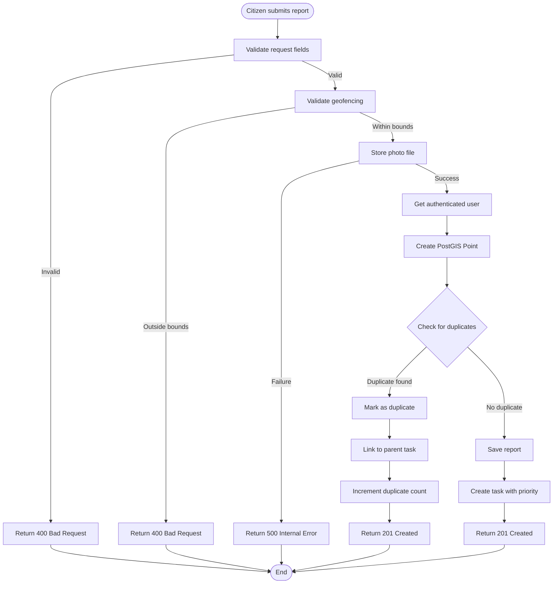
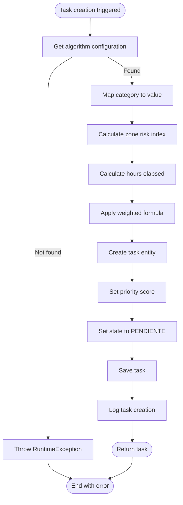
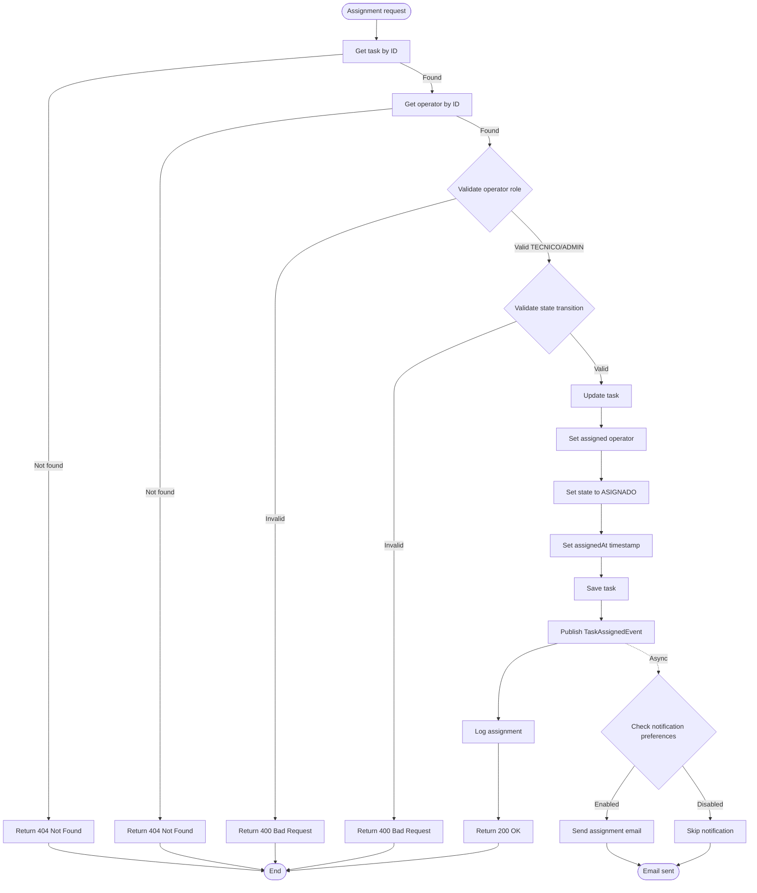
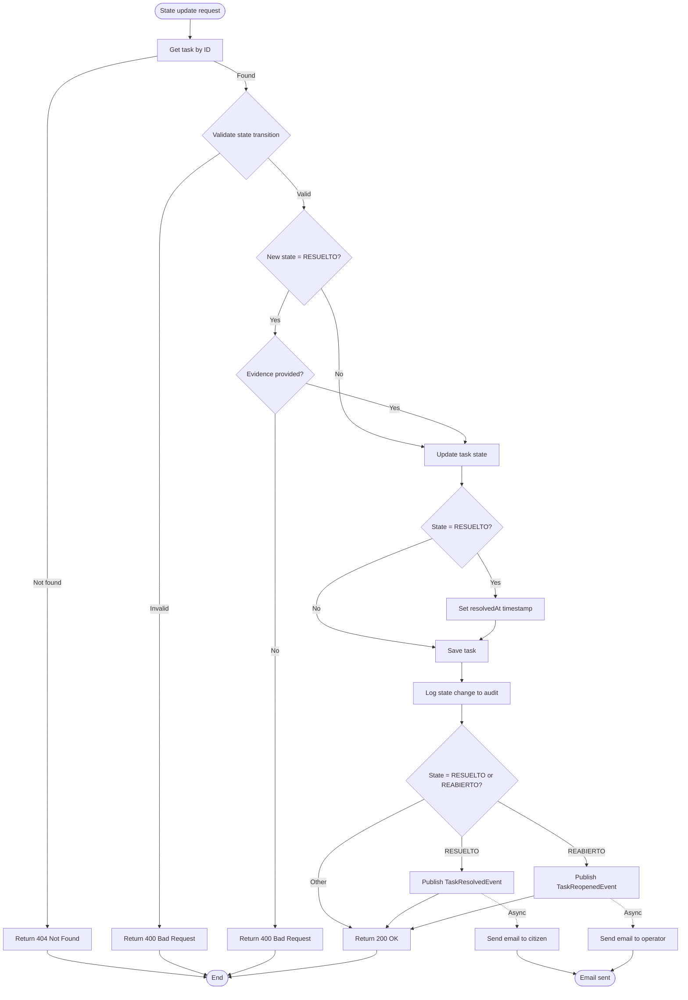
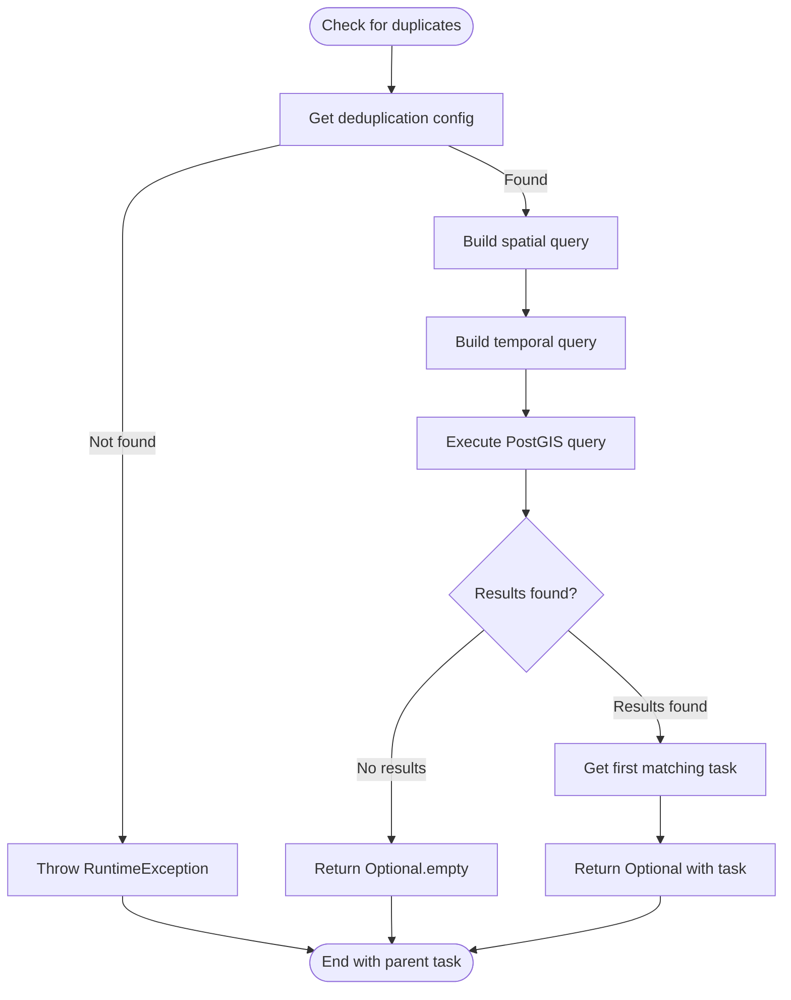
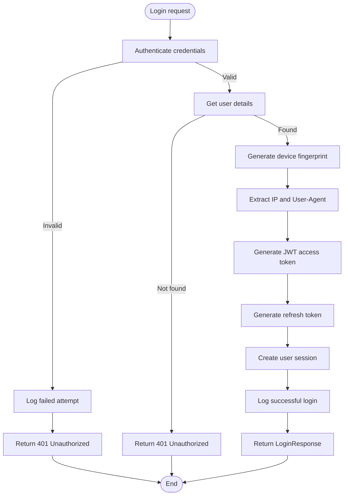
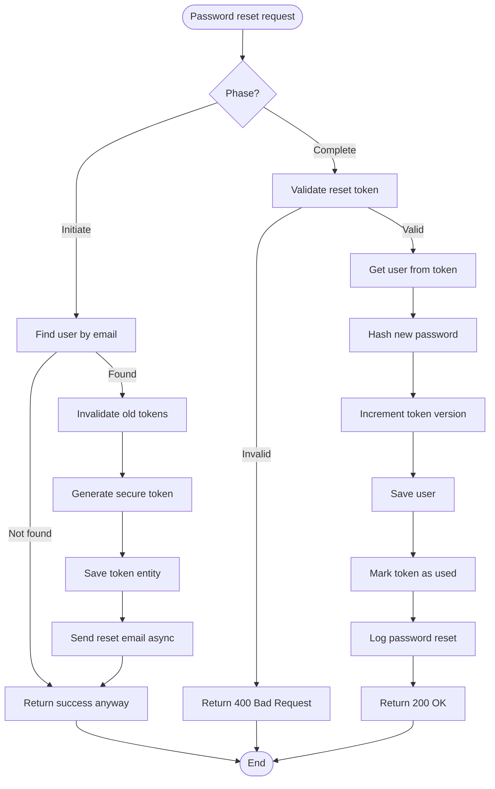
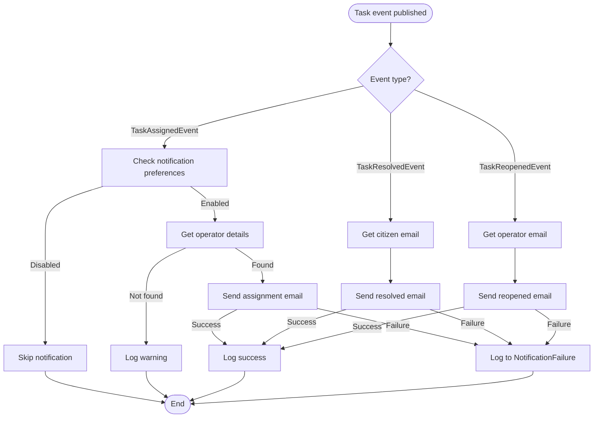

# Process View

## Overview

This document describes the runtime behavior and business processes of the Urban Cleaning Management System. It identifies main workflows, their execution patterns, and dependencies.

## Cross-References

This view is closely related to other architectural views:

- **[Logical View - Sequence Diagrams](02-logical-view.md#sequence-diagrams)**: Sequence diagrams show the detailed component interactions for each process
- **[Use Case View](01-use-case-view.md)**: Processes implement the workflows described in use case specifications
- **[Data Model View](03-data-model-view.md)**: Processes create, read, update, and delete entities documented in the data model
- **[Implementation View](07-implementation-view.md)**: Service classes that orchestrate processes are documented in the implementation view
- **[Design Decisions](08-design-decisions.md#design-patterns)**: Event-driven and strategy patterns used in processes are explained

## Table of Contents

1. [Business Process Identification](#business-process-identification)
2. [Process Flow Documentation](#process-flow-documentation)
3. [Process Classification](#process-classification)
4. [Process Models](#process-models)
5. [Process Dependencies](#process-dependencies)

---

## Business Process Identification

_This section identifies main business processes from service layer orchestration, analyzing method complexity and cross-service calls._

### Primary Processes

| Process ID | Process Name | Entry Point | Description | Criticality |
|------------|--------------|-------------|-------------|-------------|
| P01 | Citizen Report Submission | `POST /api/reports` (ReportController) | Complete workflow from report submission through duplicate detection to task creation | High |
| P02 | Task Creation and Prioritization | TaskService.createTask() | Calculates priority score using configurable algorithm and creates task from report | High |
| P03 | Task Assignment to Operator | `PATCH /api/tasks/{id}/assign` (TaskController) | Assigns task to operator, validates state transition, publishes event, sends notification | High |
| P04 | Task Lifecycle Management | TaskService.updateState() / updateStateWithEvidence() | Manages task state transitions with validation, audit logging, and event publishing | High |
| P05 | Duplicate Detection and Merging | DeduplicationService.checkForDuplicatesBeforeSave() | Spatial and temporal analysis to detect duplicate reports and merge with existing tasks | High |

### Secondary Processes

| Process ID | Process Name | Entry Point | Description | Criticality |
|------------|--------------|-------------|-------------|-------------|
| S01 | User Authentication and Session Management | `POST /api/auth/login` (AuthController) | Authenticates user, generates JWT tokens, creates session with device fingerprinting | Medium |
| S02 | Token Refresh and Rotation | `POST /api/auth/refresh` (AuthController) | Validates refresh token, rotates it, generates new access token | Medium |
| S03 | Password Reset Workflow | `POST /api/auth/password-reset/initiate` (PasswordResetController) | Generates secure token, sends email, validates token, resets password | Medium |
| S04 | Analytics Data Aggregation | `GET /api/analytics/*` (AnalyticsController) | Aggregates task data for heatmaps, MTTR, operator performance, task distribution | Medium |
| S05 | Notification Delivery | TaskEventListener / TaskAssignmentListener | Asynchronous email notification delivery for task events (assigned, resolved, reopened) | Medium |
| S06 | Feedback Processing | `POST /api/feedback` (FeedbackController) | Processes citizen feedback on resolved tasks, can reopen tasks if rejected | Medium |
| S07 | User Data Export (GDPR) | `GET /api/users/me/export` (UserController) | Exports all user data including reports, tasks, sessions, audit logs | Low |
| S08 | Session Cleanup | UserSessionService.cleanupStaleSessions() | Scheduled cleanup of expired sessions (runs daily at 5 AM) | Low |
| S09 | Token Cleanup | RefreshTokenService.cleanupExpiredTokens() | Scheduled cleanup of expired refresh tokens (runs daily at 3 AM) | Low |
| S10 | Password Reset Token Cleanup | PasswordResetService.cleanupExpiredTokens() | Scheduled cleanup of expired password reset tokens (runs daily at 2 AM) | Low |

---

## Process Flow Documentation

_This section documents detailed process flows with entry and exit points, process steps, data transformations, and transaction boundaries._

### Process P01: Citizen Report Submission

**Entry Point**: `POST /api/reports` (ReportController.createReport)

**Description**: Complete workflow from citizen report submission through validation, geofencing, duplicate detection, photo storage, and task creation. This is the primary entry point for citizens to report urban cleaning issues.

**Process Steps**:
1. **Validate Request** - ReportService.validateReportRequest()
   - Check required fields (latitude, longitude, category, description)
   - Throw ValidationException if invalid
2. **Validate Coordinates** - GeofencingService.validateCoordinates()
   - Check if coordinates are within service boundaries
   - Throw ValidationException if outside geofence
3. **Store Photo** - FileStorageService.storeFile()
   - Save uploaded photo to filesystem
   - Generate unique filename and return URL
4. **Get Current User** - SecurityContextHolder.getContext()
   - Extract authenticated user from security context
   - Support anonymous reports (null user)
5. **Create Point Geometry** - GeofencingService.createPoint()
   - Convert lat/lon to PostGIS Point geometry
6. **Check for Duplicates** - DeduplicationService.checkForDuplicatesBeforeSave()
   - Spatial query within configured radius
   - Temporal filter within configured time window
   - Return parent task if duplicate found
7. **Branch: Duplicate Found**
   - Set report.isDuplicate = true
   - Link report to parent task
   - Save report
   - Increment parent task duplicate count
8. **Branch: No Duplicate**
   - Save report
   - Call TaskService.createTask() to create new task
9. **Return Response** - Map Report to ReportResponse DTO

**Data Transformations**:
- `ReportSubmissionRequest` (DTO) → `Report` (Entity)
- `(latitude, longitude)` → `Point` (PostGIS geometry)
- `MultipartFile` → `String` (photo URL)
- `Report` (Entity) → `ReportResponse` (DTO)

**Transaction Boundaries**:
- **@Transactional** on ReportService.createReport()
- Single transaction covers: validation, duplicate check, report save, task creation
- Rollback on any exception

**Exit Points**:
- **Success**: 201 Created with ReportResponse
- **Validation Error**: 400 Bad Request (ValidationException)
- **Geofencing Error**: 400 Bad Request (ValidationException)
- **Authentication Error**: 401 Unauthorized (if endpoint requires auth)
- **File Storage Error**: 500 Internal Server Error

**Source Reference**: 
- `backend/src/main/java/com/urbanclean/controller/ReportController.java`
- `backend/src/main/java/com/urbanclean/service/ReportService.java`

---

### Process P02: Task Creation and Prioritization

**Entry Point**: TaskService.createTask() (called from ReportService)

**Description**: Creates a task from a report, calculates priority score using configurable algorithm weights, and initializes task state to PENDIENTE.

**Process Steps**:
1. **Get Algorithm Configuration** - ConfigService.getCurrentAlgorithmConfig()
   - Retrieve current weights for category, zone, time
2. **Calculate Priority Score** - PriorityCalculatorService.calculatePriority()
   - Map category to numeric value
   - Calculate zone risk index from location
   - Calculate hours elapsed since report creation
   - Apply weighted formula: `priority = (weightCategory × categoryValue) + (weightZone × zoneRisk) + (weightTime × hoursElapsed)`
3. **Create Task Entity**
   - Set report reference
   - Set calculated priority score
   - Set initial state to PENDIENTE
   - Set location from report
   - Set category from report
4. **Save Task** - TaskRepository.save()
5. **Log Task Creation**

**Data Transformations**:
- `Report` (Entity) → `Task` (Entity)
- `AlgorithmConfig` (weights) → `BigDecimal` (priority score)
- `String` (category) → `BigDecimal` (category value)
- `Point` (location) → `BigDecimal` (zone risk index)

**Transaction Boundaries**:
- **@Transactional** on TaskService.createTask()
- Nested within ReportService.createReport() transaction
- Uses REQUIRED propagation (joins parent transaction)

**Exit Points**:
- **Success**: Task entity created and saved
- **Configuration Error**: RuntimeException if algorithm config not found
- **Calculation Error**: RuntimeException if priority calculation fails

**Source Reference**: 
- `backend/src/main/java/com/urbanclean/service/TaskService.java`
- `backend/src/main/java/com/urbanclean/service/PriorityCalculatorService.java`
- `backend/src/main/java/com/urbanclean/service/ConfigService.java`

---

### Process P03: Task Assignment to Operator

**Entry Point**: `PATCH /api/tasks/{id}/assign` (TaskController.assignTask)

**Description**: Assigns a task to an operator, validates state transition, publishes TaskAssignedEvent, and triggers email notification.

**Process Steps**:
1. **Get Task** - TaskService.getTaskById()
   - Retrieve task by ID
   - Throw ResourceNotFoundException if not found
2. **Get Operator** - UserRepository.findById()
   - Retrieve operator user by ID
   - Throw ResourceNotFoundException if not found
3. **Validate Operator Role** - Check user.role
   - Ensure user has TECNICO or ADMIN role
   - Throw ValidationException if invalid role
4. **Validate State Transition** - TaskService.validateStateTransition()
   - Check if transition from current state to ASIGNADO is valid
   - Throw InvalidStateTransitionException if invalid
5. **Update Task**
   - Set assignedOperator reference
   - Set state to ASIGNADO
   - Set assignedAt timestamp
6. **Save Task** - TaskRepository.save()
7. **Publish Event** - ApplicationEventPublisher.publishEvent()
   - Create TaskAssignedEvent with task details
   - Event processed asynchronously by TaskAssignmentListener
8. **Log Assignment**

**Data Transformations**:
- `UUID` (taskId, operatorId) → `Task`, `User` (Entities)
- `Task` (Entity) → `TaskResponse` (DTO)
- `Task` (Entity) → `TaskAssignedEvent` (Domain Event)

**Transaction Boundaries**:
- **@Transactional** on TaskService.assignTask()
- Single transaction covers: validation, state update, event publishing
- Event listener runs in separate async transaction

**Exit Points**:
- **Success**: 200 OK with TaskResponse
- **Task Not Found**: 404 Not Found (ResourceNotFoundException)
- **Operator Not Found**: 404 Not Found (ResourceNotFoundException)
- **Invalid Role**: 400 Bad Request (ValidationException)
- **Invalid State Transition**: 400 Bad Request (InvalidStateTransitionException)
- **Authorization Error**: 403 Forbidden (if not ADMIN/TECNICO)

**Source Reference**: 
- `backend/src/main/java/com/urbanclean/controller/TaskController.java`
- `backend/src/main/java/com/urbanclean/service/TaskService.java`
- `backend/src/main/java/com/urbanclean/listener/TaskAssignmentListener.java`

---

### Process P04: Task Lifecycle Management

**Entry Point**: 
- `PATCH /api/tasks/{id}/state` (TaskController.updateTaskState)
- `PATCH /api/tasks/{id}/state-with-evidence` (TaskController.updateTaskStateWithEvidence)

**Description**: Manages task state transitions through the lifecycle (PENDIENTE → ASIGNADO → EN_PROGRESO → RESUELTO → REABIERTO), with validation, audit logging, and event publishing.

**Process Steps**:
1. **Get Task** - TaskService.getTaskById()
   - Retrieve task by ID
   - Throw ResourceNotFoundException if not found
2. **Validate State Transition** - TaskService.validateStateTransition()
   - Check if transition from current state to new state is valid
   - Valid transitions:
     - PENDIENTE → ASIGNADO
     - ASIGNADO → EN_PROGRESO
     - EN_PROGRESO → RESUELTO
     - RESUELTO → REABIERTO
   - Throw InvalidStateTransitionException if invalid
3. **Validate Evidence** (if transitioning to RESUELTO)
   - Ensure evidence/resolution notes provided
   - Throw ValidationException if missing
4. **Store Previous State** - For audit logging
5. **Update Task State**
   - Set new state
   - Set resolvedAt timestamp (if RESUELTO)
   - Set evidence/resolution notes (if provided)
6. **Save Task** - TaskRepository.save()
7. **Log State Change** - AuditService.logTaskStateChange()
   - Create audit log entry with previous and new state
   - Include operator, timestamp, evidence
8. **Publish Event** (if RESUELTO)
   - Create TaskResolvedEvent
   - Event processed asynchronously by TaskEventListener
   - Sends email to citizen
9. **Publish Event** (if REABIERTO)
   - Create TaskReopenedEvent
   - Event processed asynchronously by TaskEventListener
   - Sends email to operator

**Data Transformations**:
- `TaskStateUpdateRequest` (DTO) → `TaskState` (Enum)
- `Task` (Entity) → `TaskResponse` (DTO)
- `Task` (Entity) → `TaskResolvedEvent` / `TaskReopenedEvent` (Domain Events)
- State change → `AuditLog` (Entity)

**Transaction Boundaries**:
- **@Transactional** on TaskService.updateState() / updateStateWithEvidence()
- Single transaction covers: validation, state update, audit logging, event publishing
- Event listeners run in separate async transactions

**Exit Points**:
- **Success**: 200 OK with TaskResponse
- **Task Not Found**: 404 Not Found (ResourceNotFoundException)
- **Invalid State Transition**: 400 Bad Request (InvalidStateTransitionException)
- **Missing Evidence**: 400 Bad Request (ValidationException)
- **Authorization Error**: 403 Forbidden (if not assigned operator or ADMIN)

**Source Reference**: 
- `backend/src/main/java/com/urbanclean/controller/TaskController.java`
- `backend/src/main/java/com/urbanclean/service/TaskService.java`
- `backend/src/main/java/com/urbanclean/service/AuditService.java`
- `backend/src/main/java/com/urbanclean/event/TaskEventListener.java`

---

### Process P05: Duplicate Detection and Merging

**Entry Point**: DeduplicationService.checkForDuplicatesBeforeSave() (called from ReportService)

**Description**: Performs spatial and temporal analysis to detect duplicate reports and merge them with existing tasks, preventing duplicate task creation.

**Process Steps**:
1. **Get Deduplication Configuration** - ConfigService.getCurrentDuplicateDetectionConfig()
   - Retrieve radius threshold (meters)
   - Retrieve time window threshold (hours)
2. **Build Spatial Query** - Create PostGIS spatial query
   - Use ST_DWithin for distance calculation
   - Filter by configured radius
3. **Build Temporal Query** - Filter by time window
   - Calculate cutoff time: now - time window
   - Filter reports created after cutoff
4. **Execute Query** - ReportRepository.findPotentialDuplicates()
   - Spatial filter: within radius
   - Temporal filter: within time window
   - Category filter: same category
   - Exclude: already marked as duplicates
5. **Find Associated Tasks** - For each potential duplicate report
   - Get associated task (if not already a duplicate)
   - Return first matching task
6. **Return Result**
   - Optional<Task> with parent task if duplicate found
   - Empty Optional if no duplicates

**Data Transformations**:
- `Report` (unsaved entity) → Spatial query parameters
- `Point` (location) → ST_DWithin spatial function
- `LocalDateTime` (createdAt) → Temporal filter
- Query results → `Optional<Task>`

**Transaction Boundaries**:
- No @Transactional annotation (read-only operation)
- Runs within parent transaction (ReportService.createReport)
- Uses REQUIRED propagation (joins parent transaction)

**Exit Points**:
- **Duplicate Found**: Returns Optional<Task> with parent task
- **No Duplicate**: Returns Optional.empty()
- **Configuration Error**: RuntimeException if config not found
- **Query Error**: DataAccessException if spatial query fails

**Source Reference**: 
- `backend/src/main/java/com/urbanclean/service/DeduplicationService.java`
- `backend/src/main/java/com/urbanclean/service/ConfigService.java`
- `backend/src/main/java/com/urbanclean/repository/ReportRepository.java`

---

### Process S01: User Authentication and Session Management

**Entry Point**: `POST /api/auth/login` (AuthController.login)

**Description**: Authenticates user credentials, generates JWT access and refresh tokens, creates session with device fingerprinting, and logs security events.

**Process Steps**:
1. **Authenticate Credentials** - AuthenticationManager.authenticate()
   - Validate username and password
   - Throw AuthenticationException if invalid
2. **Get User Details** - UserRepository.findByUsername()
   - Retrieve user entity
   - Throw AuthenticationException if not found
3. **Generate Device Fingerprint** - DeviceFingerprintUtil.generateFingerprint()
   - Hash combination of User-Agent, Accept headers, IP address
   - Create unique device identifier
4. **Extract Request Metadata**
   - Get IP address from request
   - Get User-Agent from headers
5. **Generate Access Token** - JwtTokenProvider.generateToken()
   - Include username, userId, role, tokenVersion
   - Set expiration (24 hours default)
   - Sign with HS512 algorithm
6. **Generate Refresh Token** - RefreshTokenService.createRefreshToken()
   - Generate random 32-byte token
   - Hash token for storage
   - Store with device fingerprint, IP, user agent
   - Set expiration (30 days default)
7. **Create User Session** - UserSessionService.createSession()
   - Link to refresh token
   - Store device fingerprint, IP, user agent
   - Set active status
8. **Log Successful Login**
9. **Return Response** - LoginResponse with tokens

**Data Transformations**:
- `LoginRequest` (DTO) → Authentication credentials
- `User` (Entity) → JWT claims
- Random bytes → Refresh token string
- Request metadata → Device fingerprint hash
- Tokens → `LoginResponse` (DTO)

**Transaction Boundaries**:
- **@Transactional** on AuthService.login()
- Single transaction covers: authentication, token generation, session creation
- Rollback on any exception

**Exit Points**:
- **Success**: 200 OK with LoginResponse (access token, refresh token, role, username)
- **Invalid Credentials**: 401 Unauthorized (AuthenticationException)
- **User Not Found**: 401 Unauthorized (AuthenticationException)
- **Account Locked**: 401 Unauthorized (if too many failed attempts)

**Source Reference**: 
- `backend/src/main/java/com/urbanclean/controller/AuthController.java`
- `backend/src/main/java/com/urbanclean/service/AuthService.java`
- `backend/src/main/java/com/urbanclean/service/RefreshTokenService.java`
- `backend/src/main/java/com/urbanclean/service/UserSessionService.java`

---

### Process S02: Token Refresh and Rotation

**Entry Point**: `POST /api/auth/refresh` (AuthController.refreshToken)

**Description**: Validates refresh token, rotates it for security, generates new access token, and updates session activity.

**Process Steps**:
1. **Validate Refresh Token** - RefreshTokenService.validateRefreshToken()
   - Hash provided token
   - Look up in database
   - Check expiration
   - Check revocation status
   - Throw AuthenticationException if invalid
2. **Get User** - UserRepository.findById()
   - Retrieve user from token's userId
   - Throw AuthenticationException if not found
3. **Generate Device Fingerprint** - DeviceFingerprintUtil.generateFingerprint()
   - Create fingerprint from current request
4. **Generate New Access Token** - JwtTokenProvider.generateToken()
   - Include username, userId, role, tokenVersion
   - Set expiration (24 hours default)
5. **Rotate Refresh Token** - RefreshTokenService.rotateRefreshToken()
   - Revoke old refresh token
   - Generate new refresh token
   - Store with updated metadata
   - Return new token
6. **Log Token Refresh**
7. **Return Response** - RefreshTokenResponse with new tokens

**Data Transformations**:
- `RefreshTokenRequest` (DTO) → Token hash
- `RefreshToken` (Entity) → User validation
- `User` (Entity) → JWT claims
- New tokens → `RefreshTokenResponse` (DTO)

**Transaction Boundaries**:
- **@Transactional** on AuthService.refreshAccessToken()
- Single transaction covers: validation, token rotation, session update
- Rollback on any exception

**Exit Points**:
- **Success**: 200 OK with RefreshTokenResponse (new access token, new refresh token)
- **Invalid Token**: 401 Unauthorized (AuthenticationException)
- **Expired Token**: 401 Unauthorized (AuthenticationException)
- **Revoked Token**: 401 Unauthorized (AuthenticationException)

**Source Reference**: 
- `backend/src/main/java/com/urbanclean/controller/AuthController.java`
- `backend/src/main/java/com/urbanclean/service/AuthService.java`
- `backend/src/main/java/com/urbanclean/service/RefreshTokenService.java`

---

### Process S03: Password Reset Workflow

**Entry Point**: 
- `POST /api/auth/password-reset/initiate` (PasswordResetController.initiateReset)
- `POST /api/auth/password-reset/complete` (PasswordResetController.completeReset)

**Description**: Two-phase workflow: generates secure token and sends email, then validates token and resets password with token version increment.

**Phase 1: Initiate Reset**

**Process Steps**:
1. **Find User by Email** - UserRepository.findByEmail()
   - Return success even if not found (prevent email enumeration)
2. **Invalidate Existing Tokens** - PasswordResetTokenRepository.findByUserAndUsedFalse()
   - Mark all unused tokens as used
   - Prevent token reuse
3. **Generate Secure Token**
   - Generate 32 random bytes using SecureRandom
   - Base64 URL-encode without padding
4. **Create Token Entity** - PasswordResetToken
   - Store token, user reference, expiration (1 hour)
   - Store requesting IP address
   - Set used = false
5. **Save Token** - PasswordResetTokenRepository.save()
6. **Send Email** - EmailService.sendPasswordResetEmail()
   - Asynchronous email delivery
   - Include reset link with token
7. **Return Success** - Always return true

**Phase 2: Complete Reset**

**Process Steps**:
1. **Validate Token** - PasswordResetService.validateToken()
   - Look up token in database
   - Check expiration
   - Check if already used
   - Return null if invalid
2. **Get User** - From token.user reference
3. **Update Password** - User.setPasswordHash()
   - Hash new password with BCrypt
4. **Increment Token Version** - User.setTokenVersion()
   - Invalidate all existing JWT access tokens
   - Force re-authentication on all devices
5. **Save User** - UserRepository.save()
6. **Mark Token as Used** - PasswordResetToken.setUsed(true)
   - Set usedAt timestamp
   - Update IP address
7. **Save Token** - PasswordResetTokenRepository.save()
8. **Log Password Reset**
9. **Return Success**

**Data Transformations**:
- `PasswordResetInitiateRequest` (DTO) → Email lookup
- Random bytes → Base64 token string
- Token string → `PasswordResetToken` (Entity)
- `PasswordResetCompleteRequest` (DTO) → Password hash
- Password string → BCrypt hash

**Transaction Boundaries**:
- **@Transactional** on PasswordResetService.initiatePasswordReset()
- **@Transactional** on PasswordResetService.resetPassword()
- Separate transactions for initiate and complete phases

**Exit Points**:
- **Initiate Success**: 200 OK (always, even if email not found)
- **Complete Success**: 200 OK with PasswordResetResponse
- **Invalid Token**: 400 Bad Request
- **Expired Token**: 400 Bad Request
- **Already Used Token**: 400 Bad Request

**Source Reference**: 
- `backend/src/main/java/com/urbanclean/controller/PasswordResetController.java`
- `backend/src/main/java/com/urbanclean/service/PasswordResetService.java`
- `backend/src/main/java/com/urbanclean/service/EmailService.java`

---

### Process S04: Analytics Data Aggregation

**Entry Point**: 
- `GET /api/analytics/heatmap` (AnalyticsController.getHeatmap)
- `GET /api/analytics/mttr` (AnalyticsController.getMTTR)
- `GET /api/analytics/operator-performance` (AnalyticsController.getOperatorPerformance)
- `GET /api/analytics/task-distribution` (AnalyticsController.getTaskDistribution)

**Description**: Aggregates task data for various analytics views, applying filters for date range, category, state, and operator.

**Process Steps (Heatmap)**:
1. **Parse Filters** - AnalyticsFilters from query parameters
   - Date range (startDate, endDate)
   - Category filter (optional)
   - State filter (optional)
2. **Query Tasks** - TaskRepository with spatial grouping
   - Filter by date range, category, state
   - Group by location (spatial clustering)
   - Count tasks per location
3. **Build Heatmap Data** - HeatmapService.generateHeatmap()
   - Create grid of coordinates
   - Calculate intensity per grid cell
   - Return list of HeatmapPoint (lat, lon, intensity)
4. **Return Response** - HeatmapResponse with data points

**Process Steps (MTTR - Mean Time To Resolution)**:
1. **Parse Filters** - AnalyticsFilters
2. **Query Resolved Tasks** - TaskRepository
   - Filter by state = RESUELTO
   - Filter by date range, category
   - Calculate time difference: resolvedAt - createdAt
3. **Calculate Statistics** - AnalyticsService.calculateMTTR()
   - Average resolution time
   - Median resolution time
   - Min/max resolution time
   - Group by category if requested
4. **Return Response** - MTTRResponse with statistics

**Process Steps (Operator Performance)**:
1. **Parse Filters** - AnalyticsFilters
2. **Query Tasks by Operator** - TaskRepository
   - Filter by assignedOperator
   - Filter by date range
   - Group by operator
3. **Calculate Metrics** - AnalyticsService.calculateOperatorPerformance()
   - Tasks assigned per operator
   - Tasks completed per operator
   - Average resolution time per operator
   - Completion rate per operator
4. **Return Response** - List<OperatorPerformanceResponse>

**Process Steps (Task Distribution)**:
1. **Parse Filters** - AnalyticsFilters
2. **Query Tasks** - TaskRepository
   - Filter by date range
   - Group by category and state
3. **Calculate Distribution** - AnalyticsService.calculateDistribution()
   - Count tasks per category
   - Count tasks per state
   - Calculate percentages
4. **Return Response** - TaskDistributionResponse

**Data Transformations**:
- Query parameters → `AnalyticsFilters` (DTO)
- `Task` (Entities) → Aggregated statistics
- Spatial data → Heatmap grid
- Time differences → MTTR statistics
- Grouped data → Distribution percentages

**Transaction Boundaries**:
- **@Transactional(readOnly = true)** on all analytics methods
- Read-only transactions for performance
- No data modifications

**Exit Points**:
- **Success**: 200 OK with analytics response
- **Invalid Filters**: 400 Bad Request (ValidationException)
- **Authorization Error**: 403 Forbidden (if not ADMIN/TECNICO)

**Source Reference**: 
- `backend/src/main/java/com/urbanclean/controller/AnalyticsController.java`
- `backend/src/main/java/com/urbanclean/service/AnalyticsService.java`
- `backend/src/main/java/com/urbanclean/service/HeatmapService.java`
- `backend/src/main/java/com/urbanclean/repository/TaskRepository.java`

---

### Process S05: Notification Delivery

**Entry Point**: 
- TaskEventListener.handleTaskResolved() (event listener)
- TaskEventListener.handleTaskReopened() (event listener)
- TaskAssignmentListener.handleTaskAssigned() (event listener)

**Description**: Asynchronous email notification delivery for task events, with notification preference checking and failure logging.

**Process Steps (Task Assigned Notification)**:
1. **Receive Event** - TaskAssignedEvent from ApplicationEventPublisher
   - Event contains: taskId, operatorId, category, location, priorityScore
2. **Check Notification Preferences** - NotificationPreferenceService.isNotificationEnabled()
   - Query user's notification preferences
   - Check if TASK_ASSIGNED notifications enabled
   - Skip if disabled
3. **Get Operator Details** - UserRepository.findById()
   - Retrieve operator email and username
   - Skip if operator not found
4. **Send Email** - EmailService.sendTaskAssignmentEmail()
   - Load email template
   - Populate with task details
   - Send via SMTP
   - Log failure if email fails
5. **Log Success**

**Process Steps (Task Resolved Notification)**:
1. **Receive Event** - TaskResolvedEvent
   - Event contains: taskId, citizenEmail, taskCategory
2. **Send Email** - EmailService.sendTaskResolvedEmail()
   - Load email template
   - Populate with task details
   - Send to citizen email
   - Log failure if email fails
3. **Log Success**

**Process Steps (Task Reopened Notification)**:
1. **Receive Event** - TaskReopenedEvent
   - Event contains: taskId, operatorEmail, taskCategory, rejectionJustification
2. **Send Email** - EmailService.sendTaskReopenedEmail()
   - Load email template
   - Populate with task details and rejection reason
   - Send to operator email
   - Log failure if email fails
3. **Log Success**

**Data Transformations**:
- Domain events → Email template data
- Task details → HTML email content
- Notification preferences → Boolean (send/skip)

**Transaction Boundaries**:
- **@Async** on all event listener methods
- Separate async transaction for each notification
- Email failures don't rollback main transaction
- Failures logged to NotificationFailure table

**Exit Points**:
- **Success**: Email sent, logged
- **Notification Disabled**: Skipped, logged
- **Email Failure**: Logged to NotificationFailure table, doesn't throw exception
- **User Not Found**: Skipped, logged warning

**Source Reference**: 
- `backend/src/main/java/com/urbanclean/event/TaskEventListener.java`
- `backend/src/main/java/com/urbanclean/listener/TaskAssignmentListener.java`
- `backend/src/main/java/com/urbanclean/service/EmailService.java`
- `backend/src/main/java/com/urbanclean/service/NotificationPreferenceService.java`

---

### Process S06: Feedback Processing

**Entry Point**: `POST /api/feedback` (FeedbackController.submitFeedback)

**Description**: Processes citizen feedback on resolved tasks, can accept or reject resolution, reopening task if rejected.

**Process Steps**:
1. **Get Task** - TaskService.getTaskById()
   - Retrieve task by ID
   - Throw ResourceNotFoundException if not found
2. **Validate Task State** - Check task.state == RESUELTO
   - Only resolved tasks can receive feedback
   - Throw ValidationException if not resolved
3. **Validate Citizen Authorization** - Check task.report.submitter
   - Ensure current user is the original reporter
   - Throw AuthorizationException if not authorized
4. **Create Feedback Entity** - CitizenFeedback
   - Set task reference
   - Set feedback type (ACCEPTED / REJECTED)
   - Set rating (1-5)
   - Set comments
   - Set submitter
5. **Save Feedback** - CitizenFeedbackRepository.save()
6. **Branch: Feedback Rejected**
   - Call TaskService.updateState(taskId, REABIERTO)
   - Update task state to REABIERTO
   - Publish TaskReopenedEvent
   - Send notification to operator
7. **Branch: Feedback Accepted**
   - No additional action
   - Task remains RESUELTO
8. **Return Response** - FeedbackResponse

**Data Transformations**:
- Feedback request (DTO) → `CitizenFeedback` (Entity)
- `FeedbackType` (ACCEPTED/REJECTED) → Task state change
- `CitizenFeedback` (Entity) → `FeedbackResponse` (DTO)

**Transaction Boundaries**:
- **@Transactional** on FeedbackService.submitFeedback()
- Single transaction covers: validation, feedback save, task state update
- Rollback on any exception

**Exit Points**:
- **Success**: 201 Created with FeedbackResponse
- **Task Not Found**: 404 Not Found (ResourceNotFoundException)
- **Task Not Resolved**: 400 Bad Request (ValidationException)
- **Not Authorized**: 403 Forbidden (AuthorizationException)
- **Already Has Feedback**: 400 Bad Request (ValidationException)

**Source Reference**: 
- `backend/src/main/java/com/urbanclean/controller/FeedbackController.java`
- `backend/src/main/java/com/urbanclean/service/FeedbackService.java`
- `backend/src/main/java/com/urbanclean/service/TaskService.java`

---

## Process Classification

_This section classifies processes by business criticality based on their impact on core business value and system functionality._

### Primary Processes (Core Business Value)

| Process | Criticality | Rationale |
|---------|-------------|-----------|
| P01: Citizen Report Submission | **High** | Core entry point for all urban cleaning issues. Directly delivers primary business value by enabling citizens to report problems. Failure blocks all downstream processes. |
| P02: Task Creation and Prioritization | **High** | Essential for converting reports into actionable tasks. Priority calculation drives operator efficiency and resource allocation. Failure prevents task management. |
| P03: Task Assignment to Operator | **High** | Critical for distributing work to operators. Without assignment, tasks cannot be executed. Directly impacts operational efficiency and response times. |
| P04: Task Lifecycle Management | **High** | Manages complete task workflow from creation to resolution. State transitions track progress and enable accountability. Failure prevents task completion tracking. |
| P05: Duplicate Detection and Merging | **High** | Prevents duplicate work and resource waste. Ensures data quality and accurate analytics. Critical for system efficiency and operator productivity. |

### Secondary Processes (Supporting)

| Process | Criticality | Rationale |
|---------|-------------|-----------|
| S01: User Authentication and Session Management | **Medium** | Required for secure access but not core business function. Failure prevents user access but doesn't affect existing tasks. Can be temporarily bypassed with anonymous reports. |
| S02: Token Refresh and Rotation | **Medium** | Enhances security through token rotation. Failure forces re-authentication but doesn't block core functionality. Improves user experience but not critical. |
| S03: Password Reset Workflow | **Medium** | Important for user account recovery but infrequent operation. Failure is inconvenient but doesn't block core business processes. Alternative recovery methods exist. |
| S04: Analytics Data Aggregation | **Medium** | Provides valuable insights for decision-making but not required for daily operations. Failure doesn't prevent report submission or task management. Read-only operation. |
| S05: Notification Delivery | **Medium** | Improves communication and user experience but not critical for core workflow. Asynchronous operation with failure tolerance. Users can check status manually. |
| S06: Feedback Processing | **Medium** | Enables quality control and task reopening but not required for initial task completion. Enhances service quality but not critical for basic operations. |
| S07: User Data Export (GDPR) | **Low** | Legal compliance requirement but infrequent operation. Failure doesn't impact daily operations. Can be performed manually if needed. |
| S08: Session Cleanup | **Low** | Maintenance operation for database hygiene. Failure causes data accumulation but doesn't affect functionality. Runs on schedule, not user-triggered. |
| S09: Token Cleanup | **Low** | Maintenance operation for security hygiene. Failure causes data accumulation but doesn't affect functionality. Runs on schedule, not user-triggered. |
| S10: Password Reset Token Cleanup | **Low** | Maintenance operation for database hygiene. Failure causes data accumulation but doesn't affect functionality. Runs on schedule, not user-triggered. |

### Criticality Assessment Criteria

**High Criticality**:
- Directly delivers core business value (report submission, task management)
- Failure blocks critical workflows
- Required for daily operations
- Affects multiple users/operators
- No workaround available

**Medium Criticality**:
- Supports core business processes
- Failure causes inconvenience but not complete blockage
- Workarounds or manual alternatives exist
- Affects user experience but not core functionality
- Can be temporarily unavailable without major impact

**Low Criticality**:
- Maintenance or compliance operations
- Failure causes data accumulation, not functional impact
- Infrequent operations
- Can be performed manually if needed
- Scheduled background tasks

---

## Process Models

_This section contains activity diagrams or BPMN-style diagrams for key processes, showing decision points, parallel activities, and error handling._

### Process Model: P01 - Citizen Report Submission

**Description**: Complete workflow from citizen report submission through validation, duplicate detection, and task creation. The process branches based on duplicate detection results.

**Decision Points**:
- **Validate Request**: Checks required fields (latitude, longitude, category, description)
- **Validate Geofencing**: Checks if coordinates are within service boundaries
- **Check for Duplicates**: Spatial and temporal query to find similar reports

**Parallel Activities**: None (sequential process)

**Error Handling**:
- Validation errors return 400 Bad Request
- Geofencing errors return 400 Bad Request
- File storage errors return 500 Internal Server Error
- All errors rollback transaction

---

### Process Model: P02 - Task Creation and Prioritization

**Description**: Calculates priority score using configurable algorithm weights and creates task from report. Priority formula: `priority = (weightCategory × categoryValue) + (weightZone × zoneRisk) + (weightTime × hoursElapsed)`

**Decision Points**:
- **Get Configuration**: Retrieves current algorithm weights, fails if not configured

**Parallel Activities**: None (sequential calculation)

**Error Handling**:
- Configuration not found throws RuntimeException
- Calculation errors throw RuntimeException
- Transaction rollback on any error

---

### Process Model: P03 - Task Assignment to Operator

**Description**: Assigns task to operator with validation, state transition, and asynchronous notification delivery.

**Decision Points**:
- **Validate Role**: Ensures operator has TECNICO or ADMIN role
- **Validate State Transition**: Checks if current state allows assignment
- **Check Notification Preferences**: Determines if email should be sent

**Parallel Activities**:
- **Async Notification**: Email delivery runs asynchronously after event publishing

**Error Handling**:
- Task/operator not found returns 404
- Invalid role returns 400
- Invalid state transition returns 400
- Email failures logged but don't affect main flow

---

### Process Model: P04 - Task Lifecycle Management

**Description**: Manages task state transitions through lifecycle with validation, audit logging, and event-driven notifications.

**Decision Points**:
- **Validate Transition**: Checks if state transition is valid (PENDIENTE→ASIGNADO→EN_PROGRESO→RESUELTO→REABIERTO)
- **Check Resolved**: Determines if evidence is required
- **Validate Evidence**: Ensures resolution notes provided for RESUELTO state
- **Check Event**: Determines which event to publish

**Parallel Activities**:
- **Async Notifications**: Email delivery runs asynchronously for RESUELTO and REABIERTO states

**Error Handling**:
- Task not found returns 404
- Invalid transition returns 400
- Missing evidence returns 400
- Email failures logged but don't affect main flow

---

### Process Model: P05 - Duplicate Detection and Merging

**Description**: Performs spatial and temporal analysis to detect duplicate reports using PostGIS ST_DWithin function.

**Decision Points**:
- **Check Results**: Determines if any potential duplicates found within radius and time window

**Parallel Activities**: None (sequential query)

**Error Handling**:
- Configuration not found throws RuntimeException
- Query errors throw DataAccessException
- Transaction rollback on any error

**Query Details**:
- **Spatial Filter**: ST_DWithin(location, report.location, radius_meters)
- **Temporal Filter**: createdAt > (now - time_window_hours)
- **Category Filter**: category = report.category
- **Exclusion Filter**: isDuplicate = false

---

### Process Model: S01 - User Authentication and Session Management

**Description**: Authenticates user credentials, generates JWT tokens, creates session with device fingerprinting.

**Decision Points**:
- **Authenticate**: Validates username and password against stored hash

**Parallel Activities**: None (sequential process)

**Error Handling**:
- Invalid credentials return 401
- User not found returns 401
- Failed attempts logged for security monitoring
- Transaction rollback on any error

---

### Process Model: S03 - Password Reset Workflow

**Description**: Two-phase workflow for secure password reset with token generation, email delivery, and token version increment.

**Decision Points**:
- **Phase**: Determines if initiate or complete phase
- **Find User**: Always returns success to prevent email enumeration
- **Validate Token**: Checks expiration and usage status

**Parallel Activities**:
- **Async Email**: Email delivery runs asynchronously

**Error Handling**:
- Invalid/expired token returns 400
- Email failures logged but don't affect initiate phase
- Token version increment invalidates all existing JWTs

---

### Process Model: S05 - Notification Delivery

**Description**: Asynchronous email notification delivery for task events with preference checking and failure logging.

**Decision Points**:
- **Event Type**: Determines which notification to send
- **Check Preferences**: Determines if notification enabled for user

**Parallel Activities**:
- **All notifications run asynchronously** via @Async event listeners

**Error Handling**:
- Email failures logged to NotificationFailure table
- Failures don't throw exceptions (don't affect main flow)
- User not found logged as warning

---

## Process Dependencies

_This section documents service dependencies for each process and integration points with external systems._

### Dependency Matrix

| Process | Service Dependencies | External Integrations | Database Operations |
|---------|---------------------|----------------------|---------------------|
| P01: Citizen Report Submission | ReportService, FileStorageService, GeofencingService, TaskService, DeduplicationService | Filesystem (photo storage) | INSERT Report, INSERT Task, UPDATE Task (duplicate count) |
| P02: Task Creation and Prioritization | TaskService, PriorityCalculatorService, ConfigService | None | SELECT AlgorithmConfig, INSERT Task |
| P03: Task Assignment to Operator | TaskService, UserRepository, ApplicationEventPublisher | None | SELECT Task, SELECT User, UPDATE Task, INSERT AuditLog |
| P04: Task Lifecycle Management | TaskService, AuditService, ApplicationEventPublisher | None | SELECT Task, UPDATE Task, INSERT AuditLog |
| P05: Duplicate Detection and Merging | DeduplicationService, ConfigService, ReportRepository, TaskRepository | PostGIS (spatial queries) | SELECT Reports (spatial), SELECT Tasks, SELECT DuplicateDetectionConfig |
| S01: User Authentication | AuthService, RefreshTokenService, UserSessionService, SecurityMonitoringService, JwtTokenProvider | None | SELECT User, INSERT RefreshToken, INSERT UserSession, INSERT FailedLoginAttempt |
| S02: Token Refresh | AuthService, RefreshTokenService, JwtTokenProvider | None | SELECT RefreshToken, UPDATE RefreshToken (revoke), INSERT RefreshToken (new) |
| S03: Password Reset | PasswordResetService, EmailService, UserRepository | SMTP (email delivery) | SELECT User, INSERT PasswordResetToken, UPDATE PasswordResetToken, UPDATE User |
| S04: Analytics Data Aggregation | AnalyticsService, HeatmapService, TaskRepository | PostGIS (spatial aggregation) | SELECT Tasks (with filters and aggregations) |
| S05: Notification Delivery | EmailService, NotificationPreferenceService, NotificationFailureService | SMTP (email delivery) | SELECT NotificationPreference, SELECT User, INSERT NotificationFailure (on error) |
| S06: Feedback Processing | FeedbackService, TaskService, CitizenFeedbackRepository | None | SELECT Task, INSERT CitizenFeedback, UPDATE Task (if rejected) |

### Integration Points

#### Database Integration

**PostgreSQL with PostGIS Extension**:
- **Connection**: JDBC connection pool managed by Spring Boot
- **Transaction Management**: Spring @Transactional with default isolation level (READ_COMMITTED)
- **Spatial Operations**: PostGIS functions (ST_DWithin, ST_MakePoint, ST_Distance)
- **Used By**: All processes that persist or query data

#### Email Service Integration

**SMTP Server**:
- **Protocol**: SMTP (configured via Spring Mail)
- **Configuration**: Host, port, username, password from application.properties
- **Template Engine**: Thymeleaf for HTML email templates
- **Async Execution**: @Async annotation for non-blocking email delivery
- **Used By**: S03 (Password Reset), S05 (Notification Delivery)

#### Event Bus Integration

**Spring ApplicationEventPublisher**:
- **Pattern**: Domain event publishing for loose coupling
- **Execution**: Synchronous event publishing, asynchronous event handling
- **Used By**: P03 (Task Assignment), P04 (Task Lifecycle), S06 (Feedback Processing)

---

## Concurrency and Transactions

### Transaction Management

**Spring @Transactional**:
- **Isolation Level**: READ_COMMITTED (default)
- **Propagation**: REQUIRED (default) - joins existing transaction or creates new one
- **Rollback**: Automatic rollback on RuntimeException and Error
- **Read-Only**: Optimization for query-only operations (analytics)

### Asynchronous Processing

**@Async Configuration**:
- **Thread Pool**: Configured in AsyncConfig
- **Core Pool Size**: 5 threads
- **Max Pool Size**: 10 threads
- **Queue Capacity**: 100 tasks
- **Used By**: Email notifications, event listeners

### Concurrency Considerations

**Race Conditions**:
- **Duplicate Detection**: Potential race condition if two identical reports submitted simultaneously
- **Task Assignment**: Potential race condition if task assigned by multiple operators simultaneously
- **Token Refresh**: Potential race condition if refresh token used simultaneously

**Locking Strategy**:
- **Optimistic Locking**: Not currently implemented (could use @Version annotation)
- **Pessimistic Locking**: Not currently used
- **Database Constraints**: Unique constraints on username, email prevent duplicates

---

## Performance Characteristics

### Process Performance

| Process | Expected Duration | Bottlenecks | Optimization |
|---------|------------------|-------------|--------------|
| P01: Report Submission | 200-500ms | Duplicate detection spatial query, file I/O | Spatial indexes on location |
| P02: Task Creation | 50-100ms | Priority calculation, config lookup | Cache algorithm config |
| P03: Task Assignment | 100-200ms | State validation, event publishing | Minimal - already optimized |
| P04: Task Lifecycle | 100-300ms | Audit logging, event publishing | Batch audit logs, async events |
| P05: Duplicate Detection | 100-300ms | PostGIS spatial query | Spatial indexes (already implemented) |
| S01: Authentication | 200-400ms | BCrypt password hashing | Appropriate BCrypt strength (10) |
| S02: Token Refresh | 50-100ms | Token lookup, rotation | Index on token hash |
| S03: Password Reset | 100-200ms (initiate), 200-400ms (complete) | Email delivery (async), BCrypt hashing | Async email |
| S04: Analytics | 500-2000ms | Complex aggregation queries | Indexes on date, category, state fields |
| S05: Notification Delivery | 1000-3000ms | SMTP connection, email delivery | Async execution (already implemented) |
| S06: Feedback Processing | 100-200ms | Task state update | Minimal - already optimized |

---

## Notes

- All processes extracted from service layer analysis
- Transaction boundaries identified from @Transactional annotations
- Async operations identified from @Async annotations and event listeners
- Service dependencies traced through constructor injection
- Integration points documented from configuration and code analysis
- Performance characteristics estimated from code complexity and external dependencies
