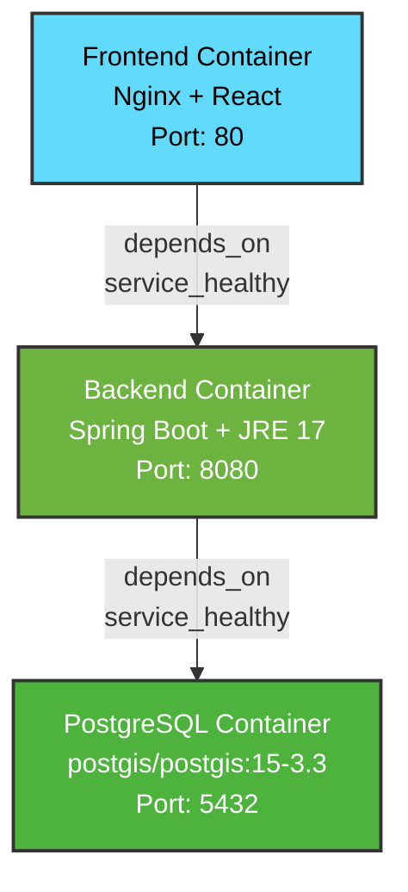
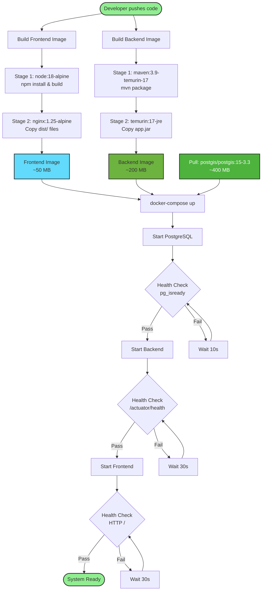

# Deployment View

## Overview

This document describes the physical deployment architecture of the Urban Cleaning Management System, including containerization, service configuration, network topology, and environment requirements.

## Cross-References

This view is closely related to other architectural views:

- **[Implementation View](07-implementation-view.md)**: Shows the software components that are deployed in these containers
- **[Design Decisions - Technology Choices](08-design-decisions.md#technology-choices)**: Explains the rationale for Docker, PostgreSQL, and other deployment technologies
- **[MVC View](04-mvc-view.md)**: Frontend and Backend containers host the View and Controller/Model layers respectively
- **[Data Model View](03-data-model-view.md)**: PostgreSQL container hosts the database schema documented in the data model

## Table of Contents

1. [Deployment Components](#deployment-components)
2. [Container Configuration](#container-configuration)
3. [Component Dependencies](#component-dependencies)
4. [Environment Requirements](#environment-requirements)
5. [Deployment Diagram](#deployment-diagram)
6. [Network Topology](#network-topology)

---

## Deployment Components

_This section documents all deployment components from Docker configuration analysis._

### Component Inventory

| Component | Type | Base Image | Purpose | Source Reference |
|-----------|------|------------|---------|------------------|
| postgres | Database Server | postgis/postgis:15-3.3 | PostgreSQL database with PostGIS extension for spatial data | docker/docker-compose.yml |
| backend | Application Server | eclipse-temurin:17-jre (runtime), maven:3.9-eclipse-temurin-17 (build) | Spring Boot REST API application | docker/docker-compose.yml, backend/Dockerfile |
| frontend | Web Server | nginx:1.25-alpine (runtime), node:18-alpine (build) | React SPA served by Nginx | docker/docker-compose.yml, frontend/Dockerfile |

### Deployment Artifacts

| Artifact | Type | Size (approx) | Build Process | Deployment Target |
|----------|------|---------------|---------------|-------------------|
| app.jar | Executable JAR | ~50-80 MB | Maven build with dependencies | Backend container |
| React build | Static files (HTML/JS/CSS) | ~2-5 MB | Vite build process | Frontend container (Nginx) |
| Database schema | SQL migrations | N/A | Flyway migrations on startup | PostgreSQL container |
| init-db.sql | Database initialization | <1 MB | Mounted as volume | PostgreSQL container |

---

## Container Configuration

_This section documents detailed configuration for each container extracted from docker-compose.yml and Dockerfiles._

### PostgreSQL Container

**Service Name**: `postgres`

**Container Name**: `urbanclean-postgres`

**Base Image**: `postgis/postgis:15-3.3`
- PostgreSQL 15 with PostGIS 3.3 extension
- Includes spatial data support (geometry, geography types)
- Pre-configured with PostGIS functions

**Exposed Ports**:
- Container: `5432` (PostgreSQL default)
- Host: `${DB_PORT:-5432}` (configurable, default 5432)
- Protocol: TCP

**Environment Variables**:
- `POSTGRES_DB`: Database name (default: `urbanclean`)
- `POSTGRES_USER`: Database user (default: `urbanclean_user`)
- `POSTGRES_PASSWORD`: Database password (default: `password`)
- `POSTGRES_INITDB_ARGS`: Initialization arguments (`--encoding=UTF8 --locale=en_US.UTF-8`)

**Volumes**:
- `postgres_data:/var/lib/postgresql/data` - Persistent database storage
- `./init-db.sql:/docker-entrypoint-initdb.d/init-db.sql` - Database initialization script

**Health Check**:
- Command: `pg_isready -U ${DB_USER} -d ${DB_NAME}`
- Interval: 10 seconds
- Timeout: 5 seconds
- Retries: 5
- Start Period: 30 seconds

**Restart Policy**: `unless-stopped`

**Logging**:
- Driver: `json-file`
- Max Size: 10 MB
- Max Files: 3

**Resource Limits**: Not explicitly configured (uses Docker defaults)

**Source Reference**: `docker/docker-compose.yml`

---

### Backend Container

**Service Name**: `backend`

**Container Name**: `urbanclean-backend`

**Base Image**: 
- Build: `maven:3.9-eclipse-temurin-17` (multi-stage build)
- Runtime: `eclipse-temurin:17-jre` (slim JRE for production)

**Build Context**: `../backend`

**Build Process** (Multi-stage):
1. **Stage 1 - Build**:
   - Base: `maven:3.9-eclipse-temurin-17`
   - Copy `pom.xml` and download dependencies (cached layer)
   - Copy source code
   - Execute: `mvn clean package -DskipTests -B -U`
   - Output: `app.jar`

2. **Stage 2 - Runtime**:
   - Base: `eclipse-temurin:17-jre`
   - Create non-root user (`spring:spring`)
   - Create `/uploads` directory with proper permissions
   - Copy JAR from build stage
   - Configure JVM options for containers

**Exposed Ports**:
- Container: `8080` (Spring Boot default)
- Host: `${BACKEND_PORT:-8080}` (configurable, default 8080)
- Protocol: HTTP

**Environment Variables**:

*Database Configuration*:
- `SPRING_DATASOURCE_URL`: `jdbc:postgresql://postgres:5432/${DB_NAME}`
- `SPRING_DATASOURCE_USERNAME`: Database user
- `SPRING_DATASOURCE_PASSWORD`: Database password
- `SPRING_JPA_HIBERNATE_DDL_AUTO`: `update`
- `SPRING_JPA_SHOW_SQL`: `${SHOW_SQL:-false}`

*JWT Configuration*:
- `JWT_SECRET`: JWT signing secret (must be changed in production)
- `JWT_EXPIRATION`: Token expiration in milliseconds (default: 86400000 = 24 hours)

*File Upload Configuration*:
- `UPLOAD_DIR`: `/uploads`
- `MAX_FILE_SIZE`: Maximum file size in bytes (default: 5242880 = 5 MB)

*Geofencing Configuration*:
- `GEOFENCE_MIN_LAT`: Minimum latitude (default: 40.3)
- `GEOFENCE_MAX_LAT`: Maximum latitude (default: 40.6)
- `GEOFENCE_MIN_LON`: Minimum longitude (default: -3.9)
- `GEOFENCE_MAX_LON`: Maximum longitude (default: -3.5)

*Algorithm Configuration*:
- `ALGORITHM_WEIGHT_CATEGORY`: Category weight (default: 0.40)
- `ALGORITHM_WEIGHT_ZONE`: Zone weight (default: 0.35)
- `ALGORITHM_WEIGHT_TIME`: Time weight (default: 0.25)

*Deduplication Configuration*:
- `DEDUPLICATION_DISTANCE_METERS`: Distance threshold (default: 50.0)
- `DEDUPLICATION_TIME_WINDOW_HOURS`: Time window (default: 24)

*Actuator Configuration*:
- `MANAGEMENT_ENDPOINTS_WEB_EXPOSURE_INCLUDE`: `health,info,metrics`
- `MANAGEMENT_ENDPOINT_HEALTH_SHOW_DETAILS`: `when_authorized`

**Volumes**:
- `backend_uploads:/uploads` - Persistent file storage for uploaded photos

**Dependencies**:
- `postgres` (condition: `service_healthy`)
- Waits for PostgreSQL health check to pass before starting

**Health Check**:
- Command: `wget --no-verbose --tries=1 --spider http://localhost:8080/actuator/health`
- Interval: 30 seconds
- Timeout: 10 seconds
- Retries: 3
- Start Period: 60 seconds

**JVM Options**:
- `JAVA_OPTS`: `-XX:+UseContainerSupport -XX:MaxRAMPercentage=75.0 -Djava.security.egd=file:/dev/./urandom`
- Container-aware memory management
- Uses 75% of available container memory
- Fast random number generation for security

**Security**:
- Runs as non-root user (`spring:spring`)
- Minimal JRE image (reduced attack surface)
- No shell access in runtime image

**Restart Policy**: `unless-stopped`

**Logging**:
- Driver: `json-file`
- Max Size: 10 MB
- Max Files: 3

**Resource Limits**: Not explicitly configured (uses Docker defaults)

**Source Reference**: `docker/docker-compose.yml`, `backend/Dockerfile`

---

### Frontend Container

**Service Name**: `frontend`

**Container Name**: `urbanclean-frontend`

**Base Image**:
- Build: `node:18-alpine` (multi-stage build)
- Runtime: `nginx:1.25-alpine` (lightweight web server)

**Build Context**: `../frontend`

**Build Process** (Multi-stage):
1. **Stage 1 - Build**:
   - Base: `node:18-alpine`
   - Copy `package*.json` and install dependencies
   - Copy source code
   - Execute: `npm run build` (Vite build)
   - Output: `dist/` directory with optimized static files

2. **Stage 2 - Runtime**:
   - Base: `nginx:1.25-alpine`
   - Create non-root user (`nginx-app`)
   - Remove default Nginx content
   - Copy build artifacts from stage 1
   - Copy custom Nginx configuration
   - Configure permissions for non-root execution

**Build Arguments**:
- `VITE_API_URL`: API endpoint URL (passed during build)

**Exposed Ports**:
- Container: `80` (Nginx default HTTP)
- Host: `${FRONTEND_PORT:-3000}` (configurable, default 3000)
- Protocol: HTTP

**Environment Variables**:
- `VITE_API_URL`: Backend API URL (default: `http://localhost:8080/api`)
- `VITE_MAP_CENTER_LAT`: Map center latitude (default: 40.4168)
- `VITE_MAP_CENTER_LON`: Map center longitude (default: -3.7038)
- `VITE_MAP_ZOOM`: Initial map zoom level (default: 13)

**Volumes**: None (stateless, serves static files from image)

**Dependencies**:
- `backend` (condition: `service_healthy`)
- Waits for backend health check to pass before starting

**Health Check**:
- Command: `wget --no-verbose --tries=1 --spider http://127.0.0.1:80/health || exit 1`
- Interval: 30 seconds
- Timeout: 3 seconds
- Retries: 3
- Start Period: 10 seconds

**Nginx Configuration**:
- Custom configuration in `nginx.conf`
- SPA routing support (fallback to index.html)
- Gzip compression enabled
- Security headers configured

**Security**:
- Runs as non-root user (`nginx-app`)
- Minimal Alpine image (reduced attack surface)
- No unnecessary packages

**Restart Policy**: `unless-stopped`

**Logging**:
- Driver: `json-file`
- Max Size: 10 MB
- Max Files: 3

**Resource Limits**: Not explicitly configured (uses Docker defaults)

**Source Reference**: `docker/docker-compose.yml`, `frontend/Dockerfile`

---

## Component Dependencies

_This section documents startup order and dependencies extracted from docker-compose.yml._

### Dependency Graph



**Description**: The deployment follows a strict dependency chain where each service waits for its dependencies to be healthy before starting. PostgreSQL starts first and must pass its health check. The backend then starts and connects to the database, running any pending migrations. Finally, the frontend starts once the backend API is available.

### Startup Order

1. **PostgreSQL Container** (First)
   - Starts immediately
   - Initializes database with PostGIS extension
   - Runs `init-db.sql` script if present
   - Health check: `pg_isready` command
   - Ready when: Health check passes (typically 10-30 seconds)

2. **Backend Container** (Second)
   - Waits for: PostgreSQL `service_healthy` condition
   - Connects to database via JDBC
   - Runs Flyway migrations (if any pending)
   - Initializes Spring Boot application
   - Health check: `/actuator/health` endpoint
   - Ready when: Health check passes (typically 30-60 seconds)

3. **Frontend Container** (Third)
   - Waits for: Backend `service_healthy` condition
   - Starts Nginx web server
   - Serves pre-built React static files
   - Health check: HTTP request to root
   - Ready when: Health check passes (typically 5-10 seconds)

**Total Startup Time**: Approximately 45-100 seconds for full stack

### Dependency Details

| Service | Depends On | Wait Condition | Health Check Interval | Start Period | Timeout |
|---------|------------|----------------|----------------------|--------------|---------|
| postgres | None | N/A | 10s | 30s | 5s |
| backend | postgres | service_healthy | 30s | 60s | 10s |
| frontend | backend | service_healthy | 30s | 10s | 3s |

### Network Connectivity

**Network Name**: `urbanclean-network`
- **Driver**: bridge
- **Subnet**: 172.20.0.0/16
- **Purpose**: Isolated network for inter-container communication

**Service Discovery**:
- Containers can reach each other by service name (DNS resolution)
- Backend connects to database using hostname `postgres`
- Frontend proxies API requests to `backend` (internal) or configured external URL

**Communication Paths**:
```
External Client
    ↓ HTTP :3000 (host port)
Frontend Container (nginx)
    ↓ HTTP :8080 (internal network)
Backend Container (spring-boot)
    ↓ JDBC :5432 (internal network)
PostgreSQL Container (postgres)
```

### Failure Handling

**PostgreSQL Failure**:
- Backend cannot start (waits for healthy condition)
- Frontend cannot start (transitive dependency)
- **Recovery**: PostgreSQL restarts automatically (`unless-stopped` policy)

**Backend Failure**:
- Frontend cannot start (waits for healthy condition)
- PostgreSQL continues running
- **Recovery**: Backend restarts automatically, reconnects to database

**Frontend Failure**:
- Backend and PostgreSQL continue running
- API remains accessible directly on port 8080
- **Recovery**: Frontend restarts automatically

### Restart Policies

All services use `unless-stopped` restart policy:
- Automatically restart on failure
- Do not restart if manually stopped
- Restart on Docker daemon restart
- Suitable for development and production

---

## Environment Requirements

_This section documents environment variables and configuration requirements extracted from docker-compose.yml and .env files._

### Environment Variables

#### Backend Environment

| Variable | Required | Default | Description | Source |
|----------|----------|---------|-------------|--------|
| **Database** |
| SPRING_DATASOURCE_URL | Yes | jdbc:postgresql://postgres:5432/urbanclean | JDBC connection URL | docker-compose.yml |
| SPRING_DATASOURCE_USERNAME | Yes | urbanclean_user | Database username | docker-compose.yml |
| SPRING_DATASOURCE_PASSWORD | Yes | password | Database password (MUST change in production) | docker-compose.yml |
| SPRING_JPA_HIBERNATE_DDL_AUTO | No | update | Hibernate DDL mode (update/validate/none) | docker-compose.yml |
| SPRING_JPA_SHOW_SQL | No | false | Show SQL queries in logs | docker-compose.yml |
| **JWT Security** |
| JWT_SECRET | Yes | (must be set) | JWT signing secret (min 256 bits) | docker-compose.yml |
| JWT_EXPIRATION | No | 86400000 | Token expiration in milliseconds (24h) | docker-compose.yml |
| **File Upload** |
| UPLOAD_DIR | No | /uploads | Directory for uploaded files | docker-compose.yml |
| MAX_FILE_SIZE | No | 5242880 | Max file size in bytes (5 MB) | docker-compose.yml |
| **Geofencing** |
| GEOFENCE_MIN_LAT | No | 40.3 | Minimum latitude boundary | docker-compose.yml |
| GEOFENCE_MAX_LAT | No | 40.6 | Maximum latitude boundary | docker-compose.yml |
| GEOFENCE_MIN_LON | No | -3.9 | Minimum longitude boundary | docker-compose.yml |
| GEOFENCE_MAX_LON | No | -3.5 | Maximum longitude boundary | docker-compose.yml |
| **Algorithm** |
| ALGORITHM_WEIGHT_CATEGORY | No | 0.40 | Category weight (must sum to 1.0) | docker-compose.yml |
| ALGORITHM_WEIGHT_ZONE | No | 0.35 | Zone weight (must sum to 1.0) | docker-compose.yml |
| ALGORITHM_WEIGHT_TIME | No | 0.25 | Time weight (must sum to 1.0) | docker-compose.yml |
| **Deduplication** |
| DEDUPLICATION_DISTANCE_METERS | No | 50.0 | Distance threshold in meters | docker-compose.yml |
| DEDUPLICATION_TIME_WINDOW_HOURS | No | 24 | Time window in hours | docker-compose.yml |
| **Actuator** |
| MANAGEMENT_ENDPOINTS_WEB_EXPOSURE_INCLUDE | No | health,info,metrics | Exposed actuator endpoints | docker-compose.yml |
| MANAGEMENT_ENDPOINT_HEALTH_SHOW_DETAILS | No | when_authorized | Health details visibility | docker-compose.yml |

#### Frontend Environment

| Variable | Required | Default | Description | Source |
|----------|----------|---------|-------------|--------|
| VITE_API_URL | Yes | http://localhost:8080/api | Backend API base URL | docker-compose.yml |
| VITE_MAP_CENTER_LAT | No | 40.4168 | Initial map center latitude | docker-compose.yml |
| VITE_MAP_CENTER_LON | No | -3.7038 | Initial map center longitude | docker-compose.yml |
| VITE_MAP_ZOOM | No | 13 | Initial map zoom level | docker-compose.yml |

#### Database Environment

| Variable | Required | Default | Description | Source |
|----------|----------|---------|-------------|--------|
| POSTGRES_DB | Yes | urbanclean | Database name | docker-compose.yml |
| POSTGRES_USER | Yes | urbanclean_user | Database superuser | docker-compose.yml |
| POSTGRES_PASSWORD | Yes | password | Database password (MUST change in production) | docker-compose.yml |
| POSTGRES_INITDB_ARGS | No | --encoding=UTF8 --locale=en_US.UTF-8 | Database initialization arguments | docker-compose.yml |

### Configuration Files

| File | Purpose | Location | Format |
|------|---------|----------|--------|
| docker-compose.yml | Service orchestration | docker/ | YAML |
| .env | Environment variables | docker/ | Shell variables |
| .env.example | Environment template | docker/ | Shell variables |
| init-db.sql | Database initialization | docker/ | SQL |
| application.properties | Spring Boot config | backend/src/main/resources/ | Properties |
| nginx.conf | Nginx configuration | frontend/ | Nginx config |

### Security Considerations

**Production Requirements**:
1. **Change Default Passwords**:
   - `POSTGRES_PASSWORD`: Use strong, random password
   - `JWT_SECRET`: Use cryptographically secure random string (min 256 bits)

2. **Secure Secrets Management**:
   - Do not commit `.env` file to version control
   - Use Docker secrets or external secret management (Vault, AWS Secrets Manager)
   - Rotate secrets regularly

3. **Network Security**:
   - Use TLS/SSL for external communication
   - Restrict database port exposure (only internal network)
   - Configure firewall rules

4. **Access Control**:
   - Use least privilege principle for database user
   - Implement rate limiting
   - Enable audit logging

### Resource Requirements

#### Minimum Requirements (Development)

| Component | CPU | Memory | Disk | Network |
|-----------|-----|--------|------|---------|
| PostgreSQL | 0.5 cores | 512 MB | 5 GB | 100 Mbps |
| Backend | 1 core | 1 GB | 2 GB | 100 Mbps |
| Frontend | 0.25 cores | 128 MB | 100 MB | 100 Mbps |
| **Total** | **1.75 cores** | **1.64 GB** | **7.1 GB** | **100 Mbps** |

#### Recommended Requirements (Production)

| Component | CPU | Memory | Disk | Network |
|-----------|-----|--------|------|---------|
| PostgreSQL | 2 cores | 4 GB | 50 GB SSD | 1 Gbps |
| Backend | 2 cores | 2 GB | 10 GB | 1 Gbps |
| Frontend | 1 core | 512 MB | 1 GB | 1 Gbps |
| **Total** | **5 cores** | **6.5 GB** | **61 GB** | **1 Gbps** |

**Notes**:
- Disk requirements depend on data volume (reports, photos, audit logs)
- Backend memory scales with concurrent users (JVM heap)
- PostgreSQL memory improves query performance (shared buffers, cache)
- Network bandwidth depends on traffic volume and file uploads

### Host Requirements

**Operating System**:
- Linux (Ubuntu 20.04+, Debian 11+, CentOS 8+, RHEL 8+)
- macOS 11+ (for development)
- Windows 10/11 with WSL2 (for development)

**Docker Requirements**:
- Docker Engine 20.10+ or Docker Desktop 4.0+
- Docker Compose 2.0+ (or docker-compose 1.29+)
- Minimum 4 GB RAM allocated to Docker
- Minimum 20 GB disk space

**Network Requirements**:
- Ports 3000, 8080, 5432 available (or configured alternatives)
- Internet access for pulling images (first run)
- DNS resolution for container names

---

## Deployment Diagram

_This section contains deployment diagrams showing physical/logical nodes, artifacts, and communication paths._

### Diagram Notation Legend

**Deployment Diagram Symbols**:
- **Rectangle with header**: Container/Node (e.g., "Frontend Container")
- **Nested rectangles**: Components within containers
- **Cylinder**: Database or persistent storage
- **Arrow**: Communication path/dependency
- **Dashed box**: Network boundary
- **Color coding**: Different colors represent different technology stacks

**Communication Indicators**:
- `HTTP/REST`: HTTP protocol communication
- `JDBC`: Database connection protocol
- `Port: XXXX`: Exposed network port
- `depends_on`: Container startup dependency

**Artifact Types**:
- `.jar`: Java application archive
- `HTML/JS/CSS`: Static web files
- `Volume`: Persistent data storage
- `Image`: Docker container image

---

### High-Level Deployment Architecture

```mermaid
graph TB
    subgraph "Docker Host Machine"
        subgraph "urbanclean-network<br/>(Bridge Network: 172.20.0.0/16)"
            subgraph "Frontend Container<br/>(urbanclean-frontend)"
                Nginx[Nginx 1.25<br/>Web Server]
                StaticFiles[React Build<br/>HTML/JS/CSS]
            end
            
            subgraph "Backend Container<br/>(urbanclean-backend)"
                SpringBoot[Spring Boot 3.2.2<br/>Application Server]
                JAR[app.jar<br/>~50-80 MB]
                Uploads[/uploads<br/>Volume Mount]
            end
            
            subgraph "Database Container<br/>(urbanclean-postgres)"
                PostgreSQL[PostgreSQL 15<br/>+ PostGIS 3.3]
                Data[(Database Files<br/>Volume)]
            end
        end
        
        subgraph "Docker Volumes"
            Vol1[postgres_data]
            Vol2[backend_uploads]
        end
    end
    
    Client[Web Browser<br/>External Client] -->|HTTP :3000| Nginx
    Nginx -->|Proxy<br/>HTTP :8080| SpringBoot
    SpringBoot -->|JDBC<br/>:5432| PostgreSQL
    
    StaticFiles -.->|serves| Nginx
    JAR -.->|runs| SpringBoot
    Data -.->|persists| PostgreSQL
    Uploads -.->|mounts| Vol2
    Data -.->|mounts| Vol1
    
    style Client fill:#FFE4B5,stroke:#333,stroke-width:2px
    style Nginx fill:#61DAFB,stroke:#333,stroke-width:2px
    style SpringBoot fill:#6DB33F,stroke:#333,stroke-width:2px
    style PostgreSQL fill:#4DB33D,stroke:#333,stroke-width:2px,color:#fff
    style Vol1 fill:#FFA500,stroke:#333,stroke-width:2px
    style Vol2 fill:#FFA500,stroke:#333,stroke-width:2px
```

**Legend**:
- **Solid arrows** (→): Network communication paths
- **Dashed arrows** (-.->): Deployment artifacts and volume mounts
- **Subgraphs**: Logical grouping of components
- **Colors**: Blue (Frontend), Green (Backend), Dark Green (Database), Orange (Volumes)

**Description**: The deployment architecture consists of three containerized services running on a single Docker host, connected via a bridge network. The frontend serves static files through Nginx, the backend runs the Spring Boot application, and the database provides persistent storage with PostGIS support. Two Docker volumes ensure data persistence across container restarts.

### Detailed Component Deployment

```mermaid
graph LR
    subgraph "External"
        Browser[Web Browser]
    end
    
    subgraph "Docker Host"
        subgraph "Frontend :3000→:80"
            N[Nginx<br/>nginx:1.25-alpine]
            R[React SPA<br/>Vite Build]
        end
        
        subgraph "Backend :8080→:8080"
            SB[Spring Boot<br/>JRE 17]
            J[app.jar]
            U[/uploads]
        end
        
        subgraph "Database :5432→:5432"
            PG[PostgreSQL 15]
            PS[PostGIS 3.3]
            DB[(Data)]
        end
        
        V1[Volume:<br/>postgres_data]
        V2[Volume:<br/>backend_uploads]
    end
    
    Browser -->|HTTP GET /| N
    Browser -->|HTTP POST /api/*| N
    N -->|Proxy /api/*| SB
    R -.->|Served by| N
    J -.->|Executed by| SB
    SB -->|JDBC| PG
    PS -.->|Extension of| PG
    DB -.->|Stored in| V1
    U -.->|Mounted from| V2
    
    style Browser fill:#FFE4B5,stroke:#333,stroke-width:2px
    style N fill:#61DAFB,stroke:#333,stroke-width:2px
    style SB fill:#6DB33F,stroke:#333,stroke-width:2px
    style PG fill:#4DB33D,stroke:#333,stroke-width:2px,color:#fff
```

**Port Mappings**:
- Frontend: Host `3000` → Container `80`
- Backend: Host `8080` → Container `8080`
- Database: Host `5432` → Container `5432`

### Build and Deployment Flow



**Build Process Summary**:
1. **Frontend**: Multi-stage build (Node.js → Nginx) produces ~50 MB image
2. **Backend**: Multi-stage build (Maven → JRE) produces ~200 MB image
3. **Database**: Pre-built PostGIS image (~400 MB) pulled from Docker Hub
4. **Total**: ~650 MB for all images (first pull)

---

## Network Topology

_This section documents network configuration and communication paths._

### Network Configuration

| Network | Driver | Subnet | Purpose |
|---------|--------|--------|---------|
| urbanclean-network | bridge | 172.20.0.0/16 | Isolated network for inter-container communication |
| default (host) | bridge | N/A | Host network for external access |

**Network Details**:
- **Type**: User-defined bridge network
- **Isolation**: Containers isolated from other Docker networks
- **DNS**: Automatic DNS resolution between containers by service name
- **IP Range**: 172.20.0.0 - 172.20.255.255 (65,536 addresses)
- **Gateway**: 172.20.0.1 (Docker host)

### Port Mappings

| Service | Container Port | Host Port | Protocol | Purpose |
|---------|---------------|-----------|----------|---------|
| frontend | 80 | 3000 (configurable) | HTTP | Web UI access |
| backend | 8080 | 8080 (configurable) | HTTP | REST API access |
| postgres | 5432 | 5432 (configurable) | TCP | Database access (dev only) |

**Port Configuration**:
- All host ports are configurable via environment variables
- Container ports are fixed by application configuration
- Production: Database port should NOT be exposed to host

### Communication Paths

```
┌─────────────────────────────────────────────────────────────┐
│                        External Network                      │
│                                                              │
│  ┌──────────────┐                                           │
│  │ Web Browser  │                                           │
│  │ (Client)     │                                           │
│  └──────┬───────┘                                           │
│         │ HTTP :3000                                        │
└─────────┼───────────────────────────────────────────────────┘
          │
┌─────────┼───────────────────────────────────────────────────┐
│         │              Docker Host                          │
│         │                                                   │
│  ┌──────▼──────────────────────────────────────────────┐   │
│  │         urbanclean-network (172.20.0.0/16)          │   │
│  │                                                      │   │
│  │  ┌────────────────┐                                 │   │
│  │  │   Frontend     │                                 │   │
│  │  │   Container    │                                 │   │
│  │  │   :80          │                                 │   │
│  │  └────────┬───────┘                                 │   │
│  │           │ HTTP :8080                              │   │
│  │           │ (internal)                              │   │
│  │  ┌────────▼───────┐                                 │   │
│  │  │   Backend      │                                 │   │
│  │  │   Container    │                                 │   │
│  │  │   :8080        │                                 │   │
│  │  └────────┬───────┘                                 │   │
│  │           │ JDBC :5432                              │   │
│  │           │ (internal)                              │   │
│  │  ┌────────▼───────┐                                 │   │
│  │  │   Database     │                                 │   │
│  │  │   Container    │                                 │   │
│  │  │   :5432        │                                 │   │
│  │  └────────────────┘                                 │   │
│  │                                                      │   │
│  └──────────────────────────────────────────────────────┘   │
│                                                              │
└──────────────────────────────────────────────────────────────┘
```

**Communication Details**:
1. **External → Frontend**: HTTP requests from browser to Nginx (port 3000)
2. **Frontend → Backend**: Proxied API requests from Nginx to Spring Boot (port 8080, internal)
3. **Backend → Database**: JDBC connections from Spring Boot to PostgreSQL (port 5432, internal)

### Security

**Network Isolation**:
- Containers communicate via isolated Docker network
- No direct external access to backend or database (except through frontend)
- Service discovery via DNS (no hardcoded IPs)

**Exposed Ports**:
- **Production**: Only frontend port (3000) should be exposed
- **Development**: All ports exposed for debugging
- **Database**: Port 5432 should NEVER be exposed in production

**TLS/SSL**:
- **Current**: HTTP only (development)
- **Production Recommendation**: 
  - Use reverse proxy (Nginx, Traefik) with TLS termination
  - Configure SSL certificates (Let's Encrypt)
  - Redirect HTTP to HTTPS

**Firewall Rules** (Production Recommendations):
- Allow inbound: Port 443 (HTTPS) only
- Allow outbound: Ports 80, 443 (for updates, external APIs)
- Block: All other inbound ports
- Internal: Allow all communication within Docker network

---

## Volume Management

_This section documents persistent storage configuration._

### Volume Configuration

| Volume | Type | Mount Point | Purpose | Backup |
|--------|------|-------------|---------|--------|
| postgres_data | Named volume | /var/lib/postgresql/data | PostgreSQL database files | Critical - daily backups recommended |
| backend_uploads | Named volume | /uploads | User-uploaded photos | Important - regular backups recommended |

**Volume Details**:
- **Driver**: local (Docker default)
- **Location**: `/var/lib/docker/volumes/` on host
- **Persistence**: Survives container restarts and removals
- **Sharing**: Can be mounted by multiple containers (if needed)

### Data Persistence

**Database Data**:
- **Volume**: `postgres_data`
- **Size**: Grows with data (reports, tasks, users, audit logs)
- **Backup Strategy**: 
  - Daily automated backups using `pg_dump`
  - Retention: 30 days
  - Off-site storage recommended
- **Recovery**: Restore from backup using `pg_restore`

**Uploaded Files**:
- **Volume**: `backend_uploads`
- **Size**: Grows with photo uploads (~1-5 MB per photo)
- **Backup Strategy**:
  - Sync to object storage (S3, MinIO)
  - Retention: Indefinite (or per policy)
- **Recovery**: Restore from object storage

**Logs**:
- **Location**: Container logs (JSON files)
- **Rotation**: Max 10 MB per file, 3 files retained
- **Aggregation**: Consider centralized logging (ELK, Loki)

### Volume Management Commands

```bash
# List volumes
docker volume ls

# Inspect volume
docker volume inspect urbanclean_postgres_data

# Backup database volume
docker run --rm -v urbanclean_postgres_data:/data -v $(pwd):/backup \
  alpine tar czf /backup/postgres-backup-$(date +%Y%m%d).tar.gz /data

# Restore database volume
docker run --rm -v urbanclean_postgres_data:/data -v $(pwd):/backup \
  alpine tar xzf /backup/postgres-backup-YYYYMMDD.tar.gz -C /

# Remove volumes (CAUTION: Data loss!)
docker-compose down -v
```

---


## Build Process

_This section documents the container build process using multi-stage Dockerfiles._

### Multi-Stage Builds

#### Backend Build

**Dockerfile**: `backend/Dockerfile`

**Build Stages**:
1. **Build Stage** (~800 MB):
   - Base: Maven 3.9 with JDK 17
   - Downloads dependencies (cached layer)
   - Compiles source code
   - Packages as executable JAR
   - Output: `app.jar` (~50-80 MB)

2. **Runtime Stage** (~200 MB):
   - Base: JRE 17 only (no compiler, no Maven)
   - Creates non-root user for security
   - Copies only the JAR file
   - Configures JVM for containers
   - Final image: ~200 MB (vs ~800 MB with full JDK)

**Optimization Benefits**:
- **Size Reduction**: 75% smaller final image
- **Security**: No build tools in production image
- **Performance**: Faster image pulls and deployments
- **Caching**: Dependencies cached separately from source code

#### Frontend Build

**Dockerfile**: `frontend/Dockerfile`

**Build Stages**:
1. **Build Stage** (~400 MB):
   - Base: Node.js 18 Alpine
   - Installs dependencies
   - Runs Vite build process
   - Output: `dist/` directory (~2-5 MB)

2. **Runtime Stage** (~50 MB):
   - Base: Nginx Alpine (minimal web server)
   - Creates non-root user
   - Copies only built static files
   - Configures Nginx for SPA routing
   - Final image: ~50 MB (vs ~400 MB with Node.js)

**Optimization Benefits**:
- **Size Reduction**: 87% smaller final image
- **Security**: No Node.js runtime in production
- **Performance**: Nginx optimized for static file serving
- **Simplicity**: No JavaScript runtime needed

---

## Deployment Procedures

### Local Development Deployment

**Prerequisites**:
- Docker Engine 20.10+ installed
- Docker Compose 2.0+ installed
- Ports 3000, 8080, 5432 available

**Steps**:

1. **Clone Repository and Configure**:
   ```bash
   cd docker
   cp .env.example .env
   # Edit .env with your configuration
   ```

2. **Start Services**:
   ```bash
   docker-compose up -d
   ```

3. **View Logs**:
   ```bash
   docker-compose logs -f
   ```

4. **Stop Services**:
   ```bash
   docker-compose down
   ```

---

## Monitoring and Health Checks

### Health Check Configuration

| Service | Endpoint | Interval | Timeout | Retries | Start Period |
|---------|----------|----------|---------|---------|--------------|
| postgres | `pg_isready -U user -d db` | 10s | 5s | 5 | 30s |
| backend | `GET /actuator/health` | 30s | 10s | 3 | 60s |
| frontend | `GET /` | 30s | 3s | 3 | 10s |

### Monitoring

**Container Metrics** (via Docker):
```bash
docker stats
```

**Application Metrics** (via Actuator):
- Endpoint: `http://localhost:8080/actuator/metrics`

---

## Scaling Considerations

### Horizontal Scaling

**Frontend** (Stateless):
- ✅ Can be scaled horizontally
- Multiple instances behind load balancer

**Backend** (Stateless with JWT):
- ✅ Can be scaled horizontally
- File uploads require shared storage (S3, NFS)

**Database** (Stateful):
- ❌ Single instance (vertical scaling only)
- PostgreSQL replication possible for read replicas

---

## Notes

- All configuration extracted from docker-compose.yml and Dockerfiles
- Environment variables documented from .env.example
- Resource requirements based on typical workloads
- Multi-stage builds optimize image size and security
- Health checks ensure reliable service startup
- Production deployment requires additional security hardening
