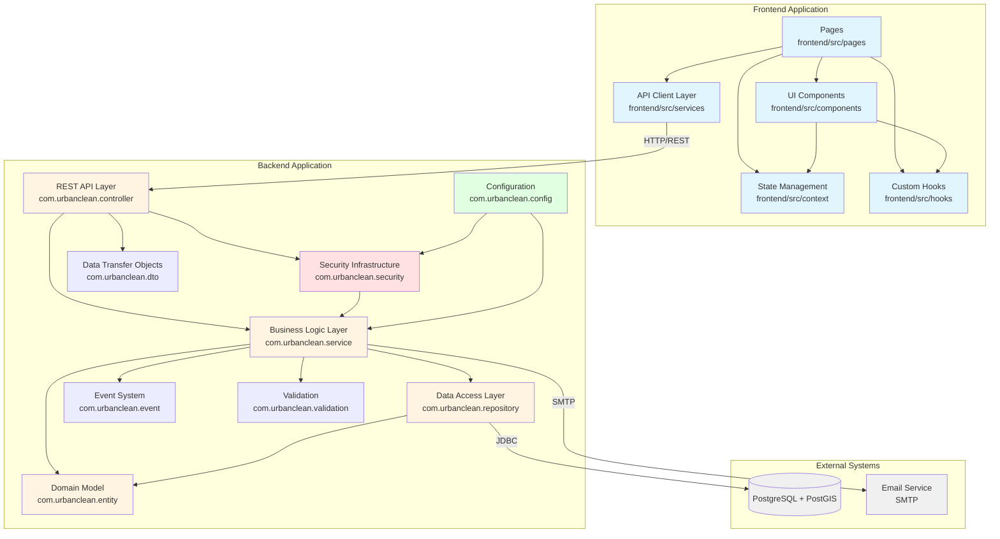
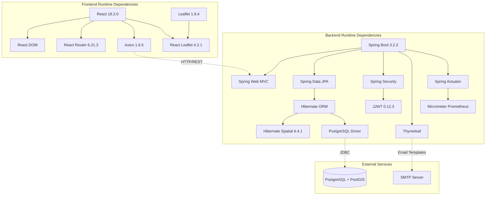

# Implementation View

## Overview

The Implementation View describes the module structure and organization of the Urban Cleaning Management System. This view maps the logical architecture to the physical code organization, showing how packages and directories are structured, how components interface with each other, and how the system integrates external dependencies.

The system follows a layered architecture pattern with clear separation of concerns:

- **Backend**: Spring Boot application organized into functional packages
- **Frontend**: React application organized by feature and responsibility
- **Integration**: Well-defined interfaces between layers and external systems

## Cross-References

This view is closely related to other architectural views:

- **[Logical View - Class Diagram](02-logical-view.md#class-diagram)**: Classes shown in the logical view are organized into the packages documented here
- **[MVC View](04-mvc-view.md)**: MVC components map to specific packages (controller/, entity/, components/)
- **[Data Model View](03-data-model-view.md)**: Entity classes are located in the `com.urbanclean.entity` package
- **[Deployment View](06-deployment-view.md)**: Packages are compiled and deployed in the containers described in the deployment view
- **[Design Decisions](08-design-decisions.md)**: Integration patterns and dependency choices are explained

## Component Diagram

The following diagram shows the high-level component structure derived from the package organization:



### Component Legend

- **Blue**: Frontend components (React)
- **Orange**: Backend core layers (Spring Boot)
- **Red**: Security infrastructure
- **Green**: Configuration components
- **Gray**: External systems

## Backend Package Structure

### Package-to-Component Mapping

| Package | Component | Responsibility |
|---------|-----------|----------------|
| `com.urbanclean.controller` | REST API Layer | HTTP request handling, routing, response formatting |
| `com.urbanclean.service` | Business Logic Layer | Business rules, orchestration, transaction management |
| `com.urbanclean.repository` | Data Access Layer | Database operations, query execution |
| `com.urbanclean.entity` | Domain Model | Domain entities, business objects |
| `com.urbanclean.security` | Security Infrastructure | Authentication, authorization, JWT handling |
| `com.urbanclean.config` | Configuration | Application configuration, bean definitions |
| `com.urbanclean.dto` | Data Transfer Objects | Request/response data structures |
| `com.urbanclean.event` | Event System | Event publishing and handling |
| `com.urbanclean.exception` | Exception Handling | Custom exceptions, global error handling |
| `com.urbanclean.validation` | Validation | Input validation, custom validators |
| `com.urbanclean.util` | Utilities | Helper functions, common utilities |

### Detailed Package Structure

```
backend/src/main/java/com/urbanclean/
├── UrbanCleaningApplication.java          # Application entry point
├── config/                                 # Configuration Layer
│   ├── SecurityConfig.java                # Security configuration
│   ├── OpenAPIConfig.java                 # API documentation config
│   ├── AsyncConfig.java                   # Async processing config
│   ├── CacheConfig.java                   # Caching configuration
│   ├── RateLimitingFilter.java            # Rate limiting
│   ├── ScheduledTasks.java                # Scheduled job configuration
│   ├── DataInitializer.java               # Database initialization
│   └── ActuatorConfig.java                # Monitoring endpoints config
├── controller/                             # REST API Layer
│   ├── AuthController.java                # Authentication endpoints
│   ├── ReportController.java              # Report management endpoints
│   ├── TaskController.java                # Task management endpoints
│   ├── UserController.java                # User management endpoints
│   ├── AnalyticsController.java           # Analytics endpoints
│   ├── FeedbackController.java            # Feedback endpoints
│   ├── ConfigController.java              # Configuration endpoints
│   ├── PasswordResetController.java       # Password reset endpoints
│   ├── SessionController.java             # Session management endpoints
│   ├── NotificationPreferenceController.java
│   ├── NotificationFailureController.java
│   ├── UnsubscribeController.java
│   └── PerformanceMetricsController.java
├── service/                                # Business Logic Layer
│   ├── AuthService.java                   # Authentication logic
│   ├── ReportService.java                 # Report processing
│   ├── TaskService.java                   # Task management
│   ├── UserDataService.java               # User data operations
│   ├── AnalyticsService.java              # Analytics processing
│   ├── FeedbackService.java               # Feedback processing
│   ├── ConfigService.java                 # Configuration management
│   ├── PriorityCalculatorService.java     # Priority calculation
│   ├── DeduplicationService.java          # Duplicate detection
│   ├── GeofencingService.java             # Geofencing validation
│   ├── HeatmapService.java                # Heatmap generation
│   ├── AuditService.java                  # Audit logging
│   ├── EmailService.java                  # Email notifications
│   ├── AlertService.java                  # Alert management
│   ├── PasswordResetService.java          # Password reset logic
│   ├── RefreshTokenService.java           # Token refresh logic
│   ├── TokenBlacklistService.java         # Token invalidation
│   ├── UserSessionService.java            # Session management
│   ├── NotificationPreferenceService.java
│   ├── NotificationFailureService.java
│   ├── FileStorageService.java
│   ├── PerformanceMetricsService.java
│   └── SecurityMonitoringService.java
├── repository/                             # Data Access Layer
│   ├── UserRepository.java
│   ├── ReportRepository.java
│   ├── TaskRepository.java
│   ├── AuditLogRepository.java
│   ├── AlgorithmConfigRepository.java
│   ├── CitizenFeedbackRepository.java
│   ├── PasswordResetTokenRepository.java
│   ├── RefreshTokenRepository.java
│   ├── TokenBlacklistRepository.java
│   ├── UserSessionRepository.java
│   ├── FailedLoginAttemptRepository.java
│   ├── NotificationPreferenceRepository.java
│   └── NotificationFailureRepository.java
├── entity/                                 # Domain Model
│   ├── User.java
│   ├── Report.java
│   ├── Task.java
│   ├── AuditLog.java
│   ├── AlgorithmConfig.java
│   ├── CitizenFeedback.java
│   ├── PasswordResetToken.java
│   ├── RefreshToken.java
│   ├── TokenBlacklist.java
│   ├── UserSession.java
│   ├── FailedLoginAttempt.java
│   ├── NotificationPreference.java
│   ├── NotificationFailure.java
│   ├── UserRole.java                      # Enum
│   ├── TaskState.java                     # Enum
│   └── FeedbackType.java                  # Enum
├── dto/                                    # Data Transfer Objects
│   ├── request/                           # Request DTOs
│   │   ├── LoginRequest.java
│   │   ├── RegisterRequest.java
│   │   ├── ReportSubmissionRequest.java
│   │   ├── TaskStateUpdateRequest.java
│   │   ├── AlgorithmWeightsRequest.java
│   │   ├── AnalyticsFilters.java
│   │   ├── ChangePasswordRequest.java
│   │   ├── DeleteAccountRequest.java
│   │   ├── UpdateProfileRequest.java
│   │   ├── PasswordResetInitiateRequest.java
│   │   ├── PasswordResetCompleteRequest.java
│   │   ├── RefreshTokenRequest.java
│   │   ├── TokenExpirationRequest.java
│   │   ├── NotificationPreferenceRequest.java
│   │   ├── RejectFeedbackRequest.java
│   │   ├── DuplicateDetectionRequest.java
│   │   └── TaskFilterRequest.java
│   └── response/                          # Response DTOs
│       ├── LoginResponse.java
│       ├── ReportResponse.java
│       ├── TaskResponse.java
│       ├── UserProfileResponse.java
│       ├── AlgorithmWeightsResponse.java
│       ├── HeatmapResponse.java
│       ├── MTTRResponse.java
│       ├── OperatorPerformanceResponse.java
│       ├── TaskDistributionResponse.java
│       ├── FeedbackResponse.java
│       ├── AuditLogResponse.java
│       ├── ErrorResponse.java
│       ├── PasswordResetResponse.java
│       ├── RefreshTokenResponse.java
│       ├── TokenExpirationResponse.java
│       ├── UserSessionResponse.java
│       ├── UserDataExport.java
│       ├── NotificationPreferenceResponse.java
│       ├── NotificationFailureResponse.java
│       ├── DuplicateDetectionResponse.java
│       └── PerformanceMetricsResponse.java
├── security/                               # Security Infrastructure
│   ├── JwtTokenProvider.java             # JWT token generation/validation
│   ├── JwtAuthenticationFilter.java      # JWT filter for requests
│   └── UserDetailsServiceImpl.java       # User details loading
├── event/                                  # Event System
│   ├── TaskAssignedEvent.java
│   ├── TaskResolvedEvent.java
│   ├── TaskReopenedEvent.java
│   └── TaskEventListener.java
├── listener/                               # Event Listeners
│   └── TaskAssignmentListener.java
├── exception/                              # Exception Handling
│   ├── GlobalExceptionHandler.java
│   └── custom/
│       ├── AuthenticationException.java
│       ├── ResourceNotFoundException.java
│       ├── ValidationException.java
│       └── InvalidStateTransitionException.java
├── validation/                             # Validation
│   ├── EmailValidator.java
│   ├── PasswordValidator.java
│   ├── ValidEmail.java                    # Annotation
│   └── ValidPassword.java                 # Annotation
├── util/                                   # Utilities
│   └── DeviceFingerprintUtil.java
└── enums/                                  # Enumerations
    └── NotificationType.java
```

## Frontend Directory Structure

### Directory-to-Component Mapping

| Directory | Component | Responsibility |
|-----------|-----------|----------------|
| `frontend/src/components` | UI Components | Reusable UI components organized by feature |
| `frontend/src/pages` | Page Components | Top-level page components for routing |
| `frontend/src/services` | API Client Layer | HTTP client, API service wrappers |
| `frontend/src/context` | State Management | React Context providers for global state |
| `frontend/src/hooks` | Custom Hooks | Reusable React hooks |
| `frontend/src/utils` | Utilities | Helper functions, validators |

### Detailed Frontend Structure

```
frontend/src/
├── main.jsx                               # Application entry point
├── App.jsx                                # Root component with routing
├── components/                            # UI Components
│   ├── common/                           # Shared components
│   │   ├── ProtectedRoute.jsx           # Route protection
│   │   └── UserInfo.jsx                 # User information display
│   ├── citizen/                          # Citizen-specific components
│   │   ├── ReportForm.jsx               # Report submission form
│   │   └── MapView.jsx                  # Map for location selection
│   ├── operator/                         # Operator-specific components
│   │   ├── TaskList.jsx                 # Task list display
│   │   ├── TaskDetail.jsx               # Task detail view
│   │   ├── TaskMap.jsx                  # Task map visualization
│   │   └── AuditTimeline.jsx            # Audit history timeline
│   ├── admin/                            # Admin-specific components
│   │   └── ConfigPanel.jsx              # Configuration panel
│   └── user/                             # User management components
│       └── ActiveSessions.jsx           # Active sessions display
├── pages/                                 # Page Components
│   ├── LoginPage.jsx                     # Login page
│   ├── CitizenReportPage.jsx            # Citizen report submission page
│   ├── OperatorDashboard.jsx            # Operator dashboard
│   ├── AdminConfigPage.jsx              # Admin configuration page
│   └── UserProfile.jsx                   # User profile page
├── services/                              # API Client Layer
│   ├── api.js                            # Axios instance configuration
│   ├── authService.js                    # Authentication API calls
│   ├── reportService.js                  # Report API calls
│   ├── taskService.js                    # Task API calls
│   └── configService.js                  # Configuration API calls
├── context/                               # State Management
│   └── AuthContext.jsx                   # Authentication context
├── hooks/                                 # Custom Hooks
│   └── useGeolocation.js                 # Geolocation hook
└── utils/                                 # Utilities
    └── (utility functions)
```


## Component Interfaces

This section documents the public interfaces of key components, showing their dependencies and provided functionality.

### REST API Layer (Controllers)

Controllers expose HTTP endpoints and depend on service layer components. All controllers follow REST conventions and use DTOs for request/response handling.

#### AuthController
**Dependencies**: `AuthService`, `RefreshTokenService`

**Public Interface**:
```java
POST   /api/auth/login              // Authenticate user
POST   /api/auth/register           // Register new user
POST   /api/auth/refresh            // Refresh access token
POST   /api/auth/logout             // Logout current session
POST   /api/auth/logout-all         // Logout all sessions
```

#### ReportController
**Dependencies**: `ReportService`

**Public Interface**:
```java
POST   /api/reports                 // Submit new report (multipart/form-data)
GET    /api/reports                 // Get all reports (admin/operator)
GET    /api/reports/my              // Get current user's reports
GET    /api/reports/{id}            // Get report by ID
```

#### TaskController
**Dependencies**: `TaskService`, `AuditService`

**Public Interface**:
```java
GET    /api/tasks                   // Get all tasks with filters
GET    /api/tasks/{id}              // Get task by ID
PATCH  /api/tasks/{id}/assign       // Assign task to operator
PATCH  /api/tasks/{id}/state        // Update task state
GET    /api/tasks/{id}/audit        // Get task audit history
```

#### AnalyticsController
**Dependencies**: `AnalyticsService`, `HeatmapService`

**Public Interface**:
```java
GET    /api/analytics/heatmap       // Get heatmap data
GET    /api/analytics/mttr          // Get mean time to resolution
GET    /api/analytics/operator-performance  // Get operator performance metrics
GET    /api/analytics/task-distribution     // Get task distribution by category
```

#### ConfigController
**Dependencies**: `ConfigService`

**Public Interface**:
```java
GET    /api/admin/config/algorithm-weights  // Get current algorithm weights
PUT    /api/admin/config/algorithm-weights  // Update algorithm weights
```

#### UserController
**Dependencies**: `UserDataService`, `PasswordResetService`

**Public Interface**:
```java
GET    /api/users/profile           // Get current user profile
PUT    /api/users/profile           // Update user profile
POST   /api/users/change-password   // Change password
DELETE /api/users/account           // Delete user account
GET    /api/users/data-export       // Export user data (GDPR)
```

### Business Logic Layer (Services)

Services contain business logic and orchestrate operations across multiple repositories and other services.

#### ReportService
**Dependencies**: 
- `ReportRepository`
- `UserRepository`
- `FileStorageService`
- `GeofencingService`
- `TaskService`
- `TaskRepository`
- `DeduplicationService`

**Public Interface**:
```java
Report createReport(ReportSubmissionRequest request, MultipartFile photo)
Report getReportById(UUID id)
List<ReportResponse> getAllReports()
List<ReportResponse> getMyReports()
```

**Functionality**: Report submission, validation, duplicate detection, photo storage

#### TaskService
**Dependencies**:
- `TaskRepository`
- `ReportRepository`
- `UserRepository`
- `PriorityCalculatorService`
- `AuditService`
- `ApplicationEventPublisher`

**Public Interface**:
```java
Task createTask(Report report)
Task getTaskById(UUID id)
List<TaskResponse> getAllTasks(TaskFilterRequest filters)
Task assignTask(UUID taskId, UUID operatorId)
Task updateTaskState(UUID taskId, TaskStateUpdateRequest request)
void recalculateAllPriorities()
```

**Functionality**: Task lifecycle management, state transitions, priority calculation, event publishing

#### AuthService
**Dependencies**:
- `UserRepository`
- `PasswordEncoder`
- `JwtTokenProvider`
- `AuthenticationManager`
- `SecurityMonitoringService`
- `RefreshTokenService`
- `UserSessionService`
- `TokenBlacklistService`

**Public Interface**:
```java
LoginResponse login(String username, String password, HttpServletRequest request)
RefreshTokenResponse refreshAccessToken(String refreshToken, HttpServletRequest request)
void logout(String accessToken, String refreshToken, HttpServletRequest request)
void logoutAll(String accessToken)
User register(RegisterRequest request)
boolean validatePassword(String rawPassword, String encodedPassword)
```

**Functionality**: Authentication, token management, session management, user registration

#### PriorityCalculatorService
**Dependencies**:
- `AlgorithmConfigRepository`

**Public Interface**:
```java
BigDecimal calculatePriority(Report report)
BigDecimal calculatePriority(String category, Point location, LocalDateTime createdAt)
```

**Functionality**: Priority score calculation using configurable weights

**Algorithm**:
```
Priority = (WeightCategory × CategoryValue) + 
           (WeightZone × ZoneRiskIndex) + 
           (WeightTime × HoursElapsed)
```

#### DeduplicationService
**Dependencies**:
- `TaskRepository`
- `ReportRepository`

**Public Interface**:
```java
Optional<Task> checkForDuplicatesBeforeSave(Report report)
List<Task> findPotentialDuplicates(DuplicateDetectionRequest request)
```

**Functionality**: Spatial and temporal duplicate detection using PostGIS

**Detection Criteria**:
- Distance threshold: 100 meters
- Time window: 24 hours
- Same category

#### AnalyticsService
**Dependencies**:
- `TaskRepository`
- `ReportRepository`

**Public Interface**:
```java
MTTRResponse calculateMTTR(AnalyticsFilters filters)
List<OperatorPerformanceResponse> getOperatorPerformance(AnalyticsFilters filters)
List<TaskDistributionResponse> getTaskDistribution(AnalyticsFilters filters)
```

**Functionality**: Analytics calculations, performance metrics, statistical analysis

#### EmailService
**Dependencies**:
- `JavaMailSender`
- `TemplateEngine` (Thymeleaf)

**Public Interface**:
```java
void sendPasswordResetEmail(String to, String resetToken)
void sendTaskAssignedEmail(Task task, User operator)
void sendTaskResolvedEmail(Task task, User citizen)
void sendTaskReopenedEmail(Task task, User operator)
void sendAccountDeletionEmail(String to, String username)
```

**Functionality**: Email notifications using HTML templates

### Data Access Layer (Repositories)

Repositories extend Spring Data JPA interfaces and provide database access with custom queries.

#### TaskRepository
**Extends**: `JpaRepository<Task, UUID>`

**Custom Queries**:
```java
List<Task> findByState(TaskState state)
List<Task> findByAssignedOperator(User operator)
List<Task> findByStateAndAssignedOperator(TaskState state, User operator)
@Query("SELECT t FROM Task t WHERE t.location IS NOT NULL")
List<Task> findAllWithLocation()
@Query("SELECT t FROM Task t WHERE t.state = :state AND t.createdAt >= :startDate")
List<Task> findByStateAndCreatedAtAfter(TaskState state, LocalDateTime startDate)
```

#### ReportRepository
**Extends**: `JpaRepository<Report, UUID>`

**Custom Queries**:
```java
List<Report> findBySubmitter(User submitter)
@Query("SELECT r FROM Report r WHERE r.isDuplicate = false")
List<Report> findNonDuplicateReports()
```

#### UserRepository
**Extends**: `JpaRepository<User, UUID>`

**Custom Queries**:
```java
Optional<User> findByUsername(String username)
Optional<User> findByEmail(String email)
boolean existsByUsername(String username)
boolean existsByEmail(String email)
List<User> findByRole(UserRole role)
```

### Security Infrastructure

#### JwtTokenProvider
**Dependencies**: None (utility component)

**Public Interface**:
```java
String generateToken(String username, UUID userId, UserRole role, Integer tokenVersion)
String getUsernameFromToken(String token)
UUID getUserIdFromToken(String token)
Integer getTokenVersionFromToken(String token)
boolean validateToken(String token)
Date getExpirationDateFromToken(String token)
```

**Functionality**: JWT token generation, validation, and claim extraction

#### JwtAuthenticationFilter
**Dependencies**: `JwtTokenProvider`, `UserDetailsService`, `TokenBlacklistService`

**Functionality**: 
- Intercepts HTTP requests
- Extracts JWT from Authorization header
- Validates token and checks blacklist
- Sets authentication in SecurityContext

### Event System

#### ApplicationEventPublisher (Spring Framework)
**Used by**: `TaskService`

**Published Events**:
- `TaskAssignedEvent`: When task is assigned to operator
- `TaskResolvedEvent`: When task is marked as resolved
- `TaskReopenedEvent`: When task is reopened

#### TaskEventListener
**Dependencies**: `EmailService`, `NotificationPreferenceService`

**Event Handlers**:
```java
@EventListener
void handleTaskAssigned(TaskAssignedEvent event)

@EventListener
void handleTaskResolved(TaskResolvedEvent event)

@EventListener
void handleTaskReopened(TaskReopenedEvent event)
```

**Functionality**: Sends email notifications when task events occur

### Frontend API Client Layer

#### api.js (Axios Configuration)
**Dependencies**: `axios`

**Configuration**:
```javascript
const api = axios.create({
  baseURL: process.env.REACT_APP_API_URL || 'http://localhost:8080/api',
  headers: { 'Content-Type': 'application/json' }
});

// Request interceptor: Add JWT token
api.interceptors.request.use((config) => {
  const token = localStorage.getItem('token');
  if (token) {
    config.headers.Authorization = `Bearer ${token}`;
  }
  return config;
});

// Response interceptor: Handle 401 errors
api.interceptors.response.use(
  (response) => response,
  (error) => {
    if (error.response?.status === 401) {
      // Redirect to login
    }
    return Promise.reject(error);
  }
);
```

#### authService.js
**Dependencies**: `api.js`

**Public Interface**:
```javascript
async login(username, password)
async register(username, email, password, role)
async refreshToken(refreshToken)
async logout(accessToken, refreshToken)
async logoutAll(accessToken)
```

#### taskService.js
**Dependencies**: `api.js`

**Public Interface**:
```javascript
async getTasks(filters)
async getTaskById(id)
async assignTask(taskId, operatorId)
async updateTaskState(taskId, state, evidence)
async getTaskAuditHistory(taskId)
```

#### reportService.js
**Dependencies**: `api.js`

**Public Interface**:
```javascript
async submitReport(reportData, photoFile)
async getMyReports()
async getReportById(id)
```


## Module Integration Patterns

The system employs several well-established integration patterns to achieve loose coupling, maintainability, and testability.

### 1. Dependency Injection Pattern

**Implementation**: Spring Framework's Dependency Injection (Constructor Injection)

**Description**: Components declare their dependencies through constructor parameters, and Spring automatically provides (injects) the required instances at runtime.

**Benefits**:
- Loose coupling between components
- Easy to test (can inject mocks)
- Clear dependency declaration
- Immutable dependencies (final fields)

**Example**:
```java
@Service
@RequiredArgsConstructor  // Lombok generates constructor
public class ReportService {
    // Dependencies declared as final fields
    private final ReportRepository reportRepository;
    private final UserRepository userRepository;
    private final FileStorageService fileStorageService;
    private final GeofencingService geofencingService;
    private final TaskService taskService;
    private final DeduplicationService deduplicationService;
    
    // Spring automatically injects all dependencies via constructor
    // No @Autowired annotation needed with constructor injection
}
```

**Configuration**:
```java
@Configuration
public class SecurityConfig {
    @Bean
    public PasswordEncoder passwordEncoder() {
        return new BCryptPasswordEncoder();
    }
    
    @Bean
    public AuthenticationManager authenticationManager(
            AuthenticationConfiguration config) throws Exception {
        return config.getAuthenticationManager();
    }
}
```

**Dependency Graph Example**:
```
ReportController
    └─> ReportService
            ├─> ReportRepository (Spring Data JPA)
            ├─> UserRepository (Spring Data JPA)
            ├─> FileStorageService
            ├─> GeofencingService
            ├─> TaskService
            │       ├─> TaskRepository
            │       ├─> PriorityCalculatorService
            │       ├─> AuditService
            │       └─> ApplicationEventPublisher
            └─> DeduplicationService
                    ├─> TaskRepository
                    └─> ReportRepository
```

### 2. Repository Pattern

**Implementation**: Spring Data JPA

**Description**: Repositories provide an abstraction layer over data access, encapsulating database operations and queries. The pattern separates business logic from data access logic.

**Benefits**:
- Abstraction over database operations
- Automatic CRUD implementation
- Custom query support
- Transaction management
- Easy to mock for testing

**Example**:
```java
// Repository interface - Spring Data JPA generates implementation
@Repository
public interface TaskRepository extends JpaRepository<Task, UUID> {
    // Spring generates implementation for standard CRUD operations
    // save(), findById(), findAll(), delete(), etc.
    
    // Custom query methods - Spring generates implementation from method name
    List<Task> findByState(TaskState state);
    List<Task> findByAssignedOperator(User operator);
    
    // Custom JPQL query
    @Query("SELECT t FROM Task t WHERE t.state = :state AND t.createdAt >= :startDate")
    List<Task> findByStateAndCreatedAtAfter(
        @Param("state") TaskState state, 
        @Param("startDate") LocalDateTime startDate
    );
    
    // Native SQL query with PostGIS
    @Query(value = """
        SELECT * FROM tareas t 
        WHERE ST_DWithin(t.location::geography, 
                        ST_SetSRID(ST_MakePoint(:longitude, :latitude), 4326)::geography, 
                        :radiusMeters)
        AND t.category = :category
        AND t.created_at >= :since
        """, nativeQuery = true)
    List<Task> findNearbyTasks(
        @Param("latitude") Double latitude,
        @Param("longitude") Double longitude,
        @Param("radiusMeters") Double radiusMeters,
        @Param("category") String category,
        @Param("since") LocalDateTime since
    );
}
```

**Usage in Service Layer**:
```java
@Service
@RequiredArgsConstructor
public class TaskService {
    private final TaskRepository taskRepository;
    
    @Transactional(readOnly = true)
    public List<Task> getPendingTasks() {
        // Repository abstracts database access
        return taskRepository.findByState(TaskState.PENDIENTE);
    }
    
    @Transactional
    public Task assignTask(UUID taskId, UUID operatorId) {
        Task task = taskRepository.findById(taskId)
            .orElseThrow(() -> new ResourceNotFoundException("Task not found"));
        
        // Business logic
        task.setAssignedOperator(operator);
        task.setState(TaskState.ASIGNADO);
        
        // Repository handles persistence
        return taskRepository.save(task);
    }
}
```

### 3. Event-Driven Pattern

**Implementation**: Spring Application Events

**Description**: Components communicate through events rather than direct method calls, achieving loose coupling. Event publishers don't need to know about event consumers.

**Benefits**:
- Loose coupling between components
- Easy to add new event handlers
- Asynchronous processing support
- Single Responsibility Principle

**Event Definition**:
```java
@Getter
public class TaskAssignedEvent extends ApplicationEvent {
    private final Task task;
    private final User operator;
    
    public TaskAssignedEvent(Object source, Task task, User operator) {
        super(source);
        this.task = task;
        this.operator = operator;
    }
}
```

**Event Publishing** (in TaskService):
```java
@Service
@RequiredArgsConstructor
public class TaskService {
    private final ApplicationEventPublisher eventPublisher;
    private final TaskRepository taskRepository;
    
    @Transactional
    public Task assignTask(UUID taskId, UUID operatorId) {
        Task task = taskRepository.findById(taskId)
            .orElseThrow(() -> new ResourceNotFoundException("Task not found"));
        
        User operator = userRepository.findById(operatorId)
            .orElseThrow(() -> new ResourceNotFoundException("Operator not found"));
        
        task.setAssignedOperator(operator);
        task.setState(TaskState.ASIGNADO);
        Task savedTask = taskRepository.save(task);
        
        // Publish event - TaskService doesn't know who will handle it
        eventPublisher.publishEvent(new TaskAssignedEvent(this, savedTask, operator));
        
        return savedTask;
    }
}
```

**Event Handling** (in TaskEventListener):
```java
@Component
@RequiredArgsConstructor
@Slf4j
public class TaskEventListener {
    private final EmailService emailService;
    private final NotificationPreferenceService notificationPreferenceService;
    
    @EventListener
    @Async  // Process asynchronously to not block main thread
    public void handleTaskAssigned(TaskAssignedEvent event) {
        Task task = event.getTask();
        User operator = event.getOperator();
        
        log.info("Task {} assigned to operator {}", task.getId(), operator.getUsername());
        
        // Check notification preferences
        if (notificationPreferenceService.isEmailEnabled(operator.getId())) {
            emailService.sendTaskAssignedEmail(task, operator);
        }
    }
    
    @EventListener
    @Async
    public void handleTaskResolved(TaskResolvedEvent event) {
        Task task = event.getTask();
        
        if (task.getReport().getSubmitter() != null) {
            User citizen = task.getReport().getSubmitter();
            if (notificationPreferenceService.isEmailEnabled(citizen.getId())) {
                emailService.sendTaskResolvedEmail(task, citizen);
            }
        }
    }
}
```

**Event Flow**:
```
TaskController.assignTask()
    └─> TaskService.assignTask()
            ├─> Update task state
            ├─> Save to database
            └─> Publish TaskAssignedEvent
                    └─> TaskEventListener.handleTaskAssigned() [Async]
                            └─> EmailService.sendTaskAssignedEmail()
```

### 4. Layered Architecture Pattern

**Implementation**: Three-tier architecture with clear layer boundaries

**Description**: The system is organized into distinct layers, each with specific responsibilities. Dependencies flow downward (presentation → business → data).

**Layers**:

1. **Presentation Layer** (Controllers)
   - HTTP request/response handling
   - Input validation
   - DTO mapping
   - Security enforcement

2. **Business Logic Layer** (Services)
   - Business rules implementation
   - Transaction management
   - Orchestration of operations
   - Event publishing

3. **Data Access Layer** (Repositories)
   - Database operations
   - Query execution
   - Entity persistence

**Layer Communication Rules**:
- Controllers can only call Services (not Repositories directly)
- Services can call Repositories and other Services
- Repositories only interact with the database
- No circular dependencies between layers

**Example Flow**:
```
HTTP Request
    ↓
[Presentation Layer]
ReportController.createReport()
    ├─> Validate request DTO
    ├─> Extract multipart file
    └─> Call ReportService.createReport()
        ↓
[Business Logic Layer]
ReportService.createReport()
    ├─> Validate business rules
    ├─> Call GeofencingService.validateCoordinates()
    ├─> Call FileStorageService.storeFile()
    ├─> Call DeduplicationService.checkForDuplicates()
    ├─> Call ReportRepository.save()
    └─> Call TaskService.createTask()
        ↓
[Data Access Layer]
ReportRepository.save()
    └─> JPA/Hibernate persists to PostgreSQL
        ↓
HTTP Response (ReportResponse DTO)
```

**Layer Isolation Example**:
```java
// ❌ BAD: Controller directly accessing Repository
@RestController
public class TaskController {
    private final TaskRepository taskRepository;  // WRONG!
    
    @GetMapping("/api/tasks")
    public List<Task> getTasks() {
        return taskRepository.findAll();  // Bypasses business logic
    }
}

// ✅ GOOD: Controller calls Service, Service uses Repository
@RestController
@RequiredArgsConstructor
public class TaskController {
    private final TaskService taskService;  // Correct!
    
    @GetMapping("/api/tasks")
    public List<TaskResponse> getTasks(@RequestParam TaskFilterRequest filters) {
        return taskService.getAllTasks(filters);  // Business logic applied
    }
}
```

### 5. DTO Pattern (Data Transfer Object)

**Implementation**: Separate request/response DTOs

**Description**: DTOs are used to transfer data between layers, keeping entities isolated from external interfaces. This prevents exposing internal domain model structure.

**Benefits**:
- Decouples API contract from domain model
- Prevents over-fetching/under-fetching
- Allows different representations for different use cases
- Protects sensitive entity fields

**Example**:
```java
// Entity (Domain Model) - Internal representation
@Entity
@Table(name = "usuarios")
public class User {
    @Id
    private UUID id;
    private String username;
    private String email;
    private String passwordHash;  // Never expose in API!
    private UserRole role;
    private Integer tokenVersion;  // Internal security field
    private LocalDateTime createdAt;
}

// Request DTO - What client sends
@Data
public class RegisterRequest {
    @NotBlank
    private String username;
    
    @Email
    private String email;
    
    @ValidPassword
    private String password;  // Plain text, will be hashed
    
    private UserRole role;
}

// Response DTO - What client receives
@Data
@Builder
public class UserProfileResponse {
    private UUID id;
    private String username;
    private String email;
    private UserRole role;
    private LocalDateTime createdAt;
    // passwordHash and tokenVersion NOT included!
}
```

**Mapping in Service Layer**:
```java
@Service
public class UserDataService {
    public UserProfileResponse getUserProfile(UUID userId) {
        User user = userRepository.findById(userId)
            .orElseThrow(() -> new ResourceNotFoundException("User not found"));
        
        // Map Entity to Response DTO
        return UserProfileResponse.builder()
            .id(user.getId())
            .username(user.getUsername())
            .email(user.getEmail())
            .role(user.getRole())
            .createdAt(user.getCreatedAt())
            .build();
    }
}
```

### 6. Transaction Management Pattern

**Implementation**: Spring `@Transactional` annotation

**Description**: Declarative transaction management ensures data consistency and automatic rollback on errors.

**Example**:
```java
@Service
@RequiredArgsConstructor
public class ReportService {
    
    @Transactional  // Entire method runs in a transaction
    public Report createReport(ReportSubmissionRequest request, MultipartFile photo) {
        // 1. Store file
        String photoUrl = fileStorageService.storeFile(photo);
        
        // 2. Save report
        Report report = reportRepository.save(newReport);
        
        // 3. Create task
        taskService.createTask(report);
        
        // If any step fails, entire transaction rolls back
        return report;
    }
    
    @Transactional(readOnly = true)  // Optimization for read-only operations
    public List<Report> getAllReports() {
        return reportRepository.findAll();
    }
}
```

### 7. Filter Chain Pattern

**Implementation**: Spring Security Filter Chain

**Description**: HTTP requests pass through a chain of filters for cross-cutting concerns (authentication, rate limiting, logging).

**Filter Chain**:
```
HTTP Request
    ↓
[RateLimitingFilter]
    ├─> Check rate limit
    ├─> Allow or reject request
    ↓
[JwtAuthenticationFilter]
    ├─> Extract JWT from header
    ├─> Validate token
    ├─> Check token blacklist
    ├─> Set SecurityContext
    ↓
[Spring Security Filters]
    ├─> Authorization checks
    ├─> CSRF protection
    ↓
[Controller]
    └─> Handle request
```

**Filter Implementation**:
```java
@Component
@RequiredArgsConstructor
public class JwtAuthenticationFilter extends OncePerRequestFilter {
    private final JwtTokenProvider jwtTokenProvider;
    private final UserDetailsService userDetailsService;
    private final TokenBlacklistService tokenBlacklistService;
    
    @Override
    protected void doFilterInternal(HttpServletRequest request, 
                                   HttpServletResponse response, 
                                   FilterChain filterChain) {
        // Extract token from header
        String token = extractTokenFromRequest(request);
        
        if (token != null && jwtTokenProvider.validateToken(token)) {
            // Check if token is blacklisted
            if (!tokenBlacklistService.isBlacklisted(token)) {
                // Set authentication in SecurityContext
                Authentication auth = getAuthentication(token);
                SecurityContextHolder.getContext().setAuthentication(auth);
            }
        }
        
        // Continue filter chain
        filterChain.doFilter(request, response);
    }
}
```

### Integration Pattern Summary

| Pattern | Purpose | Implementation | Benefits |
|---------|---------|----------------|----------|
| Dependency Injection | Component wiring | Spring Framework | Loose coupling, testability |
| Repository | Data access abstraction | Spring Data JPA | Clean separation, query abstraction |
| Event-Driven | Asynchronous communication | Spring Events | Loose coupling, extensibility |
| Layered Architecture | Separation of concerns | 3-tier structure | Maintainability, clear boundaries |
| DTO | Data transfer | Request/Response classes | API decoupling, security |
| Transaction Management | Data consistency | @Transactional | ACID guarantees, automatic rollback |
| Filter Chain | Request processing | Spring Security | Cross-cutting concerns, security |


## External Dependencies

This section documents all external libraries and frameworks used by the system, organized by category and purpose.

### Backend Dependencies (Maven/pom.xml)

#### Core Framework

**Spring Boot 3.2.2**
- **Artifact**: `spring-boot-starter-parent`
- **Purpose**: Core framework providing dependency management, auto-configuration, and production-ready features
- **Key Features**: Embedded server, dependency injection, auto-configuration
- **Source**: `backend/pom.xml` (parent declaration)

**Java 17**
- **Purpose**: Programming language and runtime environment
- **Features Used**: Records, sealed classes, pattern matching, text blocks
- **Source**: `backend/pom.xml` (java.version property)

#### Spring Boot Starters

**spring-boot-starter-web**
- **Purpose**: Web application development with Spring MVC
- **Provides**: Embedded Tomcat, Spring MVC, Jackson JSON
- **Usage**: REST API implementation, HTTP request handling

**spring-boot-starter-data-jpa**
- **Purpose**: Data persistence with JPA/Hibernate
- **Provides**: Hibernate ORM, Spring Data JPA, transaction management
- **Usage**: Repository pattern, entity management, database operations

**spring-boot-starter-security**
- **Purpose**: Authentication and authorization
- **Provides**: Spring Security framework, password encoding, security filters
- **Usage**: JWT authentication, role-based access control, endpoint security

**spring-boot-starter-validation**
- **Purpose**: Bean validation
- **Provides**: Hibernate Validator, JSR-380 validation
- **Usage**: Request DTO validation, custom validators

**spring-boot-starter-mail**
- **Purpose**: Email sending functionality
- **Provides**: JavaMail API, Spring mail support
- **Usage**: Email notifications (task assignments, password reset)

**spring-boot-starter-thymeleaf**
- **Purpose**: HTML template engine
- **Provides**: Thymeleaf template engine
- **Usage**: HTML email templates

**spring-boot-starter-actuator**
- **Purpose**: Production monitoring and management
- **Provides**: Health checks, metrics, info endpoints
- **Usage**: Application health monitoring, operational metrics

**spring-boot-starter-cache**
- **Purpose**: Caching abstraction
- **Provides**: Spring Cache abstraction, in-memory caching
- **Usage**: Analytics query caching

#### Database

**PostgreSQL Driver**
- **Artifact**: `org.postgresql:postgresql` (runtime scope)
- **Version**: Managed by Spring Boot (42.7.1)
- **Purpose**: JDBC driver for PostgreSQL database
- **Usage**: Database connectivity

**Hibernate Spatial 6.4.1.Final**
- **Artifact**: `org.hibernate.orm:hibernate-spatial`
- **Purpose**: Spatial data type support for PostGIS
- **Provides**: JTS geometry types, spatial query support
- **Usage**: Location-based queries, geofencing, duplicate detection
- **Key Types**: `Point`, `Geometry`, spatial functions

#### Security

**JJWT 0.12.3**
- **Artifacts**: 
  - `io.jsonwebtoken:jjwt-api` (API)
  - `io.jsonwebtoken:jjwt-impl` (Implementation)
  - `io.jsonwebtoken:jjwt-jackson` (JSON processing)
- **Purpose**: JWT token generation and validation
- **Usage**: Access tokens, refresh tokens, token claims
- **Algorithms**: HS512 for signing

#### Monitoring and Observability

**Micrometer Prometheus Registry**
- **Artifact**: `io.micrometer:micrometer-registry-prometheus`
- **Purpose**: Metrics collection and export to Prometheus
- **Usage**: Performance metrics, custom metrics, monitoring

**Resilience4j 2.1.0**
- **Artifact**: `io.github.resilience4j:resilience4j-spring-boot3`
- **Purpose**: Fault tolerance patterns
- **Provides**: Circuit breaker, rate limiter, retry, bulkhead
- **Usage**: Email service circuit breaker, external service resilience

#### API Documentation

**SpringDoc OpenAPI 2.3.0**
- **Artifact**: `org.springdoc:springdoc-openapi-starter-webmvc-ui`
- **Purpose**: OpenAPI 3.0 specification generation
- **Provides**: Swagger UI, API documentation
- **Usage**: Interactive API documentation at `/swagger-ui.html`

#### Utilities

**Lombok**
- **Artifact**: `org.projectlombok:lombok` (optional, compile-time)
- **Purpose**: Boilerplate code reduction
- **Annotations Used**: `@Data`, `@Builder`, `@RequiredArgsConstructor`, `@Slf4j`
- **Usage**: Entity classes, DTOs, services

**Spring Retry**
- **Artifact**: `org.springframework.retry:spring-retry`
- **Purpose**: Retry logic for transient failures
- **Usage**: Email sending retry, external service calls

**Spring Aspects**
- **Artifact**: `org.springframework:spring-aspects`
- **Purpose**: AspectJ support for AOP
- **Usage**: Retry annotations, transaction management

**UA Parser 1.6.1**
- **Artifact**: `com.github.ua-parser:uap-java`
- **Purpose**: User agent string parsing
- **Usage**: Device fingerprinting, session management

#### Testing

**spring-boot-starter-test**
- **Purpose**: Testing framework
- **Provides**: JUnit 5, Mockito, AssertJ, Spring Test
- **Usage**: Unit tests, integration tests

**spring-security-test**
- **Purpose**: Security testing utilities
- **Provides**: `@WithMockUser`, security test support
- **Usage**: Controller security testing

**JUnit QuickCheck 1.0**
- **Artifacts**:
  - `com.pholser:junit-quickcheck-core`
  - `com.pholser:junit-quickcheck-generators`
- **Purpose**: Property-based testing
- **Usage**: Token rotation property tests, validation property tests

### Frontend Dependencies (npm/package.json)

#### Core Framework

**React 18.2.0**
- **Package**: `react`, `react-dom`
- **Purpose**: UI library for building component-based interfaces
- **Features Used**: Hooks, Context API, functional components
- **Usage**: All UI components, state management

**React Router DOM 6.21.3**
- **Package**: `react-router-dom`
- **Purpose**: Client-side routing
- **Usage**: Page navigation, protected routes, route parameters

#### HTTP Client

**Axios 1.6.5**
- **Package**: `axios`
- **Purpose**: Promise-based HTTP client
- **Features Used**: Interceptors, request/response transformation
- **Usage**: API calls, JWT token injection, error handling

#### Mapping

**Leaflet 1.9.4**
- **Package**: `leaflet`
- **Purpose**: Interactive map library
- **Usage**: Map display, marker placement, location selection

**React Leaflet 4.2.1**
- **Package**: `react-leaflet`
- **Purpose**: React components for Leaflet
- **Usage**: Map integration in React components

#### Utilities

**PropTypes 15.8.1**
- **Package**: `prop-types`
- **Purpose**: Runtime type checking for React props
- **Usage**: Component prop validation

#### Build Tools

**Vite 5.0.11**
- **Package**: `vite` (dev dependency)
- **Purpose**: Fast build tool and dev server
- **Features**: Hot module replacement, optimized builds
- **Usage**: Development server, production builds

**@vitejs/plugin-react 4.2.1**
- **Package**: `@vitejs/plugin-react` (dev dependency)
- **Purpose**: React support for Vite
- **Usage**: JSX transformation, Fast Refresh

#### Code Quality

**ESLint 8.56.0**
- **Packages**: `eslint`, `eslint-plugin-react`, `eslint-plugin-react-hooks`
- **Purpose**: JavaScript linting
- **Usage**: Code quality enforcement, style checking

#### Testing

**React Testing Library**
- **Packages**: 
  - `@testing-library/react` 14.1.2
  - `@testing-library/jest-dom` 6.2.0
  - `@testing-library/user-event` 14.5.2
- **Purpose**: React component testing
- **Usage**: Component unit tests, integration tests

### External Services

#### PostgreSQL + PostGIS
- **Version**: PostgreSQL 15 + PostGIS 3.3
- **Container**: `postgis/postgis:15-3.3`
- **Purpose**: Relational database with spatial extensions
- **Features Used**:
  - Relational data storage
  - Spatial queries (ST_DWithin, ST_Distance)
  - Geometry types (Point, Polygon)
  - Spatial indexes (GIST)
- **Source**: `docker/docker-compose.yml`

#### SMTP Server (Email)
- **Purpose**: Email delivery
- **Configuration**: Via environment variables
  - `SPRING_MAIL_HOST`
  - `SPRING_MAIL_PORT`
  - `SPRING_MAIL_USERNAME`
  - `SPRING_MAIL_PASSWORD`
- **Usage**: Notification emails, password reset emails
- **Source**: `backend/src/main/resources/application.properties`

### Dependency Graph



### Dependency Management

**Backend (Maven)**:
- Parent POM: `spring-boot-starter-parent` manages versions
- Explicit versions only for non-Spring dependencies
- Dependency scope: `runtime` for drivers, `test` for testing libraries
- Source: `backend/pom.xml`

**Frontend (npm)**:
- Package manager: npm
- Lock file: `package-lock.json` ensures reproducible builds
- Dev dependencies separated from runtime dependencies
- Source: `frontend/package.json`

### Version Compatibility Matrix

| Component | Version | Compatible With |
|-----------|---------|-----------------|
| Java | 17 | Spring Boot 3.2.2 |
| Spring Boot | 3.2.2 | Java 17+ |
| Hibernate | 6.4.x | Spring Boot 3.2.2 |
| PostgreSQL | 15 | Hibernate Spatial 6.4.1 |
| PostGIS | 3.3 | PostgreSQL 15 |
| React | 18.2.0 | React Router 6.x |
| Node.js | 18+ | Vite 5.x |

### Security Considerations

**Dependency Scanning**:
- Regular updates for security patches
- Vulnerability scanning recommended
- Keep Spring Boot and dependencies up to date

**Known Secure Versions**:
- JJWT 0.12.3: Latest stable, no known vulnerabilities
- Spring Boot 3.2.2: Includes security patches
- PostgreSQL 15: Long-term support version


## Component Responsibilities

This section provides a detailed breakdown of each major component's purpose, key classes, and boundaries.

### Backend Components

#### 1. Configuration Component (`com.urbanclean.config`)

**Purpose**: Application configuration, bean definitions, and infrastructure setup

**Key Classes**:
- `SecurityConfig`: Security configuration, authentication, authorization
- `OpenAPIConfig`: API documentation configuration
- `AsyncConfig`: Asynchronous processing configuration
- `CacheConfig`: Caching strategy configuration
- `RateLimitingFilter`: Rate limiting implementation
- `ScheduledTasks`: Scheduled job definitions
- `DataInitializer`: Database initialization and seed data
- `ActuatorConfig`: Monitoring endpoint configuration

**Responsibilities**:
- Define Spring beans (PasswordEncoder, AuthenticationManager)
- Configure security rules and filters
- Set up async thread pools
- Configure caching strategies
- Initialize application data
- Configure monitoring endpoints

**Boundaries**:
- Does not contain business logic
- Provides infrastructure components to other layers
- Configuration only, no data processing

**Dependencies**: Spring Framework, Spring Security, Spring Boot Actuator

---

#### 2. REST API Layer (`com.urbanclean.controller`)

**Purpose**: HTTP request handling, routing, and response formatting

**Key Classes**:
- `AuthController`: Authentication endpoints (login, register, logout)
- `ReportController`: Report submission and retrieval
- `TaskController`: Task management operations
- `UserController`: User profile and account management
- `AnalyticsController`: Analytics and reporting endpoints
- `FeedbackController`: Citizen feedback management
- `ConfigController`: System configuration (admin only)
- `PasswordResetController`: Password reset workflow
- `SessionController`: Session management
- `NotificationPreferenceController`: Notification settings
- `PerformanceMetricsController`: Performance monitoring

**Responsibilities**:
- Validate HTTP requests
- Map requests to DTOs
- Call appropriate service methods
- Map responses to DTOs
- Handle HTTP status codes
- Apply security annotations (@PreAuthorize)
- Document endpoints (@Operation, @ApiResponse)

**Boundaries**:
- No business logic (delegates to services)
- No direct database access (uses services)
- Only handles HTTP concerns
- Returns DTOs, never entities

**Dependencies**: Service layer, DTO classes, Spring Web MVC

**Example Responsibility Flow**:
```
HTTP POST /api/reports
    ↓
ReportController.createReport()
    ├─> Validate multipart request
    ├─> Extract ReportSubmissionRequest DTO
    ├─> Extract MultipartFile
    ├─> Call ReportService.createReport()
    ├─> Map Report entity to ReportResponse DTO
    └─> Return HTTP 201 Created with ReportResponse
```

---

#### 3. Business Logic Layer (`com.urbanclean.service`)

**Purpose**: Business rules, orchestration, and transaction management

**Key Classes**:

**Core Services**:
- `ReportService`: Report processing, validation, duplicate detection coordination
- `TaskService`: Task lifecycle, state transitions, priority management
- `AuthService`: Authentication, token management, user registration

**Supporting Services**:
- `PriorityCalculatorService`: Priority score calculation algorithm
- `DeduplicationService`: Spatial/temporal duplicate detection
- `GeofencingService`: Coordinate validation, spatial operations
- `HeatmapService`: Heatmap data generation
- `AnalyticsService`: Statistical analysis, performance metrics
- `AuditService`: Audit log creation and retrieval
- `EmailService`: Email notification sending
- `AlertService`: Alert generation and management

**Infrastructure Services**:
- `FileStorageService`: File upload/storage management
- `PasswordResetService`: Password reset token management
- `RefreshTokenService`: Refresh token lifecycle
- `TokenBlacklistService`: Token revocation
- `UserSessionService`: Session tracking
- `SecurityMonitoringService`: Security event logging
- `NotificationPreferenceService`: User notification preferences
- `NotificationFailureService`: Failed notification tracking
- `PerformanceMetricsService`: Performance data collection

**Responsibilities**:
- Implement business rules and validation
- Orchestrate operations across multiple repositories
- Manage transactions (@Transactional)
- Publish domain events
- Transform entities to DTOs
- Coordinate between multiple services
- Handle business exceptions

**Boundaries**:
- No HTTP concerns (doesn't know about requests/responses)
- No direct SQL (uses repositories)
- Focuses on business logic only
- Can call other services and repositories

**Dependencies**: Repository layer, other services, event publisher

**Example Responsibility**:
```java
// ReportService orchestrates multiple operations
@Transactional
public Report createReport(ReportSubmissionRequest request, MultipartFile photo) {
    // 1. Business validation
    validateReportRequest(request);
    
    // 2. Coordinate with GeofencingService
    geofencingService.validateCoordinates(request.getLatitude(), request.getLongitude());
    
    // 3. Coordinate with FileStorageService
    String photoUrl = fileStorageService.storeFile(photo);
    
    // 4. Check for duplicates (DeduplicationService)
    Optional<Task> parentTask = deduplicationService.checkForDuplicates(report);
    
    // 5. Save to database (Repository)
    Report savedReport = reportRepository.save(report);
    
    // 6. Create task if not duplicate (TaskService)
    if (parentTask.isEmpty()) {
        taskService.createTask(savedReport);
    }
    
    return savedReport;
}
```

---

#### 4. Data Access Layer (`com.urbanclean.repository`)

**Purpose**: Database operations and query execution

**Key Interfaces**:
- `UserRepository`: User CRUD and queries
- `ReportRepository`: Report persistence
- `TaskRepository`: Task queries, spatial queries
- `AuditLogRepository`: Audit log storage
- `AlgorithmConfigRepository`: Configuration persistence
- `CitizenFeedbackRepository`: Feedback storage
- `PasswordResetTokenRepository`: Token management
- `RefreshTokenRepository`: Refresh token storage
- `TokenBlacklistRepository`: Blacklisted token storage
- `UserSessionRepository`: Session tracking
- `FailedLoginAttemptRepository`: Security monitoring
- `NotificationPreferenceRepository`: User preferences
- `NotificationFailureRepository`: Failed notification tracking

**Responsibilities**:
- Provide CRUD operations (inherited from JpaRepository)
- Define custom query methods
- Execute JPQL queries
- Execute native SQL queries (especially for PostGIS)
- Manage entity persistence

**Boundaries**:
- No business logic
- No transaction management (handled by service layer)
- Only data access operations
- Returns entities, not DTOs

**Dependencies**: JPA/Hibernate, entity classes

**Example Custom Queries**:
```java
@Repository
public interface TaskRepository extends JpaRepository<Task, UUID> {
    // Method name query
    List<Task> findByState(TaskState state);
    
    // JPQL query
    @Query("SELECT t FROM Task t WHERE t.state = :state AND t.createdAt >= :startDate")
    List<Task> findByStateAndCreatedAtAfter(
        @Param("state") TaskState state, 
        @Param("startDate") LocalDateTime startDate
    );
    
    // Native SQL with PostGIS
    @Query(value = """
        SELECT * FROM tareas t 
        WHERE ST_DWithin(t.location::geography, 
                        ST_SetSRID(ST_MakePoint(:longitude, :latitude), 4326)::geography, 
                        :radiusMeters)
        """, nativeQuery = true)
    List<Task> findNearbyTasks(
        @Param("latitude") Double latitude,
        @Param("longitude") Double longitude,
        @Param("radiusMeters") Double radiusMeters
    );
}
```

---

#### 5. Domain Model (`com.urbanclean.entity`)

**Purpose**: Domain entities representing business concepts

**Key Entities**:
- `User`: System users (citizens, operators, admins)
- `Report`: Citizen-submitted reports
- `Task`: Work tasks for operators
- `AuditLog`: Audit trail for task changes
- `AlgorithmConfig`: Priority calculation configuration
- `CitizenFeedback`: Feedback on task resolution
- `PasswordResetToken`: Password reset tokens
- `RefreshToken`: JWT refresh tokens
- `TokenBlacklist`: Revoked tokens
- `UserSession`: Active user sessions
- `FailedLoginAttempt`: Security monitoring
- `NotificationPreference`: User notification settings
- `NotificationFailure`: Failed notification tracking

**Enums**:
- `UserRole`: ROLE_CIUDADANO, ROLE_TECNICO, ROLE_ADMIN
- `TaskState`: PENDIENTE, ASIGNADO, EN_PROGRESO, RESUELTO, REABIERTO
- `FeedbackType`: SATISFECHO, INSATISFECHO, NEUTRAL

**Responsibilities**:
- Represent business concepts
- Define database schema (via JPA annotations)
- Maintain entity relationships
- Provide getters/setters
- Define validation constraints

**Boundaries**:
- No business logic (pure data)
- No service dependencies
- Only JPA annotations and relationships

**Dependencies**: JPA, Hibernate Spatial (for Point type)

**Example Entity**:
```java
@Entity
@Table(name = "tareas")
public class Task {
    @Id
    private UUID id;
    
    @ManyToOne
    @JoinColumn(name = "report_id")
    private Report report;
    
    @ManyToOne
    @JoinColumn(name = "assigned_operator_id")
    private User assignedOperator;
    
    @Enumerated(EnumType.STRING)
    private TaskState state;
    
    @Column(columnDefinition = "geometry(Point,4326)")
    private Point location;
    
    private BigDecimal priorityScore;
    private Integer duplicateCount;
    private LocalDateTime createdAt;
    private LocalDateTime resolvedAt;
}
```

---

#### 6. Data Transfer Objects (`com.urbanclean.dto`)

**Purpose**: Data transfer between layers and external clients

**Request DTOs** (`dto.request`):
- `LoginRequest`: Login credentials
- `RegisterRequest`: User registration data
- `ReportSubmissionRequest`: Report submission data
- `TaskStateUpdateRequest`: Task state change data
- `AlgorithmWeightsRequest`: Configuration update data
- `AnalyticsFilters`: Analytics query filters
- And 10+ more request DTOs

**Response DTOs** (`dto.response`):
- `LoginResponse`: Authentication response with tokens
- `ReportResponse`: Report data for client
- `TaskResponse`: Task data for client
- `UserProfileResponse`: User profile data
- `HeatmapResponse`: Heatmap data
- `MTTRResponse`: Mean time to resolution metrics
- And 15+ more response DTOs

**Responsibilities**:
- Define API contract
- Validate input data (@Valid annotations)
- Protect sensitive entity fields
- Provide different views of same data
- Support API versioning

**Boundaries**:
- No business logic
- No persistence
- Pure data structures

**Dependencies**: Validation annotations, Lombok

**Example DTO**:
```java
@Data
@Builder
public class TaskResponse {
    private UUID id;
    private String category;
    private String description;
    private Double latitude;
    private Double longitude;
    private TaskState state;
    private BigDecimal priorityScore;
    private String assignedOperatorUsername;
    private LocalDateTime createdAt;
    private LocalDateTime resolvedAt;
    // Note: Does not include internal fields like duplicateCount
}
```

---

#### 7. Security Infrastructure (`com.urbanclean.security`)

**Purpose**: Authentication and authorization implementation

**Key Classes**:
- `JwtTokenProvider`: JWT token generation and validation
- `JwtAuthenticationFilter`: Request filter for JWT authentication
- `UserDetailsServiceImpl`: User details loading for Spring Security

**Responsibilities**:
- Generate JWT tokens with claims
- Validate JWT tokens
- Extract claims from tokens
- Filter HTTP requests
- Load user details for authentication
- Set SecurityContext

**Boundaries**:
- No business logic
- Focuses on security concerns only
- Works with Spring Security framework

**Dependencies**: Spring Security, JJWT library

---

#### 8. Event System (`com.urbanclean.event`, `com.urbanclean.listener`)

**Purpose**: Asynchronous event-driven communication

**Event Classes**:
- `TaskAssignedEvent`: Published when task is assigned
- `TaskResolvedEvent`: Published when task is resolved
- `TaskReopenedEvent`: Published when task is reopened

**Listener Classes**:
- `TaskEventListener`: Handles task events, sends notifications
- `TaskAssignmentListener`: Additional task assignment handling

**Responsibilities**:
- Define domain events
- Publish events from services
- Handle events asynchronously
- Trigger side effects (emails, notifications)

**Boundaries**:
- Decoupled from event publishers
- Asynchronous processing
- No return values to publishers

**Dependencies**: Spring Events, EmailService

---

#### 9. Exception Handling (`com.urbanclean.exception`)

**Purpose**: Centralized error handling and custom exceptions

**Key Classes**:
- `GlobalExceptionHandler`: Centralized exception handling with @ControllerAdvice
- `AuthenticationException`: Authentication failures
- `ResourceNotFoundException`: Entity not found
- `ValidationException`: Business validation failures
- `InvalidStateTransitionException`: Invalid task state transitions

**Responsibilities**:
- Define custom exception types
- Map exceptions to HTTP status codes
- Format error responses
- Log exceptions

**Boundaries**:
- Only exception handling
- No business logic

**Dependencies**: Spring Web MVC, ErrorResponse DTO

---

#### 10. Validation (`com.urbanclean.validation`)

**Purpose**: Custom validation logic

**Key Classes**:
- `EmailValidator`: Email format validation
- `PasswordValidator`: Password strength validation
- `@ValidEmail`: Custom email validation annotation
- `@ValidPassword`: Custom password validation annotation

**Responsibilities**:
- Implement custom validation rules
- Provide reusable validators
- Support JSR-380 validation

**Boundaries**:
- Only validation logic
- No business operations

**Dependencies**: Jakarta Validation API

---

### Frontend Components

#### 1. UI Components (`frontend/src/components`)

**Purpose**: Reusable UI components organized by feature

**Common Components** (`components/common`):
- `ProtectedRoute`: Route protection based on authentication
- `UserInfo`: User information display

**Citizen Components** (`components/citizen`):
- `ReportForm`: Report submission form with photo upload
- `MapView`: Map for location selection

**Operator Components** (`components/operator`):
- `TaskList`: Task list with filtering
- `TaskDetail`: Detailed task view
- `TaskMap`: Map showing task locations
- `AuditTimeline`: Task audit history timeline

**Admin Components** (`components/admin`):
- `ConfigPanel`: Algorithm weight configuration

**User Components** (`components/user`):
- `ActiveSessions`: Active session management

**Responsibilities**:
- Render UI elements
- Handle user interactions
- Manage local component state
- Call API services
- Display data from props

**Boundaries**:
- No direct API calls (uses services)
- No business logic
- Focuses on presentation

**Dependencies**: React, React Hooks, API services

---

#### 2. Page Components (`frontend/src/pages`)

**Purpose**: Top-level page components for routing

**Key Pages**:
- `LoginPage`: Authentication page
- `CitizenReportPage`: Report submission page
- `OperatorDashboard`: Operator task management
- `AdminConfigPage`: Admin configuration
- `UserProfile`: User profile and settings

**Responsibilities**:
- Compose UI components
- Manage page-level state
- Handle routing
- Coordinate API calls

**Boundaries**:
- Top-level components only
- Delegates to smaller components

**Dependencies**: React Router, UI components, API services

---

#### 3. API Client Layer (`frontend/src/services`)

**Purpose**: HTTP client and API service wrappers

**Key Services**:
- `api.js`: Axios configuration with interceptors
- `authService.js`: Authentication API calls
- `reportService.js`: Report API calls
- `taskService.js`: Task API calls
- `configService.js`: Configuration API calls

**Responsibilities**:
- Configure HTTP client
- Add JWT tokens to requests
- Handle API responses
- Handle API errors
- Provide typed API methods

**Boundaries**:
- No UI logic
- No state management
- Only API communication

**Dependencies**: Axios

---

#### 4. State Management (`frontend/src/context`)

**Purpose**: Global state management

**Key Contexts**:
- `AuthContext`: Authentication state (user, token, login, logout)

**Responsibilities**:
- Provide global state
- Manage authentication state
- Persist tokens to localStorage
- Provide state update methods

**Boundaries**:
- Only state management
- No API calls (delegates to services)

**Dependencies**: React Context API

---

#### 5. Custom Hooks (`frontend/src/hooks`)

**Purpose**: Reusable React hooks

**Key Hooks**:
- `useGeolocation`: Browser geolocation access

**Responsibilities**:
- Encapsulate reusable logic
- Manage hook-specific state
- Provide clean API to components

**Boundaries**:
- Only hook logic
- No UI rendering

**Dependencies**: React Hooks

---

### Component Interaction Summary

```
Frontend Request Flow:
Page Component → API Service → Axios → Backend Controller

Backend Processing Flow:
Controller → Service → Repository → Database

Event Flow:
Service → Event Publisher → Event Listener → Email Service

Authentication Flow:
Login Request → AuthController → AuthService → JwtTokenProvider → Response with Token
Subsequent Requests → JwtAuthenticationFilter → Token Validation → SecurityContext
```

### Responsibility Matrix

| Layer | Knows About | Doesn't Know About |
|-------|-------------|-------------------|
| Controllers | Services, DTOs, HTTP | Repositories, Entities, Database |
| Services | Repositories, Entities, Other Services | HTTP, Controllers, DTOs |
| Repositories | Entities, Database | Services, Business Logic |
| Entities | JPA Annotations | Services, Controllers |
| DTOs | Validation | Entities, Business Logic |
| Security | Spring Security, JWT | Business Logic |
| Events | Domain Events | HTTP, Database |

