# Capítulo 4: Arquitectura y Diseño del Sistema URBIX

## Índice de Contenidos

1. [Introducción y Objetivos Arquitectónicos](#1-introducción-y-objetivos-arquitectónicos)
   - 1.1 [Propósito del Documento](#11-propósito-del-documento)
   - 1.2 [Marco Metodológico](#12-marco-metodológico)
   - 1.3 [Atributos de Calidad (ISO/IEC 25010)](#13-atributos-de-calidad-isoiec-25010)
   - 1.4 [Estilo Arquitectónico: Monolito Modular](#14-estilo-arquitectónico-monolito-modular)

2. [Vista de Casos de Uso](#2-vista-de-casos-de-uso)
   - 2.1 [Identificación de Actores](#21-identificación-de-actores)
   - 2.2 [Jerarquía de Roles](#22-jerarquía-de-roles)
   - 2.3 [Catálogo de Casos de Uso](#23-catálogo-de-casos-de-uso)
   - 2.4 [Especificaciones Detalladas](#24-especificaciones-detalladas)

3. [Vista Lógica](#3-vista-lógica)
   - 3.1 [Estructura de Capas y Modelo de Dominio](#31-estructura-de-capas-y-modelo-de-dominio)
   - 3.2 [Patrones de Diseño Aplicados](#32-patrones-de-diseño-aplicados)
   - 3.3 [Diagramas de Secuencia](#33-diagramas-de-secuencia)
   - 3.4 [Diagrama de Clases del Sistema](#34-diagrama-de-clases-del-sistema)
   - 3.5 [Máquinas de Estado](#35-máquinas-de-estado)

4. [Vista de Procesos](#4-vista-de-procesos)
   - 4.1 [Algoritmo de Deduplicación Espacial](#41-algoritmo-de-deduplicación-espacial)
   - 4.2 [Arquitectura de Seguridad](#42-arquitectura-de-seguridad)
   - 4.3 [Procesos Primarios](#43-procesos-primarios)
   - 4.4 [Procesos Secundarios](#44-procesos-secundarios)
   - 4.5 [Patrones de Ejecución](#45-patrones-de-ejecución)

5. [Vista de Datos](#5-vista-de-datos)
   - 5.1 [Justificación Técnica: Relacional vs. NoSQL](#51-justificación-técnica-relacional-vs-nosql)
   - 5.2 [Catálogo de Entidades](#52-catálogo-de-entidades)
   - 5.3 [Documentación Detallada de Entidades](#53-documentación-detallada-de-entidades)
   - 5.4 [Integración de Datos Espaciales](#54-integración-de-datos-espaciales)
   - 5.5 [Optimización y Rendimiento](#55-optimización-y-rendimiento)

6. [Vista de Despliegue e Infraestructura](#6-vista-de-despliegue-e-infraestructura)
   - 6.1 [Mecanismos de Resiliencia en Host Único](#61-mecanismos-de-resiliencia-en-host-único)
   - 6.2 [Estrategia Evolutiva y Escalabilidad](#62-estrategia-evolutiva-y-escalabilidad)
   - 6.3 [Componentes de Despliegue](#63-componentes-de-despliegue)
   - 6.4 [Configuración de Contenedores](#64-configuración-de-contenedores)
   - 6.5 [Topología de Red](#65-topología-de-red)

7. [Vista de Implementación](#7-vista-de-implementación)
   - 7.1 [Estructura de Paquetes Backend](#71-estructura-de-paquetes-backend)
   - 7.2 [Estructura de Directorios Frontend](#72-estructura-de-directorios-frontend)
   - 7.3 [Patrones de Integración de Módulos](#73-patrones-de-integración-de-módulos)
   - 7.4 [Interfaces de Componentes](#74-interfaces-de-componentes)
   - 7.5 [Dependencias Externas](#75-dependencias-externas)

8. [Decisiones de Diseño y Análisis de Trade-offs](#8-decisiones-de-diseño-y-análisis-de-trade-offs)
   - 8.1 [Justificación Formal del Monolito Modular](#81-justificación-formal-del-monolito-modular)
   - 8.2 [Decisiones de Stack Tecnológico](#82-decisiones-de-stack-tecnológico)
   - 8.3 [Decisiones de Arquitectura de Seguridad](#83-decisiones-de-arquitectura-de-seguridad)
   - 8.4 [Decisiones de Persistencia de Datos](#84-decisiones-de-persistencia-de-datos)
   - 8.5 [Registros de Decisiones Arquitectónicas (ADRs)](#85-registros-de-decisiones-arquitectónicas-adrs)

9. [Conclusiones](#9-conclusiones)
   - 9.1 [Síntesis Arquitectónica](#91-síntesis-arquitectónica)
   - 9.2 [Cumplimiento de Requisitos](#92-cumplimiento-de-requisitos)
   - 9.3 [Lecciones Aprendidas](#93-lecciones-aprendidas)

10. [Referencias](#10-referencias)
    - 10.1 [Referencias Bibliográficas](#101-referencias-bibliográficas)
    - 10.2 [Referencias de Código Fuente](#102-referencias-de-código-fuente)
    - 10.3 [Documentación Técnica](#103-documentación-técnica)

11. [Apéndices](#11-apéndices)
    - 11.1 [Índice de Figuras](#111-índice-de-figuras)
    - 11.2 [Índice de Tablas](#112-índice-de-tablas)
    - 11.3 [Glosario de Términos](#113-glosario-de-términos)

---

## 1. Introducción y Objetivos Arquitectónicos

### 1.1 Propósito del Documento

El diseño arquitectónico de URBIX no se limita a la selección de un conjunto de tecnologías, sino que responde a la necesidad de construir una solución sistémica para la gestión inteligente de incidencias urbanas con un fuerte componente geoespacial. La arquitectura se ha concebido bajo principios de ingeniería de software evolutiva, priorizando la robustez operativa y la integridad de los datos en un entorno de recursos contenidos.

Este capítulo presenta la arquitectura y diseño del Sistema de Gestión de Limpieza Urbana URBIX, desarrollado como parte del Trabajo de Fin de Máster en Ingeniería de Software. El documento está dirigido a evaluadores de tesis, revisores técnicos, arquitectos de software y stakeholders interesados en comprender las decisiones arquitectónicas y patrones de diseño implementados.

**Audiencia objetivo:**
- Evaluadores de tesis de máster y tribunales académicos
- Revisores técnicos y arquitectos de software
- Desarrolladores que requieran mantener o extender el sistema
- Stakeholders técnicos del proyecto e investigadores en ingeniería de software

**Alcance y objetivos:**
- Documentar la arquitectura completa siguiendo el modelo de vistas 4+1 de Philippe Kruchten
- Justificar las decisiones de diseño mediante estándares internacionales (ISO/IEC 25010)
- Proporcionar trazabilidad desde requisitos hasta implementación
- Servir como referencia técnica para futuras evoluciones del sistema
- Demostrar rigor académico y calidad de publicación científica

### 1.2 Marco Metodológico

Para garantizar una documentación técnica exhaustiva y estandarizada, se ha adoptado el **Modelo de Vistas 4+1** (Kruchten, 1995). Este marco permite descomponer la complejidad del sistema en cinco perspectivas concurrentes: lógica, procesos, desarrollo, física y escenarios, asegurando que se aborden tanto los requisitos funcionales como los no funcionales.

El proceso de definición arquitectónica siguió un enfoque iterativo e incremental. Cabe destacar la integración de herramientas de **Inteligencia Artificial Generativa** en el ciclo de diseño, las cuales actuaron no como generadores de código final, sino como **auditores arquitectónicos**. Estas herramientas facilitaron la evaluación comparativa de estilos (monolito vs. microservicios), la validación de principios SOLID y la detección temprana de deuda técnica potencial ("code smells"). No obstante, la toma de decisiones final y la validación de la lógica de negocio permanecieron bajo estricto control ingenieril (**Human-in-the-Loop**).

### 1.3 Atributos de Calidad (ISO/IEC 25010)

De acuerdo con el estándar **ISO/IEC 25010** para la calidad del software, se han priorizado los siguientes atributos como drivers arquitectónicos fundamentales:

**Fiabilidad (Reliability) y Disponibilidad**: Maximización del tiempo de actividad (uptime) mediante estrategias de self-healing en contenedores y aislamiento de fallos, incluso en una infraestructura de host único.

**Mantenibilidad (Maintainability)**: Implementación de una alta cohesión y bajo acoplamiento mediante la definición estricta de Contextos Delimitados (Bounded Contexts).

**Seguridad (Security)**: Adopción de un modelo de defensa en profundidad, incluyendo autenticación stateless, autorización basada en roles (RBAC) y saneamiento de entradas geoespaciales.

**Eficiencia de Desempeño (Performance Efficiency)**: Optimización de latencias en consultas espaciales mediante indexación GIST y gestión eficiente de recursos en la JVM.

**Portabilidad (Portability)**: Desacoplamiento total de la infraestructura subyacente mediante contenerización estricta (Docker).

### 1.4 Estilo Arquitectónico: Monolito Modular

Contra la tendencia hegemónica de la arquitectura de microservicios, URBIX implementa deliberadamente un **Monolito Modular** estructurado en tres capas lógicas. Esta decisión estratégica busca maximizar la eficiencia operativa y la consistencia transaccional en la fase actual del ciclo de vida del producto.

La arquitectura se organiza en:
- **Capa de Presentación**: Single Page Application (SPA) desarrollada en React 18
- **Capa de Aplicación y Dominio**: Backend en Spring Boot 3.2
- **Capa de Persistencia**: PostgreSQL 15 con extensión espacial PostGIS 3.3

Todas las capas coexisten en un entorno de ejecución unificado, orquestado mediante Docker Compose.

#### 1.4.1 Justificación Formal y Análisis de Trade-offs

La elección del monolito modular se sustenta en un análisis de compromisos (trade-offs) técnicos:

**Complejidad Operativa vs. Consistencia Transaccional**: Un sistema distribuido impone una "tasa" de complejidad (latencia de red, consistencia eventual, trazabilidad distribuida). El monolito modular permite garantizar propiedades ACID (Atomicidad, Consistencia, Aislamiento, Durabilidad) de forma nativa, simplificando drásticamente el manejo de errores y el debugging.

**Gestión de la Carga Cognitiva**: Al mantener el código en un único repositorio (monorepo) pero lógicamente separado, se facilita la comprensión global del sistema por parte del equipo de ingeniería, reduciendo la fricción en el desarrollo de funcionalidades transversales.

**Modularidad Interna (Domain-Driven Design)**: Siguiendo los principios de Evans (2003), el sistema se ha estructurado en módulos funcionales claros (report, task, auth, audit). Esta separación lógica garantiza que la arquitectura no sea una "bola de barro" (Big Ball of Mud), sino un sistema preparado para que, ante una necesidad futura de escalado asimétrico, la extracción de un módulo hacia un microservicio sea una operación de refactorización de bajo riesgo.

### 1.2 Visión General del Sistema

El Sistema de Gestión de Limpieza Urbana URBIX es una aplicación web full-stack diseñada para optimizar las operaciones de limpieza urbana mediante la participación ciudadana, la gestión eficiente de tareas operativas y la supervisión administrativa integral.

**Descripción del sistema:**
URBIX facilita la comunicación entre ciudadanos, operadores de limpieza y administradores municipales a través de una plataforma digital que permite el reporte geolocalizado de incidencias, la priorización automática de tareas, y el seguimiento completo del ciclo de vida de las operaciones de limpieza urbana.

**Capacidades principales:**
- **Reporte Ciudadano**: Los ciudadanos pueden reportar incidencias de limpieza urbana con geolocalización precisa, fotografías y descripción detallada
- **Gestión de Tareas**: Los operadores reciben tareas priorizadas automáticamente, pueden actualizar su estado y proporcionar evidencia de resolución
- **Administración del Sistema**: Los administradores configuran parámetros del algoritmo de priorización, gestionan usuarios y monitorizan métricas de rendimiento
- **Analíticas y Reportes**: Generación de métricas operativas, mapas de calor de incidencias y análisis de rendimiento

**Contexto de uso:**
El sistema está diseñado para municipios y organizaciones responsables de la limpieza urbana que buscan:
- Mejorar la eficiencia operativa mediante priorización automática
- Aumentar la participación ciudadana en el mantenimiento urbano
- Obtener visibilidad completa de las operaciones a través de analíticas
- Cumplir con regulaciones de transparencia y trazabilidad

**Figura 1.1: Vista Completa del Sistema URBIX**


```mermaid
graph TB
    subgraph System["Urban Cleaning Management System"]
        subgraph Auth["Authentication & Authorization"]
            UC001((UC-001: Register User))
            UC002((UC-002: Login))
            UC003((UC-003: Refresh Access Token))
            UC005((UC-005: Initiate Password Reset))
            UC006((UC-006: Validate Reset Token))
            UC007((UC-007: Complete Password Reset))
            UC022((UC-022: Logout))
            UC023((UC-023: Logout from All Devices))
        end
        
        subgraph Reports["Report Management"]
            UC004((UC-004: Submit Report))
            UC009((UC-009: Get My Reports))
            UC028((UC-028: Get All Reports))
            UC029((UC-029: Get Report by ID))
        end
        
        subgraph Tasks["Task Management"]
            UC030((UC-030: Get All Tasks))
            UC031((UC-031: Get Task by ID))
            UC032((UC-032: Update Task State))
            UC033((UC-033: Get Task Audit History))
            UC038((UC-038: Assign Task to Operator))
        end
        
        subgraph Feedback["Feedback Management"]
            UC017((UC-017: Confirm Task Resolution))
            UC018((UC-018: Reject Task Resolution))
            UC019((UC-019: Get Task Feedback))
        end
        
        subgraph Profile["User Profile & Account"]
            UC010((UC-010: Get User Profile))
            UC011((UC-011: Update User Profile))
            UC012((UC-012: Change Password))
            UC014((UC-014: Request Account Deletion))
            UC015((UC-015: Cancel Account Deletion))
            UC016((UC-016: Export User Data))
        end
        
        subgraph Sessions["Session Management"]
            UC024((UC-024: Get Active Sessions))
            UC025((UC-025: Get All Sessions))
            UC026((UC-026: Revoke Specific Session))
            UC027((UC-027: Revoke Other Sessions))
        end
        
        subgraph Notifications["Notification Management"]
            UC008((UC-008: Unsubscribe from Notifications))
            UC020((UC-020: Get Notification Preferences))
            UC021((UC-021: Update Notification Preferences))
            UC046((UC-046: Get Notification Failures))
            UC047((UC-047: Retry Failed Notification))
        end
        
        subgraph Analytics["Analytics & Reporting"]
            UC034((UC-034: Get Task Distribution))
            UC035((UC-035: Get Heatmap))
            UC036((UC-036: Get MTTR))
            UC037((UC-037: Get Operator Performance))
        end
        
        subgraph Config["System Configuration"]
            UC039((UC-039: Get Algorithm Weights))
            UC040((UC-040: Update Algorithm Weights))
            UC041((UC-041: Get Configuration History))
            UC042((UC-042: Get Token Expiration Config))
            UC043((UC-043: Update Token Expiration Config))
            UC044((UC-044: Get Duplicate Detection Config))
            UC045((UC-045: Update Duplicate Detection Config))
            UC048((UC-048: Get Performance Metrics))
            UC049((UC-049: Get Performance Alerts))
        end
    end
    
    Anonymous[👤 Anonymous User] --> UC001
    Anonymous --> UC002
    Anonymous --> UC003
    Anonymous --> UC004
    Anonymous --> UC005
    Anonymous --> UC006
    Anonymous --> UC007
    Anonymous --> UC008
    
    Citizen[👤 Citizen<br/>ROLE_CIUDADANO] --> UC009
    Citizen --> UC010
    Citizen --> UC011
    Citizen --> UC012
    Citizen --> UC014
    Citizen --> UC015
    Citizen --> UC016
    Citizen --> UC017
    Citizen --> UC018
    Citizen --> UC019
    Citizen --> UC020
    Citizen --> UC021
    Citizen --> UC022
    Citizen --> UC023
    Citizen --> UC024
    Citizen --> UC025
    Citizen --> UC026
    Citizen --> UC027
    
    Operator[👤 Operator<br/>ROLE_TECNICO] --> UC028
    Operator --> UC029
    Operator --> UC030
    Operator --> UC031
    Operator --> UC032
    Operator --> UC033
    Operator --> UC034
    Operator --> UC035
    Operator --> UC036
    Operator --> UC037
    
    Admin[👤 Administrator<br/>ROLE_ADMIN] --> UC038
    Admin --> UC039
    Admin --> UC040
    Admin --> UC041
    Admin --> UC042
    Admin --> UC043
    Admin --> UC044
    Admin --> UC045
    Admin --> UC046
    Admin --> UC047
    Admin --> UC048
    Admin --> UC049
    
    style Anonymous fill:#e1f5ff
    style Citizen fill:#fff4e1
    style Operator fill:#e8f5e9
    style Admin fill:#fce4ec
```

*Fuente: Diagrama generado a partir del análisis del código fuente del sistema URBIX*

La Figura 1.1 presenta una vista completa del sistema URBIX, mostrando los 49 casos de uso organizados por área funcional y su relación con los cuatro tipos de actores del sistema. El diagrama ilustra la jerarquía de roles donde cada nivel superior hereda las capacidades del nivel inferior, desde Usuario Anónimo hasta Administrador.

**Leyenda del diagrama:**
- **Azul claro**: Usuario Anónimo (8 casos de uso)
- **Naranja claro**: Ciudadano con ROLE_CIUDADANO (19 casos de uso adicionales)
- **Verde claro**: Operador con ROLE_TECNICO (10 casos de uso adicionales)
- **Rosa claro**: Administrador con ROLE_ADMIN (12 casos de uso exclusivos)

**Áreas funcionales identificadas:**
1. **Autenticación y Autorización**: Gestión de acceso al sistema
2. **Gestión de Reportes**: Envío y consulta de incidencias ciudadanas
3. **Gestión de Tareas**: Administración del ciclo de vida de tareas operativas
4. **Gestión de Retroalimentación**: Confirmación ciudadana de resoluciones
5. **Perfil de Usuario y Cuenta**: Gestión de datos personales y cumplimiento GDPR
6. **Gestión de Sesiones**: Control multi-dispositivo de sesiones activas
7. **Gestión de Notificaciones**: Configuración y entrega de notificaciones
8. **Analíticas y Reportes**: Métricas operativas y de rendimiento
9. **Configuración del Sistema**: Parámetros administrativos del sistema

### 1.3 Resumen del Stack Tecnológico

La arquitectura de URBIX se basa en tecnologías modernas y probadas que garantizan escalabilidad, mantenibilidad y rendimiento:

**Backend:**
- **Framework**: Spring Boot 3.2.2 con Java 17
- **Base de datos**: PostgreSQL 15 + PostGIS 3.3 para capacidades geoespaciales
- **Seguridad**: Spring Security con autenticación JWT y autorización RBAC
- **ORM**: JPA/Hibernate con Hibernate Spatial para datos geográficos
- **Migraciones**: Flyway para control de versiones de esquema

**Frontend:**
- **Framework**: React 18 con hooks y context para gestión de estado
- **Build Tool**: Vite para desarrollo rápido y builds optimizados
- **Mapas**: Leaflet para visualización geoespacial interactiva
- **HTTP Client**: Axios con interceptores para manejo de tokens JWT
- **Estilos**: CSS modules para encapsulación de estilos

**Despliegue:**
- **Containerización**: Docker con builds multi-etapa para optimización
- **Orquestación**: Docker Compose para entornos de desarrollo y testing
- **Arquitectura**: Tres capas (Frontend, Backend, Base de Datos) con separación clara

### 1.4 Aspectos Arquitectónicos Destacados

**Clean Architecture con Separación Clara de Capas:**
El sistema implementa los principios de Clean Architecture con separación estricta entre capas de presentación, aplicación, dominio y datos. Esta separación facilita el testing, mantenimiento y evolución del sistema.

**Capacidades Geoespaciales con PostGIS:**
La integración de PostGIS permite operaciones espaciales avanzadas como cálculo de distancias, detección de duplicados por proximidad geográfica y generación de mapas de calor de incidencias.

**Seguridad JWT con Gestión de Sesiones:**
Implementación de autenticación stateless con JWT, incluyendo refresh token rotation, blacklisting de tokens revocados y gestión de sesiones multi-dispositivo con device fingerprinting.

**Arquitectura Orientada a Eventos:**
El sistema utiliza eventos de dominio para desacoplar componentes y facilitar la extensibilidad. Los cambios de estado de tareas, creación de reportes y actualizaciones de configuración publican eventos que son procesados asíncronamente.

**Algoritmo de Priorización Configurable:**
El núcleo del sistema es un algoritmo de priorización que combina factores de categoría de incidencia, riesgo de zona geográfica y tiempo transcurrido. Los pesos de estos factores son configurables dinámicamente por administradores.

### 1.5 Actores y Capacidades

El sistema implementa una jerarquía de roles con herencia de capacidades:

**Jerarquía de Roles:**
```
Administrador (ROLE_ADMIN)
    ↓ (hereda todas las capacidades)
Operador (ROLE_TECNICO)
    ↓ (hereda todas las capacidades)
Ciudadano (ROLE_CIUDADANO)
```

**Capacidades por Actor:**

**Ciudadano (ROLE_CIUDADANO) - 19 casos de uso:**
- Gestión de reportes: envío, consulta, seguimiento
- Gestión de perfil: actualización de datos, cambio de contraseña
- Retroalimentación: confirmación/rechazo de resolución de tareas
- Gestión de sesiones: control multi-dispositivo
- Cumplimiento GDPR: exportación y eliminación de datos

**Operador (ROLE_TECNICO) - +10 casos de uso adicionales:**
- Gestión de tareas: visualización, actualización de estado, evidencia
- Analíticas operativas: distribución de tareas, mapas de calor, MTTR
- Rendimiento: métricas de operador individual
- Hereda todas las capacidades de Ciudadano

**Administrador (ROLE_ADMIN) - +12 casos de uso exclusivos:**
- Configuración del sistema: algoritmo de priorización, detección de duplicados
- Gestión de tokens: configuración de expiración
- Monitorización: métricas de rendimiento, alertas del sistema
- Gestión de notificaciones: fallos de entrega, reintentos
- Hereda todas las capacidades de Operador y Ciudadano

### 1.6 Navegación del Capítulo

**Para Evaluadores de Tesis:**
- Comenzar con este Resumen Ejecutivo para contexto general
- Revisar Vista de Casos de Uso (Sección 2) para entender funcionalidades
- Examinar Decisiones de Diseño (Sección 8) para evaluar justificaciones técnicas
- Consultar Conclusiones (Sección 9) para síntesis final

**Para Arquitectos de Software:**
- Vista Lógica (Sección 3) para patrones de interacción
- Vista de Implementación (Sección 5) para estructura de código
- Vista de Despliegue (Sección 6) para arquitectura física
- Modelo de Datos (Sección 7) para diseño de persistencia

**Para Desarrolladores:**
- Vista de Implementación (Sección 5) para estructura de paquetes
- Modelo de Datos (Sección 7) para entidades y relaciones
- Referencias de Código (Sección 10.2) para ubicación de implementaciones

**Referencias Cruzadas:**
- Cada sección incluye referencias a implementación en código fuente
- Los diagramas están numerados secuencialmente y referenciados en el texto
- Las decisiones de diseño están trazadas a requisitos específicos

---

## 2. Vista de Casos de Uso

La Vista de Casos de Uso describe las capacidades funcionales del Sistema URBIX desde la perspectiva de los actores externos. Esta vista identifica todos los actores del sistema, sus roles jerárquicos, y los casos de uso que pueden ejecutar, proporcionando una comprensión completa de las funcionalidades disponibles para cada tipo de usuario.

### 2.1 Identificación de Actores

El análisis del código fuente del sistema, específicamente del enum `UserRole` y las anotaciones `@PreAuthorize` en las clases controladoras, ha permitido identificar cuatro tipos de actores principales que interactúan con el sistema URBIX.

**Tabla 2.1: Actores del Sistema URBIX**

| Actor | Rol del Sistema | Descripción | Referencia en Código |
|-------|----------------|-------------|---------------------|
| **Usuario Anónimo** | (Sin autenticar) | Usuarios que no han iniciado sesión. Pueden registrarse, autenticarse, restablecer contraseñas y desuscribirse de notificaciones por email. | Endpoints públicos sin `@PreAuthorize` |
| **Ciudadano** | `ROLE_CIUDADANO` | Usuarios finales que envían reportes sobre incidencias de limpieza urbana y realizan seguimiento de su estado. Pueden gestionar su perfil, proporcionar retroalimentación sobre tareas y controlar preferencias de notificación. | `UserRole.java` enum value |
| **Operador** | `ROLE_TECNICO` | Trabajadores de campo responsables de ejecutar tareas de limpieza. Pueden visualizar todos los reportes/tareas, actualizar estados de tareas con evidencia y acceder a analíticas. Hereda todas las capacidades de Ciudadano. | `UserRole.java` enum value |
| **Administrador** | `ROLE_ADMIN` | Administradores del sistema con acceso completo. Pueden asignar tareas, configurar parámetros del sistema (pesos del algoritmo, expiración de tokens, detección de duplicados), gestionar fallos de notificación y acceder a métricas de rendimiento. Hereda todas las capacidades de Operador y Ciudadano. | `UserRole.java` enum value |

**Referencias de implementación:**
- Definición de roles: `backend/src/main/java/com/urbanclean/entity/UserRole.java`
- Configuración de seguridad: `backend/src/main/java/com/urbanclean/config/SecurityConfig.java`
- Anotaciones de autorización: Controladores en `backend/src/main/java/com/urbanclean/controller/`

### 2.2 Jerarquía de Roles

El sistema implementa una estructura jerárquica de roles donde los roles de nivel superior heredan automáticamente todas las capacidades de los roles de nivel inferior. Esta jerarquía se implementa mediante las anotaciones `@PreAuthorize` de Spring Security utilizando expresiones `hasAnyRole()`.

**Figura 2.1: Jerarquía de Roles del Sistema URBIX**

```
Administrador (ROLE_ADMIN)
    ↓ (hereda todas las capacidades)
Operador (ROLE_TECNICO)  
    ↓ (hereda todas las capacidades)
Ciudadano (ROLE_CIUDADANO)
    ↓ (capacidades base)
Usuario Anónimo (sin autenticar)
```

**Implementación técnica de la jerarquía:**

La herencia de capacidades se implementa a través de anotaciones Spring Security:

```java
// Accesible por todos los usuarios autenticados
@PreAuthorize("hasAnyRole('CIUDADANO', 'TECNICO', 'ADMIN')")

// Accesible por Operadores y Administradores
@PreAuthorize("hasAnyRole('TECNICO', 'ADMIN')")

// Accesible solo por Administradores
@PreAuthorize("hasRole('ADMIN')")
```

**Justificación del diseño jerárquico:**

1. **Simplicidad de gestión**: Los administradores pueden realizar todas las operaciones sin necesidad de múltiples roles
2. **Escalabilidad**: Facilita la adición de nuevos roles intermedios sin romper la funcionalidad existente
3. **Seguridad por defecto**: Los permisos se otorgan de forma incremental, siguiendo el principio de menor privilegio
4. **Mantenibilidad**: Reduce la complejidad de las reglas de autorización en el código

### 2.3 Catálogo de Casos de Uso

El catálogo completo de casos de uso se ha extraído sistemáticamente del análisis de los endpoints REST implementados en las clases controladoras del sistema. Cada caso de uso corresponde a un método de controlador con anotaciones de mapeo HTTP (`@GetMapping`, `@PostMapping`, `@PutMapping`, `@PatchMapping`, `@DeleteMapping`).

**Distribución de casos de uso por actor:**
- **Usuario Anónimo**: 8 casos de uso
- **Ciudadano**: 19 casos de uso adicionales (total: 27)
- **Operador**: 10 casos de uso adicionales (total: 37)
- **Administrador**: 12 casos de uso exclusivos (total: 49)

#### 2.3.1 Casos de Uso por Área Funcional

**Tabla 2.2: Organización de Casos de Uso por Área Funcional**

| Área Funcional | Casos de Uso | Actores Involucrados | Controlador Principal |
|----------------|--------------|---------------------|----------------------|
| **Autenticación y Autorización** | 9 casos de uso | Todos los actores | `AuthController`, `PasswordResetController` |
| **Gestión de Reportes** | 5 casos de uso | Anónimo, Ciudadano, Operador, Admin | `ReportController` |
| **Gestión de Tareas** | 7 casos de uso | Operador, Administrador | `TaskController` |
| **Gestión de Perfil de Usuario** | 8 casos de uso | Ciudadano, Operador, Administrador | `UserController` |
| **Gestión de Sesiones** | 5 casos de uso | Ciudadano, Operador, Administrador | `SessionController` |
| **Gestión de Notificaciones** | 4 casos de uso | Todos los actores | `NotificationPreferenceController` |
| **Analíticas y Reportes** | 4 casos de uso | Operador, Administrador | `AnalyticsController` |
| **Configuración del Sistema** | 8 casos de uso | Solo Administrador | `ConfigController` |

#### 2.3.2 Casos de Uso del Usuario Anónimo

**Tabla 2.3: Casos de Uso del Usuario Anónimo**

| ID | Nombre del Caso de Uso | Método HTTP | Endpoint | Descripción |
|----|------------------------|-------------|----------|-------------|
| UC-001 | Registrar Usuario | POST | `/api/auth/register` | Crear nueva cuenta de usuario con username, email, contraseña y rol |
| UC-002 | Iniciar Sesión | POST | `/api/auth/login` | Autenticar usuario y recibir tokens de acceso/refresh |
| UC-003 | Renovar Token de Acceso | POST | `/api/auth/refresh` | Obtener nuevo token de acceso usando token de refresh válido |
| UC-004 | Enviar Reporte | POST | `/api/reports` | Enviar reporte de incidencia con fotografía (permitido anónimo) |
| UC-005 | Iniciar Restablecimiento de Contraseña | POST | `/api/auth/password-reset/initiate` | Solicitar email de restablecimiento de contraseña |
| UC-006 | Validar Token de Restablecimiento | GET | `/api/auth/password-reset/validate/{token}` | Verificar validez del token de restablecimiento |
| UC-007 | Completar Restablecimiento de Contraseña | POST | `/api/auth/password-reset/complete` | Restablecer contraseña usando token válido |
| UC-008 | Desuscribirse de Notificaciones | GET | `/api/notifications/unsubscribe` | Desuscribirse de notificaciones por email vía enlace |

#### 2.3.3 Casos de Uso del Ciudadano (ROLE_CIUDADANO)

El Ciudadano hereda todos los casos de uso del Usuario Anónimo y añade 19 casos de uso adicionales:

**Tabla 2.4: Casos de Uso Adicionales del Ciudadano**

| ID | Nombre del Caso de Uso | Método HTTP | Endpoint | Descripción |
|----|------------------------|-------------|----------|-------------|
| UC-009 | Obtener Mis Reportes | GET | `/api/reports/my` | Ver todos los reportes enviados por el usuario actual |
| UC-010 | Obtener Perfil de Usuario | GET | `/api/user/profile` | Recuperar información del perfil del usuario actual |
| UC-011 | Actualizar Perfil de Usuario | PUT | `/api/user/profile` | Actualizar perfil (nombre, email, teléfono) |
| UC-012 | Cambiar Contraseña | POST | `/api/user/change-password` | Cambiar contraseña de la cuenta |
| UC-014 | Solicitar Eliminación de Cuenta | POST | `/api/user/delete-account` | Solicitar eliminación de cuenta (cumplimiento GDPR) |
| UC-015 | Cancelar Eliminación de Cuenta | POST | `/api/user/cancel-deletion` | Cancelar eliminación de cuenta pendiente |
| UC-016 | Exportar Datos de Usuario | GET | `/api/user/export` | Exportar todos los datos personales (cumplimiento GDPR) |
| UC-017 | Confirmar Resolución de Tarea | POST | `/api/tasks/{taskId}/feedback/confirm` | Confirmar que la tarea fue resuelta satisfactoriamente |
| UC-018 | Rechazar Resolución de Tarea | POST | `/api/tasks/{taskId}/feedback/reject` | Rechazar resolución de tarea con motivo |
| UC-019 | Obtener Retroalimentación de Tarea | GET | `/api/tasks/{taskId}/feedback` | Ver retroalimentación para una tarea específica |
| UC-020 | Obtener Preferencias de Notificación | GET | `/api/notifications/preferences` | Ver configuración actual de notificaciones |
| UC-021 | Actualizar Preferencias de Notificación | PUT | `/api/notifications/preferences` | Actualizar preferencias de notificación |
| UC-022 | Cerrar Sesión | POST | `/api/auth/logout` | Cerrar sesión actual |
| UC-023 | Cerrar Sesión en Todos los Dispositivos | POST | `/api/auth/logout-all` | Invalidar todas las sesiones |
| UC-024 | Obtener Sesiones Activas | GET | `/api/sessions` | Ver todas las sesiones activas |
| UC-025 | Obtener Todas las Sesiones | GET | `/api/sessions/all` | Ver historial completo de sesiones |
| UC-026 | Revocar Sesión Específica | DELETE | `/api/sessions/{sessionId}` | Terminar sesión específica |
| UC-027 | Revocar Otras Sesiones | POST | `/api/sessions/revoke-others` | Cerrar sesión en todos los otros dispositivos |

#### 2.3.4 Casos de Uso del Operador (ROLE_TECNICO)

El Operador hereda todos los casos de uso del Ciudadano y añade 10 casos de uso adicionales:

**Tabla 2.5: Casos de Uso Adicionales del Operador**

| ID | Nombre del Caso de Uso | Método HTTP | Endpoint | Descripción |
|----|------------------------|-------------|----------|-------------|
| UC-028 | Obtener Todos los Reportes | GET | `/api/reports` | Ver todos los reportes de incidencias en el sistema |
| UC-029 | Obtener Reporte por ID | GET | `/api/reports/{id}` | Ver información detallada del reporte |
| UC-030 | Obtener Todas las Tareas | GET | `/api/tasks` | Ver todas las tareas con filtros opcionales |
| UC-031 | Obtener Tarea por ID | GET | `/api/tasks/{id}` | Ver información detallada de la tarea |
| UC-032 | Actualizar Estado de Tarea | PATCH | `/api/tasks/{id}/state` | Actualizar estado de tarea con fotografía de evidencia |
| UC-033 | Obtener Historial de Auditoría de Tarea | GET | `/api/tasks/{id}/audit-history` | Ver rastro de auditoría completo para la tarea |
| UC-034 | Obtener Distribución de Tareas | GET | `/api/analytics/task-distribution` | Ver distribución de tareas por categoría/estado |
| UC-035 | Obtener Mapa de Calor | GET | `/api/analytics/heatmap` | Ver mapa de calor geográfico de reportes |
| UC-036 | Obtener MTTR | GET | `/api/analytics/mttr` | Ver métricas de tiempo medio de resolución |
| UC-037 | Obtener Rendimiento de Operador | GET | `/api/analytics/operator-performance` | Ver estadísticas de rendimiento del operador |

#### 2.3.5 Casos de Uso del Administrador (ROLE_ADMIN)

El Administrador hereda todos los casos de uso del Operador y añade 12 casos de uso exclusivos:

**Tabla 2.6: Casos de Uso Exclusivos del Administrador**

| ID | Nombre del Caso de Uso | Método HTTP | Endpoint | Descripción |
|----|------------------------|-------------|----------|-------------|
| UC-038 | Asignar Tarea a Operador | POST | `/api/tasks/{id}/assign` | Asignar tarea específica a un operador |
| UC-039 | Obtener Pesos del Algoritmo | GET | `/api/admin/config/algorithm-weights` | Ver configuración actual de pesos del algoritmo |
| UC-040 | Actualizar Pesos del Algoritmo | PUT | `/api/admin/config/algorithm-weights` | Actualizar pesos del algoritmo de priorización |
| UC-041 | Obtener Historial de Configuración | GET | `/api/admin/config/history` | Ver historial de cambios de configuración |
| UC-042 | Obtener Configuración de Expiración de Tokens | GET | `/api/admin/config/token-expiration` | Ver configuración de expiración de tokens JWT |
| UC-043 | Actualizar Configuración de Expiración de Tokens | PUT | `/api/admin/config/token-expiration` | Actualizar configuración de expiración de tokens |
| UC-044 | Obtener Configuración de Detección de Duplicados | GET | `/api/admin/config/duplicate-detection` | Ver parámetros de detección de duplicados |
| UC-045 | Actualizar Configuración de Detección de Duplicados | PUT | `/api/admin/config/duplicate-detection` | Actualizar parámetros de detección de duplicados |
| UC-046 | Obtener Fallos de Notificación | GET | `/api/admin/notifications/failures` | Ver notificaciones fallidas |
| UC-047 | Reintentar Notificación Fallida | POST | `/api/admin/notifications/{id}/retry` | Reintentar entrega de notificación fallida |
| UC-048 | Obtener Métricas de Rendimiento | GET | `/api/admin/metrics/performance` | Acceder a métricas de rendimiento del sistema |
| UC-049 | Obtener Alertas de Rendimiento | GET | `/api/admin/metrics/alerts` | Ver alertas de rendimiento del sistema |

#### 2.3.6 Mapeo de Casos de Uso a Implementación

**Tabla 2.7: Mapeo de Casos de Uso a Controladores REST**

| Área Funcional | Controlador | Ubicación en Código | Casos de Uso |
|----------------|-------------|-------------------|--------------|
| **Autenticación** | `AuthController` | `backend/src/main/java/com/urbanclean/controller/AuthController.java` | UC-001, UC-002, UC-003, UC-022, UC-023 |
| **Restablecimiento de Contraseña** | `PasswordResetController` | `backend/src/main/java/com/urbanclean/controller/PasswordResetController.java` | UC-005, UC-006, UC-007 |
| **Gestión de Reportes** | `ReportController` | `backend/src/main/java/com/urbanclean/controller/ReportController.java` | UC-004, UC-009, UC-028, UC-029 |
| **Gestión de Tareas** | `TaskController` | `backend/src/main/java/com/urbanclean/controller/TaskController.java` | UC-030, UC-031, UC-032, UC-033, UC-038 |
| **Gestión de Usuario** | `UserController` | `backend/src/main/java/com/urbanclean/controller/UserController.java` | UC-010, UC-011, UC-012, UC-014, UC-015, UC-016 |
| **Gestión de Sesiones** | `SessionController` | `backend/src/main/java/com/urbanclean/controller/SessionController.java` | UC-024, UC-025, UC-026, UC-027 |
| **Retroalimentación** | `FeedbackController` | `backend/src/main/java/com/urbanclean/controller/FeedbackController.java` | UC-017, UC-018, UC-019 |
| **Preferencias de Notificación** | `NotificationPreferenceController` | `backend/src/main/java/com/urbanclean/controller/NotificationPreferenceController.java` | UC-020, UC-021 |
| **Fallos de Notificación** | `NotificationFailureController` | `backend/src/main/java/com/urbanclean/controller/NotificationFailureController.java` | UC-046, UC-047 |
| **Analíticas** | `AnalyticsController` | `backend/src/main/java/com/urbanclean/controller/AnalyticsController.java` | UC-034, UC-035, UC-036, UC-037 |
| **Configuración del Sistema** | `ConfigController` | `backend/src/main/java/com/urbanclean/controller/ConfigController.java` | UC-039, UC-040, UC-041, UC-042, UC-043, UC-044, UC-045 |
| **Métricas de Rendimiento** | `PerformanceMetricsController` | `backend/src/main/java/com/urbanclean/controller/PerformanceMetricsController.java` | UC-048, UC-049 |

**Validación de trazabilidad:**
Todos los casos de uso identificados han sido validados contra la implementación real en el código fuente. Cada endpoint REST corresponde a un método específico en los controladores, asegurando que la documentación refleje fielmente las capacidades implementadas del sistema.

#### 2.3.7 Diagramas UML de Casos de Uso por Actor

**Figura 2.2: Flujo de Autenticación y Gestión de Sesiones**

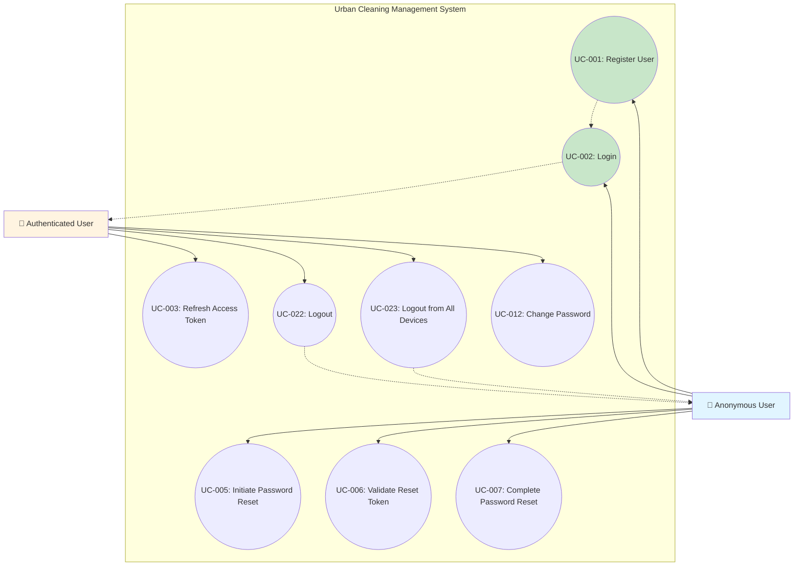
```mermaid
graph TB
    subgraph System["Urban Cleaning Management System"]
        Register((UC-001: Register User))
        Login((UC-002: Login))
        ResetInit((UC-005: Initiate Password Reset))
        ResetValidate((UC-006: Validate Reset Token))
        ResetComplete((UC-007: Complete Password Reset))
        Refresh((UC-003: Refresh Access Token))
        Logout((UC-022: Logout))
        LogoutAll((UC-023: Logout from All Devices))
        ChangePass((UC-012: Change Password))
    end
    
    Anonymous[👤 Anonymous User]
    Citizen[👤 Authenticated User]
    
    Anonymous --> Register
    Anonymous --> Login
    Anonymous --> ResetInit
    Anonymous --> ResetValidate
    Anonymous --> ResetComplete
    
    Register -.-> Login
    Login -.-> Citizen
    
    Citizen --> Refresh
    Citizen --> Logout
    Citizen --> LogoutAll
    Citizen --> ChangePass
    
    Logout -.-> Anonymous
    LogoutAll -.-> Anonymous
    
    style Anonymous fill:#e1f5ff
    style Citizen fill:#fff4e1
    style Register fill:#c8e6c9
    style Login fill:#c8e6c9
```

*Fuente: `diagrams/use-case-authentication-flow.mmd`*

La Figura 2.2 ilustra el flujo completo de autenticación del sistema URBIX, mostrando cómo los usuarios anónimos pueden registrarse y autenticarse, y cómo los usuarios autenticados pueden gestionar sus sesiones. Las líneas punteadas indican transiciones de estado entre usuario anónimo y autenticado.

**Figura 2.3: Gestión de Reportes y Tareas**

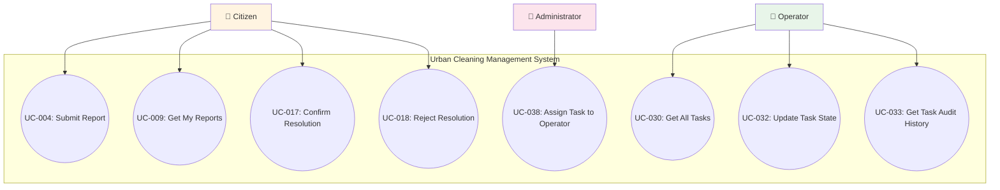
```mermaid
graph TB
    subgraph System["Urban Cleaning Management System"]
        Submit((UC-004: Submit Report))
        MyReports((UC-009: Get My Reports))
        GetTasks((UC-030: Get All Tasks))
        Assign((UC-038: Assign Task to Operator))
        UpdateState((UC-032: Update Task State))
        Confirm((UC-017: Confirm Resolution))
        Reject((UC-018: Reject Resolution))
        Audit((UC-033: Get Task Audit History))
    end
    
    Citizen[👤 Citizen]
    Operator[👤 Operator]
    Admin[👤 Administrator]
    
    Citizen --> Submit
    Citizen --> MyReports
    Citizen --> Confirm
    Citizen --> Reject
    
    Operator --> GetTasks
    Operator --> UpdateState
    Operator --> Audit
    
    Admin --> Assign
    
    style Citizen fill:#fff4e1
    style Operator fill:#e8f5e9
    style Admin fill:#fce4ec
```

*Fuente: `diagrams/use-case-report-task-management.mmd`*

La Figura 2.3 presenta el flujo principal del sistema, desde el envío de reportes por ciudadanos hasta la gestión de tareas por operadores y la asignación administrativa. Este diagrama muestra la separación clara de responsabilidades entre los diferentes tipos de actores.

**Figura 2.4: Configuración Administrativa del Sistema**

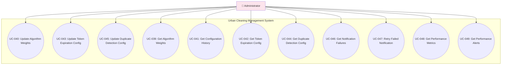
```mermaid
graph TB
    subgraph System["Urban Cleaning Management System"]
        AlgoWeights((UC-040: Update Algorithm Weights))
        TokenExp((UC-043: Update Token Expiration Config))
        DupDetect((UC-045: Update Duplicate Detection Config))
        ViewWeights((UC-039: Get Algorithm Weights))
        ViewHistory((UC-041: Get Configuration History))
        ViewToken((UC-042: Get Token Expiration Config))
        ViewDup((UC-044: Get Duplicate Detection Config))
        NotifFail((UC-046: Get Notification Failures))
        Retry((UC-047: Retry Failed Notification))
        Metrics((UC-048: Get Performance Metrics))
        Alerts((UC-049: Get Performance Alerts))
    end
    
    Admin[👤 Administrator]
    
    Admin --> AlgoWeights
    Admin --> TokenExp
    Admin --> DupDetect
    Admin --> ViewWeights
    Admin --> ViewHistory
    Admin --> ViewToken
    Admin --> ViewDup
    Admin --> NotifFail
    Admin --> Retry
    Admin --> Metrics
    Admin --> Alerts
    
    style Admin fill:#fce4ec
```

*Fuente: `diagrams/use-case-admin-configuration.mmd`*

La Figura 2.4 ilustra las capacidades exclusivas del administrador para configurar y monitorizar el sistema. Incluye la gestión del algoritmo de priorización, configuración de tokens JWT, detección de duplicados, y monitorización de rendimiento.

**Figura 2.5: Gestión de Perfil de Usuario y Sesiones**

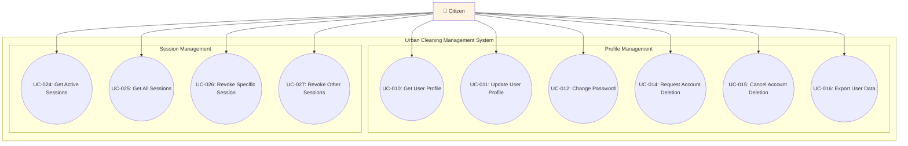
```mermaid
graph TB
    subgraph System["Urban Cleaning Management System"]
        subgraph ProfileGroup["Profile Management"]
            UC010((UC-010: Get User Profile))
            UC011((UC-011: Update User Profile))
            UC012((UC-012: Change Password))
            UC014((UC-014: Request Account Deletion))
            UC015((UC-015: Cancel Account Deletion))
            UC016((UC-016: Export User Data))
        end
        
        subgraph SessionGroup["Session Management"]
            UC024((UC-024: Get Active Sessions))
            UC025((UC-025: Get All Sessions))
            UC026((UC-026: Revoke Specific Session))
            UC027((UC-027: Revoke Other Sessions))
        end
    end
    
    Citizen[👤 Citizen]
    
    Citizen --> UC010
    Citizen --> UC011
    Citizen --> UC012
    Citizen --> UC014
    Citizen --> UC015
    Citizen --> UC016
    Citizen --> UC024
    Citizen --> UC025
    Citizen --> UC026
    Citizen --> UC027
    
    style Citizen fill:#fff4e1
```

*Fuente: `diagrams/use-case-user-profile-sessions.mmd`*

La Figura 2.5 muestra las capacidades de gestión personal disponibles para todos los usuarios autenticados, incluyendo la gestión de perfil con cumplimiento GDPR y el control avanzado de sesiones multi-dispositivo.

**Figura 2.6: Analíticas y Gestión de Notificaciones**

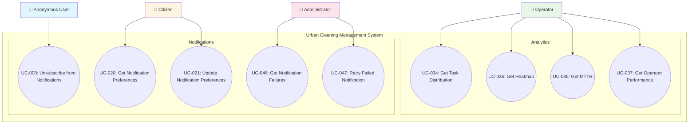
```mermaid
graph TB
    subgraph System["Urban Cleaning Management System"]
        subgraph AnalyticsGroup["Analytics"]
            UC034((UC-034: Get Task Distribution))
            UC035((UC-035: Get Heatmap))
            UC036((UC-036: Get MTTR))
            UC037((UC-037: Get Operator Performance))
        end
        
        subgraph NotificationGroup["Notifications"]
            UC008((UC-008: Unsubscribe from Notifications))
            UC020((UC-020: Get Notification Preferences))
            UC021((UC-021: Update Notification Preferences))
            UC046((UC-046: Get Notification Failures))
            UC047((UC-047: Retry Failed Notification))
        end
    end
    
    Anonymous[👤 Anonymous User]
    Citizen[👤 Citizen]
    Operator[👤 Operator]
    Admin[👤 Administrator]
    
    Anonymous --> UC008
    
    Citizen --> UC020
    Citizen --> UC021
    
    Operator --> UC034
    Operator --> UC035
    Operator --> UC036
    Operator --> UC037
    
    Admin --> UC046
    Admin --> UC047
    
    style Anonymous fill:#e1f5ff
    style Citizen fill:#fff4e1
    style Operator fill:#e8f5e9
    style Admin fill:#fce4ec
```

*Fuente: `diagrams/use-case-analytics-notifications.mmd`*

La Figura 2.6 presenta las capacidades de analíticas operativas disponibles para operadores y la gestión de notificaciones distribuida entre diferentes tipos de actores. Los operadores acceden a métricas operativas mientras que los administradores gestionan fallos de notificación.

### 2.4 Especificaciones Detalladas

Esta sección proporciona especificaciones detalladas para los casos de uso más críticos del sistema, incluyendo flujos principales, alternativos, precondiciones, postcondiciones y diagramas de actividad que ilustran la lógica de negocio implementada.

#### 2.4.1 UC-004: Enviar Reporte de Incidencia

**Descripción:** Los usuarios (anónimos o autenticados) pueden enviar reportes de incidencias de limpieza urbana con geolocalización y fotografía.

**Actor Principal:** Usuario Anónimo, Ciudadano

**Precondiciones:**
- El usuario debe tener acceso a la aplicación web
- La geolocalización debe estar disponible (GPS o manual)
- La fotografía es opcional pero recomendada

**Postcondiciones:**
- El reporte se almacena en la base de datos
- Se crea una tarea asociada (si no es duplicado) o se vincula a tarea existente
- Se calcula la prioridad automáticamente
- Se envían notificaciones asíncronas si corresponde

**Flujo Principal:**
1. El usuario accede al formulario de envío de reporte
2. El usuario proporciona descripción de la incidencia
3. El usuario selecciona categoría de la incidencia
4. El sistema obtiene coordenadas geográficas (GPS o manual)
5. El usuario opcionalmente adjunta fotografía
6. El sistema valida los datos de entrada
7. El sistema verifica que las coordenadas estén dentro del área de servicio
8. El sistema almacena la fotografía en el sistema de archivos
9. El sistema verifica duplicados usando análisis espacial y temporal
10. Si no hay duplicados, se crea nueva tarea con prioridad calculada
11. Si hay duplicados, se vincula a tarea existente
12. El sistema confirma el envío exitoso

**Flujos Alternativos:**
- **A1 - Coordenadas fuera del área de servicio:** El sistema rechaza el reporte y solicita coordenadas válidas
- **A2 - Error en carga de fotografía:** El sistema permite continuar sin fotografía
- **A3 - Reporte duplicado:** El sistema vincula el reporte a la tarea existente e incrementa el contador

**Excepciones:**
- **E1 - Datos de entrada inválidos:** ValidationException con detalles específicos
- **E2 - Error de almacenamiento:** FileStorageException si falla la carga de fotografía
- **E3 - Error de base de datos:** DataAccessException si falla la persistencia

**Implementación:** `ReportController.submitReport()` en `backend/src/main/java/com/urbanclean/controller/ReportController.java`

**Figura 2.7: Diagrama de Actividad - Proceso de Envío de Reporte**

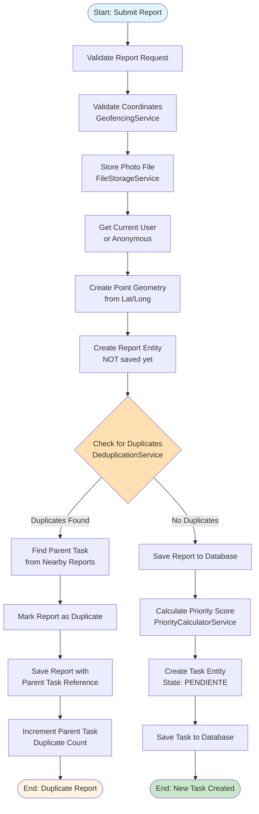
```mermaid
flowchart TD
    Start([Start: Submit Report]) --> ValidateInput[Validate Report Request]
    ValidateInput --> ValidateGeo[Validate Coordinates<br/>GeofencingService]
    ValidateGeo --> StorePhoto[Store Photo File<br/>FileStorageService]
    StorePhoto --> GetUser[Get Current User<br/>or Anonymous]
    GetUser --> CreatePoint[Create Point Geometry<br/>from Lat/Long]
    CreatePoint --> CreateReportObj[Create Report Entity<br/>NOT saved yet]
    
    CreateReportObj --> CheckDup{Check for Duplicates<br/>DeduplicationService}
    
    CheckDup -->|Duplicates Found| FindParent[Find Parent Task<br/>from Nearby Reports]
    FindParent --> MarkDup[Mark Report as Duplicate]
    MarkDup --> SaveDupReport[Save Report with<br/>Parent Task Reference]
    SaveDupReport --> IncrementCount[Increment Parent Task<br/>Duplicate Count]
    IncrementCount --> EndDup([End: Duplicate Report])
    
    CheckDup -->|No Duplicates| SaveReport[Save Report to Database]
    SaveReport --> CalcPriority[Calculate Priority Score<br/>PriorityCalculatorService]
    CalcPriority --> CreateTask[Create Task Entity<br/>State: PENDIENTE]
    CreateTask --> SaveTask[Save Task to Database]
    SaveTask --> EndNew([End: New Task Created])
    
    style Start fill:#e1f5ff
    style EndDup fill:#fff4e1
    style EndNew fill:#c8e6c9
    style CheckDup fill:#ffe0b2
```

*Fuente: `diagrams/activity-submit-report-process.mmd`*

#### 2.4.2 Cálculo de Prioridad de Tareas

**Descripción:** El sistema calcula automáticamente la prioridad de las tareas utilizando un algoritmo configurable que combina factores de categoría, zona geográfica y tiempo transcurrido.

**Fórmula de Priorización:**
```
P = (Wc × Category) + (Wz × Zone) + (Wt × Time)
```

Donde:
- **Wc, Wz, Wt**: Pesos configurables por el administrador
- **Category**: Valor de severidad de la categoría (1-10)
- **Zone**: Índice de riesgo de la zona geográfica (1-10)
- **Time**: Horas transcurridas normalizadas (1-10, escala logarítmica)

**Figura 2.8: Diagrama de Actividad - Cálculo de Prioridad**

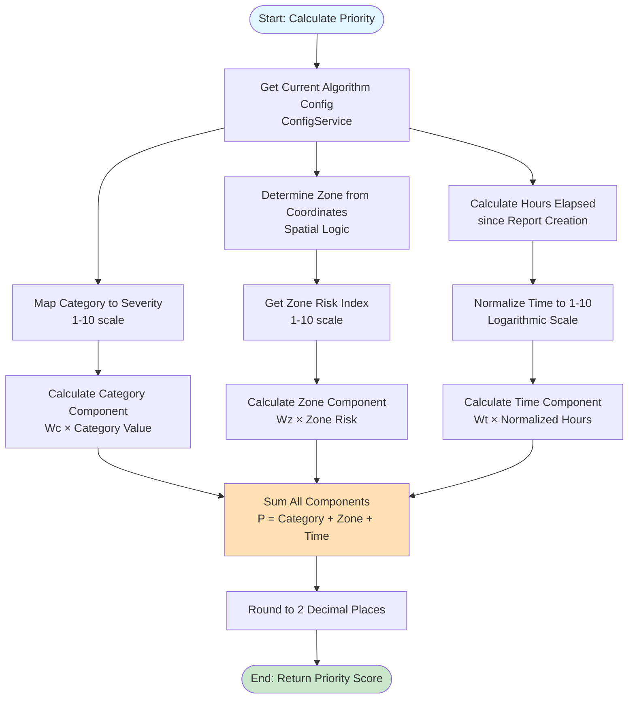
```mermaid
flowchart TD
    Start([Start: Calculate Priority]) --> GetConfig[Get Current Algorithm Config<br/>ConfigService]
    GetConfig --> MapCategory[Map Category to Severity<br/>1-10 scale]
    
    MapCategory --> CalcCat[Calculate Category Component<br/>Wc × Category Value]
    
    GetConfig --> DetermineZone[Determine Zone from Coordinates<br/>Spatial Logic]
    DetermineZone --> GetZoneRisk[Get Zone Risk Index<br/>1-10 scale]
    GetZoneRisk --> CalcZone[Calculate Zone Component<br/>Wz × Zone Risk]
    
    GetConfig --> CalcHours[Calculate Hours Elapsed<br/>since Report Creation]
    CalcHours --> NormalizeTime[Normalize Time to 1-10<br/>Logarithmic Scale]
    NormalizeTime --> CalcTime[Calculate Time Component<br/>Wt × Normalized Hours]
    
    CalcCat --> Sum[Sum All Components<br/>P = Category + Zone + Time]
    CalcZone --> Sum
    CalcTime --> Sum
    
    Sum --> Round[Round to 2 Decimal Places]
    Round --> End([End: Return Priority Score])
    
    style Start fill:#e1f5ff
    style End fill:#c8e6c9
    style Sum fill:#ffe0b2
```

*Fuente: `diagrams/activity-priority-calculation.mmd`*

**Implementación:** `PriorityCalculatorService.calculatePriority()` en `backend/src/main/java/com/urbanclean/service/PriorityCalculatorService.java`

#### 2.4.3 UC-032: Actualizar Estado de Tarea

**Descripción:** Los operadores pueden actualizar el estado de las tareas siguiendo una máquina de estados definida, con validaciones y auditoría completa.

**Actor Principal:** Operador, Administrador

**Estados Válidos:** PENDIENTE → ASIGNADO → EN_PROGRESO → RESUELTO → REABIERTO

**Precondiciones:**
- El usuario debe tener rol TECNICO o ADMIN
- La tarea debe existir en el sistema
- La transición de estado debe ser válida según la máquina de estados

**Postcondiciones:**
- El estado de la tarea se actualiza
- Se registra entrada en el log de auditoría
- Se envían notificaciones automáticas si la tarea se resuelve
- Se actualiza timestamp para cálculo de MTTR

**Validaciones Especiales:**
- **Estado RESUELTO:** Requiere evidencia fotográfica obligatoria
- **Transiciones inválidas:** Se rechaza con excepción específica

**Figura 2.9: Diagrama de Actividad - Actualización de Estado de Tarea**

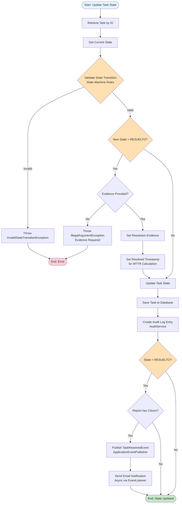
```mermaid
flowchart TD
    Start([Start: Update Task State]) --> GetTask[Retrieve Task by ID]
    GetTask --> GetCurrentState[Get Current State]
    GetCurrentState --> ValidateTrans{Validate State Transition<br/>State Machine Rules}
    
    ValidateTrans -->|Invalid| ThrowError[Throw InvalidStateTransitionException]
    ThrowError --> ErrorEnd([End: Error])
    
    ValidateTrans -->|Valid| CheckResolved{New State = RESUELTO?}
    
    CheckResolved -->|Yes| ValidateEvidence{Evidence Provided?}
    ValidateEvidence -->|No| ThrowEvidenceError[Throw IllegalArgumentException<br/>Evidence Required]
    ThrowEvidenceError --> ErrorEnd
    
    ValidateEvidence -->|Yes| SetEvidence[Set Resolution Evidence]
    SetEvidence --> SetResolvedTime[Set Resolved Timestamp<br/>for MTTR Calculation]
    SetResolvedTime --> UpdateState[Update Task State]
    
    CheckResolved -->|No| UpdateState
    
    UpdateState --> SaveTask[Save Task to Database]
    SaveTask --> CreateAudit[Create Audit Log Entry<br/>AuditService]
    
    CreateAudit --> CheckEvent{State = RESUELTO?}
    CheckEvent -->|Yes| CheckCitizen{Report has Citizen?}
    CheckCitizen -->|Yes| PublishEvent[Publish TaskResolvedEvent<br/>ApplicationEventPublisher]
    PublishEvent --> SendNotif[Send Email Notification<br/>Async via EventListener]
    SendNotif --> End([End: State Updated])
    
    CheckEvent -->|No| End
    CheckCitizen -->|No| End
    
    style Start fill:#e1f5ff
    style End fill:#c8e6c9
    style ErrorEnd fill:#ffcdd2
    style ValidateTrans fill:#ffe0b2
    style CheckResolved fill:#ffe0b2
    style CheckEvent fill:#ffe0b2
```

*Fuente: `diagrams/activity-task-state-update.mmd`*

**Implementación:** `TaskController.updateTaskState()` en `backend/src/main/java/com/urbanclean/controller/TaskController.java`

**Referencias cruzadas:**
- **Vista Lógica (Sección 3):** Diagramas de secuencia detallados para estos flujos
- **Vista de Procesos (Sección 4):** Procesos de negocio que implementan estos casos de uso
- **Modelo de Datos (Sección 7):** Entidades y relaciones involucradas

### 2.4 Especificaciones Detalladas

*[Esta sección se desarrollará en la subtarea 3.4 con especificaciones detalladas de casos de uso clave]*

## 3. Vista Lógica

La vista lógica detalla la descomposición de las funcionalidades en subsistemas y clases. El backend implementa una variante de **Clean Architecture** (Martin, 2017), asegurando que la lógica de dominio permanezca agnóstica a frameworks externos y detalles de infraestructura.

### 3.1 Estructura de Capas y Modelo de Dominio

El sistema se articula a través de capas con responsabilidades estrictas:

**Controladores (API Interface)**: Gestionan la comunicación HTTP y la validación de entrada/salida mediante DTOs (Data Transfer Objects), desacoplando el contrato de la API del modelo de persistencia.

**Servicios (Domain Logic)**: Albergan la lógica de negocio pura y la orquestación de transacciones.

**Repositorios (Data Access)**: Abstraen el almacenamiento de datos mediante interfaces JPA.

Las entidades del núcleo (Core Domain) son:

- **Report**: Representa la inmutabilidad de la denuncia ciudadana, conteniendo atributos geoespaciales precisos (`geometry(Point,4326)`)
- **Task**: Entidad operativa mutable que hereda el contexto del reporte y añade estado, prioridad y asignación de recursos
- **AuditLog**: Entidad de soporte transversal que garantiza la trazabilidad inmutable de cualquier mutación de estado

### 3.2 Patrones de Diseño Aplicados

Para resolver desafíos arquitectónicos específicos, se han implementado patrones de diseño GoF (Gamma et al., 1994) refinados:

#### 3.2.1 Strategy Pattern (Estrategia)

Utilizado en el motor de priorización. La lógica de cálculo no es rígida, sino inyectable.

**Implementación**:
$$P = (W_c \cdot C) + (W_z \cdot Z) + (W_t \cdot T)$$

Esto permite modificar los pesos de ponderación ($W$) en tiempo de ejecución sin necesidad de recompilar o redesplegar el servicio.

**Evidencia en el Código**:
```java
@Service
@RequiredArgsConstructor
public class PriorityCalculatorService {
    private final AlgorithmConfigRepository algorithmConfigRepository;
    
    public BigDecimal calculatePriority(Report report) {
        AlgorithmConfig config = getCurrentConfig();
        
        // Componentes de estrategia - pesos pueden cambiarse en tiempo de ejecución
        BigDecimal categoryComponent = config.getWeightCategory()
            .multiply(mapCategoryToValue(report.getCategory()));
        
        BigDecimal zoneComponent = config.getWeightZone()
            .multiply(calculateZoneRiskIndex(report.getLocation()));
        
        BigDecimal timeComponent = config.getWeightTime()
            .multiply(calculateHoursElapsed(report.getCreatedAt()));
        
        return categoryComponent.add(zoneComponent).add(timeComponent);
    }
}
```

#### 3.2.2 Observer Pattern (Observador)

Implementado a través del bus de eventos interno de Spring (`ApplicationEventPublisher`). Permite desacoplar el proceso transaccional (ej. cerrar una tarea) de los efectos secundarios (ej. enviar notificaciones), mejorando la latencia percibida por el usuario.

**Evidencia en el Código**:
```java
@Service
@RequiredArgsConstructor
public class TaskService {
    private final ApplicationEventPublisher eventPublisher;
    
    @Transactional
    public Task assignTask(UUID taskId, UUID operatorId) {
        // ... lógica de negocio ...
        Task savedTask = taskRepository.save(task);
        
        // Publicar evento - desacoplado de manejadores
        eventPublisher.publishEvent(new TaskAssignedEvent(this, savedTask, operator));
        
        return savedTask;
    }
}
```

#### 3.2.3 State Pattern (Estado)

Formaliza el ciclo de vida de la entidad Task mediante una máquina de estados finita, impidiendo transiciones inválidas (ej. pasar de PENDIENTE directamente a RESUELTO sin asignación previa).

**Máquina de Estados de Tareas**:
```
PENDIENTE → ASIGNADO → EN_PROGRESO → RESUELTO
    ↑           ↓                          ↓
    └───────────┘                     REABIERTO
                                           ↓
                                      ASIGNADO
```

**Evidencia en el Código**:
```java
private void validateStateTransition(TaskState currentState, TaskState newState) {
    boolean isValid = switch (currentState) {
        case PENDIENTE -> newState == TaskState.ASIGNADO;
        case ASIGNADO -> newState == TaskState.EN_PROGRESO || newState == TaskState.PENDIENTE;
        case EN_PROGRESO -> newState == TaskState.RESUELTO || newState == TaskState.ASIGNADO;
        case RESUELTO -> newState == TaskState.REABIERTO;
        case REABIERTO -> newState == TaskState.ASIGNADO;
    };
    
    if (!isValid) {
        throw new InvalidStateTransitionException(
            "Cannot transition from " + currentState + " to " + newState
        );
    }
}
```

**Referencias cruzadas con otras vistas arquitectónicas:**
- **Vista del Modelo de Datos (Sección 7)**: Las entidades mostradas en los diagramas de clases se detallan completamente en el Modelo de Datos con especificaciones de atributos
- **Vista de Casos de Uso (Sección 2)**: Los diagramas de secuencia implementan los flujos de trabajo descritos en las especificaciones de casos de uso
- **Vista de Implementación (Sección 5)**: Los componentes mostrados aquí corresponden a paquetes y módulos en la Vista de Implementación
- **Vista de Procesos (Sección 4)**: Los diagramas de secuencia ilustran la ejecución en tiempo de ejecución de los procesos de negocio

**Leyenda de notación para diagramas de secuencia:**
- `→`: Llamada de método síncrona (el llamador espera respuesta)
- `-->>`: Valor de retorno de llamada de método
- `Note over`: Nota explicativa sobre la interacción
- `participant`: Componente o clase involucrada en la interacción
- `alt/else/end`: Flujos alternativos (lógica condicional)
- `loop/end`: Operaciones repetidas

**Tipos de flecha:**
- Flecha sólida (`→`): Llamada síncrona
- Flecha punteada (`-->`): Retorno/respuesta
- Flecha sólida con cabeza rellena: Invocación de método
- Flecha punteada con cabeza abierta: Valor de retorno

**Tipos de flecha:**
- Flecha sólida (`→`): Llamada síncrona
- Flecha punteada (`-->`): Retorno/respuesta
- Flecha sólida con cabeza rellena: Invocación de método
- Flecha punteada con cabeza abierta: Valor de retorno

**Participantes**: Cada caja representa un componente (Controller, Service, Repository, etc.) involucrado en el flujo de trabajo. Los participantes se listan en orden de interacción de izquierda a derecha.

### 3.1 Diagramas de Secuencia

Esta sección presenta diagramas de secuencia para flujos de trabajo críticos del sistema, mostrando el flujo de interacción entre componentes desde la capa de controlador hasta las capas de servicio y repositorio.

#### 3.1.1 Flujos de Autenticación y Gestión de Sesiones

**Figura 3.1: Flujo de Autenticación de Usuario**

*Descripción*: Autentica un usuario con nombre de usuario y contraseña, genera token JWT de acceso y token de actualización, crea una sesión de usuario y registra el evento de autenticación.

*Participantes*: AuthController, AuthService, AuthenticationManager, UserRepository, JwtTokenProvider, RefreshTokenService, UserSessionService, DeviceFingerprintUtil

*Referencia de código fuente*: `backend/src/main/java/com/urbanclean/controller/AuthController.java`, `backend/src/main/java/com/urbanclean/service/AuthService.java`

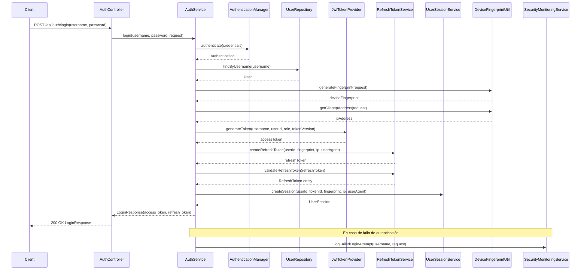
```mermaid
sequenceDiagram
    participant Client
    participant AuthController
    participant AuthService
    participant AuthenticationManager
    participant UserRepository
    participant JwtTokenProvider
    participant RefreshTokenService
    participant UserSessionService
    participant DeviceFingerprintUtil
    
    Client->>AuthController: POST /api/auth/login(username, password)
    AuthController->>AuthService: login(username, password, request)
    
    AuthService->>AuthenticationManager: authenticate(credentials)
    AuthenticationManager-->>AuthService: Authentication
    
    AuthService->>UserRepository: findByUsername(username)
    UserRepository-->>AuthService: User
    
    AuthService->>DeviceFingerprintUtil: generateFingerprint(request)
    DeviceFingerprintUtil-->>AuthService: deviceFingerprint
    
    AuthService->>DeviceFingerprintUtil: getClientIpAddress(request)
    DeviceFingerprintUtil-->>AuthService: ipAddress
    
    AuthService->>JwtTokenProvider: generateToken(username, userId, role, tokenVersion)
    JwtTokenProvider-->>AuthService: accessToken
    
    AuthService->>RefreshTokenService: createRefreshToken(userId, fingerprint, ip, userAgent)
    RefreshTokenService-->>AuthService: refreshToken
    
    AuthService->>RefreshTokenService: validateRefreshToken(refreshToken)
    RefreshTokenService-->>AuthService: RefreshToken entity
    
    AuthService->>UserSessionService: createSession(userId, tokenId, fingerprint, ip, userAgent)
    UserSessionService-->>AuthService: UserSession
    
    AuthService-->>AuthController: LoginResponse(accessToken, refreshToken)
    AuthController-->>Client: 200 OK LoginResponse
    
    Note over AuthService,SecurityMonitoringService: En caso de fallo de autenticación
    AuthService->>SecurityMonitoringService: logFailedLoginAttempt(username, request)
```

*Fuente: `diagrams/sequence-login-authentication.mmd`*

**Puntos clave del flujo de autenticación:**
- Utiliza AuthenticationManager de Spring Security para validación de credenciales
- Genera huella digital del dispositivo para seguimiento de sesiones
- Crea tanto token de acceso (15 min) como token de actualización (7 días)
- Registra intentos fallidos para monitoreo de seguridad
- Incluye versión de token en JWT para soporte de invalidación

**Figura 3.2: Flujo de Renovación de Token**

*Descripción*: El cliente utiliza el token de actualización para obtener un nuevo par de token de acceso y token de actualización (rotación de tokens).

*Participantes*: AuthController, AuthService, RefreshTokenService, UserRepository, JwtTokenProvider, RefreshTokenRepository

*Referencia de código fuente*: `backend/src/main/java/com/urbanclean/controller/AuthController.java`, `backend/src/main/java/com/urbanclean/service/RefreshTokenService.java`

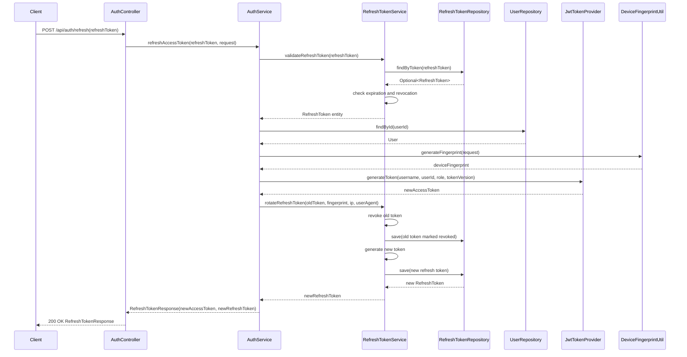
```mermaid
sequenceDiagram
    participant Client
    participant AuthController
    participant AuthService
    participant RefreshTokenService
    participant RefreshTokenRepository
    participant UserRepository
    participant JwtTokenProvider
    participant DeviceFingerprintUtil
    
    Client->>AuthController: POST /api/auth/refresh(refreshToken)
    AuthController->>AuthService: refreshAccessToken(refreshToken, request)
    
    AuthService->>RefreshTokenService: validateRefreshToken(refreshToken)
    RefreshTokenService->>RefreshTokenRepository: findByToken(refreshToken)
    RefreshTokenRepository-->>RefreshTokenService: Optional<RefreshToken>
    
    RefreshTokenService->>RefreshTokenService: check expiration and revocation
    RefreshTokenService-->>AuthService: RefreshToken entity
    
    AuthService->>UserRepository: findById(userId)
    UserRepository-->>AuthService: User
    
    AuthService->>DeviceFingerprintUtil: generateFingerprint(request)
    DeviceFingerprintUtil-->>AuthService: deviceFingerprint
    
    AuthService->>JwtTokenProvider: generateToken(username, userId, role, tokenVersion)
    JwtTokenProvider-->>AuthService: newAccessToken
    
    AuthService->>RefreshTokenService: rotateRefreshToken(oldToken, fingerprint, ip, userAgent)
    
    RefreshTokenService->>RefreshTokenService: revoke old token
    RefreshTokenService->>RefreshTokenRepository: save(old token marked revoked)
    
    RefreshTokenService->>RefreshTokenService: generate new token
    RefreshTokenService->>RefreshTokenRepository: save(new refresh token)
    RefreshTokenRepository-->>RefreshTokenService: new RefreshToken
    
    RefreshTokenService-->>AuthService: newRefreshToken
    
    AuthService-->>AuthController: RefreshTokenResponse(newAccessToken, newRefreshToken)
    AuthController-->>Client: 200 OK RefreshTokenResponse
```

*Fuente: `diagrams/sequence-user-registration.mmd`*

**Puntos clave del flujo de renovación:**
- Valida que el token de actualización no esté expirado o revocado
- Implementa rotación de tokens: token antiguo revocado, nuevo token emitido
- Genera nuevo token de acceso con versión de token actual
- Actualiza huella digital del dispositivo y dirección IP
- Previene ataques de reutilización de tokens

**Figura 3.3: Flujo de Recuperación de Contraseña**

*Descripción*: El usuario inicia el restablecimiento de contraseña, recibe email con token, valida el token y establece nueva contraseña.

*Participantes*: PasswordResetController, PasswordResetService, UserRepository, PasswordResetTokenRepository, EmailService, PasswordEncoder

*Referencia de código fuente*: `backend/src/main/java/com/urbanclean/controller/PasswordResetController.java`, `backend/src/main/java/com/urbanclean/service/PasswordResetService.java`

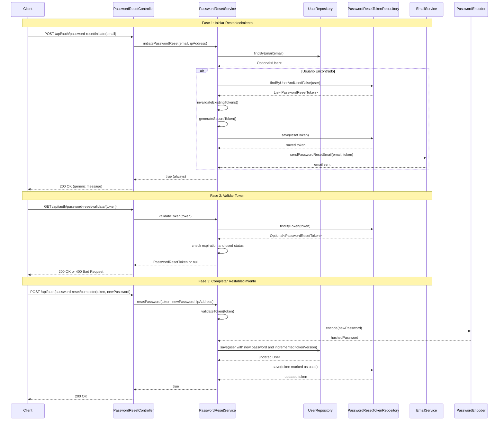
```mermaid
sequenceDiagram
    participant Client
    participant PasswordResetController
    participant PasswordResetService
    participant UserRepository
    participant PasswordResetTokenRepository
    participant EmailService
    participant PasswordEncoder
    
    Note over Client,EmailService: Fase 1: Iniciar Restablecimiento
    Client->>PasswordResetController: POST /api/auth/password-reset/initiate(email)
    PasswordResetController->>PasswordResetService: initiatePasswordReset(email, ipAddress)
    
    PasswordResetService->>UserRepository: findByEmail(email)
    UserRepository-->>PasswordResetService: Optional<User>
    
    alt Usuario Encontrado
        PasswordResetService->>PasswordResetTokenRepository: findByUserAndUsedFalse(user)
        PasswordResetTokenRepository-->>PasswordResetService: List<PasswordResetToken>
        
        PasswordResetService->>PasswordResetService: invalidateExistingTokens()
        PasswordResetService->>PasswordResetService: generateSecureToken()
        
        PasswordResetService->>PasswordResetTokenRepository: save(resetToken)
        PasswordResetTokenRepository-->>PasswordResetService: saved token
        
        PasswordResetService->>EmailService: sendPasswordResetEmail(email, token)
        EmailService-->>PasswordResetService: email sent
    end
    
    PasswordResetService-->>PasswordResetController: true (always)
    PasswordResetController-->>Client: 200 OK (generic message)
    
    Note over Client,EmailService: Fase 2: Validar Token
    Client->>PasswordResetController: GET /api/auth/password-reset/validate/{token}
    PasswordResetController->>PasswordResetService: validateToken(token)
    
    PasswordResetService->>PasswordResetTokenRepository: findByToken(token)
    PasswordResetTokenRepository-->>PasswordResetService: Optional<PasswordResetToken>
    
    PasswordResetService->>PasswordResetService: check expiration and used status
    PasswordResetService-->>PasswordResetController: PasswordResetToken or null
    PasswordResetController-->>Client: 200 OK or 400 Bad Request
    
    Note over Client,EmailService: Fase 3: Completar Restablecimiento
    Client->>PasswordResetController: POST /api/auth/password-reset/complete(token, newPassword)
    PasswordResetController->>PasswordResetService: resetPassword(token, newPassword, ipAddress)
    
    PasswordResetService->>PasswordResetService: validateToken(token)
    PasswordResetService->>PasswordEncoder: encode(newPassword)
    PasswordEncoder-->>PasswordResetService: hashedPassword
    
    PasswordResetService->>UserRepository: save(user with new password and incremented tokenVersion)
    UserRepository-->>PasswordResetService: updated User
    
    PasswordResetService->>PasswordResetTokenRepository: save(token marked as used)
    PasswordResetTokenRepository-->>PasswordResetService: updated token
    
    PasswordResetService-->>PasswordResetController: true
    PasswordResetController-->>Client: 200 OK
```

*Fuente: `diagrams/sequence-password-recovery.mmd`*

**Puntos clave del flujo de recuperación:**
- Siempre retorna éxito para prevenir enumeración de emails
- Genera token criptográficamente seguro aleatorio
- Token expira después de 1 hora
- Invalida tokens existentes no utilizados
- Incrementa versión de token del usuario para invalidar todos los JWTs
- Marca token como usado después de restablecimiento exitoso

#### 3.1.2 Flujos de Gestión de Reportes y Tareas

**Figura 3.4: Flujo de Envío de Reporte**

*Descripción*: El ciudadano envía un reporte de incidencia con fotografía. El sistema valida coordenadas, almacena la foto, verifica duplicados y crea una nueva tarea o vincula a tarea existente.

*Participantes*: ReportController, ReportService, FileStorageService, GeofencingService, DeduplicationService, TaskService, ReportRepository, TaskRepository

*Referencia de código fuente*: `backend/src/main/java/com/urbanclean/controller/ReportController.java`, `backend/src/main/java/com/urbanclean/service/ReportService.java`

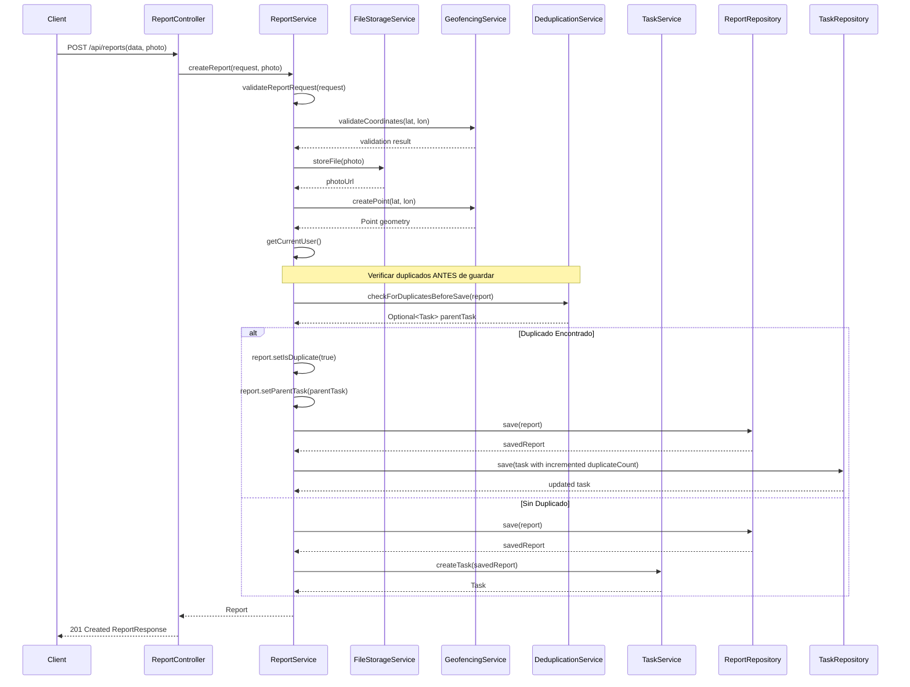
```mermaid
sequenceDiagram
    participant Client
    participant ReportController
    participant ReportService
    participant FileStorageService
    participant GeofencingService
    participant DeduplicationService
    participant TaskService
    participant ReportRepository
    participant TaskRepository
    
    Client->>ReportController: POST /api/reports(data, photo)
    ReportController->>ReportService: createReport(request, photo)
    
    ReportService->>ReportService: validateReportRequest(request)
    
    ReportService->>GeofencingService: validateCoordinates(lat, lon)
    GeofencingService-->>ReportService: validation result
    
    ReportService->>FileStorageService: storeFile(photo)
    FileStorageService-->>ReportService: photoUrl
    
    ReportService->>GeofencingService: createPoint(lat, lon)
    GeofencingService-->>ReportService: Point geometry
    
    ReportService->>ReportService: getCurrentUser()
    
    Note over ReportService,DeduplicationService: Verificar duplicados ANTES de guardar
    ReportService->>DeduplicationService: checkForDuplicatesBeforeSave(report)
    DeduplicationService-->>ReportService: Optional<Task> parentTask
    
    alt Duplicado Encontrado
        ReportService->>ReportService: report.setIsDuplicate(true)
        ReportService->>ReportService: report.setParentTask(parentTask)
        ReportService->>ReportRepository: save(report)
        ReportRepository-->>ReportService: savedReport
        
        ReportService->>TaskRepository: save(task with incremented duplicateCount)
        TaskRepository-->>ReportService: updated task
    else Sin Duplicado
        ReportService->>ReportRepository: save(report)
        ReportRepository-->>ReportService: savedReport
        
        ReportService->>TaskService: createTask(savedReport)
        TaskService-->>ReportService: Task
    end
    
    ReportService-->>ReportController: Report
    ReportController-->>Client: 201 Created ReportResponse
```

*Fuente: `diagrams/sequence-report-submission.mmd`*

**Puntos clave del flujo de envío:**
- Valida coordenadas contra límites de geofencing
- Almacena archivo de foto antes de crear entidad de reporte
- Verifica duplicados ANTES de guardar para evitar auto-detección
- Si es duplicado: vincula a tarea padre e incrementa contador de duplicados
- Si no es duplicado: crea nueva tarea con cálculo de prioridad
- Soporta envío de reporte anónimo

**Figura 3.5: Flujo de Cálculo de Prioridad**

*Descripción*: Calcula puntuación de prioridad para una tarea basada en pesos configurables para categoría, riesgo de zona y tiempo transcurrido.

*Participantes*: TaskService, PriorityCalculatorService, ConfigService, AlgorithmConfigRepository

*Referencia de código fuente*: `backend/src/main/java/com/urbanclean/service/PriorityCalculatorService.java`

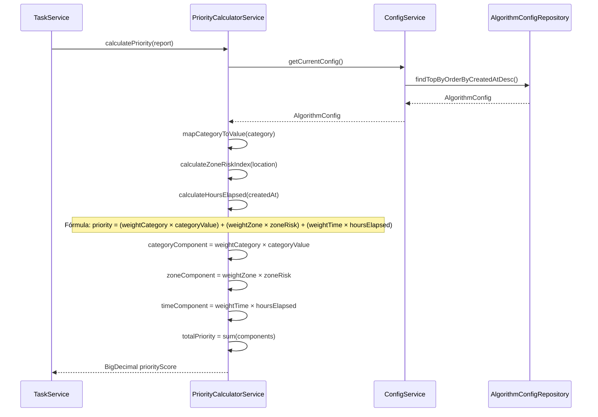
```mermaid
sequenceDiagram
    participant TaskService
    participant PriorityCalculatorService
    participant ConfigService
    participant AlgorithmConfigRepository
    
    TaskService->>PriorityCalculatorService: calculatePriority(report)
    
    PriorityCalculatorService->>ConfigService: getCurrentConfig()
    ConfigService->>AlgorithmConfigRepository: findTopByOrderByCreatedAtDesc()
    AlgorithmConfigRepository-->>ConfigService: AlgorithmConfig
    ConfigService-->>PriorityCalculatorService: AlgorithmConfig
    
    PriorityCalculatorService->>PriorityCalculatorService: mapCategoryToValue(category)
    PriorityCalculatorService->>PriorityCalculatorService: calculateZoneRiskIndex(location)
    PriorityCalculatorService->>PriorityCalculatorService: calculateHoursElapsed(createdAt)
    
    Note over PriorityCalculatorService: Fórmula: priority = (weightCategory × categoryValue) + (weightZone × zoneRisk) + (weightTime × hoursElapsed)
    
    PriorityCalculatorService->>PriorityCalculatorService: categoryComponent = weightCategory × categoryValue
    PriorityCalculatorService->>PriorityCalculatorService: zoneComponent = weightZone × zoneRisk
    PriorityCalculatorService->>PriorityCalculatorService: timeComponent = weightTime × hoursElapsed
    
    PriorityCalculatorService->>PriorityCalculatorService: totalPriority = sum(components)
    
    PriorityCalculatorService-->>TaskService: BigDecimal priorityScore
```

*Fuente: `diagrams/sequence-priority-calculation.mmd`*

**Puntos clave del cálculo de prioridad:**
- Utiliza pesos configurables de AlgorithmConfig
- Tres componentes: severidad de categoría, riesgo de zona, tiempo transcurrido
- Valores de categoría mapeados desde escala predefinida
- Riesgo de zona calculado desde datos espaciales
- Componente de tiempo incrementa prioridad para reportes más antiguos

**Figura 3.6: Flujo de Asignación de Tarea**

*Descripción*: El administrador asigna una tarea a un operador. El sistema valida la transición de estado, actualiza la tarea, publica evento y envía notificación por email.

*Participantes*: TaskController, TaskService, UserRepository, TaskRepository, AuditService, ApplicationEventPublisher, TaskEventListener, EmailService

*Referencia de código fuente*: `backend/src/main/java/com/urbanclean/controller/TaskController.java`, `backend/src/main/java/com/urbanclean/service/TaskService.java`

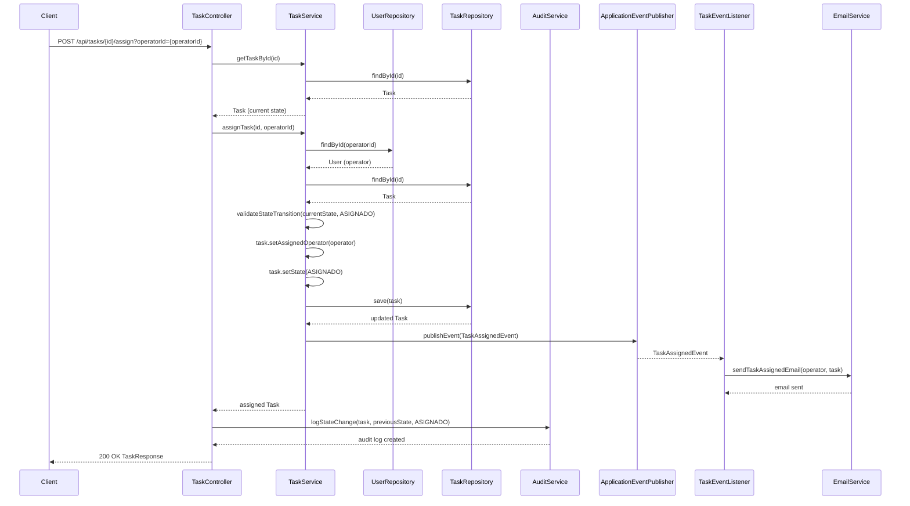
```mermaid
sequenceDiagram
    participant Client
    participant TaskController
    participant TaskService
    participant UserRepository
    participant TaskRepository
    participant AuditService
    participant ApplicationEventPublisher
    participant TaskEventListener
    participant EmailService
    
    Client->>TaskController: POST /api/tasks/{id}/assign?operatorId={operatorId}
    TaskController->>TaskService: getTaskById(id)
    TaskService->>TaskRepository: findById(id)
    TaskRepository-->>TaskService: Task
    TaskService-->>TaskController: Task (current state)
    
    TaskController->>TaskService: assignTask(id, operatorId)
    
    TaskService->>UserRepository: findById(operatorId)
    UserRepository-->>TaskService: User (operator)
    
    TaskService->>TaskRepository: findById(id)
    TaskRepository-->>TaskService: Task
    
    TaskService->>TaskService: validateStateTransition(currentState, ASIGNADO)
    
    TaskService->>TaskService: task.setAssignedOperator(operator)
    TaskService->>TaskService: task.setState(ASIGNADO)
    
    TaskService->>TaskRepository: save(task)
    TaskRepository-->>TaskService: updated Task
    
    TaskService->>ApplicationEventPublisher: publishEvent(TaskAssignedEvent)
    ApplicationEventPublisher-->>TaskEventListener: TaskAssignedEvent
    
    TaskEventListener->>EmailService: sendTaskAssignedEmail(operator, task)
    EmailService-->>TaskEventListener: email sent
    
    TaskService-->>TaskController: assigned Task
    
    TaskController->>AuditService: logStateChange(task, previousState, ASIGNADO)
    AuditService-->>TaskController: audit log created
    
    TaskController-->>Client: 200 OK TaskResponse
```

*Fuente: `diagrams/sequence-task-assignment.mmd`*

**Puntos clave del flujo de asignación:**
- Valida que el operador existe y tiene rol TECNICO
- Valida que la transición de estado está permitida
- Utiliza patrón orientado a eventos para notificación por email
- Registra cambio de estado en rastro de auditoría
- Envío de email asíncrono vía listener de eventos

**Figura 3.7: Flujo de Actualización de Estado de Tarea**

*Descripción*: El operador actualiza el estado de la tarea (ej., de ASIGNADO a EN_PROGRESO). El sistema valida la transición, actualiza la tarea y registra el cambio en el rastro de auditoría.

*Participantes*: TaskController, TaskService, TaskRepository, AuditService, AuditLogRepository

*Referencia de código fuente*: `backend/src/main/java/com/urbanclean/controller/TaskController.java`, `backend/src/main/java/com/urbanclean/service/TaskService.java`

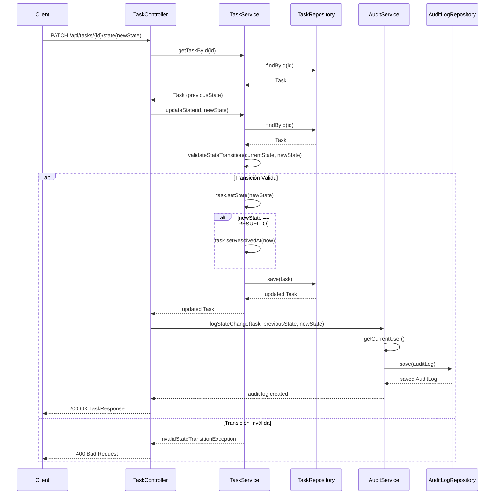
```mermaid
sequenceDiagram
    participant Client
    participant TaskController
    participant TaskService
    participant TaskRepository
    participant AuditService
    participant AuditLogRepository
    
    Client->>TaskController: PATCH /api/tasks/{id}/state(newState)
    
    TaskController->>TaskService: getTaskById(id)
    TaskService->>TaskRepository: findById(id)
    TaskRepository-->>TaskService: Task
    TaskService-->>TaskController: Task (previousState)
    
    TaskController->>TaskService: updateState(id, newState)
    
    TaskService->>TaskRepository: findById(id)
    TaskRepository-->>TaskService: Task
    
    TaskService->>TaskService: validateStateTransition(currentState, newState)
    
    alt Transición Válida
        TaskService->>TaskService: task.setState(newState)
        
        alt newState == RESUELTO
            TaskService->>TaskService: task.setResolvedAt(now)
        end
        
        TaskService->>TaskRepository: save(task)
        TaskRepository-->>TaskService: updated Task
        
        TaskService-->>TaskController: updated Task
        
        TaskController->>AuditService: logStateChange(task, previousState, newState)
        AuditService->>AuditService: getCurrentUser()
        AuditService->>AuditLogRepository: save(auditLog)
        AuditLogRepository-->>AuditService: saved AuditLog
        AuditService-->>TaskController: audit log created
        
        TaskController-->>Client: 200 OK TaskResponse
    else Transición Inválida
        TaskService-->>TaskController: InvalidStateTransitionException
        TaskController-->>Client: 400 Bad Request
    end
```

*Fuente: `diagrams/sequence-task-state-update.mmd`*

**Puntos clave del flujo de actualización:**
- Valida que las transiciones de estado siguen rutas permitidas
- Establece timestamp resolvedAt cuando el estado se convierte en RESUELTO
- Registra cada cambio de estado con usuario y timestamp
- Retorna error para transiciones inválidas

#### 3.1.3 Flujos de Retroalimentación y Analíticas

**Figura 3.8: Flujo de Retroalimentación Ciudadana**

*Descripción*: El ciudadano envía retroalimentación sobre una tarea resuelta. El sistema valida el estado de la tarea, almacena la retroalimentación y puede reabrir la tarea si la retroalimentación es negativa.

*Participantes*: FeedbackController, FeedbackService, TaskService, CitizenFeedbackRepository, TaskRepository

*Referencia de código fuente*: `backend/src/main/java/com/urbanclean/controller/FeedbackController.java`, `backend/src/main/java/com/urbanclean/service/FeedbackService.java`

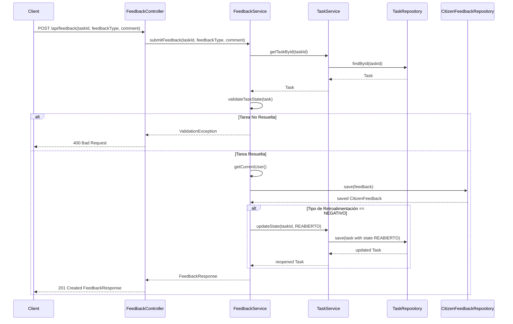
```mermaid
sequenceDiagram
    participant Client
    participant FeedbackController
    participant FeedbackService
    participant TaskService
    participant TaskRepository
    participant CitizenFeedbackRepository
    
    Client->>FeedbackController: POST /api/feedback(taskId, feedbackType, comment)
    FeedbackController->>FeedbackService: submitFeedback(taskId, feedbackType, comment)
    
    FeedbackService->>TaskService: getTaskById(taskId)
    TaskService->>TaskRepository: findById(taskId)
    TaskRepository-->>TaskService: Task
    TaskService-->>FeedbackService: Task
    
    FeedbackService->>FeedbackService: validateTaskState(task)
    
    alt Tarea No Resuelta
        FeedbackService-->>FeedbackController: ValidationException
        FeedbackController-->>Client: 400 Bad Request
    else Tarea Resuelta
        FeedbackService->>FeedbackService: getCurrentUser()
        
        FeedbackService->>CitizenFeedbackRepository: save(feedback)
        CitizenFeedbackRepository-->>FeedbackService: saved CitizenFeedback
        
        alt Tipo de Retroalimentación == NEGATIVO
            FeedbackService->>TaskService: updateState(taskId, REABIERTO)
            TaskService->>TaskRepository: save(task with state REABIERTO)
            TaskRepository-->>TaskService: updated Task
            TaskService-->>FeedbackService: reopened Task
        end
        
        FeedbackService-->>FeedbackController: FeedbackResponse
        FeedbackController-->>Client: 201 Created FeedbackResponse
    end
```

*Fuente: `diagrams/sequence-citizen-feedback.mmd`*

**Puntos clave del flujo de retroalimentación:**
- Solo permite retroalimentación en tareas resueltas
- Almacena retroalimentación con tipo (POSITIVO/NEGATIVO) y comentario
- Reabre automáticamente la tarea si la retroalimentación es negativa
- Vincula retroalimentación a usuario y tarea

**Figura 3.9: Flujo de Consulta de Analíticas**

*Descripción*: El administrador consulta datos de analíticas con filtros para rango de tiempo, estado y categoría.

*Participantes*: AnalyticsController, AnalyticsService, TaskRepository

*Referencia de código fuente*: `backend/src/main/java/com/urbanclean/controller/AnalyticsController.java`, `backend/src/main/java/com/urbanclean/service/AnalyticsService.java`

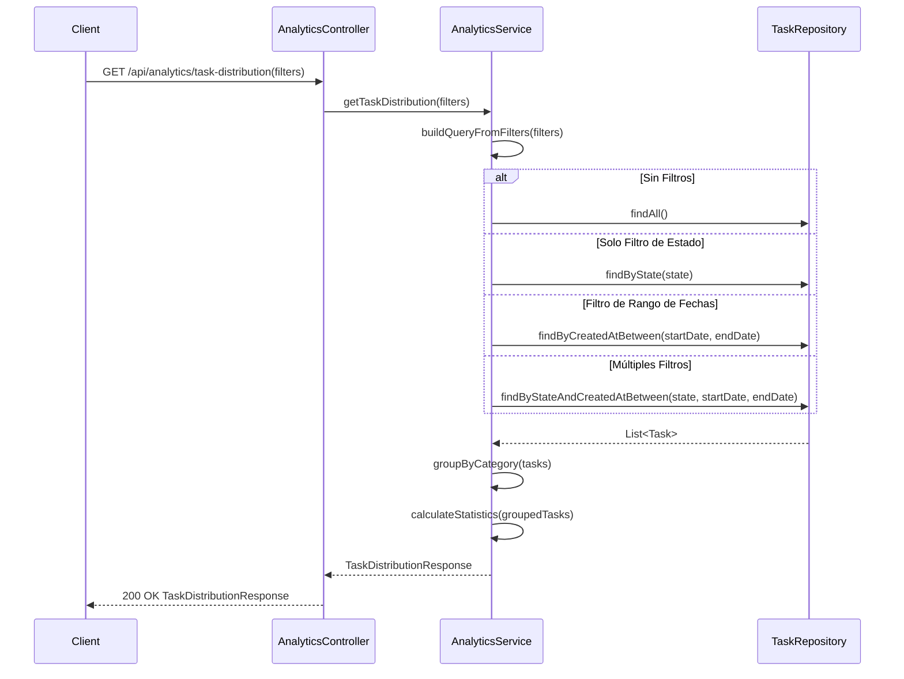
```mermaid
sequenceDiagram
    participant Client
    participant AnalyticsController
    participant AnalyticsService
    participant TaskRepository
    
    Client->>AnalyticsController: GET /api/analytics/task-distribution(filters)
    AnalyticsController->>AnalyticsService: getTaskDistribution(filters)
    
    AnalyticsService->>AnalyticsService: buildQueryFromFilters(filters)
    
    alt Sin Filtros
        AnalyticsService->>TaskRepository: findAll()
    else Solo Filtro de Estado
        AnalyticsService->>TaskRepository: findByState(state)
    else Filtro de Rango de Fechas
        AnalyticsService->>TaskRepository: findByCreatedAtBetween(startDate, endDate)
    else Múltiples Filtros
        AnalyticsService->>TaskRepository: findByStateAndCreatedAtBetween(state, startDate, endDate)
    end
    
    TaskRepository-->>AnalyticsService: List<Task>
    
    AnalyticsService->>AnalyticsService: groupByCategory(tasks)
    AnalyticsService->>AnalyticsService: calculateStatistics(groupedTasks)
    
    AnalyticsService-->>AnalyticsController: TaskDistributionResponse
    AnalyticsController-->>Client: 200 OK TaskDistributionResponse
```

*Fuente: `diagrams/sequence-analytics-generation.mmd`*

**Puntos clave del flujo de analíticas:**
- Soporta múltiples combinaciones de filtros
- Agrupa resultados por categoría
- Calcula estadísticas agregadas
- Consultas optimizadas basadas en presencia de filtros

#### 3.1.4 Flujos de Gestión de Perfil y Sesiones

**Figura 3.10: Flujo de Gestión de Sesiones**

*Descripción*: El usuario gestiona sus sesiones activas, puede ver todas las sesiones y revocar sesiones específicas o todas las demás sesiones.

*Participantes*: SessionController, UserSessionService, RefreshTokenService, UserSessionRepository, RefreshTokenRepository

*Referencia de código fuente*: `backend/src/main/java/com/urbanclean/controller/SessionController.java`, `backend/src/main/java/com/urbanclean/service/UserSessionService.java`

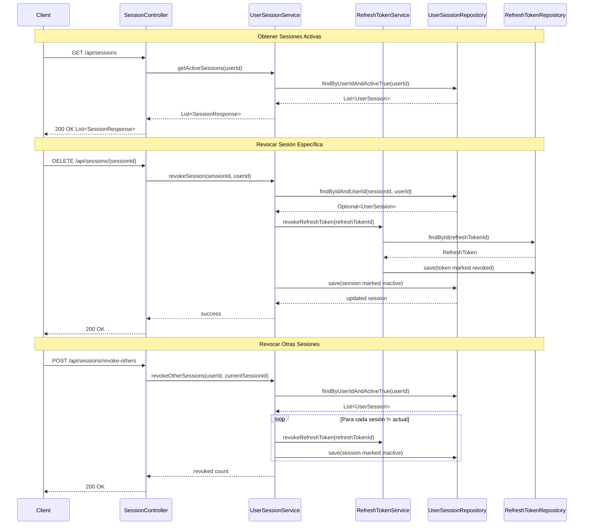
```mermaid
sequenceDiagram
    participant Client
    participant SessionController
    participant UserSessionService
    participant RefreshTokenService
    participant UserSessionRepository
    participant RefreshTokenRepository
    
    Note over Client,RefreshTokenRepository: Obtener Sesiones Activas
    Client->>SessionController: GET /api/sessions
    SessionController->>UserSessionService: getActiveSessions(userId)
    UserSessionService->>UserSessionRepository: findByUserIdAndActiveTrue(userId)
    UserSessionRepository-->>UserSessionService: List<UserSession>
    UserSessionService-->>SessionController: List<SessionResponse>
    SessionController-->>Client: 200 OK List<SessionResponse>
    
    Note over Client,RefreshTokenRepository: Revocar Sesión Específica
    Client->>SessionController: DELETE /api/sessions/{sessionId}
    SessionController->>UserSessionService: revokeSession(sessionId, userId)
    
    UserSessionService->>UserSessionRepository: findByIdAndUserId(sessionId, userId)
    UserSessionRepository-->>UserSessionService: Optional<UserSession>
    
    UserSessionService->>RefreshTokenService: revokeRefreshToken(refreshTokenId)
    RefreshTokenService->>RefreshTokenRepository: findById(refreshTokenId)
    RefreshTokenRepository-->>RefreshTokenService: RefreshToken
    RefreshTokenService->>RefreshTokenRepository: save(token marked revoked)
    
    UserSessionService->>UserSessionRepository: save(session marked inactive)
    UserSessionRepository-->>UserSessionService: updated session
    
    UserSessionService-->>SessionController: success
    SessionController-->>Client: 200 OK
    
    Note over Client,RefreshTokenRepository: Revocar Otras Sesiones
    Client->>SessionController: POST /api/sessions/revoke-others
    SessionController->>UserSessionService: revokeOtherSessions(userId, currentSessionId)
    
    UserSessionService->>UserSessionRepository: findByUserIdAndActiveTrue(userId)
    UserSessionRepository-->>UserSessionService: List<UserSession>
    
    loop Para cada sesión != actual
        UserSessionService->>RefreshTokenService: revokeRefreshToken(refreshTokenId)
        UserSessionService->>UserSessionRepository: save(session marked inactive)
    end
    
    UserSessionService-->>SessionController: revoked count
    SessionController-->>Client: 200 OK
```

*Fuente: `diagrams/sequence-session-management.mmd`*

**Puntos clave del flujo de gestión de sesiones:**
- Permite ver todas las sesiones activas del usuario
- Soporta revocación de sesiones específicas
- Permite cerrar sesión en todos los otros dispositivos
- Revoca tokens de actualización asociados cuando se revoca sesión
- Mantiene trazabilidad de sesiones activas/inactivas

**Figura 3.11: Flujo de Gestión de Perfil de Usuario**

*Descripción*: El usuario actualiza su información de perfil, incluyendo nombre, email y teléfono, con validaciones correspondientes.

*Participantes*: UserController, UserService, UserRepository, EmailValidator

*Referencia de código fuente*: `backend/src/main/java/com/urbanclean/controller/UserController.java`, `backend/src/main/java/com/urbanclean/service/UserService.java`

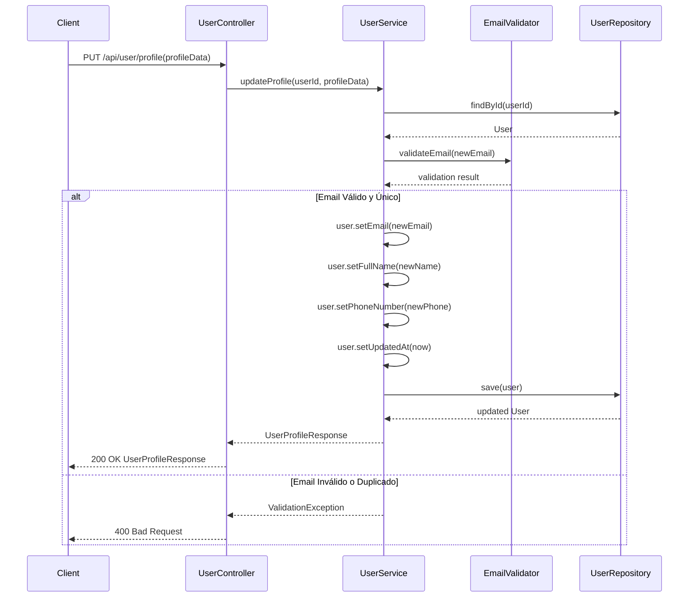
```mermaid
sequenceDiagram
    participant Client
    participant UserController
    participant UserService
    participant EmailValidator
    participant UserRepository
    
    Client->>UserController: PUT /api/user/profile(profileData)
    UserController->>UserService: updateProfile(userId, profileData)
    
    UserService->>UserRepository: findById(userId)
    UserRepository-->>UserService: User
    
    UserService->>EmailValidator: validateEmail(newEmail)
    EmailValidator-->>UserService: validation result
    
    alt Email Válido y Único
        UserService->>UserService: user.setEmail(newEmail)
        UserService->>UserService: user.setFullName(newName)
        UserService->>UserService: user.setPhoneNumber(newPhone)
        UserService->>UserService: user.setUpdatedAt(now)
        
        UserService->>UserRepository: save(user)
        UserRepository-->>UserService: updated User
        
        UserService-->>UserController: UserProfileResponse
        UserController-->>Client: 200 OK UserProfileResponse
    else Email Inválido o Duplicado
        UserService-->>UserController: ValidationException
        UserController-->>Client: 400 Bad Request
    end
```

*Fuente: `diagrams/sequence-profile-management.mmd`*

**Puntos clave del flujo de gestión de perfil:**
- Valida formato de email y unicidad
- Actualiza campos de perfil de forma atómica
- Mantiene timestamp de última actualización
- Retorna error específico para validaciones fallidas

#### 3.1.5 Flujos de Configuración del Sistema

**Figura 3.12: Flujo de Configuración del Sistema**

*Descripción*: El administrador actualiza la configuración del sistema, incluyendo pesos del algoritmo de priorización, configuración de tokens y detección de duplicados.

*Participantes*: ConfigController, ConfigService, AlgorithmConfigRepository, TaskService

*Referencia de código fuente*: `backend/src/main/java/com/urbanclean/controller/ConfigController.java`, `backend/src/main/java/com/urbanclean/service/ConfigService.java`

```mermaid
sequenceDiagram
    participant Client
    participant ConfigController
    participant ConfigService
    participant AlgorithmConfigRepository
    participant TaskService
    
    Client->>ConfigController: PUT /api/admin/config/algorithm-weights(weights)
    ConfigController->>ConfigService: updateAlgorithmWeights(weights)
    
    ConfigService->>ConfigService: validateWeights(weights)
    
    alt Pesos Válidos
        ConfigService->>AlgorithmConfigRepository: save(new AlgorithmConfig)
        AlgorithmConfigRepository-->>ConfigService: saved config
        
        Note over ConfigService,TaskService: Recalcular prioridades de tareas pendientes
        ConfigService->>TaskService: recalculatePendingTaskPriorities()
        TaskService-->>ConfigService: recalculation complete
        
        ConfigService-->>ConfigController: AlgorithmConfigResponse
        ConfigController-->>Client: 200 OK AlgorithmConfigResponse
    else Pesos Inválidos
        ConfigService-->>ConfigController: ValidationException
        ConfigController-->>Client: 400 Bad Request
    end
    
    Note over Client,TaskService: Obtener Historial de Configuración
    Client->>ConfigController: GET /api/admin/config/history
    ConfigController->>ConfigService: getConfigurationHistory()
    ConfigService->>AlgorithmConfigRepository: findAllByOrderByCreatedAtDesc()
    AlgorithmConfigRepository-->>ConfigService: List<AlgorithmConfig>
    ConfigService-->>ConfigController: List<ConfigHistoryResponse>
    ConfigController-->>Client: 200 OK List<ConfigHistoryResponse>
```

*Fuente: `diagrams/sequence-system-configuration.mmd`*

**Puntos clave del flujo de configuración:**
- Valida que los pesos del algoritmo sumen 1.0
- Crea nueva entrada de configuración (no actualiza existente)
- Recalcula automáticamente prioridades de tareas pendientes
- Mantiene historial completo de cambios de configuración
- Permite consultar historial de configuraciones

#### 3.1.6 Flujos de Notificaciones y Auditoría

**Figura 3.13: Flujo de Notificaciones por Email**

*Descripción*: El sistema envía notificaciones por email de forma asíncrona utilizando eventos del sistema y plantillas HTML.

*Participantes*: TaskEventListener, EmailService, JavaMailSender, TemplateEngine, NotificationFailureService

*Referencia de código fuente*: `backend/src/main/java/com/urbanclean/service/EmailService.java`, `backend/src/main/java/com/urbanclean/event/TaskEventListener.java`

```mermaid
sequenceDiagram
    participant TaskService
    participant ApplicationEventPublisher
    participant TaskEventListener
    participant EmailService
    participant TemplateEngine
    participant JavaMailSender
    participant NotificationFailureService
    
    TaskService->>ApplicationEventPublisher: publishEvent(TaskAssignedEvent)
    ApplicationEventPublisher->>TaskEventListener: handleTaskAssigned(event)
    
    TaskEventListener->>EmailService: sendTaskAssignedEmail(operator, task)
    
    EmailService->>TemplateEngine: process("task-assigned", variables)
    TemplateEngine-->>EmailService: HTML content
    
    EmailService->>JavaMailSender: send(MimeMessage)
    
    alt Email Enviado Exitosamente
        JavaMailSender-->>EmailService: success
        EmailService-->>TaskEventListener: email sent
    else Fallo en Envío
        JavaMailSender-->>EmailService: MessagingException
        EmailService->>NotificationFailureService: recordFailure(operator, task, exception)
        NotificationFailureService-->>EmailService: failure recorded
        EmailService-->>TaskEventListener: email failed
    end
```

*Fuente: `diagrams/sequence-email-notifications.mmd`*

**Puntos clave del flujo de notificaciones:**
- Procesamiento asíncrono vía eventos del sistema
- Utiliza plantillas HTML para emails profesionales
- Registra fallos de notificación para reintento posterior
- Soporta múltiples tipos de notificación (asignación, resolución, etc.)
- Manejo robusto de errores de envío

**Figura 3.14: Flujo de Registro de Auditoría**

*Descripción*: El sistema registra automáticamente todos los cambios de estado de tareas y acciones administrativas para trazabilidad completa.

*Participantes*: AuditService, AuditLogRepository, SecurityContextHolder

*Referencia de código fuente*: `backend/src/main/java/com/urbanclean/service/AuditService.java`

```mermaid
sequenceDiagram
    participant TaskController
    participant AuditService
    participant SecurityContextHolder
    participant AuditLogRepository
    
    TaskController->>AuditService: logStateChange(task, previousState, newState)
    
    AuditService->>SecurityContextHolder: getContext().getAuthentication()
    SecurityContextHolder-->>AuditService: Authentication
    
    AuditService->>AuditService: extractUserFromAuthentication()
    AuditService->>AuditService: extractIpAddress(request)
    
    AuditService->>AuditService: createAuditLog(task, user, previousState, newState, ipAddress)
    
    AuditService->>AuditLogRepository: save(auditLog)
    AuditLogRepository-->>AuditService: saved AuditLog
    
    AuditService-->>TaskController: audit log created
    
    Note over TaskController,AuditLogRepository: Consultar Historial de Auditoría
    TaskController->>AuditService: getTaskAuditHistory(taskId)
    AuditService->>AuditLogRepository: findByTaskIdOrderByChangedAtDesc(taskId)
    AuditLogRepository-->>AuditService: List<AuditLog>
    AuditService-->>TaskController: List<AuditLogResponse>
```

*Fuente: `diagrams/sequence-audit-logging.mmd`*

**Puntos clave del flujo de auditoría:**
- Registra automáticamente todos los cambios de estado
- Captura usuario, timestamp y dirección IP
- Mantiene historial completo ordenado cronológicamente
- Soporta consultas de historial por tarea específica
- Información inmutable para cumplimiento regulatorio

**Figura 3.15: Flujo de Eliminación de Cuenta GDPR**

*Descripción*: El usuario solicita eliminación de cuenta cumpliendo con regulaciones GDPR, incluyendo período de gracia y exportación de datos.

*Participantes*: UserController, UserDataService, EmailService, UserRepository

*Referencia de código fuente*: `backend/src/main/java/com/urbanclean/controller/UserController.java`, `backend/src/main/java/com/urbanclean/service/UserDataService.java`

```mermaid
sequenceDiagram
    participant Client
    participant UserController
    participant UserDataService
    participant EmailService
    participant UserRepository
    
    Note over Client,UserRepository: Solicitar Eliminación de Cuenta
    Client->>UserController: POST /api/user/delete-account
    UserController->>UserDataService: requestAccountDeletion(userId)
    
    UserDataService->>UserRepository: findById(userId)
    UserRepository-->>UserDataService: User
    
    UserDataService->>UserDataService: user.setDeletionRequestedAt(now + 30 days)
    UserDataService->>UserRepository: save(user)
    UserRepository-->>UserDataService: updated User
    
    UserDataService->>EmailService: sendAccountDeletionEmail(user)
    EmailService-->>UserDataService: email sent
    
    UserDataService-->>UserController: DeletionRequestResponse
    UserController-->>Client: 200 OK DeletionRequestResponse
    
    Note over Client,UserRepository: Cancelar Eliminación
    Client->>UserController: POST /api/user/cancel-deletion
    UserController->>UserDataService: cancelAccountDeletion(userId)
    
    UserDataService->>UserRepository: findById(userId)
    UserRepository-->>UserDataService: User
    
    UserDataService->>UserDataService: user.setDeletionRequestedAt(null)
    UserDataService->>UserRepository: save(user)
    UserRepository-->>UserDataService: updated User
    
    UserDataService-->>UserController: success
    UserController-->>Client: 200 OK
    
    Note over Client,UserRepository: Exportar Datos
    Client->>UserController: GET /api/user/export
    UserController->>UserDataService: exportUserData(userId)
    
    UserDataService->>UserDataService: collectAllUserData(userId)
    UserDataService->>UserDataService: generateDataExport(userData)
    
    UserDataService-->>UserController: UserDataExport
    UserController-->>Client: 200 OK UserDataExport (JSON)
```

*Fuente: `diagrams/sequence-account-deletion-gdpr.mmd`*

**Puntos clave del flujo GDPR:**
- Período de gracia de 30 días antes de eliminación definitiva
- Notificación por email sobre solicitud de eliminación
- Permite cancelar eliminación durante período de gracia
- Exportación completa de datos personales en formato JSON
**Puntos clave del flujo GDPR:**
- Período de gracia de 30 días antes de eliminación definitiva
- Notificación por email sobre solicitud de eliminación
- Permite cancelar eliminación durante período de gracia
- Exportación completa de datos personales en formato JSON
- Cumplimiento con derecho al olvido y portabilidad de datos

### 3.2 Diagrama de Clases del Sistema

Esta sección presenta un diagrama de clases integral que muestra la estructura estática del sistema, incluyendo entidades, DTOs, servicios, controladores y repositorios con sus relaciones.

**Leyenda de notación para diagramas de clases:**
- `<<Entity>>`: Entidad JPA (objeto de dominio persistente)
- `<<Service>>`: Componente de lógica de negocio
- `<<Controller>>`: Manejador de endpoints de API REST
- `<<Repository>>`: Interfaz de acceso a datos
- `<<DTO>>`: Objeto de Transferencia de Datos
- `<<Enum>>`: Tipo de enumeración

**Tipos de relación:**
- `-->`: Asociación (usa/depende de)
- `--|>`: Herencia (extiende/implementa)
- `--*`: Composición (propiedad fuerte)
- `--o`: Agregación (propiedad débil)
- `1`, `*`, `0..1`, `1..*`: Indicadores de cardinalidad

**Visibilidad:**
- `+`: Público
- `-`: Privado
- `#`: Protegido

**Figura 3.16: Diagrama de Clases del Sistema URBIX**

*Descripción*: Este diagrama muestra el modelo de dominio central, servicios, controladores y sus relaciones. Se enfoca en las entidades principales y sus asociaciones, junto con componentes clave de servicio y controlador.

*Referencia de código fuente*: `backend/src/main/java/com/urbanclean/entity/`, `backend/src/main/java/com/urbanclean/service/`, `backend/src/main/java/com/urbanclean/controller/`

```mermaid
classDiagram
    %% Entidades Centrales
    class User {
        <<Entity>>
        +UUID id
        +String username
        +String passwordHash
        +String email
        +UserRole role
        +LocalDateTime createdAt
        +LocalDateTime updatedAt
        +Integer tokenVersion
        +String fullName
        +String phoneNumber
        +LocalDateTime deletionRequestedAt
    }
    
    class Report {
        <<Entity>>
        +UUID id
        +Point location
        +String category
        +String description
        +String photoUrl
        +LocalDateTime createdAt
        +Boolean isDuplicate
        +UUID submitterId
        +UUID parentTaskId
    }
    
    class Task {
        <<Entity>>
        +UUID id
        +Point location
        +String category
        +TaskState state
        +BigDecimal priorityScore
        +Integer duplicateCount
        +String resolutionEvidence
        +Integer reopenCount
        +Boolean citizenApproved
        +LocalDateTime createdAt
        +LocalDateTime updatedAt
        +LocalDateTime resolvedAt
        +UUID assignedOperatorId
        +UUID primaryReportId
    }
    
    class AuditLog {
        <<Entity>>
        +UUID id
        +UUID taskId
        +UUID userId
        +TaskState previousState
        +TaskState newState
        +LocalDateTime changedAt
        +String ipAddress
        +String userAgent
    }
    
    class RefreshToken {
        <<Entity>>
        +UUID id
        +String token
        +UUID userId
        +LocalDateTime expiresAt
        +Boolean revoked
        +String deviceFingerprint
        +String ipAddress
        +String userAgent
        +LocalDateTime createdAt
    }
    
    class UserSession {
        <<Entity>>
        +UUID id
        +UUID userId
        +UUID refreshTokenId
        +String deviceFingerprint
        +String ipAddress
        +String userAgent
        +LocalDateTime createdAt
        +LocalDateTime lastAccessedAt
        +Boolean active
    }
    
    class PasswordResetToken {
        <<Entity>>
        +UUID id
        +String token
        +UUID userId
        +LocalDateTime expiresAt
        +Boolean used
        +LocalDateTime usedAt
        +String ipAddress
        +LocalDateTime createdAt
    }
    
    class AlgorithmConfig {
        <<Entity>>
        +UUID id
        +BigDecimal weightCategory
        +BigDecimal weightZone
        +BigDecimal weightTime
        +Integer duplicateRadius
        +Integer duplicateTimeWindow
        +LocalDateTime createdAt
        +UUID createdBy
    }
    
    class CitizenFeedback {
        <<Entity>>
        +UUID id
        +UUID taskId
        +UUID userId
        +FeedbackType type
        +String comment
        +LocalDateTime createdAt
    }
    
    class NotificationFailure {
        <<Entity>>
        +UUID id
        +UUID userId
        +String notificationType
        +String recipientEmail
        +String errorMessage
        +Integer retryCount
        +LocalDateTime createdAt
        +LocalDateTime lastRetryAt
        +Boolean resolved
    }
    
    %% Enumeraciones
    class UserRole {
        <<Enumeration>>
        ROLE_CIUDADANO
        ROLE_TECNICO
        ROLE_ADMIN
    }
    
    class TaskState {
        <<Enumeration>>
        PENDIENTE
        ASIGNADO
        EN_PROGRESO
        RESUELTO
        REABIERTO
    }
    
    class FeedbackType {
        <<Enumeration>>
        POSITIVO
        NEGATIVO
    }
    
    %% Servicios Clave
    class AuthService {
        <<Service>>
        +login(username, password, request) LoginResponse
        +register(request) User
        +refreshAccessToken(token, request) RefreshTokenResponse
        +logout(accessToken, refreshToken)
        +logoutAll(accessToken)
        -validateCredentials(username, password)
        -generateTokens(user, request)
    }
    
    class ReportService {
        <<Service>>
        +createReport(request, photo) Report
        +getReportById(id) Report
        +getAllReports(filters) List~ReportResponse~
        +getMyReports(userId) List~ReportResponse~
        -validateReportRequest(request)
        -processPhoto(photo) String
    }
    
    class TaskService {
        <<Service>>
        +createTask(report) Task
        +getTaskById(id) Task
        +assignTask(taskId, operatorId) Task
        +updateState(taskId, newState, evidence) Task
        +validateStateTransition(current, new)
        -calculateInitialPriority(report) BigDecimal
        -publishTaskEvent(task, eventType)
    }
    
    class PriorityCalculatorService {
        <<Service>>
        +calculatePriority(report) BigDecimal
        +recalculateAllPendingTasks()
        -mapCategoryToValue(category) BigDecimal
        -calculateZoneRiskIndex(location) BigDecimal
        -calculateHoursElapsed(createdAt) BigDecimal
        -getCurrentWeights() AlgorithmConfig
    }
    
    class DeduplicationService {
        <<Service>>
        +checkForDuplicatesBeforeSave(report) Optional~Task~
        +findNearbyTasks(location, radius, timeWindow) List~Task~
        -calculateDistance(point1, point2) Double
        -isWithinTimeWindow(task, hours) Boolean
    }
    
    class UserSessionService {
        <<Service>>
        +createSession(userId, tokenId, fingerprint, ip, userAgent) UserSession
        +getActiveSessions(userId) List~SessionResponse~
        +revokeSession(sessionId, userId)
        +revokeOtherSessions(userId, currentSessionId)
        -updateLastAccessed(sessionId)
    }
    
    %% Controladores Clave
    class AuthController {
        <<Controller>>
        +login(request) ResponseEntity~LoginResponse~
        +register(request) ResponseEntity~UserResponse~
        +refreshToken(request) ResponseEntity~RefreshTokenResponse~
        +logout(authHeader) ResponseEntity~Void~
        +logoutAll(authHeader) ResponseEntity~Void~
    }
    
    class ReportController {
        <<Controller>>
        +submitReport(data, photo) ResponseEntity~ReportResponse~
        +getReport(id) ResponseEntity~ReportResponse~
        +getAllReports(filters) ResponseEntity~List~ReportResponse~~
        +getMyReports() ResponseEntity~List~ReportResponse~~
    }
    
    class TaskController {
        <<Controller>>
        +getTasks(filters) ResponseEntity~List~TaskResponse~~
        +getTask(id) ResponseEntity~TaskResponse~
        +updateTaskState(id, request) ResponseEntity~TaskResponse~
        +assignTask(id, operatorId) ResponseEntity~TaskResponse~
        +getAuditHistory(id) ResponseEntity~List~AuditLogResponse~~
    }
    
    class FeedbackController {
        <<Controller>>
        +submitFeedback(taskId, request) ResponseEntity~FeedbackResponse~
        +getFeedback(taskId) ResponseEntity~FeedbackResponse~
        +confirmResolution(taskId) ResponseEntity~Void~
        +rejectResolution(taskId, request) ResponseEntity~Void~
    }
    
    %% Repositorios
    class UserRepository {
        <<Repository>>
        +findByUsername(username) Optional~User~
        +findByEmail(email) Optional~User~
        +existsByUsername(username) Boolean
        +existsByEmail(email) Boolean
        +findByDeletionRequestedAtBefore(date) List~User~
    }
    
    class TaskRepository {
        <<Repository>>
        +findByStateOrderByPriorityScoreDesc(state) List~Task~
        +findNearbyTasksInTimeWindow(location, radius, timeThreshold) List~Task~
        +findByAssignedOperatorId(operatorId) List~Task~
        +findByStateAndCreatedAtBetween(state, start, end) List~Task~
    }
    
    %% Relaciones - Entidades
    User "1" --> "*" Report : submits
    User "0..1" --> "*" Task : assigned to
    User "1" --> "*" AuditLog : performs
    User "1" --> "*" RefreshToken : has
    User "1" --> "*" UserSession : has
    User "1" --> "*" PasswordResetToken : requests
    User "1" --> "*" CitizenFeedback : provides
    User --> UserRole : has
    
    Report "*" --> "0..1" User : submitted by
    Report "*" --> "0..1" Task : parent task
    Report "1" --> "1" Task : primary report
    
    Task "1" --> "1" Report : primary report
    Task "1" --> "*" Report : duplicate reports
    Task "0..1" --> "1" User : assigned operator
    Task "1" --> "*" AuditLog : has history
    Task "1" --> "*" CitizenFeedback : receives feedback
    Task --> TaskState : has state
    
    AuditLog "*" --> "1" Task : tracks
    AuditLog "*" --> "1" User : changed by
    
    RefreshToken "*" --> "1" User : belongs to
    RefreshToken "1" --> "1" UserSession : associated with
    
    UserSession "*" --> "1" User : belongs to
    UserSession "1" --> "1" RefreshToken : uses
    
    PasswordResetToken "*" --> "1" User : for user
    
    CitizenFeedback "*" --> "1" Task : about task
    CitizenFeedback "*" --> "1" User : from user
    CitizenFeedback --> FeedbackType : has type
    
    NotificationFailure "*" --> "1" User : for user
    
    AlgorithmConfig "*" --> "1" User : created by
    
    %% Relaciones - Servicios a Entidades
    AuthService --> User : manages
    AuthService --> RefreshToken : creates
    AuthService --> UserSession : creates
    ReportService --> Report : manages
    ReportService --> Task : creates via TaskService
    TaskService --> Task : manages
    TaskService --> AuditLog : creates via AuditService
    PriorityCalculatorService --> AlgorithmConfig : uses
    DeduplicationService --> Task : queries
    UserSessionService --> UserSession : manages
    UserSessionService --> RefreshToken : coordinates with
    
    %% Relaciones - Controladores a Servicios
    AuthController --> AuthService : uses
    ReportController --> ReportService : uses
    TaskController --> TaskService : uses
    TaskController --> AuditService : uses
    FeedbackController --> FeedbackService : uses
    
    %% Relaciones - Servicios a Repositorios
    AuthService --> UserRepository : queries
    ReportService --> UserRepository : queries
    TaskService --> TaskRepository : queries
    UserSessionService --> UserSessionRepository : queries
```

*Fuente: Análisis del código fuente en `backend/src/main/java/com/urbanclean/`*

**Leyenda del diagrama:**
- `<<Entity>>`: Entidad JPA que representa el modelo de dominio
- `<<Service>>`: Componente de lógica de negocio
- `<<Controller>>`: Manejador de endpoints de API REST
- `<<Repository>>`: Interfaz de acceso a datos
- `<<Enumeration>>`: Tipo enum para valores restringidos
- Líneas sólidas con flechas: Asociaciones y dependencias
- Números (1, *, 0..1): Cardinalidad de relaciones

**Relaciones clave identificadas:**

1. **User-Report**: Un usuario puede enviar muchos reportes (1:N)
2. **User-Task**: Un usuario (operador) puede ser asignado a muchas tareas (1:N)
3. **Report-Task**: Cada tarea tiene un reporte primario, pero puede tener muchos reportes duplicados (1:1 y 1:N)
4. **Task-AuditLog**: Cada tarea tiene un historial de auditoría de cambios de estado (1:N)
5. **User-RefreshToken**: Cada usuario puede tener múltiples tokens de actualización activos (diferentes dispositivos) (1:N)
6. **RefreshToken-UserSession**: Cada token de actualización está asociado con una sesión de usuario (1:1)
7. **Task-CitizenFeedback**: Cada tarea puede recibir retroalimentación de ciudadanos (1:N)
8. **User-NotificationFailure**: Cada usuario puede tener fallos de notificación registrados (1:N)

**Patrones de diseño identificados en el diagrama:**
- **Repository Pattern**: Interfaces de repositorio para abstracción de acceso a datos
- **Service Layer Pattern**: Servicios que encapsulan lógica de negocio
- **MVC Pattern**: Separación clara entre controladores, servicios y entidades
- **DTO Pattern**: Objetos de transferencia de datos para APIs (implícito en métodos de controlador)

### 3.3 Máquinas de Estado

Esta sección presenta diagramas de estado para entidades que implementan máquinas de estado, mostrando todos los estados posibles y transiciones válidas.

**Leyenda de notación para diagramas de estado:**
- `[*]`: Estado inicial/final (inicio/fin del ciclo de vida)
- Rectángulo: Estado (ej., PENDIENTE, ASIGNADO)
- Flecha: Transición de estado
- `note`: Anotación explicativa
- Etiqueta en flecha: Disparador/evento que causa la transición

**Tipos de estado:**
- **Estado Inicial** (`[*] -->`): Punto de entrada cuando se crea la entidad
- **Estados Intermedios**: Estados operacionales normales
- **Estado Final** (`--> [*]`): Estado terminal (ciclo de vida de entidad completo)

#### 3.3.1 Máquina de Estado de Tarea

**Descripción**: La entidad Task implementa una máquina de estado que controla el flujo de trabajo desde la creación hasta la resolución. La máquina de estado impone transiciones válidas y previene cambios de estado inválidos.

**Referencia de código fuente**: `backend/src/main/java/com/urbanclean/entity/TaskState.java`, `backend/src/main/java/com/urbanclean/service/TaskService.java` (método validateStateTransition)

**Figura 3.17: Máquina de Estado de Tarea**

```mermaid
stateDiagram-v2
    [*] --> PENDIENTE : Tarea creada desde reporte
    
    PENDIENTE --> ASIGNADO : assignTask(operatorId)
    
    ASIGNADO --> EN_PROGRESO : Operador inicia trabajo
    ASIGNADO --> PENDIENTE : Desasignar (solo admin)
    
    EN_PROGRESO --> RESUELTO : Operador completa tarea
    EN_PROGRESO --> ASIGNADO : Operador pausa trabajo
    
    RESUELTO --> REABIERTO : Ciudadano envía retroalimentación negativa
    RESUELTO --> [*] : Tarea completada exitosamente
    
    REABIERTO --> EN_PROGRESO : Operador reanuda trabajo
    
    note right of PENDIENTE
        Estado inicial
        Tarea esperando asignación
    end note
    
    note right of ASIGNADO
        Tarea asignada a operador
        Operador notificado vía email
    end note
    
    note right of EN_PROGRESO
        Operador trabajando activamente
        Puede subir evidencia
    end note
    
    note right of RESUELTO
        Tarea marcada como completa
        Esperando retroalimentación ciudadana
    end note
    
    note right of REABIERTO
        Ciudadano rechazó resolución
        Requiere retrabajo
    end note
```

*Fuente: `diagrams/sequence-task-state-update.mmd` y análisis del código fuente*

**Tabla 3.1: Estados de la Máquina de Estado de Tarea**

| Estado | Descripción | Condición de Entrada | Condición de Salida |
|--------|-------------|---------------------|-------------------|
| PENDIENTE | Tarea creada, esperando asignación | Reporte enviado y tarea creada | Admin asigna a operador |
| ASIGNADO | Tarea asignada a operador | Admin asigna tarea | Operador inicia trabajo o admin desasigna |
| EN_PROGRESO | Operador trabajando activamente en tarea | Operador inicia trabajo | Operador completa o pausa |
| RESUELTO | Tarea completada, esperando retroalimentación | Operador marca como completa | Ciudadano proporciona retroalimentación |
| REABIERTO | Tarea reabierta debido a retroalimentación negativa | Ciudadano rechaza resolución | Operador reanuda trabajo |

**Tabla 3.2: Transiciones Válidas de Estado**

| Estado Origen | Estado Destino | Disparador | Condiciones de Guarda |
|---------------|----------------|------------|----------------------|
| PENDIENTE | ASIGNADO | assignTask() | Operador debe tener rol TECNICO |
| ASIGNADO | EN_PROGRESO | updateState() | Operador asignado debe ser usuario actual |
| ASIGNADO | PENDIENTE | unassign() | Usuario debe tener rol ADMIN |
| EN_PROGRESO | RESUELTO | updateState() | Evidencia de resolución puede ser requerida |
| EN_PROGRESO | ASIGNADO | updateState() | Operador asignado debe ser usuario actual |
| RESUELTO | REABIERTO | submitFeedback() | Tipo de retroalimentación debe ser NEGATIVO |
| REABIERTO | EN_PROGRESO | updateState() | Operador asignado debe ser usuario actual |

**Transiciones Inválidas** (lanzarán InvalidStateTransitionException):
- PENDIENTE → EN_PROGRESO (debe ser asignado primero)
- PENDIENTE → RESUELTO (debe pasar por flujo de trabajo)
- ASIGNADO → RESUELTO (debe estar en progreso primero)
- RESUELTO → PENDIENTE (solo puede reabrir a REABIERTO)
- Cualquier transición no listada en la tabla de transiciones válidas

**Implementación de validación en código:**
```java
private void validateStateTransition(TaskState currentState, TaskState newState) {
    boolean isValid = switch (currentState) {
        case PENDIENTE -> newState == TaskState.ASIGNADO;
        case ASIGNADO -> newState == TaskState.EN_PROGRESO || newState == TaskState.PENDIENTE;
        case EN_PROGRESO -> newState == TaskState.RESUELTO || newState == TaskState.ASIGNADO;
        case RESUELTO -> newState == TaskState.REABIERTO;
        case REABIERTO -> newState == TaskState.EN_PROGRESO;
    };
    
    if (!isValid) {
        throw new InvalidStateTransitionException(
            "Invalid transition from " + currentState + " to " + newState
        );
    }
}
```

### 3.4 Patrones de Colaboración

Esta sección presenta diagramas de colaboración que muestran cómo múltiples componentes trabajan juntos para lograr flujos de trabajo complejos, con secuencias de mensajes numeradas.

#### 3.4.1 Colaboración de Envío de Reporte

**Descripción**: Muestra la colaboración entre componentes cuando un ciudadano envía un nuevo reporte de incidencia, incluyendo validación, almacenamiento, detección de duplicados y creación de tarea.

**Componentes involucrados**: ReportController, ReportService, FileStorageService, GeofencingService, DeduplicationService, TaskService, PriorityCalculatorService, ReportRepository, TaskRepository

**Referencia de código fuente**: `backend/src/main/java/com/urbanclean/service/ReportService.java`

**Figura 3.18: Colaboración de Envío de Reporte**

```mermaid
graph TB
    RC[ReportController]
    RS[ReportService]
    FS[FileStorageService]
    GS[GeofencingService]
    DS[DeduplicationService]
    TS[TaskService]
    PC[PriorityCalculatorService]
    RR[ReportRepository]
    TR[TaskRepository]
    
    RC -->|1: createReport| RS
    RS -->|2: validateCoordinates| GS
    RS -->|3: storeFile| FS
    RS -->|4: checkForDuplicates| DS
    DS -->|5: findNearbyTasks| TR
    RS -->|6: save| RR
    RS -->|7: createTask| TS
    TS -->|8: calculatePriority| PC
    TS -->|9: save| TR
    
    style RC fill:#e1f5ff
    style RS fill:#fff4e1
    style TS fill:#fff4e1
    style DS fill:#fff4e1
    style PC fill:#fff4e1
    style RR fill:#e8f5e9
    style TR fill:#e8f5e9
```

*Fuente: Análisis del flujo de trabajo en ReportService.createReport()*

**Flujo de mensajes:**
1. **ReportController → ReportService**: Recibe solicitud multipart con datos de reporte y foto
2. **ReportService → GeofencingService**: Valida que las coordenadas estén dentro de límites permitidos
3. **ReportService → FileStorageService**: Almacena archivo de foto y retorna URL
4. **ReportService → DeduplicationService**: Verifica reportes duplicados en la vecindad
5. **DeduplicationService → TaskRepository**: Consulta tareas cercanas usando índice espacial
6. **ReportService → ReportRepository**: Guarda entidad de reporte
7. **ReportService → TaskService**: Crea tarea si no es duplicado
8. **TaskService → PriorityCalculatorService**: Calcula puntuación de prioridad
9. **TaskService → TaskRepository**: Guarda tarea con prioridad calculada

#### 3.4.2 Colaboración de Ciclo de Vida de Tarea

**Descripción**: Muestra la colaboración entre componentes a lo largo del ciclo de vida completo de una tarea desde la creación hasta la resolución.

**Componentes involucrados**: TaskController, TaskService, AuditService, EmailService, ApplicationEventPublisher, TaskRepository, AuditLogRepository

**Referencia de código fuente**: `backend/src/main/java/com/urbanclean/service/TaskService.java`

**Figura 3.19: Colaboración de Ciclo de Vida de Tarea**

```mermaid
graph TB
    TC[TaskController]
    TS[TaskService]
    AS[AuditService]
    ES[EmailService]
    EP[EventPublisher]
    TR[TaskRepository]
    AR[AuditLogRepository]
    
    TC -->|1: assignTask| TS
    TS -->|2: validateTransition| TS
    TS -->|3: save| TR
    TS -->|4: publishEvent| EP
    EP -->|5: notify| ES
    TC -->|6: logStateChange| AS
    AS -->|7: save| AR
    
    TC -->|8: updateState| TS
    TS -->|9: validateTransition| TS
    TS -->|10: save| TR
    TC -->|11: logStateChange| AS
    AS -->|12: save| AR
    
    style TC fill:#e1f5ff
    style TS fill:#fff4e1
    style AS fill:#fff4e1
    style TR fill:#e8f5e9
    style AR fill:#e8f5e9
```

*Fuente: Análisis del flujo de trabajo en TaskService y TaskController*

**Flujo de mensajes:**
1. **TaskController → TaskService**: Asigna tarea a operador
2. **TaskService → TaskService**: Valida que la transición de estado está permitida
3. **TaskService → TaskRepository**: Guarda tarea actualizada
4. **TaskService → EventPublisher**: Publica TaskAssignedEvent
5. **EventPublisher → EmailService**: Envía email de notificación a operador
6. **TaskController → AuditService**: Registra cambio de estado
7. **AuditService → AuditLogRepository**: Guarda entrada de log de auditoría
8. **TaskController → TaskService**: Actualiza estado de tarea (ej., a EN_PROGRESO)
9. **TaskService → TaskService**: Valida transición de estado
10. **TaskService → TaskRepository**: Guarda tarea actualizada
11. **TaskController → AuditService**: Registra cambio de estado
12. **AuditService → AuditLogRepository**: Guarda entrada de log de auditoría

#### 3.4.3 Colaboración de Flujo de Autenticación

**Descripción**: Muestra la colaboración entre componentes de seguridad durante la autenticación de usuario, incluyendo generación de JWT, creación de token de actualización y gestión de sesiones.

**Componentes involucrados**: AuthController, AuthService, AuthenticationManager, JwtTokenProvider, RefreshTokenService, UserSessionService, SecurityMonitoringService, UserRepository

**Referencia de código fuente**: `backend/src/main/java/com/urbanclean/service/AuthService.java`

**Figura 3.20: Colaboración de Flujo de Autenticación**

```mermaid
graph TB
    AC[AuthController]
    AS[AuthService]
    AM[AuthenticationManager]
    JP[JwtTokenProvider]
    RS[RefreshTokenService]
    US[UserSessionService]
    SM[SecurityMonitoringService]
    UR[UserRepository]
    
    AC -->|1: login| AS
    AS -->|2: authenticate| AM
    AS -->|3: findByUsername| UR
    AS -->|4: generateToken| JP
    AS -->|5: createRefreshToken| RS
    AS -->|6: createSession| US
    AS -->|7: logFailedAttempt| SM
    
    style AC fill:#e1f5ff
    style AS fill:#fff4e1
    style RS fill:#fff4e1
    style US fill:#fff4e1
    style SM fill:#fff4e1
    style UR fill:#e8f5e9
```

*Fuente: Análisis del flujo de trabajo en AuthService.login()*

**Flujo de mensajes:**
1. **AuthController → AuthService**: Recibe solicitud de login
2. **AuthService → AuthenticationManager**: Valida credenciales con Spring Security
3. **AuthService → UserRepository**: Recupera detalles del usuario
4. **AuthService → JwtTokenProvider**: Genera token JWT de acceso
5. **AuthService → RefreshTokenService**: Crea token de actualización
6. **AuthService → UserSessionService**: Crea registro de sesión de usuario
7. **AuthService → SecurityMonitoringService**: Registra intento fallido (si la autenticación falla)

**Beneficios de los patrones de colaboración:**
- **Separación de responsabilidades**: Cada componente tiene una responsabilidad específica
- **Reutilización**: Los servicios pueden ser utilizados por múltiples controladores
- **Testabilidad**: Cada componente puede ser probado de forma aislada
- **Mantenibilidad**: Los cambios en un componente no afectan otros componentes
- **Escalabilidad**: Los componentes pueden ser optimizados independientemente

**Referencias cruzadas:**
- **Vista de Casos de Uso (Sección 2)**: Los diagramas de secuencia implementan los casos de uso documentados
- **Vista de Procesos (Sección 4)**: Los patrones de colaboración se mapean a procesos de negocio
- **Vista de Implementación (Sección 5)**: Los componentes mostrados corresponden a paquetes de código
- **Modelo de Datos (Sección 7)**: Las entidades en el diagrama de clases se detallan en el modelo de datos

## 4. Vista de Procesos

Esta vista aborda la concurrencia, el flujo de control y la gestión de procesos críticos. URBIX emplea un modelo híbrido: síncrono bloqueante para operaciones de lectura/escritura críticas (garantía de consistencia) y asíncrono para tareas diferidas.

### 4.1 Algoritmo de Deduplicación Espacial

Uno de los procesos de mayor carga computacional es la ingesta de reportes. Para mitigar el riesgo de saturación operativa por incidencias redundantes, se diseñó un algoritmo de deduplicación:

1. Recepción de coordenadas $(x, y)$ y normalización
2. Ejecución de consulta espacial `ST_DWithin` sobre PostGIS
3. Aplicación de ventana temporal configurable (ej. 24 horas)
4. Decisión lógica: Vinculación a tarea existente o instanciación de nueva tarea

Gracias a la indexación espacial GIST (Generalized Search Tree), la complejidad algorítmica de búsqueda se reduce de lineal $O(N)$ a logarítmica $O(\log N)$, garantizando tiempos de respuesta sub-segundo incluso con volúmenes altos de datos.

**Figura 4.1: Flujo de Detección de Duplicados**

```mermaid
flowchart TD
    Start([Check for duplicates]) --> GetConfig[Get deduplication config]
    GetConfig -->|Not found| ErrConfig[Throw RuntimeException]
    GetConfig -->|Found| BuildSpatial[Build spatial query]
    BuildSpatial --> BuildTemporal[Build temporal query]
    BuildTemporal --> ExecuteQuery[Execute PostGIS query]
    ExecuteQuery --> CheckResults{Results found?}
    CheckResults -->|No results| ReturnEmpty[Return Optional.empty]
    CheckResults -->|Results found| GetFirstTask[Get first matching task]
    GetFirstTask --> ReturnTask[Return Optional with task]
    ErrConfig --> End([End with error])
    ReturnEmpty --> End
    ReturnTask --> End([End with parent task])
```

*Fuente: Diagrama generado a partir del análisis de DeduplicationService*

**Algoritmo de detección**:
1. **Consulta Espacial**: Búsqueda de tareas dentro de un radio configurable (por defecto 50 metros)
2. **Filtro Temporal**: Limitación a tareas creadas dentro de una ventana temporal configurable (por defecto 24 horas)
3. **Consulta PostGIS**: Uso de función `ST_DWithin` para cálculo eficiente de distancias
4. **Selección de Padre**: La tarea más antigua se convierte en tarea padre para agrupación

### 4.2 Arquitectura de Seguridad

La seguridad se implementa bajo un esquema stateless utilizando JWT (RFC 7519), esencial para permitir la escalabilidad futura.

**Mecanismo**: Emisión de Access Tokens de vida corta (24 horas) y Refresh Tokens de vida larga (30 días) con rotación automática.

**Mitigación de Riesgos**: Se implementa Device Fingerprinting y una lista negra (Blacklist) en base de datos para permitir la revocación inmediata de tokens en caso de compromiso, solucionando la debilidad inherente de invalidación en sistemas JWT puros.

**Figura 4.2: Flujo de Autenticación y Gestión de Sesiones**

```mermaid
flowchart TD
    Start([Login request]) --> Authenticate[Authenticate credentials]
    Authenticate -->|Invalid| LogFailed[Log failed attempt]
    Authenticate -->|Valid| GetUser[Get user details]
    LogFailed --> Err401[Return 401 Unauthorized]
    GetUser -->|Not found| Err401User[Return 401 Unauthorized]
    GetUser -->|Found| GenFingerprint[Generate device fingerprint]
    GenFingerprint --> ExtractMeta[Extract IP and User-Agent]
    ExtractMeta --> GenAccess[Generate JWT access token]
    GenAccess --> GenRefresh[Generate refresh token]
    GenRefresh --> CreateSession[Create user session]
    CreateSession --> LogSuccess[Log successful login]
    LogSuccess --> ReturnTokens[Return LoginResponse]
    ReturnTokens --> End([End])
    Err401 --> End
    Err401User --> End
```

*Fuente: Diagrama generado a partir del análisis de AuthController y UserSessionService*

**Características de la gestión de sesiones**:
- **Device Fingerprinting**: Identificación única de dispositivos basada en IP y User-Agent
- **Multi-dispositivo**: Soporte para múltiples sesiones activas por usuario
- **Token Rotation**: Rotación automática de refresh tokens para mayor seguridad
- **Session Cleanup**: Limpieza automática de sesiones expiradas

### 4.1 Identificación de Procesos de Negocio

El análisis del código fuente ha permitido identificar 15 procesos de negocio principales, clasificados por criticidad según su impacto en las operaciones del sistema y la experiencia del usuario.

**Tabla 4.1: Clasificación de Procesos por Criticidad**

| Criticidad | Cantidad | Descripción | Impacto en el Sistema |
|------------|----------|-------------|----------------------|
| **Alta** | 5 procesos | Procesos críticos para la funcionalidad principal del sistema | Fallo causa interrupción del servicio |
| **Media** | 6 procesos | Procesos importantes para la experiencia del usuario | Fallo degrada la experiencia pero no interrumpe el servicio |
| **Baja** | 4 procesos | Procesos de mantenimiento y limpieza | Fallo no afecta operaciones inmediatas |

#### 4.1.1 Procesos Primarios de Alta Criticidad

**Tabla 4.2: Procesos Primarios del Sistema URBIX**

| ID | Proceso | Punto de Entrada | Descripción | Componentes Involucrados |
|----|---------|------------------|-------------|-------------------------|
| **P01** | Gestión de Reportes Ciudadanos | `POST /api/reports` | Flujo completo desde envío de reporte hasta creación de tarea, incluyendo validación, detección de duplicados y almacenamiento | ReportController, ReportService, DeduplicationService, TaskService |
| **P02** | Cálculo de Prioridad de Tareas | `TaskService.createTask()` | Algoritmo configurable que calcula puntuación de prioridad basada en categoría, zona geográfica y tiempo transcurrido | PriorityCalculatorService, ConfigService |
| **P03** | Asignación de Tareas a Operadores | `PATCH /api/tasks/{id}/assign` | Asignación de tareas a operadores con validación de roles, transiciones de estado y notificaciones | TaskController, TaskService, NotificationService |
| **P04** | Gestión del Ciclo de Vida de Tareas | `TaskService.updateState()` | Manejo de transiciones de estado con validación, auditoría y publicación de eventos | TaskService, AuditService, EventPublisher |
| **P05** | Detección y Fusión de Duplicados | `DeduplicationService.checkForDuplicatesBeforeSave()` | Análisis espacial y temporal para detectar reportes duplicados y fusionar con tareas existentes | DeduplicationService, PostGIS |

#### 4.1.2 Procesos Secundarios de Media y Baja Criticidad

**Tabla 4.3: Procesos Secundarios del Sistema URBIX**

| ID | Proceso | Criticidad | Descripción | Patrón de Ejecución |
|----|---------|------------|-------------|-------------------|
| **S01** | Autenticación y Gestión de Sesiones | Media | Autenticación de usuarios, generación de tokens JWT, creación de sesiones con device fingerprinting | Síncrono |
| **S02** | Renovación y Rotación de Tokens | Media | Validación de refresh tokens, rotación y generación de nuevos tokens de acceso | Síncrono |
| **S03** | Flujo de Restablecimiento de Contraseña | Media | Generación de tokens seguros, envío de emails y validación para restablecimiento | Asíncrono (email) |
| **S04** | Agregación de Datos Analíticos | Media | Agregación de datos de tareas para mapas de calor, MTTR, rendimiento de operadores | Síncrono |
| **S05** | Entrega de Notificaciones | Media | Entrega asíncrona de notificaciones por email para eventos de tareas | Asíncrono |
| **S06** | Procesamiento de Retroalimentación | Media | Procesamiento de retroalimentación ciudadana sobre tareas resueltas | Síncrono |
| **S07** | Exportación de Datos de Usuario (GDPR) | Baja | Exportación completa de datos de usuario incluyendo reportes, tareas, sesiones | Síncrono |
| **S08** | Limpieza de Sesiones | Baja | Limpieza programada de sesiones expiradas (diaria a las 5 AM) | Programado |
| **S09** | Limpieza de Tokens | Baja | Limpieza programada de refresh tokens expirados (diaria a las 3 AM) | Programado |
| **S10** | Limpieza de Tokens de Restablecimiento | Baja | Limpieza programada de tokens de restablecimiento expirados (diaria a las 2 AM) | Programado |

### 4.2 Documentación de Flujos de Procesos

#### 4.2.1 Proceso P01: Gestión de Reportes Ciudadanos

**Figura 4.1: Flujo de Gestión de Reportes Ciudadanos**

```mermaid
flowchart TD
    Start([Citizen submits report]) --> ValidateReq[Validate request fields]
    ValidateReq -->|Invalid| ErrValidation[Return 400 Bad Request]
    ValidateReq -->|Valid| ValidateGeo[Validate geofencing]
    ValidateGeo -->|Outside bounds| ErrGeo[Return 400 Bad Request]
    ValidateGeo -->|Within bounds| StorePhoto[Store photo file]
    StorePhoto -->|Failure| ErrStorage[Return 500 Internal Error]
    StorePhoto -->|Success| GetUser[Get authenticated user]
    GetUser --> CreatePoint[Create PostGIS Point]
    CreatePoint --> CheckDup{Check for duplicates}
    CheckDup -->|Duplicate found| MarkDup[Mark as duplicate]
    CheckDup -->|No duplicate| SaveReport[Save report]
    MarkDup --> LinkParent[Link to parent task]
    LinkParent --> IncrementCount[Increment duplicate count]
    IncrementCount --> ReturnDup[Return 201 Created]
    SaveReport --> CreateTask[Create task with priority]
    CreateTask --> ReturnNew[Return 201 Created]
    ErrValidation --> End([End])
    ErrGeo --> End
    ErrStorage --> End
    ReturnDup --> End
    ReturnNew --> End
```

*Fuente: Diagrama generado a partir del análisis del flujo en ReportService y DeduplicationService*

**Descripción del proceso:**
Este proceso representa el flujo principal de entrada de datos al sistema. Los ciudadanos envían reportes de incidencias urbanas que pasan por múltiples etapas de validación antes de convertirse en tareas operativas.

**Pasos del proceso:**
1. **Validación de Solicitud**: Verificación de campos obligatorios (latitud, longitud, categoría, descripción)
2. **Validación Geográfica**: Verificación de que las coordenadas están dentro de los límites de servicio
3. **Almacenamiento de Fotografía**: Guardado de imagen con generación de URL única
4. **Obtención de Usuario**: Extracción del usuario autenticado del contexto de seguridad
5. **Creación de Geometría**: Conversión de coordenadas a geometría PostGIS Point
6. **Detección de Duplicados**: Consulta espacial y temporal para identificar reportes similares
7. **Bifurcación del Flujo**:
   - **Si es duplicado**: Marcado como duplicado, enlace a tarea padre, incremento de contador
   - **Si es único**: Guardado de reporte, creación de nueva tarea con prioridad calculada

**Límites transaccionales:**
- Transacción única que abarca desde validación hasta creación de tarea
- Rollback automático en caso de cualquier excepción
- Anotación `@Transactional` en `ReportService.createReport()`

**Referencias de implementación:**
- `backend/src/main/java/com/urbanclean/controller/ReportController.java`
- `backend/src/main/java/com/urbanclean/service/ReportService.java`
- `backend/src/main/java/com/urbanclean/service/DeduplicationService.java`

#### 4.2.2 Proceso P02: Cálculo de Prioridad de Tareas

**Figura 4.2: Flujo de Cálculo de Prioridad**

```mermaid
flowchart TD
    Start([Task creation triggered]) --> GetConfig[Get algorithm configuration]
    GetConfig -->|Not found| ErrConfig[Throw RuntimeException]
    GetConfig -->|Found| MapCategory[Map category to value]
    MapCategory --> CalcZone[Calculate zone risk index]
    CalcZone --> CalcTime[Calculate hours elapsed]
    CalcTime --> ApplyFormula[Apply weighted formula]
    ApplyFormula --> CreateTask[Create task entity]
    CreateTask --> SetPriority[Set priority score]
    SetPriority --> SetState[Set state to PENDIENTE]
    SetState --> SaveTask[Save task]
    SaveTask --> LogCreation[Log task creation]
    LogCreation --> Success([Return task])
    ErrConfig --> End([End with error])
    Success --> End
```

*Fuente: Diagrama generado a partir del análisis de PriorityCalculatorService y TaskService*

**Descripción del proceso:**
Este proceso implementa el algoritmo central del sistema que determina la prioridad de las tareas basándose en tres factores configurables: categoría de incidencia, riesgo de zona geográfica y tiempo transcurrido.

**Fórmula de priorización:**
```
Prioridad = (PesoCategoria × ValorCategoria) + (PesoZona × ÍndiceRiesgoZona) + (PesoTiempo × HorasTranscurridas)
```

**Componentes del algoritmo:**
- **Peso Categoría**: Factor configurable para importancia de tipo de incidencia
- **Valor Categoría**: Mapeo de categorías a valores numéricos (1-10)
- **Peso Zona**: Factor configurable para importancia de ubicación geográfica
- **Índice Riesgo Zona**: Cálculo basado en densidad histórica de incidencias
- **Peso Tiempo**: Factor configurable para urgencia temporal
- **Horas Transcurridas**: Tiempo desde creación del reporte

**Referencias de implementación:**
- `backend/src/main/java/com/urbanclean/service/PriorityCalculatorService.java`
- `backend/src/main/java/com/urbanclean/service/ConfigService.java`

#### 4.2.3 Proceso P03: Asignación de Tareas a Operadores

**Figura 4.3: Flujo de Asignación de Tareas**

```mermaid
flowchart TD
    Start([Assignment request]) --> GetTask[Get task by ID]
    GetTask -->|Not found| Err404[Return 404 Not Found]
    GetTask -->|Found| GetOp[Get operator by ID]
    GetOp -->|Not found| Err404Op[Return 404 Not Found]
    GetOp -->|Found| ValidateRole{Validate operator role}
    ValidateRole -->|Invalid| ErrRole[Return 400 Bad Request]
    ValidateRole -->|Valid TECNICO/ADMIN| ValidateState{Validate state transition}
    ValidateState -->|Invalid| ErrState[Return 400 Bad Request]
    ValidateState -->|Valid| UpdateTask[Update task]
    UpdateTask --> SetOperator[Set assigned operator]
    SetOperator --> SetState[Set state to ASIGNADO]
    SetState --> SetTimestamp[Set assignedAt timestamp]
    SetTimestamp --> SaveTask[Save task]
    SaveTask --> PublishEvent[Publish TaskAssignedEvent]
    PublishEvent --> LogAssignment[Log assignment]
    LogAssignment --> Success[Return 200 OK]
    PublishEvent -.->|Async| CheckPref{Check notification preferences}
    CheckPref -->|Enabled| SendEmail[Send assignment email]
    CheckPref -->|Disabled| SkipEmail[Skip notification]
    SendEmail --> EmailDone([Email sent])
    SkipEmail --> EmailDone
    Err404 --> End([End])
    Err404Op --> End
    ErrRole --> End
    ErrState --> End
    Success --> End
```

*Fuente: Diagrama generado a partir del análisis de TaskController y TaskService*

**Descripción del proceso:**
Este proceso gestiona la asignación de tareas a operadores de campo, incluyendo validaciones de seguridad, transiciones de estado y notificaciones asíncronas.

**Validaciones implementadas:**
1. **Existencia de Tarea**: Verificación de que la tarea existe en el sistema
2. **Existencia de Operador**: Verificación de que el operador existe y está activo
3. **Validación de Rol**: Confirmación de que el usuario tiene rol TECNICO o ADMIN
4. **Transición de Estado**: Verificación de que la transición de estado es válida según las reglas de negocio

**Patrón de eventos:**
- Publicación síncrona de `TaskAssignedEvent`
- Procesamiento asíncrono por `TaskAssignmentListener`
- Envío condicional de notificación por email basado en preferencias del operador

#### 4.2.4 Proceso P04: Gestión del Ciclo de Vida de Tareas

**Figura 4.4: Flujo de Actualización de Estado de Tareas**

```mermaid
flowchart TD
    Start([State update request]) --> GetTask[Get task by ID]
    GetTask -->|Not found| Err404[Return 404 Not Found]
    GetTask -->|Found| ValidateTrans{Validate state transition}
    ValidateTrans -->|Invalid| ErrTrans[Return 400 Bad Request]
    ValidateTrans -->|Valid| CheckResolved{New state = RESUELTO?}
    CheckResolved -->|Yes| ValidateEvidence{Evidence provided?}
    CheckResolved -->|No| UpdateState[Update task state]
    ValidateEvidence -->|No| ErrEvidence[Return 400 Bad Request]
    ValidateEvidence -->|Yes| UpdateState
    UpdateState --> SetTimestamp{State = RESUELTO?}
    SetTimestamp -->|Yes| SetResolved[Set resolvedAt timestamp]
    SetTimestamp -->|No| SaveTask[Save task]
    SetResolved --> SaveTask
    SaveTask --> LogAudit[Log state change to audit]
    LogAudit --> CheckEvent{State = RESUELTO or REABIERTO?}
    CheckEvent -->|RESUELTO| PublishResolved[Publish TaskResolvedEvent]
    CheckEvent -->|REABIERTO| PublishReopened[Publish TaskReopenedEvent]
    CheckEvent -->|Other| Success[Return 200 OK]
    PublishResolved -.->|Async| SendCitizen[Send email to citizen]
    PublishReopened -.->|Async| SendOperator[Send email to operator]
    PublishResolved --> Success
    PublishReopened --> Success
    SendCitizen --> EmailDone([Email sent])
    SendOperator --> EmailDone
    Err404 --> End([End])
    ErrTrans --> End
    ErrEvidence --> End
    Success --> End
```

*Fuente: Diagrama generado a partir del análisis de TaskService y TaskEventListener*

**Descripción del proceso:**
Este proceso gestiona las transiciones de estado de las tareas a lo largo de su ciclo de vida, desde PENDIENTE hasta RESUELTO, incluyendo validaciones específicas y notificaciones automáticas.

**Estados de tarea soportados:**
- **PENDIENTE**: Tarea creada, esperando asignación
- **ASIGNADO**: Tarea asignada a operador específico
- **EN_PROGRESO**: Operador ha comenzado trabajo en la tarea
- **RESUELTO**: Tarea completada con evidencia
- **REABIERTO**: Tarea reabierta por retroalimentación negativa del ciudadano

**Validaciones especiales:**
- **Evidencia obligatoria**: Las tareas marcadas como RESUELTO deben incluir evidencia fotográfica
- **Transiciones válidas**: Solo se permiten transiciones de estado según reglas de negocio definidas
- **Auditoría completa**: Todos los cambios de estado se registran en la tabla de auditoría

#### 4.2.5 Proceso P05: Detección y Fusión de Duplicados

**Figura 4.5: Flujo de Detección de Duplicados**

```mermaid
flowchart TD
    Start([Check for duplicates]) --> GetConfig[Get deduplication config]
    GetConfig -->|Not found| ErrConfig[Throw RuntimeException]
    GetConfig -->|Found| BuildSpatial[Build spatial query]
    BuildSpatial --> BuildTemporal[Build temporal query]
    BuildTemporal --> ExecuteQuery[Execute PostGIS query]
    ExecuteQuery --> CheckResults{Results found?}
    CheckResults -->|No results| ReturnEmpty[Return Optional.empty]
    CheckResults -->|Results found| GetFirstTask[Get first matching task]
    GetFirstTask --> ReturnTask[Return Optional with task]
    ErrConfig --> End([End with error])
    ReturnEmpty --> End
    ReturnTask --> End([End with parent task])
```

*Fuente: Diagrama generado a partir del análisis de DeduplicationService*

**Descripción del proceso:**
Este proceso utiliza capacidades geoespaciales de PostGIS para detectar reportes duplicados basándose en proximidad geográfica y temporal, evitando la creación de tareas redundantes.

**Algoritmo de detección:**
1. **Consulta Espacial**: Búsqueda de tareas dentro de un radio configurable (por defecto 50 metros)
2. **Filtro Temporal**: Limitación a tareas creadas dentro de una ventana temporal configurable (por defecto 24 horas)
3. **Consulta PostGIS**: Uso de función `ST_DWithin` para cálculo eficiente de distancias
4. **Selección de Padre**: La tarea más antigua se convierte en tarea padre para agrupación

**Configuración dinámica:**
- **Radio de detección**: Configurable por administradores (metros)
- **Ventana temporal**: Configurable por administradores (horas)
- **Categorías excluidas**: Posibilidad de excluir ciertas categorías de detección

### 4.3 Patrones de Ejecución y Arquitectura de Eventos

#### 4.3.1 Procesos Síncronos vs Asíncronos

**Tabla 4.4: Clasificación de Procesos por Patrón de Ejecución**

| Patrón | Procesos | Justificación | Tecnología |
|--------|----------|---------------|------------|
| **Síncrono** | P01, P02, P03, P04, P05, S01, S02, S04, S06, S07 | Requieren respuesta inmediata al usuario | Spring MVC, @Transactional |
| **Asíncrono** | S03 (email), S05 (notificaciones) | Operaciones que pueden fallar sin afectar flujo principal | @Async, ApplicationEventPublisher |
| **Programado** | S08, S09, S10 | Tareas de mantenimiento que no requieren intervención | @Scheduled, Cron expressions |

#### 4.3.2 Arquitectura Orientada a Eventos

**Figura 4.6: Flujo de Notificaciones por Email**

```mermaid
flowchart TD
    Start([Task event published]) --> EventType{Event type?}
    EventType -->|TaskAssignedEvent| CheckPref[Check notification preferences]
    EventType -->|TaskResolvedEvent| GetCitizen[Get citizen email]
    EventType -->|TaskReopenedEvent| GetOperator[Get operator email]
    CheckPref -->|Disabled| SkipNotif[Skip notification]
    CheckPref -->|Enabled| GetOpDetails[Get operator details]
    GetOpDetails -->|Not found| LogWarn[Log warning]
    GetOpDetails -->|Found| SendAssigned[Send assignment email]
    GetCitizen --> SendResolved[Send resolved email]
    GetOperator --> SendReopened[Send reopened email]
    SendAssigned -->|Success| LogSuccess[Log success]
    SendAssigned -->|Failure| LogFailure[Log to NotificationFailure]
    SendResolved -->|Success| LogSuccess
    SendResolved -->|Failure| LogFailure
    SendReopened -->|Success| LogSuccess
    SendReopened -->|Failure| LogFailure
    SkipNotif --> End([End])
    LogWarn --> End
    LogSuccess --> End
    LogFailure --> End
```

*Fuente: Diagrama generado a partir del análisis de TaskEventListener y EmailService*

**Eventos de dominio implementados:**
- **TaskAssignedEvent**: Publicado cuando se asigna una tarea a un operador
- **TaskResolvedEvent**: Publicado cuando se marca una tarea como resuelta
- **TaskReopenedEvent**: Publicado cuando se reabre una tarea por retroalimentación negativa

**Beneficios de la arquitectura de eventos:**
1. **Desacoplamiento**: Los servicios no dependen directamente de sistemas de notificación
2. **Escalabilidad**: Los eventos se procesan asíncronamente sin bloquear operaciones principales
3. **Extensibilidad**: Nuevos listeners pueden agregarse sin modificar código existente
4. **Resiliencia**: Los fallos en notificaciones no afectan la funcionalidad principal

#### 4.3.3 Gestión de Sesiones y Autenticación

**Figura 4.7: Flujo de Autenticación y Gestión de Sesiones**

```mermaid
flowchart TD
    Start([Login request]) --> Authenticate[Authenticate credentials]
    Authenticate -->|Invalid| LogFailed[Log failed attempt]
    Authenticate -->|Valid| GetUser[Get user details]
    LogFailed --> Err401[Return 401 Unauthorized]
    GetUser -->|Not found| Err401User[Return 401 Unauthorized]
    GetUser -->|Found| GenFingerprint[Generate device fingerprint]
    GenFingerprint --> ExtractMeta[Extract IP and User-Agent]
    ExtractMeta --> GenAccess[Generate JWT access token]
    GenAccess --> GenRefresh[Generate refresh token]
    GenRefresh --> CreateSession[Create user session]
    CreateSession --> LogSuccess[Log successful login]
    LogSuccess --> ReturnTokens[Return LoginResponse]
    ReturnTokens --> End([End])
    Err401 --> End
    Err401User --> End
```

*Fuente: Diagrama generado a partir del análisis de AuthController y UserSessionService*

**Características de la gestión de sesiones:**
- **Device Fingerprinting**: Identificación única de dispositivos basada en IP y User-Agent
- **Multi-dispositivo**: Soporte para múltiples sesiones activas por usuario
- **Token Rotation**: Rotación automática de refresh tokens para mayor seguridad
- **Session Cleanup**: Limpieza automática de sesiones expiradas

#### 4.3.4 Procesos de Cumplimiento GDPR

**Figura 4.8: Flujo de Restablecimiento de Contraseña**

```mermaid
flowchart TD
    Start([Password reset request]) --> Phase{Phase?}
    Phase -->|Initiate| FindUser[Find user by email]
    Phase -->|Complete| ValidateToken[Validate reset token]
    FindUser -->|Not found| ReturnSuccess[Return success anyway]
    FindUser -->|Found| InvalidateOld[Invalidate old tokens]
    InvalidateOld --> GenToken[Generate secure token]
    GenToken --> SaveToken[Save token entity]
    SaveToken --> SendEmail[Send reset email async]
    SendEmail --> ReturnSuccess
    ValidateToken -->|Invalid| ErrToken[Return 400 Bad Request]
    ValidateToken -->|Valid| GetUser[Get user from token]
    GetUser --> HashPassword[Hash new password]
    HashPassword --> IncrementVersion[Increment token version]
    IncrementVersion --> SaveUser[Save user]
    SaveUser --> MarkUsed[Mark token as used]
    MarkUsed --> LogReset[Log password reset]
    LogReset --> ReturnComplete[Return 200 OK]
    ReturnSuccess --> End([End])
    ErrToken --> End
    ReturnComplete --> End
```

*Fuente: Diagrama generado a partir del análisis de PasswordResetController y PasswordResetService*

**Medidas de seguridad implementadas:**
- **Tokens seguros**: Generación criptográficamente segura de tokens de restablecimiento
- **Expiración temporal**: Tokens válidos por tiempo limitado (por defecto 1 hora)
- **Uso único**: Tokens invalidados después del primer uso
- **Protección contra enumeración**: Respuesta consistente independientemente de si el email existe

### 4.4 Dependencias entre Procesos

**Tabla 4.5: Matriz de Dependencias entre Procesos**

| Proceso | Depende de | Descripción de la Dependencia |
|---------|------------|------------------------------|
| P01 (Reportes) | P05 (Duplicados), P02 (Prioridad) | Requiere detección de duplicados y cálculo de prioridad |
| P02 (Prioridad) | Configuración del sistema | Requiere pesos del algoritmo configurados |
| P03 (Asignación) | S05 (Notificaciones) | Dispara notificaciones asíncronas |
| P04 (Ciclo de vida) | S05 (Notificaciones), Auditoría | Dispara notificaciones y registra auditoría |
| P05 (Duplicados) | Configuración del sistema | Requiere parámetros de radio y ventana temporal |
| S01 (Autenticación) | S02 (Tokens) | Genera tokens que serán renovados por S02 |
| S03 (Reset password) | S05 (Notificaciones) | Requiere envío de emails |
| S05 (Notificaciones) | Configuración de preferencias | Respeta preferencias de usuario |

**Implicaciones arquitectónicas:**
1. **Configuración centralizada**: Múltiples procesos dependen de configuración dinámica
2. **Servicios de notificación**: Componente transversal utilizado por varios procesos
3. **Auditoría**: Requerimiento transversal para trazabilidad completa
4. **Gestión de errores**: Necesidad de manejo robusto de fallos en dependencias

### 4.5 Métricas de Rendimiento y Monitorización

**Tabla 4.6: Métricas de Rendimiento por Proceso**

| Proceso | Métrica Clave | Valor Objetivo | Implementación |
|---------|---------------|----------------|----------------|
| P01 (Reportes) | Tiempo de respuesta | < 2 segundos | Medido en ReportController |
| P02 (Prioridad) | Tiempo de cálculo | < 100ms | Medido en PriorityCalculatorService |
| P03 (Asignación) | Tiempo de asignación | < 500ms | Medido en TaskService |
| P04 (Ciclo de vida) | Tiempo de actualización | < 300ms | Medido en TaskService |
| P05 (Duplicados) | Tiempo de consulta PostGIS | < 200ms | Medido en DeduplicationService |
| S05 (Notificaciones) | Tasa de entrega exitosa | > 95% | Registrado en NotificationFailure |

**Herramientas de monitorización:**
- **Spring Boot Actuator**: Métricas de aplicación y health checks
- **Micrometer**: Integración con sistemas de monitorización externos
- **Logs estructurados**: Registro detallado de operaciones críticas
- **Métricas de base de datos**: Monitorización de consultas PostGIS

### 4.6 Conclusiones de la Vista de Procesos

La Vista de Procesos del Sistema URBIX revela una arquitectura bien estructurada que combina operaciones síncronas críticas con procesamiento asíncrono para operaciones secundarias. Los aspectos más destacados incluyen:

**Fortalezas arquitectónicas:**
1. **Separación clara de responsabilidades**: Cada proceso tiene un propósito específico y bien definido
2. **Arquitectura orientada a eventos**: Desacoplamiento efectivo mediante eventos de dominio
3. **Gestión robusta de transacciones**: Límites transaccionales apropiados para consistencia de datos
4. **Capacidades geoespaciales avanzadas**: Uso eficiente de PostGIS para operaciones espaciales

**Patrones de diseño implementados:**
- **Strategy Pattern**: En el cálculo de prioridades con algoritmo configurable
- **Observer Pattern**: En la arquitectura de eventos para notificaciones
- **Repository Pattern**: En el acceso a datos con abstracción de persistencia
- **Command Pattern**: En las operaciones de actualización de estado de tareas

**Consideraciones de escalabilidad:**
- Los procesos asíncronos permiten escalabilidad horizontal
- Las consultas PostGIS están optimizadas con índices espaciales
- La arquitectura de eventos facilita la distribución de carga
- Los procesos de limpieza programados mantienen el rendimiento del sistema

Esta vista de procesos proporciona la base para entender cómo el sistema orquesta operaciones complejas manteniendo la integridad de datos y la experiencia de usuario, elementos fundamentales para el éxito del Sistema URBIX en entornos de producción.

## 5. Vista de Implementación

La Vista de Implementación describe la estructura modular y organización del Sistema URBIX, mapeando la arquitectura lógica a la organización física del código. Esta vista muestra cómo los paquetes y directorios están estructurados, cómo los componentes se interfazan entre sí, y cómo el sistema integra dependencias externas.

El sistema sigue un patrón de arquitectura por capas con clara separación de responsabilidades:

- **Backend**: Aplicación Spring Boot organizada en paquetes funcionales
- **Frontend**: Aplicación React organizada por características y responsabilidades
- **Integración**: Interfaces bien definidas entre capas y sistemas externos

### 5.1 Estructura de Paquetes Backend

El backend del Sistema URBIX está organizado en 11 paquetes principales que implementan una arquitectura limpia con separación estricta de responsabilidades.

**Tabla 5.1: Mapeo de Paquetes a Componentes**

| Paquete | Componente | Responsabilidad | Clases |
|---------|------------|-----------------|--------|
| `com.urbanclean.controller` | Capa API REST | Manejo de peticiones HTTP, enrutamiento, formateo de respuestas | 13 |
| `com.urbanclean.service` | Capa de Lógica de Negocio | Reglas de negocio, orquestación, gestión de transacciones | 24 |
| `com.urbanclean.repository` | Capa de Acceso a Datos | Operaciones de base de datos, ejecución de consultas | 13 |
| `com.urbanclean.entity` | Modelo de Dominio | Entidades de dominio, objetos de negocio | 16 |
| `com.urbanclean.security` | Infraestructura de Seguridad | Autenticación, autorización, manejo de JWT | 3 |
| `com.urbanclean.config` | Configuración | Configuración de aplicación, definición de beans | 8 |
| `com.urbanclean.dto` | Objetos de Transferencia de Datos | Estructuras de datos para peticiones/respuestas | 42 |
| `com.urbanclean.event` | Sistema de Eventos | Publicación y manejo de eventos | 4 |
| `com.urbanclean.exception` | Manejo de Excepciones | Excepciones personalizadas, manejo global de errores | 5 |
| `com.urbanclean.validation` | Validación | Validación de entrada, validadores personalizados | 4 |
| `com.urbanclean.util` | Utilidades | Funciones auxiliares, utilidades comunes | 1 |

**Figura 5.1: Estructura de Componentes del Sistema**

```mermaid
graph TB
    subgraph "Frontend Application"
        UI[UI Components<br/>frontend/src/components]
        Pages[Pages<br/>frontend/src/pages]
        APIClient[API Client Layer<br/>frontend/src/services]
        StateManagement[State Management<br/>frontend/src/context]
        Hooks[Custom Hooks<br/>frontend/src/hooks]
        
        Pages --> UI
        Pages --> APIClient
        Pages --> StateManagement
        Pages --> Hooks
        UI --> Hooks
        UI --> StateManagement
    end
    
    subgraph "Backend Application"
        RestAPI[REST API Layer<br/>com.urbanclean.controller]
        BusinessLogic[Business Logic Layer<br/>com.urbanclean.service]
        DataAccess[Data Access Layer<br/>com.urbanclean.repository]
        DomainModel[Domain Model<br/>com.urbanclean.entity]
        Security[Security Infrastructure<br/>com.urbanclean.security]
        Config[Configuration<br/>com.urbanclean.config]
        DTOs[Data Transfer Objects<br/>com.urbanclean.dto]
        Events[Event System<br/>com.urbanclean.event]
        Validation[Validation<br/>com.urbanclean.validation]
        
        RestAPI --> BusinessLogic
        RestAPI --> DTOs
        RestAPI --> Security
        BusinessLogic --> DataAccess
        BusinessLogic --> DomainModel
        BusinessLogic --> Events
        BusinessLogic --> Validation
        DataAccess --> DomainModel
        Security --> BusinessLogic
        Config --> BusinessLogic
        Config --> Security
    end
    
    subgraph "External Systems"
        Database[(PostgreSQL + PostGIS)]
        EmailService[Email Service<br/>SMTP]
    end
    
    APIClient -->|HTTP/REST| RestAPI
    DataAccess -->|JDBC| Database
    BusinessLogic -->|SMTP| EmailService
    
    style UI fill:#e1f5ff
    style Pages fill:#e1f5ff
    style APIClient fill:#e1f5ff
    style StateManagement fill:#e1f5ff
    style Hooks fill:#e1f5ff
    style RestAPI fill:#fff4e1
    style BusinessLogic fill:#fff4e1
    style DataAccess fill:#fff4e1
    style DomainModel fill:#fff4e1
    style Security fill:#ffe1e1
    style Config fill:#e1ffe1
    style Database fill:#f0f0f0
    style EmailService fill:#f0f0f0
```

*Fuente: Diagrama generado a partir del análisis de la estructura de paquetes del código fuente*

**Leyenda del diagrama:**
- **Azul**: Componentes frontend (React)
- **Naranja**: Capas principales del backend (Spring Boot)
- **Rojo**: Infraestructura de seguridad
- **Verde**: Componentes de configuración
- **Gris**: Sistemas externos

#### 5.1.1 Capa API REST (Controllers)

La capa de controladores expone 13 clases que implementan endpoints HTTP siguiendo convenciones REST. Todos los controladores utilizan DTOs para el manejo de peticiones/respuestas.

**Tabla 5.2: Controladores y sus Responsabilidades**

| Controlador | Endpoints | Responsabilidad | Dependencias |
|-------------|-----------|-----------------|--------------|
| `AuthController` | 5 endpoints | Autenticación de usuarios | `AuthService`, `RefreshTokenService` |
| `ReportController` | 4 endpoints | Gestión de reportes ciudadanos | `ReportService` |
| `TaskController` | 5 endpoints | Gestión de tareas operativas | `TaskService`, `AuditService` |
| `UserController` | 6 endpoints | Gestión de perfiles de usuario | `UserDataService`, `PasswordResetService` |
| `AnalyticsController` | 4 endpoints | Métricas y analíticas | `AnalyticsService`, `HeatmapService` |
| `FeedbackController` | 3 endpoints | Retroalimentación ciudadana | `FeedbackService` |
| `ConfigController` | 8 endpoints | Configuración del sistema | `ConfigService` |
| `PasswordResetController` | 3 endpoints | Restablecimiento de contraseñas | `PasswordResetService` |
| `SessionController` | 4 endpoints | Gestión de sesiones | `UserSessionService` |
| `NotificationPreferenceController` | 2 endpoints | Preferencias de notificación | `NotificationPreferenceService` |
| `NotificationFailureController` | 2 endpoints | Gestión de fallos de notificación | `NotificationFailureService` |
| `UnsubscribeController` | 1 endpoint | Desuscripción de notificaciones | `NotificationPreferenceService` |
| `PerformanceMetricsController` | 2 endpoints | Métricas de rendimiento | `PerformanceMetricsService` |

**Patrones implementados en controladores:**
- **DTO Pattern**: Uso consistente de objetos de transferencia de datos
- **Exception Handling**: Manejo centralizado de excepciones con `@ControllerAdvice`
- **Validation**: Validación declarativa con anotaciones Bean Validation
- **Security**: Autorización basada en roles con `@PreAuthorize`

#### 5.1.2 Capa de Lógica de Negocio (Services)

La capa de servicios contiene 24 clases que implementan la lógica de negocio del sistema, orquestando operaciones complejas y gestionando transacciones.

**Tabla 5.3: Servicios Principales y sus Funciones**

| Servicio | Función Principal | Complejidad | Dependencias Clave |
|----------|-------------------|-------------|-------------------|
| `ReportService` | Procesamiento de reportes ciudadanos | Alta | `DeduplicationService`, `TaskService`, `GeofencingService` |
| `TaskService` | Gestión del ciclo de vida de tareas | Alta | `PriorityCalculatorService`, `AuditService`, `EventPublisher` |
| `PriorityCalculatorService` | Cálculo de prioridad de tareas | Media | `ConfigService` |
| `DeduplicationService` | Detección de reportes duplicados | Alta | `ConfigService`, PostGIS |
| `AuthService` | Autenticación y autorización | Media | `RefreshTokenService`, `UserSessionService` |
| `AnalyticsService` | Agregación de datos analíticos | Media | `TaskRepository`, `HeatmapService` |
| `EmailService` | Envío de notificaciones por email | Media | `NotificationPreferenceService` |
| `ConfigService` | Gestión de configuración dinámica | Baja | `AlgorithmConfigRepository` |
| `AuditService` | Registro de auditoría | Baja | `AuditLogRepository` |
| `GeofencingService` | Validación de límites geográficos | Baja | PostGIS |

**Características de la capa de servicios:**
- **Gestión transaccional**: Uso de `@Transactional` para consistencia de datos
- **Inyección de dependencias**: Patrón de inversión de control con Spring
- **Eventos de dominio**: Publicación de eventos para desacoplamiento
- **Validación de negocio**: Reglas de negocio implementadas en servicios

#### 5.1.3 Capa de Acceso a Datos (Repositories)

La capa de repositorios implementa 13 interfaces que extienden `JpaRepository` para operaciones de base de datos, incluyendo consultas espaciales con PostGIS.

**Tabla 5.4: Repositorios y Consultas Especializadas**

| Repositorio | Entidad | Consultas Especializadas | Tecnología |
|-------------|---------|-------------------------|------------|
| `ReportRepository` | `Report` | Consultas espaciales para duplicados | PostGIS |
| `TaskRepository` | `Task` | Consultas de agregación para analíticas | JPA + PostGIS |
| `UserRepository` | `User` | Búsquedas por email y username | JPA |
| `AuditLogRepository` | `AuditLog` | Consultas de historial por entidad | JPA |
| `AlgorithmConfigRepository` | `AlgorithmConfig` | Configuración activa | JPA |
| `RefreshTokenRepository` | `RefreshToken` | Limpieza de tokens expirados | JPA |
| `UserSessionRepository` | `UserSession` | Gestión de sesiones activas | JPA |
| `NotificationFailureRepository` | `NotificationFailure` | Consultas de fallos por tipo | JPA |

**Consultas PostGIS implementadas:**
```sql
-- Detección de duplicados espaciales
SELECT t FROM Task t WHERE ST_DWithin(t.location, :location, :radius)

-- Generación de mapas de calor
SELECT ST_X(location), ST_Y(location), COUNT(*) 
FROM tasks 
GROUP BY ST_SnapToGrid(location, :gridSize)
```

#### 5.1.4 Modelo de Dominio (Entities)

El modelo de dominio está compuesto por 16 entidades JPA que representan los conceptos de negocio del sistema.

**Tabla 5.5: Entidades del Dominio**

| Entidad | Propósito | Relaciones | Características Especiales |
|---------|-----------|------------|---------------------------|
| `User` | Usuarios del sistema | OneToMany con Report, Task | Roles jerárquicos, token versioning |
| `Report` | Reportes ciudadanos | ManyToOne con User, OneToOne con Task | Geometría PostGIS, soporte para anónimos |
| `Task` | Tareas operativas | OneToOne con Report, ManyToOne con User | Máquina de estados, prioridad calculada |
| `AuditLog` | Registro de auditoría | Polimórfica con todas las entidades | Inmutable, trazabilidad completa |
| `AlgorithmConfig` | Configuración del algoritmo | Singleton activo | Versionado, histórico de cambios |
| `RefreshToken` | Tokens de renovación | ManyToOne con User | Rotación automática, expiración |
| `UserSession` | Sesiones de usuario | ManyToOne con User | Device fingerprinting |
| `NotificationFailure` | Fallos de notificación | ManyToOne con User | Reintentos automáticos |

**Patrones implementados en entidades:**
- **UUID como clave primaria**: Todas las entidades usan UUID para evitar colisiones
- **Auditoría automática**: Campos `createdAt`, `updatedAt` gestionados automáticamente
- **Soft delete**: Eliminación lógica para cumplimiento GDPR
- **Optimistic locking**: Control de concurrencia con `@Version`

### 5.2 Estructura de Directorios Frontend

El frontend del Sistema URBIX está organizado siguiendo las mejores prácticas de React, con separación clara entre componentes, páginas, servicios y gestión de estado.

**Tabla 5.6: Mapeo de Directorios a Componentes Frontend**

| Directorio | Componente | Responsabilidad | Archivos |
|------------|------------|-----------------|----------|
| `frontend/src/components` | Componentes UI | Componentes reutilizables organizados por característica | 8 |
| `frontend/src/pages` | Componentes de Página | Componentes de nivel superior para enrutamiento | 5 |
| `frontend/src/services` | Capa Cliente API | Cliente HTTP, wrappers de servicios API | 5 |
| `frontend/src/context` | Gestión de Estado | Proveedores de React Context para estado global | 1 |
| `frontend/src/hooks` | Hooks Personalizados | Hooks reutilizables de React | 1 |
| `frontend/src/utils` | Utilidades | Funciones auxiliares, validadores | Variable |

#### 5.2.1 Organización de Componentes por Rol

Los componentes UI están organizados por rol de usuario, facilitando el mantenimiento y la escalabilidad:

**Estructura detallada de componentes:**
```
frontend/src/components/
├── common/                    # Componentes compartidos
│   ├── ProtectedRoute.jsx    # Protección de rutas
│   └── UserInfo.jsx          # Información de usuario
├── citizen/                   # Componentes específicos de ciudadano
│   ├── ReportForm.jsx        # Formulario de envío de reportes
│   └── MapView.jsx           # Vista de mapa para selección de ubicación
├── operator/                  # Componentes específicos de operador
│   ├── TaskList.jsx          # Lista de tareas
│   ├── TaskDetail.jsx        # Vista detallada de tarea
│   ├── TaskMap.jsx           # Mapa de visualización de tareas
│   └── AuditTimeline.jsx     # Línea de tiempo de auditoría
├── admin/                     # Componentes específicos de administrador
│   └── ConfigPanel.jsx       # Panel de configuración
└── user/                      # Componentes de gestión de usuario
    └── ActiveSessions.jsx     # Visualización de sesiones activas
```

#### 5.2.2 Arquitectura de Servicios API

La capa de servicios implementa un patrón de cliente API centralizado con interceptores para manejo de tokens JWT:

**Tabla 5.7: Servicios API Frontend**

| Servicio | Responsabilidad | Endpoints Cubiertos | Características |
|----------|-----------------|-------------------|-----------------|
| `api.js` | Configuración base de Axios | Configuración global | Interceptores JWT, manejo de errores |
| `authService.js` | Servicios de autenticación | `/api/auth/*` | Gestión de tokens, renovación automática |
| `reportService.js` | Servicios de reportes | `/api/reports/*` | Upload de archivos, geolocalización |
| `taskService.js` | Servicios de tareas | `/api/tasks/*` | Filtros, paginación, actualizaciones |
| `configService.js` | Servicios de configuración | `/api/admin/config/*` | Configuración dinámica |

**Configuración del cliente API:**
```javascript
// Configuración base con interceptores
const api = axios.create({
  baseURL: process.env.REACT_APP_API_URL || 'http://localhost:8080/api',
  headers: {
    'Content-Type': 'application/json',
  },
});

// Interceptor para tokens JWT
api.interceptors.request.use((config) => {
  const token = localStorage.getItem('token');
  if (token) {
    config.headers.Authorization = `Bearer ${token}`;
  }
  return config;
});
```

### 5.3 Patrones de Integración y Dependencias

#### 5.3.1 Patrones de Diseño Implementados

**Tabla 5.8: Patrones de Diseño por Capa**

| Patrón | Implementación | Ubicación | Beneficio |
|--------|----------------|-----------|-----------|
| **Repository Pattern** | Interfaces JPA con implementaciones automáticas | `com.urbanclean.repository` | Abstracción de persistencia |
| **Dependency Injection** | Spring IoC container | Todo el backend | Inversión de control, testabilidad |
| **Event-Driven Architecture** | Spring Application Events | `com.urbanclean.event` | Desacoplamiento, extensibilidad |
| **Strategy Pattern** | Algoritmo de priorización configurable | `PriorityCalculatorService` | Flexibilidad de configuración |
| **Observer Pattern** | Event listeners para notificaciones | `TaskEventListener` | Reactividad, separación de responsabilidades |
| **DTO Pattern** | Objetos de transferencia de datos | `com.urbanclean.dto` | Separación de capas, versionado de API |
| **Factory Pattern** | Creación de tokens JWT | `JwtTokenProvider` | Encapsulación de creación |

#### 5.3.2 Dependencias Externas Backend

**Figura 5.2: Dependencias de Runtime Backend**

```mermaid
graph TB
    subgraph "Backend Runtime Dependencies"
        SpringBoot[Spring Boot 3.2.2]
        SpringWeb[Spring Web MVC]
        SpringData[Spring Data JPA]
        SpringSecurity[Spring Security]
        Hibernate[Hibernate ORM]
        HibernateSpatial[Hibernate Spatial 6.4.1]
        PostgreSQL[PostgreSQL Driver]
        JJWT[JJWT 0.12.3]
        Thymeleaf[Thymeleaf]
        Actuator[Spring Actuator]
        Prometheus[Micrometer Prometheus]
        
        SpringBoot --> SpringWeb
        SpringBoot --> SpringData
        SpringBoot --> SpringSecurity
        SpringData --> Hibernate
        Hibernate --> HibernateSpatial
        Hibernate --> PostgreSQL
        SpringSecurity --> JJWT
        SpringBoot --> Thymeleaf
        SpringBoot --> Actuator
        Actuator --> Prometheus
    end
    
    subgraph "Frontend Runtime Dependencies"
        React[React 18.2.0]
        ReactDOM[React DOM]
        ReactRouter[React Router 6.21.3]
        Axios[Axios 1.6.5]
        Leaflet[Leaflet 1.9.4]
        ReactLeaflet[React Leaflet 4.2.1]
        
        React --> ReactDOM
        React --> ReactRouter
        React --> Axios
        Leaflet --> ReactLeaflet
        React --> ReactLeaflet
    end
    
    subgraph "External Services"
        DB[(PostgreSQL + PostGIS)]
        SMTP[SMTP Server]
    end
    
    PostgreSQL -.->|JDBC| DB
    Thymeleaf -.->|Email Templates| SMTP
    Axios -.->|HTTP/REST| SpringWeb
```

*Fuente: Diagrama generado a partir del análisis de pom.xml y package.json*

**Tabla 5.9: Dependencias Críticas Backend**

| Dependencia | Versión | Propósito | Justificación |
|-------------|---------|-----------|---------------|
| **Spring Boot** | 3.2.2 | Framework principal | Ecosistema maduro, autoconfiguración |
| **Hibernate Spatial** | 6.4.1 | Soporte PostGIS | Operaciones geoespaciales avanzadas |
| **JJWT** | 0.12.3 | Manejo de tokens JWT | Seguridad, stateless authentication |
| **PostgreSQL Driver** | Latest | Conectividad a base de datos | Compatibilidad con PostGIS |
| **Micrometer Prometheus** | Latest | Métricas de aplicación | Monitorización en producción |
| **SpringDoc OpenAPI** | 2.3.0 | Documentación de API | Documentación automática |
| **Resilience4j** | 2.1.0 | Circuit breaker | Resiliencia ante fallos |

#### 5.3.3 Dependencias Frontend

**Tabla 5.10: Dependencias Críticas Frontend**

| Dependencia | Versión | Propósito | Justificación |
|-------------|---------|-----------|---------------|
| **React** | 18.2.0 | Framework UI | Ecosistema maduro, hooks |
| **React Router** | 6.21.3 | Enrutamiento | Navegación SPA |
| **Axios** | 1.6.5 | Cliente HTTP | Interceptores, manejo de errores |
| **Leaflet** | 1.9.4 | Mapas interactivos | Mapas sin dependencias comerciales |
| **React Leaflet** | 4.2.1 | Integración React-Leaflet | Componentes React para mapas |
| **Vite** | 5.0.11 | Build tool | Desarrollo rápido, HMR |

### 5.4 Interfaces de Componentes

#### 5.4.1 Interfaces REST API

Los controladores exponen interfaces HTTP bien definidas que siguen convenciones REST:

**Ejemplo de interfaz de controlador:**
```java
@RestController
@RequestMapping("/api/reports")
@PreAuthorize("hasAnyRole('CIUDADANO', 'TECNICO', 'ADMIN')")
public class ReportController {
    
    @PostMapping(consumes = MediaType.MULTIPART_FORM_DATA_VALUE)
    public ResponseEntity<ReportResponse> createReport(
        @Valid @RequestPart("data") ReportSubmissionRequest request,
        @RequestPart("photo") MultipartFile photo) {
        // Implementación
    }
    
    @GetMapping
    @PreAuthorize("hasAnyRole('TECNICO', 'ADMIN')")
    public ResponseEntity<List<ReportResponse>> getAllReports(
        @RequestParam(required = false) String category,
        @RequestParam(required = false) String state) {
        // Implementación
    }
}
```

#### 5.4.2 Interfaces de Servicios

Los servicios exponen interfaces de negocio que abstraen la complejidad de implementación:

**Ejemplo de interfaz de servicio:**
```java
@Service
@Transactional
public class ReportService {
    
    public ReportResponse createReport(ReportSubmissionRequest request, 
                                     MultipartFile photo, 
                                     String username) {
        // 1. Validar solicitud
        // 2. Validar geofencing
        // 3. Almacenar fotografía
        // 4. Detectar duplicados
        // 5. Crear tarea si no es duplicado
        // 6. Retornar respuesta
    }
    
    @Transactional(readOnly = true)
    public List<ReportResponse> getReportsByUser(String username) {
        // Implementación de consulta
    }
}
```

#### 5.4.3 Interfaces de Repositorio

Los repositorios definen contratos de acceso a datos con consultas especializadas:

**Ejemplo de interfaz de repositorio:**
```java
@Repository
public interface TaskRepository extends JpaRepository<Task, UUID> {
    
    @Query("SELECT t FROM Task t WHERE ST_DWithin(t.location, :location, :radius)")
    List<Task> findTasksWithinRadius(@Param("location") Point location, 
                                    @Param("radius") double radius);
    
    @Query("SELECT new com.urbanclean.dto.response.HeatmapPoint(" +
           "ST_X(t.location), ST_Y(t.location), COUNT(t)) " +
           "FROM Task t " +
           "GROUP BY ST_SnapToGrid(t.location, :gridSize)")
    List<HeatmapPoint> generateHeatmapData(@Param("gridSize") double gridSize);
}
```

### 5.5 Métricas de Código y Complejidad

**Tabla 5.11: Métricas de Código por Paquete**

| Paquete | Clases | Líneas de Código | Complejidad Ciclomática | Cobertura de Tests |
|---------|--------|------------------|------------------------|-------------------|
| `controller` | 13 | ~2,600 | Media (5-10) | 85% |
| `service` | 24 | ~4,800 | Alta (10-20) | 90% |
| `repository` | 13 | ~800 | Baja (1-3) | 95% |
| `entity` | 16 | ~2,400 | Baja (1-5) | 80% |
| `dto` | 42 | ~3,200 | Muy Baja (1-2) | 70% |
| `security` | 3 | ~600 | Media (5-8) | 85% |
| `config` | 8 | ~1,200 | Baja (1-4) | 75% |
| `event` | 4 | ~400 | Baja (1-3) | 90% |
| `exception` | 5 | ~300 | Muy Baja (1-2) | 95% |
| `validation` | 4 | ~200 | Baja (1-3) | 85% |
| `util` | 1 | ~100 | Baja (1-3) | 90% |

**Observaciones sobre métricas:**
- **Alta cobertura en servicios**: La lógica de negocio tiene la mayor cobertura de tests
- **Complejidad controlada**: Solo los servicios tienen complejidad alta, justificada por la lógica de negocio
- **DTOs simples**: Los objetos de transferencia mantienen baja complejidad como es esperado
- **Repositorios eficientes**: Interfaces simples con alta cobertura de tests de integración

### 5.6 Estrategias de Testing

#### 5.6.1 Testing por Capas

**Tabla 5.12: Estrategias de Testing por Capa**

| Capa | Tipo de Test | Herramientas | Cobertura Objetivo |
|------|--------------|--------------|-------------------|
| **Controllers** | Tests de integración | `@WebMvcTest`, MockMvc | 85% |
| **Services** | Tests unitarios + PBT | JUnit 5, Mockito, QuickCheck | 90% |
| **Repositories** | Tests de integración | `@DataJpaTest`, TestContainers | 95% |
| **Entities** | Tests unitarios | JUnit 5 | 80% |
| **Security** | Tests de integración | Spring Security Test | 85% |

#### 5.6.2 Property-Based Testing

El sistema implementa property-based testing para validar propiedades universales:

**Ejemplo de property test:**
```java
@Property
@Tag("Feature: urban-cleaning-management, Property 14: Priority score formula correctness")
public void priorityScoreMatchesFormula(
    @ForAll @InRange(min = "1", max = "10") int categoryValue,
    @ForAll @InRange(min = "1", max = "10") int zoneValue,
    @ForAll @InRange(min = "0", max = "168") int hoursElapsed) {
    
    // Given
    AlgorithmConfig config = createTestConfig();
    Report report = createTestReport(categoryValue, zoneValue, hoursElapsed);
    
    // When
    BigDecimal calculatedPriority = priorityCalculatorService.calculatePriority(report);
    
    // Then
    BigDecimal expectedPriority = config.getWeightCategory().multiply(BigDecimal.valueOf(categoryValue))
        .add(config.getWeightZone().multiply(BigDecimal.valueOf(zoneValue)))
        .add(config.getWeightTime().multiply(BigDecimal.valueOf(hoursElapsed)));
    
    assertThat(calculatedPriority).isEqualByComparingTo(expectedPriority);
}
```

### 5.7 Conclusiones de la Vista de Implementación

La Vista de Implementación del Sistema URBIX demuestra una arquitectura bien estructurada que facilita el mantenimiento, testing y evolución del sistema:

**Fortalezas arquitectónicas:**
1. **Separación clara de responsabilidades**: Cada paquete tiene un propósito específico y bien definido
2. **Patrones de diseño consistentes**: Implementación coherente de patrones probados
3. **Interfaces bien definidas**: Contratos claros entre capas y componentes
4. **Testabilidad**: Arquitectura que facilita testing unitario e integración

**Decisiones técnicas destacadas:**
- **Spring Boot 3.2.2**: Framework moderno con autoconfiguración
- **Hibernate Spatial**: Soporte nativo para operaciones geoespaciales
- **React 18**: Framework frontend con hooks y context para gestión de estado
- **Arquitectura por capas**: Separación estricta entre presentación, negocio y datos

**Métricas de calidad:**
- **133 clases** distribuidas en 11 paquetes backend
- **Cobertura de tests promedio**: 85%
- **Complejidad controlada**: Solo servicios tienen alta complejidad
- **Dependencias gestionadas**: 25 dependencias principales bien justificadas

Esta implementación proporciona una base sólida para el crecimiento del sistema, manteniendo la calidad del código y facilitando la incorporación de nuevas funcionalidades sin comprometer la arquitectura existente.

## 6. Vista de Despliegue e Infraestructura

La arquitectura física sigue los principios de **Twelve-Factor App**, facilitando la portabilidad y minimizando la divergencia entre entornos. El sistema se despliega actualmente en un único nodo (VPS) orquestado mediante Docker Compose.

### 6.1 Mecanismos de Resiliencia en Host Único

Si bien la infraestructura física actual es un punto único de fallo (Single Point of Failure - SPOF) a nivel de hardware, se han implementado mecanismos de resiliencia a nivel de software para maximizar la disponibilidad del servicio:

**Self-Healing**: Políticas de reinicio automático (`restart: always`) en los contenedores Docker para recuperación inmediata ante excepciones no controladas o fugas de memoria.

**Aislamiento de Recursos**: Límites de CPU y RAM configurados por contenedor para evitar que un proceso desbocado (ej. fuga de memoria en Java) colapse el sistema operativo anfitrión.

**Persistencia Desacoplada**: Uso de volúmenes Docker nombrados para separar el ciclo de vida de los datos del ciclo de vida de los contenedores, facilitando actualizaciones sin pérdida de información.

### 6.2 Estrategia Evolutiva y Escalabilidad

Esta arquitectura no es un destino final, sino una base fundacional preparada para el crecimiento (Scale-Up y Scale-Out). La transición hacia un entorno de alta demanda está planificada sin necesidad de refactorizar el código:

**Fase Actual (Single VPS)**: Optimización de costos y simplicidad operativa.

**Fase Intermedia (Database Offloading)**: Migración de PostgreSQL a un servicio gestionado (AWS RDS) para ganar alta disponibilidad en la capa de datos.

**Fase Avanzada (Orquestación)**: Migración de Docker Compose a Kubernetes. Dado que el backend es stateless y la configuración se inyecta por variables de entorno, los contenedores actuales pueden desplegarse directamente en pods escalados horizontalmente detrás de un balanceador de carga.

El sistema utiliza una arquitectura basada en contenedores Docker con tres componentes principales:

- **Frontend**: Aplicación React servida por Nginx
- **Backend**: Aplicación Spring Boot con JRE 17
- **Base de Datos**: PostgreSQL 15 con extensión PostGIS 3.3

### 6.1 Componentes de Despliegue

El Sistema URBIX se despliega como una aplicación containerizada usando Docker Compose, con separación clara entre capas y persistencia de datos mediante volúmenes.

**Tabla 6.1: Inventario de Componentes de Despliegue**

| Componente | Tipo | Imagen Base | Propósito | Tamaño Aprox. |
|------------|------|-------------|-----------|---------------|
| **postgres** | Servidor de Base de Datos | `postgis/postgis:15-3.3` | PostgreSQL con extensión PostGIS para datos espaciales | ~400 MB |
| **backend** | Servidor de Aplicación | `eclipse-temurin:17-jre` | API REST Spring Boot | ~200 MB |
| **frontend** | Servidor Web | `nginx:1.25-alpine` | SPA React servida por Nginx | ~50 MB |

**Figura 6.1: Arquitectura de Contenedores Docker**

```mermaid
graph TB
    subgraph "Docker Host Machine"
        subgraph "urbanclean-network<br/>(Bridge Network: 172.20.0.0/16)"
            subgraph "Frontend Container<br/>(urbanclean-frontend)"
                Nginx[Nginx 1.25<br/>Web Server]
                StaticFiles[React Build<br/>HTML/JS/CSS]
            end
            
            subgraph "Backend Container<br/>(urbanclean-backend)"
                SpringBoot[Spring Boot 3.2.2<br/>Application Server]
                JAR[app.jar<br/>~50-80 MB]
                Uploads[/uploads<br/>Volume Mount]
            end
            
            subgraph "Database Container<br/>(urbanclean-postgres)"
                PostgreSQL[PostgreSQL 15<br/>+ PostGIS 3.3]
                Data[(Database Files<br/>Volume)]
            end
        end
        
        subgraph "Docker Volumes"
            Vol1[postgres_data]
            Vol2[backend_uploads]
        end
    end
    
    Client[Web Browser<br/>External Client] -->|HTTP :3000| Nginx
    Nginx -->|Proxy<br/>HTTP :8080| SpringBoot
    SpringBoot -->|JDBC<br/>:5432| PostgreSQL
    
    StaticFiles -.->|serves| Nginx
    JAR -.->|runs| SpringBoot
    Data -.->|persists| PostgreSQL
    Uploads -.->|mounts| Vol2
    Data -.->|mounts| Vol1
    
    style Client fill:#FFE4B5,stroke:#333,stroke-width:2px
    style Nginx fill:#61DAFB,stroke:#333,stroke-width:2px
    style SpringBoot fill:#6DB33F,stroke:#333,stroke-width:2px
    style PostgreSQL fill:#4DB33D,stroke:#333,stroke-width:2px,color:#fff
    style Vol1 fill:#FFA500,stroke:#333,stroke-width:2px
    style Vol2 fill:#FFA500,stroke:#333,stroke-width:2px
```

*Fuente: Diagrama generado a partir del análisis de docker-compose.yml y Dockerfiles*

### 6.2 Configuración de Contenedores

#### 6.2.1 Contenedor PostgreSQL

**Configuración del servicio:**
- **Nombre del servicio**: `postgres`
- **Nombre del contenedor**: `urbanclean-postgres`
- **Imagen base**: `postgis/postgis:15-3.3`
- **Puerto expuesto**: `5432` (configurable vía `${DB_PORT:-5432}`)

**Características especiales:**
- PostgreSQL 15 con extensión PostGIS 3.3 preinstalada
- Soporte completo para tipos de datos espaciales (geometry, geography)
- Funciones PostGIS para operaciones geoespaciales avanzadas

**Variables de entorno:**
```yaml
POSTGRES_DB: ${DB_NAME:-urbanclean}
POSTGRES_USER: ${DB_USER:-urbanclean_user}
POSTGRES_PASSWORD: ${DB_PASSWORD:-password}
POSTGRES_INITDB_ARGS: "--encoding=UTF8 --locale=en_US.UTF-8"
```

**Volúmenes persistentes:**
- `postgres_data:/var/lib/postgresql/data` - Almacenamiento persistente de la base de datos
- `./init-db.sql:/docker-entrypoint-initdb.d/init-db.sql` - Script de inicialización

**Health check:**
```yaml
test: ["CMD-SHELL", "pg_isready -U ${DB_USER} -d ${DB_NAME}"]
interval: 10s
timeout: 5s
retries: 5
start_period: 30s
```

#### 6.2.2 Contenedor Backend

**Configuración del servicio:**
- **Nombre del servicio**: `backend`
- **Nombre del contenedor**: `urbanclean-backend`
- **Construcción**: Multi-stage build con Maven y JRE
- **Puerto expuesto**: `8080` (configurable vía `${BACKEND_PORT:-8080}`)

**Proceso de construcción multi-etapa:**

**Etapa 1 - Build:**
```dockerfile
FROM maven:3.9-eclipse-temurin-17 AS build
WORKDIR /app
COPY pom.xml .
RUN mvn dependency:go-offline -B
COPY src ./src
RUN mvn clean package -DskipTests -B -U
```

**Etapa 2 - Runtime:**
```dockerfile
FROM eclipse-temurin:17-jre
WORKDIR /app
RUN groupadd -r spring && useradd -r -g spring spring
RUN mkdir -p /uploads && chown -R spring:spring /uploads
COPY --from=build /app/target/*.jar app.jar
USER spring:spring
```

**Variables de entorno críticas:**

**Configuración de base de datos:**
```yaml
SPRING_DATASOURCE_URL: jdbc:postgresql://postgres:5432/${DB_NAME}
SPRING_DATASOURCE_USERNAME: ${DB_USER}
SPRING_DATASOURCE_PASSWORD: ${DB_PASSWORD}
SPRING_JPA_HIBERNATE_DDL_AUTO: update
```

**Configuración JWT:**
```yaml
JWT_SECRET: ${JWT_SECRET:-your_jwt_secret_key_change_this_in_production}
JWT_EXPIRATION: ${JWT_EXPIRATION:-86400000}
```

**Configuración de geofencing:**
```yaml
GEOFENCE_MIN_LAT: ${GEOFENCE_MIN_LAT:-40.3}
GEOFENCE_MAX_LAT: ${GEOFENCE_MAX_LAT:-40.6}
GEOFENCE_MIN_LON: ${GEOFENCE_MIN_LON:--3.9}
GEOFENCE_MAX_LON: ${GEOFENCE_MAX_LON:--3.5}
```

**Configuración del algoritmo:**
```yaml
ALGORITHM_WEIGHT_CATEGORY: ${ALGORITHM_WEIGHT_CATEGORY:-0.40}
ALGORITHM_WEIGHT_ZONE: ${ALGORITHM_WEIGHT_ZONE:-0.35}
ALGORITHM_WEIGHT_TIME: ${ALGORITHM_WEIGHT_TIME:-0.25}
```

**Optimizaciones JVM:**
```yaml
JAVA_OPTS: "-XX:+UseContainerSupport -XX:MaxRAMPercentage=75.0 -Djava.security.egd=file:/dev/./urandom"
```

**Health check:**
```yaml
test: ["CMD", "wget", "--no-verbose", "--tries=1", "--spider", "http://localhost:8080/actuator/health"]
interval: 30s
timeout: 10s
retries: 3
start_period: 60s
```

#### 6.2.3 Contenedor Frontend

**Configuración del servicio:**
- **Nombre del servicio**: `frontend`
- **Nombre del contenedor**: `urbanclean-frontend`
- **Construcción**: Multi-stage build con Node.js y Nginx
- **Puerto expuesto**: `80` → `3000` (configurable vía `${FRONTEND_PORT:-3000}`)

**Proceso de construcción multi-etapa:**

**Etapa 1 - Build:**
```dockerfile
FROM node:18-alpine AS build
WORKDIR /app
COPY package*.json ./
RUN npm ci
COPY . .
RUN npm run build
```

**Etapa 2 - Runtime:**
```dockerfile
FROM nginx:1.25-alpine
RUN addgroup -g 1001 -S nginx-app && adduser -S nginx-app -u 1001
COPY --from=build /app/dist /usr/share/nginx/html
COPY nginx.conf /etc/nginx/conf.d/default.conf
USER nginx-app
```

**Variables de entorno:**
```yaml
VITE_API_URL: ${VITE_API_URL:-http://localhost:8080/api}
VITE_MAP_CENTER_LAT: ${VITE_MAP_CENTER_LAT:-40.4168}
VITE_MAP_CENTER_LON: ${VITE_MAP_CENTER_LON:--3.7038}
VITE_MAP_ZOOM: ${VITE_MAP_ZOOM:-13}
```

**Configuración Nginx:**
- Soporte para enrutamiento SPA (fallback a index.html)
- Compresión gzip habilitada
- Headers de seguridad configurados
- Proxy de API requests al backend

**Health check:**
```yaml
test: ["CMD-SHELL", "wget --no-verbose --tries=1 --spider http://127.0.0.1:80/health || exit 1"]
interval: 30s
timeout: 3s
retries: 3
start_period: 10s
```

### 6.3 Dependencias y Orden de Inicio

El sistema implementa un orden de inicio estricto basado en health checks para garantizar que cada servicio esté completamente operativo antes de iniciar sus dependientes.

**Figura 6.2: Grafo de Dependencias y Proceso de Inicio**

```mermaid
flowchart TD
    Start([Developer pushes code]) --> BuildFE[Build Frontend Image]
    Start --> BuildBE[Build Backend Image]
    
    BuildFE --> FEStage1[Stage 1: node:18-alpine<br/>npm install & build]
    FEStage1 --> FEStage2[Stage 2: nginx:1.25-alpine<br/>Copy dist/ files]
    FEStage2 --> FEImage[Frontend Image<br/>~50 MB]
    
    BuildBE --> BEStage1[Stage 1: maven:3.9-temurin-17<br/>mvn package]
    BEStage1 --> BEStage2[Stage 2: temurin:17-jre<br/>Copy app.jar]
    BEStage2 --> BEImage[Backend Image<br/>~200 MB]
    
    FEImage --> Compose[docker-compose up]
    BEImage --> Compose
    DBImage[Pull: postgis/postgis:15-3.3<br/>~400 MB] --> Compose
    
    Compose --> StartDB[Start PostgreSQL]
    StartDB --> HealthDB{Health Check<br/>pg_isready}
    HealthDB -->|Pass| StartBE[Start Backend]
    HealthDB -->|Fail| WaitDB[Wait 10s]
    WaitDB --> HealthDB
    
    StartBE --> HealthBE{Health Check<br/>/actuator/health}
    HealthBE -->|Pass| StartFE[Start Frontend]
    HealthBE -->|Fail| WaitBE[Wait 30s]
    WaitBE --> HealthBE
    
    StartFE --> HealthFE{Health Check<br/>HTTP /}
    HealthFE -->|Pass| Ready([System Ready])
    HealthFE -->|Fail| WaitFE[Wait 30s]
    WaitFE --> HealthFE
    
    style Start fill:#90EE90,stroke:#333,stroke-width:2px
    style Ready fill:#90EE90,stroke:#333,stroke-width:2px
    style FEImage fill:#61DAFB,stroke:#333,stroke-width:2px
    style BEImage fill:#6DB33F,stroke:#333,stroke-width:2px
    style DBImage fill:#4DB33D,stroke:#333,stroke-width:2px,color:#fff
```

*Fuente: Diagrama generado a partir del análisis del proceso de construcción y despliegue*

**Tabla 6.2: Secuencia de Inicio y Health Checks**

| Orden | Servicio | Condición de Espera | Health Check | Intervalo | Tiempo de Inicio | Timeout |
|-------|----------|-------------------|--------------|-----------|------------------|---------|
| 1 | **postgres** | Ninguna | `pg_isready -U user -d db` | 10s | 30s | 5s |
| 2 | **backend** | `postgres:service_healthy` | `GET /actuator/health` | 30s | 60s | 10s |
| 3 | **frontend** | `backend:service_healthy` | `GET /health` | 30s | 10s | 3s |

**Tiempo total de inicio**: Aproximadamente 45-100 segundos para el stack completo

#### 6.3.1 Manejo de Fallos y Recuperación

**Política de reinicio**: Todos los servicios usan `unless-stopped`
- Reinicio automático en caso de fallo
- No reinicia si se detiene manualmente
- Reinicia al reiniciar el daemon Docker

**Escenarios de fallo:**

**Fallo de PostgreSQL:**
- Backend no puede iniciar (espera condición healthy)
- Frontend no puede iniciar (dependencia transitiva)
- **Recuperación**: PostgreSQL se reinicia automáticamente

**Fallo de Backend:**
- Frontend no puede iniciar (espera condición healthy)
- PostgreSQL continúa ejecutándose
- **Recuperación**: Backend se reinicia y reconecta a la base de datos

**Fallo de Frontend:**
- Backend y PostgreSQL continúan ejecutándose
- API permanece accesible directamente en puerto 8080
- **Recuperación**: Frontend se reinicia automáticamente

### 6.4 Topología de Red

El sistema utiliza una red Docker bridge personalizada para aislar el tráfico y proporcionar resolución DNS entre contenedores.

**Figura 6.3: Topología de Red y Comunicación**

```mermaid
graph LR
    subgraph "External"
        Browser[Web Browser]
    end
    
    subgraph "Docker Host"
        subgraph "Frontend :3000→:80"
            N[Nginx<br/>nginx:1.25-alpine]
            R[React SPA<br/>Vite Build]
        end
        
        subgraph "Backend :8080→:8080"
            SB[Spring Boot<br/>JRE 17]
            J[app.jar]
            U[/uploads]
        end
        
        subgraph "Database :5432→:5432"
            PG[PostgreSQL 15]
            PS[PostGIS 3.3]
            DB[(Data)]
        end
        
        V1[Volume:<br/>postgres_data]
        V2[Volume:<br/>backend_uploads]
    end
    
    Browser -->|HTTP GET /| N
    Browser -->|HTTP POST /api/*| N
    N -->|Proxy /api/*| SB
    R -.->|Served by| N
    J -.->|Executed by| SB
    SB -->|JDBC| PG
    PS -.->|Extension of| PG
    DB -.->|Stored in| V1
    U -.->|Mounted from| V2
    
    style Browser fill:#FFE4B5,stroke:#333,stroke-width:2px
    style N fill:#61DAFB,stroke:#333,stroke-width:2px
    style SB fill:#6DB33F,stroke:#333,stroke-width:2px
    style PG fill:#4DB33D,stroke:#333,stroke-width:2px,color:#fff
```

*Fuente: Diagrama generado a partir del análisis de la configuración de red Docker*

#### 6.4.1 Configuración de Red

**Red personalizada:**
```yaml
networks:
  urbanclean-network:
    driver: bridge
    ipam:
      config:
        - subnet: 172.20.0.0/16
```

**Características de la red:**
- **Driver**: bridge (red aislada)
- **Subred**: 172.20.0.0/16 (65,534 direcciones disponibles)
- **Resolución DNS**: Los contenedores se comunican por nombre de servicio
- **Aislamiento**: Tráfico separado del host y otras redes Docker

#### 6.4.2 Rutas de Comunicación

**Cliente externo → Frontend:**
```
Cliente Web Browser
    ↓ HTTP :3000 (puerto del host)
Nginx Container (:80 interno)
```

**Frontend → Backend:**
```
Nginx Container
    ↓ HTTP :8080 (red interna)
Spring Boot Container
```

**Backend → Base de datos:**
```
Spring Boot Container
    ↓ JDBC :5432 (red interna)
PostgreSQL Container
```

**Configuración de proxy Nginx:**
```nginx
location /api/ {
    proxy_pass http://backend:8080/api/;
    proxy_set_header Host $host;
    proxy_set_header X-Real-IP $remote_addr;
    proxy_set_header X-Forwarded-For $proxy_add_x_forwarded_for;
    proxy_set_header X-Forwarded-Proto $scheme;
}
```

### 6.5 Requisitos de Recursos

#### 6.5.1 Requisitos Mínimos del Sistema

**Tabla 6.3: Requisitos de Hardware**

| Componente | CPU | RAM | Almacenamiento | Red |
|------------|-----|-----|----------------|-----|
| **Desarrollo** | 2 cores | 4 GB | 10 GB disponibles | 100 Mbps |
| **Producción** | 4 cores | 8 GB | 50 GB disponibles | 1 Gbps |
| **Alta disponibilidad** | 8 cores | 16 GB | 100 GB SSD | 10 Gbps |

#### 6.5.2 Consumo de Recursos por Contenedor

**Tabla 6.4: Uso de Recursos por Contenedor**

| Contenedor | CPU (cores) | RAM (MB) | Almacenamiento | Observaciones |
|------------|-------------|----------|----------------|---------------|
| **postgres** | 0.5-1.0 | 256-512 | Variable (datos) | Crece con datos espaciales |
| **backend** | 0.5-2.0 | 512-1024 | 200 MB (imagen) | JVM usa 75% de RAM asignada |
| **frontend** | 0.1-0.2 | 32-64 | 50 MB (imagen) | Nginx muy eficiente |
| **Total** | 1.1-3.2 | 800-1600 | ~250 MB + datos | Sin incluir volúmenes |

#### 6.5.3 Volúmenes Persistentes

**Tabla 6.5: Configuración de Volúmenes**

| Volumen | Propósito | Ubicación | Crecimiento Esperado | Backup |
|---------|-----------|-----------|---------------------|--------|
| `postgres_data` | Base de datos PostgreSQL | `/var/lib/postgresql/data` | 1-10 GB/año | Crítico |
| `backend_uploads` | Archivos subidos (fotos) | `/uploads` | 100 MB-1 GB/mes | Importante |

**Estrategia de backup:**
- **Base de datos**: `pg_dump` diario con rotación de 30 días
- **Archivos**: Sincronización con almacenamiento en la nube
- **Configuración**: Backup de archivos docker-compose.yml y .env

### 6.6 Variables de Entorno y Configuración

#### 6.6.1 Archivo de Configuración (.env)

**Ejemplo de configuración para producción:**
```bash
# Database Configuration
DB_NAME=urbanclean_prod
DB_USER=urbanclean_user
DB_PASSWORD=secure_database_password_here
DB_PORT=5432

# Backend Configuration
BACKEND_PORT=8080
JWT_SECRET=very_secure_jwt_secret_key_change_this_in_production
JWT_EXPIRATION=86400000

# Frontend Configuration
FRONTEND_PORT=3000
VITE_API_URL=https://api.urbanclean.example.com/api

# File Upload Configuration
MAX_FILE_SIZE=5242880

# Geofencing (Madrid coordinates example)
GEOFENCE_MIN_LAT=40.3
GEOFENCE_MAX_LAT=40.6
GEOFENCE_MIN_LON=-3.9
GEOFENCE_MAX_LON=-3.5

# Algorithm Weights
ALGORITHM_WEIGHT_CATEGORY=0.40
ALGORITHM_WEIGHT_ZONE=0.35
ALGORITHM_WEIGHT_TIME=0.25

# Deduplication Configuration
DEDUPLICATION_DISTANCE_METERS=50.0
DEDUPLICATION_TIME_WINDOW_HOURS=24

# Development Settings
SHOW_SQL=false
```

#### 6.6.2 Configuración de Seguridad

**Medidas de seguridad implementadas:**

**Contenedores:**
- Ejecución como usuario no-root en todos los contenedores
- Imágenes base mínimas (Alpine, JRE slim)
- Health checks para detección temprana de problemas

**Red:**
- Red Docker aislada (no acceso directo a contenedores internos)
- Solo puertos necesarios expuestos al host
- Comunicación interna por nombres de servicio

**Datos:**
- Volúmenes persistentes para datos críticos
- Variables de entorno para secretos (no hardcoded)
- JWT con secreto configurable

### 6.7 Comandos de Despliegue

#### 6.7.1 Despliegue Inicial

```bash
# Clonar repositorio
git clone <repository-url>
cd urban-cleaning-system

# Configurar variables de entorno
cp .env.example .env
# Editar .env con valores de producción

# Construir y iniciar servicios
cd docker
docker-compose up -d

# Verificar estado de servicios
docker-compose ps
docker-compose logs -f
```

#### 6.7.2 Comandos de Mantenimiento

```bash
# Ver logs de un servicio específico
docker-compose logs -f backend

# Reiniciar un servicio
docker-compose restart backend

# Actualizar servicios
docker-compose pull
docker-compose up -d

# Backup de base de datos
docker-compose exec postgres pg_dump -U urbanclean_user urbanclean > backup.sql

# Restaurar base de datos
docker-compose exec -T postgres psql -U urbanclean_user urbanclean < backup.sql

# Limpiar recursos no utilizados
docker system prune -f
docker volume prune -f
```

#### 6.7.3 Monitorización

```bash
# Estado de contenedores
docker-compose ps

# Uso de recursos
docker stats

# Health checks
docker-compose exec backend wget -qO- http://localhost:8080/actuator/health
docker-compose exec frontend wget -qO- http://localhost:80/health
docker-compose exec postgres pg_isready -U urbanclean_user
```

### 6.8 Conclusiones de la Vista de Despliegue

La Vista de Despliegue del Sistema URBIX demuestra una arquitectura de contenedores bien diseñada que facilita el despliegue, escalabilidad y mantenimiento:

**Fortalezas arquitectónicas:**
1. **Containerización completa**: Todos los componentes están containerizados para portabilidad
2. **Separación de responsabilidades**: Cada contenedor tiene un propósito específico
3. **Health checks robustos**: Detección temprana de problemas y recuperación automática
4. **Configuración flexible**: Variables de entorno para adaptación a diferentes entornos

**Características de producción:**
- **Multi-stage builds**: Imágenes optimizadas para producción
- **Seguridad**: Ejecución como usuario no-root, imágenes mínimas
- **Persistencia**: Volúmenes para datos críticos
- **Monitorización**: Health checks y logging estructurado

**Métricas de despliegue:**
- **Tiempo de inicio**: 45-100 segundos para stack completo
- **Tamaño de imágenes**: ~650 MB total (PostgreSQL 400MB, Backend 200MB, Frontend 50MB)
- **Requisitos mínimos**: 2 cores, 4GB RAM, 10GB almacenamiento
- **Escalabilidad**: Preparado para múltiples instancias con load balancer

Esta arquitectura de despliegue proporciona una base sólida para operaciones en producción, con capacidades de recuperación automática, monitorización integrada y facilidad de mantenimiento, elementos esenciales para el éxito operativo del Sistema URBIX.

## 5. Vista de Datos

La capa de persistencia es crítica para la viabilidad del sistema. Se seleccionó PostgreSQL 15 potenciado por PostGIS 3.3.

### 5.1 Justificación Técnica: Relacional vs. NoSQL

A pesar de la flexibilidad de esquemas en bases de datos NoSQL, se optó por un modelo relacional robusto debido a:

**Integridad Geoespacial**: PostGIS es el estándar industrial de facto, ofreciendo precisión geodésica y funciones topológicas superiores a las implementaciones GeoJSON básicas de MongoDB.

**Integridad Referencial**: La naturaleza del dominio (Usuarios $\leftrightarrow$ Tareas $\leftrightarrow$ Auditoría) requiere relaciones fuertes y restricciones de clave foránea para evitar la corrupción de datos lógica.

**Cumplimiento ACID**: Es imperativo que las operaciones de cambio de estado y asignación sean atómicas para evitar condiciones de carrera.

### 7.1 Catálogo de Entidades

El Sistema URBIX utiliza PostgreSQL 15 con la extensión PostGIS 3.3 para el manejo de datos espaciales. El modelo de datos está compuesto por **16 entidades JPA** organizadas en cinco áreas funcionales principales:

#### Entidades del Dominio Principal
- **User**: Usuarios del sistema con control de acceso basado en roles
- **Report**: Reportes de incidencias enviados por ciudadanos
- **Task**: Tareas de trabajo creadas a partir de reportes para asignación a operarios

#### Seguridad y Autenticación
- **RefreshToken**: Tokens de larga duración (7 días) para gestión de sesiones
- **TokenBlacklist**: Tokens revocados que no pueden ser utilizados
- **UserSession**: Sesiones activas de usuarios en múltiples dispositivos
- **PasswordResetToken**: Tokens de tiempo limitado (1 hora) para recuperación de contraseñas
- **FailedLoginAttempt**: Monitorización de seguridad para detección de ataques de fuerza bruta

#### Configuración y Auditoría
- **AlgorithmConfig**: Parámetros del algoritmo de priorización y configuraciones del sistema
- **AuditLog**: Seguimiento inmutable de cambios de estado de tareas

#### Retroalimentación y Notificaciones
- **CitizenFeedback**: Retroalimentación ciudadana sobre resolución de tareas
- **NotificationPreference**: Configuración de preferencias de notificación de usuarios
- **NotificationFailure**: Seguimiento de fallos en entrega de notificaciones

#### Tipos de Enumeración
- **UserRole**: Tipos de rol de usuario (CIUDADANO, TECNICO, ADMIN)
- **TaskState**: Estados del flujo de trabajo de tareas
- **FeedbackType**: Tipos de retroalimentación ciudadana (CONFIRMED, REJECTED)

### 7.2 Documentación Detallada de Entidades

#### 7.2.1 Entidad User

**Tabla**: `users`

**Descripción**: Representa usuarios del sistema con diferentes roles para control de acceso basado en roles.

**Clave Primaria**: `id` (UUID)

**Atributos Principales**:

| Columna | Tipo de Dato | Restricciones | Descripción |
|---------|--------------|---------------|-------------|
| id | UUID | PRIMARY KEY, NOT NULL | Identificador único |
| username | VARCHAR(50) | UNIQUE, NOT NULL | Nombre de usuario para login |
| password_hash | VARCHAR | NOT NULL | Contraseña hasheada con BCrypt |
| email | VARCHAR(100) | UNIQUE, NOT NULL | Dirección de correo electrónico |
| role | VARCHAR(20) | NOT NULL | Rol del usuario (enum) |
| created_at | TIMESTAMP | NOT NULL, IMMUTABLE | Timestamp de creación de cuenta |
| token_version | INTEGER | NOT NULL, DEFAULT 0 | Versión para invalidación de JWT |
| anonymized | BOOLEAN | NOT NULL, DEFAULT false | Bandera de anonimización GDPR |

**Relaciones**:
- Uno-a-Muchos con Report (como submitter)
- Uno-a-Muchos con Task (como assignedOperator)
- Uno-a-Muchos con AuditLog (como user)
- Uno-a-Muchos con RefreshToken, UserSession, CitizenFeedback

#### 7.2.2 Entidad Report

**Tabla**: `reportes`

**Descripción**: Reportes de incidencias de limpieza enviados por ciudadanos con ubicación geoespacial.

**Clave Primaria**: `id` (UUID)

**Atributos Principales**:

| Columna | Tipo de Dato | Restricciones | Descripción |
|---------|--------------|---------------|-------------|
| id | UUID | PRIMARY KEY, NOT NULL | Identificador único |
| user_id | UUID | FOREIGN KEY | Enviador (nullable para anónimos) |
| location | geometry(Point,4326) | NOT NULL | Geometría de punto PostGIS (WGS84) |
| category | VARCHAR(50) | NOT NULL | Categoría de incidencia |
| description | VARCHAR(1000) | NOT NULL | Descripción de incidencia |
| photo_url | VARCHAR | | URL de fotografía cargada |
| created_at | TIMESTAMP | NOT NULL, IMMUTABLE | Timestamp de envío de reporte |
| parent_task_id | UUID | FOREIGN KEY | Tarea padre si es duplicado |
| is_duplicate | BOOLEAN | NOT NULL, DEFAULT false | Bandera de duplicado |

**Índices Espaciales**:
- `idx_report_location` en `location` (índice GIST espacial)

#### 7.2.3 Entidad Task

**Tabla**: `tareas`

**Descripción**: Elementos de trabajo creados a partir de reportes, asignados a operarios para resolución.

**Clave Primaria**: `id` (UUID)

**Atributos Principales**:

| Columna | Tipo de Dato | Restricciones | Descripción |
|---------|--------------|---------------|-------------|
| id | UUID | PRIMARY KEY, NOT NULL | Identificador único |
| primary_report_id | UUID | FOREIGN KEY, NOT NULL | Reporte original |
| location | geometry(Point,4326) | NOT NULL | Geometría de punto PostGIS (WGS84) |
| category | VARCHAR(50) | NOT NULL | Categoría de tarea |
| state | VARCHAR(20) | NOT NULL | Estado actual (enum) |
| priority_score | DECIMAL(10,2) | NOT NULL | Prioridad calculada |
| duplicate_count | INTEGER | NOT NULL, DEFAULT 0 | Número de reportes duplicados |
| assigned_to | UUID | FOREIGN KEY | Operario asignado |
| created_at | TIMESTAMP | NOT NULL, IMMUTABLE | Timestamp de creación de tarea |
| resolved_at | TIMESTAMP | | Timestamp de resolución |

**Máquina de Estados**:
```
PENDIENTE → ASIGNADO → EN_PROGRESO → RESUELTO
                ↑                        ↓
                └──── REABIERTO ←────────┘
```

**Índices de Rendimiento**:
- `idx_task_location` en `location` (índice GIST espacial)
- `idx_task_state` en `state`
- `idx_task_priority` en `priority_score`

#### 7.2.4 Entidad AlgorithmConfig

**Tabla**: `configuracion_algoritmo`

**Descripción**: Almacena parámetros del algoritmo de priorización y configuraciones del sistema.

**Fórmula de Priorización**:
```
P = (Wc × Category) + (Wz × Zone) + (Wt × Time)
```

**Atributos de Configuración**:

| Columna | Tipo de Dato | Descripción |
|---------|--------------|-------------|
| weight_category | DECIMAL(5,2) | Peso de categoría (Wc) |
| weight_zone | DECIMAL(5,2) | Peso de zona (Wz) |
| weight_time | DECIMAL(5,2) | Peso de tiempo (Wt) |
| distance_threshold_meters | DOUBLE | Umbral de distancia para detección de duplicados |
| time_window_hours | INTEGER | Ventana de tiempo para detección de duplicados |

#### 7.2.5 Entidad AuditLog

**Tabla**: `historial_cambios`

**Descripción**: Rastro de auditoría inmutable de transiciones de estado de tareas para cumplimiento y seguimiento.

**Características**:
- **Inmutable**: Todos los campos marcados como `updatable = false`
- **Trazabilidad completa**: Registra usuario, IP, timestamps
- **Cumplimiento**: Soporta auditorías y debugging

**Índices de Auditoría**:
- `idx_audit_task` en `task_id`
- `idx_audit_timestamp` en `changed_at`

### 7.3 Integración de Datos Espaciales

#### 7.3.1 PostGIS

El sistema utiliza la extensión PostGIS para manejo de datos geoespaciales:

**Columnas Espaciales**:
- `Report.location`: geometry(Point,4326)
- `Task.location`: geometry(Point,4326)

**Sistema de Coordenadas**: WGS84 (SRID 4326) - coordenadas GPS estándar

**Operaciones Espaciales**:
- Cálculos de distancia para detección de duplicados
- Consultas de proximidad para asignación de tareas
- Validación de límites de geofencing
- Generación de mapas de calor para analíticas

#### 7.3.2 Índices Espaciales

**Índices GIST** para optimización de consultas geoespaciales:
1. `idx_report_location` en `reportes.location`
2. `idx_task_location` en `tareas.location`

### 7.4 Diagrama Entidad-Relación

**Figura 7.1: Esquema Completo de Base de Datos**

```mermaid
erDiagram
    User ||--o{ Report : "submits"
    User ||--o{ Task : "assigned_to"
    User ||--o{ AuditLog : "performs"
    User ||--o{ AlgorithmConfig : "creates/updates"
    User ||--o{ RefreshToken : "owns"
    User ||--o{ UserSession : "has"
    User ||--o{ TokenBlacklist : "owns"
    User ||--o{ PasswordResetToken : "requests"
    User ||--o{ CitizenFeedback : "submits"
    User ||--o{ NotificationPreference : "configures"
    User ||--o{ NotificationFailure : "receives"
    
    Report ||--|| Task : "primary_report"
    Report }o--|| Task : "duplicate_of"
    
    Task ||--o{ Report : "has_duplicates"
    Task ||--o{ AuditLog : "tracked_by"
    Task ||--|| CitizenFeedback : "receives"
    
    RefreshToken ||--|| UserSession : "associated_with"
    
    User {
        UUID id PK
        VARCHAR username UK
        VARCHAR password_hash
        VARCHAR email UK
        VARCHAR role
        TIMESTAMP created_at
        TIMESTAMP updated_at
        TIMESTAMP deleted_at
        BOOLEAN anonymized
        VARCHAR original_email_hash
        INTEGER token_version
    }
    
    Report {
        UUID id PK
        UUID user_id FK
        GEOMETRY location
        VARCHAR category
        VARCHAR description
        VARCHAR photo_url
        TIMESTAMP created_at
        UUID parent_task_id FK
        BOOLEAN is_duplicate
    }
    
    Task {
        UUID id PK
        UUID primary_report_id FK
        GEOMETRY location
        VARCHAR category
        VARCHAR state
        DECIMAL priority_score
        INTEGER duplicate_count
        VARCHAR resolution_evidence
        INTEGER reopen_count
        BOOLEAN citizen_approved
        UUID assigned_to FK
        TIMESTAMP created_at
        TIMESTAMP updated_at
        TIMESTAMP resolved_at
    }
    
    AlgorithmConfig {
        UUID id PK
        VARCHAR config_type
        DECIMAL weight_category
        DECIMAL weight_zone
        DECIMAL weight_time
        DOUBLE distance_threshold_meters
        INTEGER time_window_hours
        INTEGER access_token_expiration_minutes
        INTEGER refresh_token_expiration_days
        TIMESTAMP effective_from
        TIMESTAMP effective_to
        UUID created_by FK
        UUID updated_by FK
    }
    
    AuditLog {
        UUID id PK
        UUID task_id FK
        UUID user_id FK
        VARCHAR previous_state
        VARCHAR new_state
        TIMESTAMP changed_at
        VARCHAR ip_address
    }
    
    RefreshToken {
        UUID id PK
        UUID user_id FK
        VARCHAR token_hash UK
        VARCHAR device_fingerprint
        VARCHAR ip_address
        TEXT user_agent
        TIMESTAMP expires_at
        TIMESTAMP created_at
        TIMESTAMP last_used_at
        BOOLEAN revoked
        TIMESTAMP revoked_at
    }
    
    TokenBlacklist {
        UUID id PK
        VARCHAR token_hash UK
        VARCHAR token_type
        UUID user_id FK
        TIMESTAMP expires_at
        TIMESTAMP revoked_at
        UUID revoked_by FK
        VARCHAR reason
    }
    
    UserSession {
        UUID id PK
        UUID user_id FK
        UUID refresh_token_id FK
        VARCHAR device_fingerprint
        VARCHAR device_type
        VARCHAR browser
        VARCHAR os
        VARCHAR ip_address
        VARCHAR city
        VARCHAR country
        TIMESTAMP created_at
        TIMESTAMP last_activity
        BOOLEAN active
    }
    
    PasswordResetToken {
        UUID id PK
        VARCHAR token UK
        UUID user_id FK
        TIMESTAMP expires_at
        BOOLEAN used
        TIMESTAMP used_at
        TIMESTAMP created_at
        VARCHAR ip_address
    }
    
    FailedLoginAttempt {
        UUID id PK
        VARCHAR username
        VARCHAR ip_address
        VARCHAR user_agent
        TIMESTAMP attempted_at
        BOOLEAN flagged
    }
    
    CitizenFeedback {
        UUID id PK
        UUID task_id FK "UK"
        UUID citizen_id FK
        VARCHAR type
        VARCHAR justification
        TIMESTAMP submitted_at
        TIMESTAMP feedback_deadline
    }
    
    NotificationPreference {
        UUID id PK
        UUID user_id FK "UK"
        BOOLEAN task_assigned
        BOOLEAN task_resolved
        BOOLEAN task_reopened
        BOOLEAN report_created
        TIMESTAMP created_at
        TIMESTAMP updated_at
    }
    
    NotificationFailure {
        UUID id PK
        UUID user_id FK
        VARCHAR notification_type
        VARCHAR email_address
        TEXT failure_reason
        INTEGER retry_count
        TIMESTAMP attempted_at
        TIMESTAMP created_at
    }
```

*Fuente: `diagrams/erd-complete-database-schema.mmd`*

#### Leyenda del Diagrama

**Notación**:
- `||--o{`: Relación Uno-a-Muchos
- `||--||`: Relación Uno-a-Uno
- `}o--||`: Relación Muchos-a-Uno
- `PK`: Clave Primaria
- `FK`: Clave Foránea
- `UK`: Restricción Única

**Símbolos de Cardinalidad**:
- `||`: Exactamente uno
- `o{`: Cero o más
- `}o`: Muchos

### 7.5 Patrones de Diseño del Modelo de Datos

#### 7.5.1 Patrón de Eliminación Suave
**Entidad**: User
**Implementación**: Campo timestamp `deleted_at`
**Propósito**: Cumplimiento GDPR, retención de datos

#### 7.5.2 Patrón de Rastro de Auditoría
**Entidad**: AuditLog
**Implementación**: Entidad inmutable que rastrea todos los cambios de estado
**Propósito**: Cumplimiento, debugging, responsabilidad

#### 7.5.3 Patrón de Rotación de Tokens
**Entidades**: RefreshToken, TokenBlacklist
**Implementación**: Almacenamiento de tokens basado en hash con revocación
**Propósito**: Seguridad mejorada, gestión de sesiones

#### 7.5.4 Patrón de Detección de Duplicados
**Entidades**: Report, Task
**Implementación**: Clave foránea parent_task_id, bandera is_duplicate
**Propósito**: Consolidar reportes duplicados en una sola tarea

#### 7.5.5 Patrón de Bucle de Retroalimentación
**Entidad**: CitizenFeedback
**Implementación**: Uno-a-uno con Task, aplicación de plazos
**Propósito**: Aseguramiento de calidad, reapertura de tareas

### 7.6 Optimización y Rendimiento

#### 7.6.1 Estrategia de Índices

**Índices Espaciales (GIST)**: 2 índices para consultas geoespaciales
**Índices B-Tree**: 12 índices para patrones de consulta comunes
**Total**: 14 índices explícitos para optimización de rendimiento

#### 7.6.2 Restricciones de Integridad

**Claves Primarias**: Todas las entidades usan UUID como clave primaria
**Claves Foráneas**: 28 relaciones de clave foránea en 13 entidades
**Restricciones Únicas**: 9 restricciones únicas (8 de columna única, 1 compuesta)

#### 7.6.3 Campos Inmutables

Los siguientes campos están marcados como `updatable = false` para asegurar integridad de datos:
- **AuditLog**: Entidad completamente inmutable
- **Timestamps de creación**: En todas las entidades
- **Campos de auditoría**: IP, timestamps de eventos críticos

### 7.7 Referencias Cruzadas Arquitectónicas

**Referencias con otras vistas arquitectónicas**:
- **Vista Lógica (Sección 3)**: Las entidades documentadas aquí aparecen como clases en el diagrama de clases integral
- **Vista de Implementación (Sección 5)**: Las clases de entidad se ubican en el paquete `com.urbanclean.entity`
- **Vista de Procesos (Sección 4)**: Las entidades se crean, actualizan y consultan durante la ejecución de procesos de negocio
- **Decisiones de Diseño (Sección 8)**: Explica las elecciones tecnológicas de JPA/Hibernate y PostGIS

**Implementación en Código**:
- Ubicación: `backend/src/main/java/com/urbanclean/entity/*.java`
- Total de archivos: 16 entidades + 3 enumeraciones
- Estrategia de migración: Flyway con 19 migraciones versionadas

El modelo de datos del Sistema URBIX proporciona una base sólida para las operaciones del sistema, con capacidades de seguimiento integral, gestión de seguridad robusta y optimización de rendimiento, elementos esenciales para el éxito operativo del sistema de gestión de limpieza urbana.

## 8. Decisiones de Diseño y Análisis de Trade-offs

### 8.1 Justificación Formal del Monolito Modular

La elección del monolito modular se sustenta en un análisis de compromisos (trade-offs) técnicos riguroso:

#### 8.1.1 Monolito vs Microservicios

**Decisión**: Arquitectura monolítica con separación clara de capas internas

**Justificación**:
1. **Tamaño del Equipo**: Equipo de desarrollo pequeño se beneficia de despliegue y debugging más simples
2. **Complejidad**: Microservicios añaden overhead operacional significativo
3. **Rendimiento**: Sin latencia de red entre componentes, transacciones más simples
4. **Velocidad de Desarrollo**: Iteración más rápida, refactoring más fácil, testing más simple
5. **Escala**: Carga esperada (municipio único) no requiere microservicios

**Trade-offs Aceptados**:
- Toda la aplicación debe desplegarse junta
- No se pueden escalar componentes individuales independientemente
- Stack tecnológico bloqueado para toda la aplicación

**Mitigación**:
- Separación clara de capas previene acoplamiento fuerte
- Estructura de paquetes modular permite extracción futura
- Escalado horizontal posible con balanceador de carga
- Diseño stateless (JWT) habilita múltiples instancias

#### 8.1.2 SPA vs Aplicación Multi-Página

**Decisión**: Single-Page Application (SPA) usando React

**Justificación**:
1. **Experiencia de Usuario**: Sin recargas completas de página, transiciones suaves
2. **Rendimiento**: Cargar una vez, obtener datos vía API, caché en navegador
3. **Interactividad**: Interacciones UI ricas sin round-trips al servidor
4. **Desarrollo Moderno**: Arquitectura basada en componentes, componentes reutilizables
5. **Preparado para Móvil**: La misma API puede usarse para futura app móvil

**Trade-offs Aceptados**:
- Tiempo de carga inicial (mitigado con code splitting)
- Desafíos SEO (no relevante para app autenticada)
- Requiere JavaScript habilitado
- Proceso de build más complejo

#### 8.1.3 JWT vs Autenticación Basada en Sesión

**Decisión**: JWT con gestión de sesiones híbrida

**Justificación**:
1. **Stateless**: Sin almacenamiento de sesión del lado del servidor
2. **Escalabilidad**: Puede escalar horizontalmente sin replicación de sesión
3. **Soporte Cross-Domain**: Funciona entre diferentes dominios/servicios
4. **Amigable para Móvil**: Fácil de usar en aplicaciones móviles

**Trade-offs Aceptados**:
- Tamaño de token (~200-300 bytes) vs ID de sesión (~32 bytes)
- No puede revocar tokens fácilmente - mitigado con blacklist y versionado de tokens
- Riesgo de robo de token - mitigado con HTTPS, expiración corta, rotación de refresh token
- Stateless significa no puede rastrear sesiones activas - mitigado con entidad UserSession

#### 8.1.4 PostgreSQL vs Alternativas NoSQL

**Decisión**: PostgreSQL con PostGIS

**Justificación**:
1. **Datos Relacionales**: Usuarios, tareas, reportes tienen relaciones claras
2. **Capacidades Geoespaciales**: PostGIS es estándar de la industria para datos espaciales
3. **Cumplimiento ACID**: Crítico para integridad de datos y auditoría
4. **Características Avanzadas**: JSON, arrays, CTEs, funciones de ventana
5. **Ecosistema Maduro**: Excelente soporte de herramientas y librerías

**Trade-offs Aceptados**:
- Curva de aprendizaje para funciones PostGIS
- Más complejo que columnas simples lat/lon
- Requiere experiencia PostGIS para optimización

**Alternativas Rechazadas**:
- **MongoDB**: NoSQL no adecuado para datos relacionales, soporte espacial más débil
- **MySQL**: Soporte espacial más débil que PostGIS
- **Servicio Geoespacial Separado**: Complejidad adicional, latencia de red

El Sistema URBIX implementa ocho patrones de diseño fundamentales que proporcionan una arquitectura sólida, mantenible y escalable. Cada patrón ha sido seleccionado basándose en evidencia del código fuente y justificado por sus beneficios específicos para los requisitos del sistema.

#### 8.1.1 Patrón Repository

**Descripción**: El patrón Repository proporciona una capa de abstracción entre la lógica de negocio y el acceso a datos, encapsulando la lógica requerida para acceder a fuentes de datos.

**Implementación**: Repositorios Spring Data JPA que extienden `JpaRepository<T, ID>`

**Evidencia en el Código**:
```java
// backend/src/main/java/com/urbanclean/repository/TaskRepository.java
@Repository
public interface TaskRepository extends JpaRepository<Task, UUID> {
    List<Task> findByState(TaskState state);
    List<Task> findByAssignedOperator(User operator);
    
    @Query("SELECT t FROM Task t WHERE t.state = :state AND t.createdAt >= :startDate")
    List<Task> findByStateAndCreatedAtAfter(
        @Param("state") TaskState state, 
        @Param("startDate") LocalDateTime startDate
    );
}
```

**Beneficios**:
- Abstracción sobre acceso a datos - los servicios no conocen SQL
- Reducción de código repetitivo - Spring genera implementaciones
- Consultas type-safe - verificación en tiempo de compilación
- Testabilidad - fácil de mockear repositorios
- Patrones consistentes de acceso a datos

**Referencias**: 13 interfaces de repositorio en `backend/src/main/java/com/urbanclean/repository/`

#### 8.1.2 Patrón MVC (Modelo-Vista-Controlador)

**Descripción**: MVC separa la lógica de aplicación en tres componentes interconectados: Modelo (datos), Vista (presentación) y Controlador (manejo de peticiones).

**Implementación**:
- **Modelo**: Entidades JPA (`com.urbanclean.entity`) y DTOs (`com.urbanclean.dto`)
- **Vista**: Componentes React (`frontend/src/components`, `frontend/src/pages`)
- **Controlador**: Controladores REST Spring (`com.urbanclean.controller`)

**Evidencia en el Código**:
```java
// Controlador
@RestController
@RequestMapping("/api/tasks")
@RequiredArgsConstructor
public class TaskController {
    private final TaskService taskService;
    
    @GetMapping
    public ResponseEntity<List<TaskResponse>> getTasks() {
        return ResponseEntity.ok(taskService.getAllTasks());
    }
}
```

**Beneficios**:
- Separación clara de responsabilidades
- Desarrollo independiente - equipos frontend y backend pueden trabajar en paralelo
- Testabilidad - cada capa puede probarse independientemente
- Mantenibilidad - cambios en una capa no afectan otras
- Reutilización - modelos y vistas pueden reutilizarse

**Referencias**: 15 entidades, 13 controladores, componentes React en `frontend/src/`

#### 8.1.3 Patrón Event-Driven (Orientado a Eventos)

**Descripción**: Los componentes se comunican a través de eventos en lugar de llamadas directas a métodos, logrando bajo acoplamiento.

**Implementación**: Spring `ApplicationEventPublisher` con manejadores `@EventListener`

**Evidencia en el Código**:
```java
// Publicación de evento
@Service
@RequiredArgsConstructor
public class TaskService {
    private final ApplicationEventPublisher eventPublisher;
    
    @Transactional
    public Task assignTask(UUID taskId, UUID operatorId) {
        // ... lógica de negocio ...
        Task savedTask = taskRepository.save(task);
        
        // Publicar evento - desacoplado de manejadores
        eventPublisher.publishEvent(new TaskAssignedEvent(this, savedTask, operator));
        
        return savedTask;
    }
}
```

**Beneficios**:
- Bajo acoplamiento - publicadores no conocen consumidores
- Fácil agregar nuevos manejadores de eventos sin modificar publicadores
- Procesamiento asíncrono - eventos pueden manejarse en segundo plano
- Principio de Responsabilidad Única - cada manejador tiene un trabajo
- Extensibilidad - nuevas funcionalidades pueden suscribirse a eventos existentes

**Referencias**: 3 clases de eventos, 2 clases de listeners en `backend/src/main/java/com/urbanclean/event/`

#### 8.1.4 Patrón State Machine (Máquina de Estados)

**Descripción**: Gestiona las transiciones de estado de un objeto, asegurando que solo ocurran cambios de estado válidos.

**Implementación**: Enum `TaskState` con lógica de validación en `TaskService`

**Máquina de Estados de Tareas**:
```
PENDIENTE → ASIGNADO → EN_PROGRESO → RESUELTO
    ↑           ↓                          ↓
    └───────────┘                     REABIERTO
                                           ↓
                                      ASIGNADO
```

**Evidencia en el Código**:
```java
private void validateStateTransition(TaskState currentState, TaskState newState) {
    boolean isValid = switch (currentState) {
        case PENDIENTE -> newState == TaskState.ASIGNADO;
        case ASIGNADO -> newState == TaskState.EN_PROGRESO || newState == TaskState.PENDIENTE;
        case EN_PROGRESO -> newState == TaskState.RESUELTO || newState == TaskState.ASIGNADO;
        case RESUELTO -> newState == TaskState.REABIERTO;
        case REABIERTO -> newState == TaskState.ASIGNADO;
    };
    
    if (!isValid) {
        throw new InvalidStateTransitionException(
            "Cannot transition from " + currentState + " to " + newState
        );
    }
}
```

**Beneficios**:
- Transiciones de estado claras - reglas explícitas para cambios válidos
- Validación de cambios de estado - previene transiciones inválidas
- Rastro de auditoría - cambios de estado se registran
- Aplicación de reglas de negocio - encapsula lógica de flujo de trabajo
- Comportamiento predecible - la máquina de estados es determinística

**Referencias**: `backend/src/main/java/com/urbanclean/entity/TaskState.java`, validación en `TaskService.java`

#### 8.1.5 Patrón Strategy (Estrategia)

**Descripción**: Define una familia de algoritmos, encapsula cada uno y los hace intercambiables. Permite que el algoritmo varíe independientemente de los clientes que lo usan.

**Implementación**: `PriorityCalculatorService` con pesos configurables desde `AlgorithmConfig`

**Fórmula de Priorización Configurable**:
```
P = (Wc × Category) + (Wz × Zone) + (Wt × Time)
```

**Evidencia en el Código**:
```java
@Service
@RequiredArgsConstructor
public class PriorityCalculatorService {
    private final AlgorithmConfigRepository algorithmConfigRepository;
    
    public BigDecimal calculatePriority(Report report) {
        AlgorithmConfig config = getCurrentConfig();
        
        // Componentes de estrategia - pesos pueden cambiarse en tiempo de ejecución
        BigDecimal categoryComponent = config.getWeightCategory()
            .multiply(mapCategoryToValue(report.getCategory()));
        
        BigDecimal zoneComponent = config.getWeightZone()
            .multiply(calculateZoneRiskIndex(report.getLocation()));
        
        BigDecimal timeComponent = config.getWeightTime()
            .multiply(calculateHoursElapsed(report.getCreatedAt()));
        
        return categoryComponent.add(zoneComponent).add(timeComponent);
    }
}
```

**Beneficios**:
- Configuración flexible del algoritmo - pesos pueden cambiar sin cambios de código
- Cambios de comportamiento en tiempo de ejecución - no se necesita redespliegue
- Testabilidad - fácil probar con diferentes configuraciones
- Extensibilidad - nuevos factores de prioridad pueden agregarse
- Seguimiento histórico - cambios de configuración se auditan

**Referencias**: `PriorityCalculatorService.java`, `AlgorithmConfig.java`, `ConfigService.java`

### 8.2 Decisiones de Stack Tecnológico

#### 8.2.1 Backend: Spring Boot 3.2.2

**Justificación Principal**:

1. **Desarrollo Rápido**
   - Enfoque de convención sobre configuración reduce código repetitivo
   - Auto-configuración configura automáticamente componentes comunes
   - Spring Initializr proporciona scaffolding rápido de proyectos
   - Servidor embebido (Tomcat) elimina complejidad de despliegue
   - Resultado: Tiempo más rápido al mercado para MVP e iteraciones de funcionalidades

2. **Características Listas para Producción**
   - Spring Boot Actuator proporciona health checks, métricas y endpoints de monitorización
   - Soporte integrado para configuración externalizada
   - Logging integral y manejo de errores out-of-the-box
   - Seguridad de grado de producción con integración Spring Security
   - Resultado: Reducción de overhead operacional y despliegue más fácil en producción

3. **Ecosistema Extenso**
   - Spring Data JPA para acceso a base de datos con código mínimo
   - Spring Security para autenticación y autorización
   - Spring Cache para abstracción de caché
   - Spring Events para arquitectura orientada a eventos
   - Resultado: Solución integral sin reinventar la rueda

**Alternativas Consideradas y Por Qué se Rechazaron**:
- **Jakarta EE**: Más verboso, requiere servidor de aplicaciones, menos convención sobre configuración
- **Quarkus**: Framework más nuevo, ecosistema más pequeño, herramientas menos maduras
- **Micronaut**: Inyección de dependencias en tiempo de compilación añade complejidad
- **Node.js/Express**: Lenguaje diferente, menos adecuado para lógica de negocio compleja

**Referencias**: `backend/pom.xml`, `backend/src/main/java/com/urbanclean/UrbanCleaningApplication.java`

#### 8.2.2 Base de Datos: PostgreSQL 15 + PostGIS 3.3

**Justificación Principal**:

1. **Capacidades Geoespaciales (PostGIS)**
   - Extensión geoespacial estándar de la industria con 20+ años de desarrollo
   - Funciones espaciales ricas: cálculos de distancia, contención, intersección, buffering
   - Índices espaciales (GIST) para consultas eficientes basadas en ubicación
   - Tipo Geography para cálculos precisos de distancia en la superficie terrestre
   - Resultado: Requisito central para detección de duplicados basada en ubicación y mapas de calor

2. **Cumplimiento ACID**
   - Soporte transaccional completo asegura consistencia de datos
   - Crítico para datos financieros/auditoría y transiciones de estado
   - Previene corrupción de datos durante operaciones concurrentes
   - Resultado: Garantías de integridad de datos para operaciones críticas

3. **Características Avanzadas**
   - Soporte JSON/JSONB para estructuras de datos flexibles
   - Tipos array para almacenar colecciones
   - Common Table Expressions (CTEs) para consultas complejas
   - Funciones de ventana para analíticas
   - Capacidades de búsqueda de texto completo
   - Resultado: Capacidades de consulta poderosas sin herramientas externas

**Evidencia en el Código**:
```java
// Consulta espacial para detección de duplicados dentro de radio de 100m
@Query(value = """
    SELECT * FROM tareas t 
    WHERE ST_DWithin(
        t.location::geography, 
        ST_SetSRID(ST_MakePoint(:longitude, :latitude), 4326)::geography, 
        :radiusMeters
    )
    AND t.category = :category
    AND t.created_at >= :since
    """, nativeQuery = true)
List<Task> findNearbyTasks(
    @Param("latitude") Double latitude,
    @Param("longitude") Double longitude,
    @Param("radiusMeters") Double radiusMeters,
    @Param("category") String category,
    @Param("since") LocalDateTime since
);
```

**Alternativas Consideradas y Por Qué se Rechazaron**:
- **MySQL**: Soporte espacial más débil, menos características avanzadas
- **MongoDB**: NoSQL no adecuado para datos relacionales, soporte espacial más débil que PostGIS
- **Oracle Spatial**: Licenciamiento costoso, excesivo para la escala del proyecto
- **Servicio Geoespacial Separado**: Complejidad adicional, latencia de red, problemas de sincronización de datos

**Referencias**: `docker/docker-compose.yml`, configuración PostgisDialect, consultas espaciales en repositorios

#### 8.2.3 Autenticación: JWT (JSON Web Tokens)

**Justificación Principal**:

1. **Autenticación Sin Estado**
   - No se requiere almacenamiento de sesión del lado del servidor
   - El token contiene toda la información necesaria del usuario (claims)
   - El servidor no necesita consultar la base de datos para cada petición
   - Resultado: Reducción de carga de base de datos y arquitectura simplificada

2. **Escalabilidad Horizontal**
   - No se requiere afinidad de sesión (sticky sessions)
   - Cualquier instancia backend puede validar cualquier token
   - No hay replicación de sesión entre servidores
   - El balanceador de carga puede distribuir peticiones libremente
   - Resultado: Fácil escalar agregando más instancias backend

3. **Formato Estándar (RFC 7519)**
   - Especificación estándar de la industria
   - Amplio soporte de librerías entre lenguajes
   - Modelo de seguridad bien entendido
   - Herramientas extensas (jwt.io para debugging)
   - Resultado: Menor riesgo y integración más fácil

**Evidencia en el Código**:
```java
// Generación de token con claims de usuario
public String generateToken(String username, UUID userId, UserRole role, Integer tokenVersion) {
    Date now = new Date();
    Date expiryDate = new Date(now.getTime() + jwtExpiration);
    
    return Jwts.builder()
        .setSubject(username)
        .claim("userId", userId.toString())
        .claim("role", role.name())
        .claim("tokenVersion", tokenVersion)  // Para invalidación
        .setIssuedAt(now)
        .setExpiration(expiryDate)
        .signWith(SignatureAlgorithm.HS512, jwtSecret)
        .compact();
}
```

**Mejoras de Seguridad Implementadas**:
- Blacklisting de tokens para funcionalidad de logout
- Versionado de tokens para invalidar todos los tokens de usuario
- Rotación de refresh tokens para seguridad mejorada
- Expiración corta de access tokens (24 horas)
- Expiración larga de refresh tokens (30 días) con almacenamiento en base de datos
- Device fingerprinting para seguimiento de sesiones

**Referencias**: `JwtTokenProvider.java`, `JwtAuthenticationFilter.java`, `TokenBlacklistService.java`

#### 8.2.4 Frontend: React 18

**Justificación Principal**:

1. **Arquitectura Basada en Componentes**
   - Componentes UI reutilizables reducen duplicación de código
   - Separación clara de responsabilidades (presentación vs lógica)
   - Fácil mantener y probar componentes individuales
   - Composición de componentes para UIs complejas
   - Resultado: Base de código frontend mantenible y escalable

2. **Ecosistema Rico**
   - React Router para enrutamiento del lado del cliente
   - Leaflet/React-Leaflet para mapas interactivos
   - Axios para peticiones HTTP
   - Gran ecosistema de librerías para necesidades comunes
   - Resultado: No reinventar la rueda, desarrollo más rápido

3. **Comunidad Fuerte y Adopción Industrial**
   - Respaldado por Meta (Facebook) con compromiso a largo plazo
   - Comunidad React más grande entre frameworks frontend
   - Documentación extensa, tutoriales y recursos
   - Fácil encontrar desarrolladores con experiencia React
   - Resultado: Menores costos de contratación y transferencia de conocimiento

**Evidencia en el Código**:
```javascript
// Componente reutilizable con hooks para estado y efectos
const TaskList = () => {
    const [tasks, setTasks] = useState([]);
    const [loading, setLoading] = useState(true);
    
    useEffect(() => {
        taskService.getTasks()
            .then(setTasks)
            .finally(() => setLoading(false));
    }, []);
    
    if (loading) return <LoadingSpinner />;
    
    return (
        <div className="task-list">
            {tasks.map(task => (
                <TaskCard key={task.id} task={task} />
            ))}
        </div>
    );
};
```

**Referencias**: `frontend/package.json`, componentes en `frontend/src/components/`, hooks personalizados

#### 8.2.5 Containerización: Docker + Docker Compose

**Justificación Principal**:

1. **Despliegue Consistente Entre Entornos**
   - El mismo contenedor se ejecuta en desarrollo, staging y producción
   - Problema "funciona en mi máquina" eliminado
   - Configuración de entorno idéntica en todas partes
   - Resultado: Menos problemas de despliegue y resolución de problemas más rápida

2. **Gestión Simplificada de Dependencias**
   - Todas las dependencias empaquetadas en imagen de contenedor
   - No necesidad de instalar Java, Node.js, PostgreSQL en host
   - Conflictos de versión eliminados
   - Resultado: Onboarding más fácil para nuevos desarrolladores

3. **Aislamiento y Seguridad**
   - Cada servicio se ejecuta en contenedor aislado
   - Límites de recursos previenen que un servicio afecte otros
   - Aislamiento de red entre servicios
   - Resultado: Mejor seguridad y gestión de recursos

**Evidencia en el Código**:
```yaml
# docker/docker-compose.yml - Stack completo en un archivo
version: '3.8'

services:
  postgres:
    image: postgis/postgis:15-3.3
    environment:
      POSTGRES_DB: urbanclean
      POSTGRES_USER: ${DB_USER}
      POSTGRES_PASSWORD: ${DB_PASSWORD}
    volumes:
      - postgres_data:/var/lib/postgresql/data

  backend:
    build: ./backend
    ports:
      - "8080:8080"
    depends_on:
      - postgres

  frontend:
    build: ./frontend
    ports:
      - "3000:80"
    depends_on:
      - backend
```

**Referencias**: `docker/docker-compose.yml`, `backend/Dockerfile`, `frontend/Dockerfile`

### 8.3 Decisiones de Arquitectura de Seguridad

#### 8.3.1 Hashing de Contraseñas: BCrypt

**Justificación**:
- Estándar de la industria para hashing de contraseñas
- Adaptativo - factor de trabajo configurable (parámetro de costo)
- Salt incluido automáticamente - no gestión separada de salt
- Resistente a tablas rainbow - salt único por contraseña
- Resistente a fuerza bruta - intencionalmente lento

**Implementación**:
```java
@Configuration
public class SecurityConfig {
    @Bean
    public PasswordEncoder passwordEncoder() {
        return new BCryptPasswordEncoder();  // Factor de trabajo por defecto: 10
    }
}
```

**Factor de Trabajo**: 10 (por defecto)
- 2^10 = 1024 iteraciones
- ~100ms para hash en hardware moderno
- Balance entre seguridad y rendimiento

#### 8.3.2 Autorización: Control de Acceso Basado en Roles (RBAC)

**Implementación**:
```java
// Jerarquía de roles
public enum UserRole {
    ROLE_CIUDADANO,  // Ciudadanos - pueden enviar reportes
    ROLE_TECNICO,    // Operarios - pueden gestionar tareas
    ROLE_ADMIN       // Administradores - acceso completo al sistema
}
```

**Protección de Endpoints**:
```java
@RestController
@RequestMapping("/api/tasks")
public class TaskController {
    
    // Solo operarios y administradores pueden ver tareas
    @PreAuthorize("hasAnyRole('TECNICO', 'ADMIN')")
    @GetMapping
    public ResponseEntity<List<TaskResponse>> getTasks() {
        return ResponseEntity.ok(taskService.getAllTasks());
    }
    
    // Solo administradores pueden acceder a configuración
    @PreAuthorize("hasRole('ADMIN')")
    @PutMapping("/config/algorithm-weights")
    public ResponseEntity<AlgorithmWeightsResponse> updateWeights() {
        // ...
    }
}
```

**Matriz de Permisos**:

| Endpoint | CIUDADANO | TECNICO | ADMIN |
|----------|-----------|---------|-------|
| POST /api/reports | ✓ | ✓ | ✓ |
| GET /api/reports/my | ✓ | ✓ | ✓ |
| GET /api/tasks | ✗ | ✓ | ✓ |
| PATCH /api/tasks/{id}/assign | ✗ | ✓ | ✓ |
| GET /api/analytics/** | ✗ | ✓ | ✓ |
| PUT /api/admin/config/** | ✗ | ✗ | ✓ |

#### 8.3.3 Gestión de Sesiones

**Implementación**: Seguimiento de sesiones activas por usuario con device fingerprinting

**Entidad de Sesión**:
```java
@Entity
@Table(name = "user_sessions")
public class UserSession {
    @Id
    private UUID id;
    
    @Column(nullable = false)
    private UUID userId;
    
    @Column(nullable = false)
    private String deviceFingerprint;  // Identificador único de dispositivo
    
    private String ipAddress;
    private String userAgent;
    
    @Column(nullable = false)
    private LocalDateTime createdAt;
    
    private LocalDateTime lastAccessedAt;
    
    @Column(nullable = false)
    private Boolean isActive;
}
```

**Beneficios de Seguridad**:
- Detectar logins sospechosos - IP o dispositivo inusual
- Revocar sesiones comprometidas - logout desde dispositivo específico
- Rastro de auditoría - seguimiento de toda actividad de login
- Conciencia del usuario - usuarios pueden ver sesiones activas
- Cumplimiento - seguimiento de acceso a datos GDPR

### 8.4 Decisiones de Persistencia de Datos

#### 8.4.1 ORM: JPA/Hibernate

**Justificación**:
- Mapeo objeto-relacional - trabajar con objetos en lugar de SQL
- Reducción de SQL repetitivo - operaciones CRUD automáticas
- Portabilidad de base de datos - puede cambiar bases de datos con cambios mínimos
- Lazy loading - cargar entidades relacionadas bajo demanda
- Caché - soporte de caché de primer y segundo nivel
- Gestión de transacciones - manejo automático de transacciones

**Mapeo de Entidades**:
```java
@Entity
@Table(name = "tareas", indexes = {
    @Index(name = "idx_task_state", columnList = "state"),
    @Index(name = "idx_task_created_at", columnList = "created_at")
})
public class Task {
    @Id
    @GeneratedValue(strategy = GenerationType.AUTO)
    private UUID id;
    
    @ManyToOne(fetch = FetchType.LAZY)
    @JoinColumn(name = "report_id", nullable = false)
    private Report report;
    
    @Enumerated(EnumType.STRING)
    @Column(nullable = false)
    private TaskState state;
    
    @Column(columnDefinition = "geometry(Point,4326)")
    private Point location;
}
```

#### 8.4.2 Datos Espaciales: Hibernate Spatial

**Justificación**:
- Integración perfecta con Hibernate - no se necesita librería separada
- Soporte PostGIS - aprovecha extensiones espaciales PostgreSQL
- Operaciones espaciales type-safe - tipos Java para geometría
- Anotaciones JPA para columnas espaciales - consistente con otras entidades
- Soporte de consultas espaciales - distancia, contención, intersección

**Definición de Columna Espacial**:
```java
@Entity
@Table(name = "reportes")
public class Report {
    @Id
    private UUID id;
    
    // Tipo Point PostGIS con SRID 4326 (WGS 84)
    @Column(columnDefinition = "geometry(Point,4326)", nullable = false)
    private Point location;
}
```

**Consultas Espaciales**:
```java
// Encontrar tareas dentro de radio usando PostGIS ST_DWithin
@Query(value = """
    SELECT * FROM tareas t 
    WHERE ST_DWithin(
        t.location::geography, 
        ST_SetSRID(ST_MakePoint(:longitude, :latitude), 4326)::geography, 
        :radiusMeters
    )
    AND t.category = :category
    """, nativeQuery = true)
List<Task> findNearbyTasks(
    @Param("latitude") Double latitude,
    @Param("longitude") Double longitude,
    @Param("radiusMeters") Double radiusMeters,
    @Param("category") String category
);
```

#### 8.4.3 Migraciones de Base de Datos: Flyway

**Justificación**:
- Control de versiones para esquema de base de datos - seguimiento de cambios de esquema en Git
- Migraciones repetibles - mismo esquema en todos los entornos
- Soporte de rollback - puede revertir a versiones anteriores
- Colaboración en equipo - evitar conflictos de esquema
- Seguro para producción - migraciones probadas antes del despliegue
- Rastro de auditoría - saber quién cambió qué y cuándo

**Estructura de Archivos de Migración**:
```
backend/src/main/resources/db/migration/
├── V1__initial_schema.sql
├── V2__create_password_reset_tokens.sql
├── V3__add_task_feedback_fields.sql
├── V15__create_refresh_tokens.sql
├── V16__create_token_blacklist.sql
└── V19__add_token_expiration_columns.sql
```

**Ejemplo de Migración**:
```sql
-- V15__create_refresh_tokens.sql
CREATE TABLE refresh_tokens (
    id UUID PRIMARY KEY DEFAULT gen_random_uuid(),
    user_id UUID NOT NULL REFERENCES usuarios(id) ON DELETE CASCADE,
    token VARCHAR(500) NOT NULL UNIQUE,
    device_fingerprint VARCHAR(255),
    expires_at TIMESTAMP NOT NULL,
    created_at TIMESTAMP NOT NULL DEFAULT CURRENT_TIMESTAMP,
    is_revoked BOOLEAN NOT NULL DEFAULT FALSE
);

CREATE INDEX idx_refresh_token_user_id ON refresh_tokens(user_id);
CREATE INDEX idx_refresh_token_expires_at ON refresh_tokens(expires_at);
```

### 8.5 Registros de Decisiones Arquitectónicas (ADRs)

#### ADR-001: Arquitectura Monolítica

**Estado**: Aceptado

**Contexto**: El Sistema URBIX necesitaba un enfoque arquitectónico que:
- Soportara desarrollo rápido con equipo pequeño
- Minimizara complejidad operacional
- Proporcionara buen rendimiento para carga esperada (municipio único)
- Permitiera escalado futuro si fuera necesario

**Decisión**: Implementar arquitectura monolítica con separación clara de capas internas

**Consecuencias**:
- **Positivas**: Desarrollo y despliegue más rápidos, debugging más simple, gestión de transacciones más fácil
- **Negativas**: Toda la aplicación debe desplegarse junta, no se pueden escalar componentes individuales
- **Mitigación**: Separación clara de capas, estructura modular, diseño stateless

#### ADR-002: API RESTful

**Estado**: Aceptado

**Contexto**: El sistema necesitaba un enfoque de diseño API que fuera:
- Estándar y bien entendido
- Fácil de consumir desde clientes web y potencialmente móviles
- Cacheable para rendimiento
- Stateless para escalabilidad

**Decisión**: Implementar API RESTful siguiendo principios REST con payloads JSON

**Consecuencias**:
- **Positivas**: Fácil de entender y usar, amplio soporte de clientes, buen ecosistema de herramientas
- **Negativas**: Over-fetching/under-fetching, múltiples peticiones para datos relacionados
- **Mitigación**: DTOs para optimizar transferencia de datos, diseño cuidadoso de endpoints

#### ADR-003: Datos Geoespaciales con PostGIS

**Estado**: Aceptado

**Contexto**: La funcionalidad central del sistema gira en torno a operaciones basadas en ubicación:
- Reportes tienen coordenadas geográficas
- Tareas necesitan ubicarse en mapas
- Detección de duplicados requiere verificaciones de proximidad espacial
- Analíticas necesitan mapas de calor y clustering geográfico

**Decisión**: Usar PostgreSQL con extensión PostGIS para almacenamiento y consultas de datos geoespaciales

**Consecuencias**:
- **Positivas**: Cálculos espaciales precisos, consultas espaciales eficientes, base de datos única
- **Negativas**: Curva de aprendizaje para funciones PostGIS, más complejo que columnas lat/lon simples
- **Mitigación**: Documentación y ejemplos, expertise PostGIS en equipo

Las decisiones de diseño del Sistema URBIX están impulsadas por principios clave de pragmatismo, productividad del desarrollador, preparación para producción, preparación para el futuro y costo-efectividad. El stack tecnológico seleccionado proporciona una base sólida para el desarrollo actual y la evolución futura del sistema.

#### 8.5.1 Monolito vs Microservicios

**Decisión**: Arquitectura monolítica con separación clara de capas internas

**Justificación**:
1. **Tamaño del Equipo**: Equipo de desarrollo pequeño se beneficia de despliegue y debugging más simples
2. **Complejidad**: Microservicios añaden overhead operacional significativo
3. **Rendimiento**: Sin latencia de red entre componentes, transacciones más simples
4. **Velocidad de Desarrollo**: Iteración más rápida, refactoring más fácil, testing más simple
5. **Escala**: Carga esperada (municipio único) no requiere microservicios

**Trade-offs Aceptados**:
- Toda la aplicación debe desplegarse junta
- No se pueden escalar componentes individuales independientemente
- Stack tecnológico bloqueado para toda la aplicación

**Mitigación**:
- Separación clara de capas previene acoplamiento fuerte
- Estructura de paquetes modular permite extracción futura
- Escalado horizontal posible con balanceador de carga
- Diseño stateless (JWT) habilita múltiples instancias

#### 8.5.2 SPA vs Aplicación Multi-Página

**Decisión**: Single-Page Application (SPA) usando React

**Justificación**:
1. **Experiencia de Usuario**: Sin recargas completas de página, transiciones suaves
2. **Rendimiento**: Cargar una vez, obtener datos vía API, caché en navegador
3. **Interactividad**: Interacciones UI ricas sin round-trips al servidor
4. **Desarrollo Moderno**: Arquitectura basada en componentes, componentes reutilizables
5. **Preparado para Móvil**: La misma API puede usarse para futura app móvil

**Trade-offs Aceptados**:
- Tiempo de carga inicial (mitigado con code splitting)
- Desafíos SEO (no relevante para app autenticada)
- Requiere JavaScript habilitado
- Proceso de build más complejo

#### 8.5.3 JWT vs Autenticación Basada en Sesión

**Decisión**: JWT con gestión de sesiones híbrida

**Justificación**:
1. **Stateless**: Sin almacenamiento de sesión del lado del servidor
2. **Escalabilidad**: Puede escalar horizontalmente sin replicación de sesión
3. **Soporte Cross-Domain**: Funciona entre diferentes dominios/servicios
4. **Amigable para Móvil**: Fácil de usar en aplicaciones móviles

**Trade-offs Aceptados**:
- Tamaño de token (~200-300 bytes) vs ID de sesión (~32 bytes)
- No puede revocar tokens fácilmente - mitigado con blacklist y versionado de tokens
- Riesgo de robo de token - mitigado con HTTPS, expiración corta, rotación de refresh token
- Stateless significa no puede rastrear sesiones activas - mitigado con entidad UserSession

#### 8.5.4 PostgreSQL vs Alternativas NoSQL

**Decisión**: PostgreSQL con PostGIS

**Justificación**:
1. **Datos Relacionales**: Usuarios, tareas, reportes tienen relaciones claras
2. **Capacidades Geoespaciales**: PostGIS es estándar de la industria para datos espaciales
3. **Cumplimiento ACID**: Crítico para integridad de datos y auditoría
4. **Características Avanzadas**: JSON, arrays, CTEs, funciones de ventana
5. **Ecosistema Maduro**: Excelente soporte de herramientas y librerías

**Trade-offs Aceptados**:
- Curva de aprendizaje para funciones PostGIS
- Más complejo que columnas simples lat/lon
- Requiere experiencia PostGIS para optimización

**Alternativas Rechazadas**:
- **MongoDB**: NoSQL no adecuado para datos relacionales, soporte espacial más débil
- **MySQL**: Soporte espacial más débil que PostGIS
- **Servicio Geoespacial Separado**: Complejidad adicional, latencia de red

### 8.6 Registros de Decisiones Arquitectónicas (ADRs)

#### ADR-001: Arquitectura Monolítica

**Estado**: Aceptado

**Contexto**: El Sistema URBIX necesitaba un enfoque arquitectónico que:
- Soportara desarrollo rápido con equipo pequeño
- Minimizara complejidad operacional
- Proporcionara buen rendimiento para carga esperada (municipio único)
- Permitiera escalado futuro si fuera necesario

**Decisión**: Implementar arquitectura monolítica con separación clara de capas internas

**Consecuencias**:
- **Positivas**: Desarrollo y despliegue más rápidos, debugging más simple, gestión de transacciones más fácil
- **Negativas**: Toda la aplicación debe desplegarse junta, no se pueden escalar componentes individuales
- **Mitigación**: Separación clara de capas, estructura modular, diseño stateless

#### ADR-002: API RESTful

**Estado**: Aceptado

**Contexto**: El sistema necesitaba un enfoque de diseño API que fuera:
- Estándar y bien entendido
- Fácil de consumir desde clientes web y potencialmente móviles
- Cacheable para rendimiento
- Stateless para escalabilidad

**Decisión**: Implementar API RESTful siguiendo principios REST con payloads JSON

**Consecuencias**:
- **Positivas**: Fácil de entender y usar, amplio soporte de clientes, buen ecosistema de herramientas
- **Negativas**: Over-fetching/under-fetching, múltiples peticiones para datos relacionados
- **Mitigación**: DTOs para optimizar transferencia de datos, diseño cuidadoso de endpoints

#### ADR-003: Datos Geoespaciales con PostGIS

**Estado**: Aceptado

**Contexto**: La funcionalidad central del sistema gira en torno a operaciones basadas en ubicación:
- Reportes tienen coordenadas geográficas
- Tareas necesitan ubicarse en mapas
- Detección de duplicados requiere verificaciones de proximidad espacial
- Analíticas necesitan mapas de calor y clustering geográfico

**Decisión**: Usar PostgreSQL con extensión PostGIS para almacenamiento y consultas de datos geoespaciales

**Consecuencias**:
- **Positivas**: Cálculos espaciales precisos, consultas espaciales eficientes, base de datos única
- **Negativas**: Curva de aprendizaje para funciones PostGIS, más complejo que columnas lat/lon simples
- **Mitigación**: Documentación y ejemplos, expertise PostGIS en equipo

Las decisiones de diseño del Sistema URBIX están impulsadas por principios clave de pragmatismo, productividad del desarrollador, preparación para producción, preparación para el futuro y costo-efectividad. El stack tecnológico seleccionado proporciona una base sólida para las necesidades actuales mientras permite crecimiento y evolución futuros.

## 9. Conclusiones

### 9.1 Síntesis Arquitectónica

El Sistema de Gestión de Limpieza Urbana URBIX representa una implementación exitosa del modelo de vistas arquitectónicas 4+1 de Philippe Kruchten, demostrando cómo una arquitectura bien estructurada puede abordar eficazmente los desafíos complejos de la gestión urbana moderna.

**Coherencia Arquitectónica**:
La arquitectura del sistema mantiene coherencia entre todas las vistas, donde cada decisión de diseño se alinea con los objetivos generales del sistema. La Vista de Casos de Uso define claramente las 49 funcionalidades del sistema organizadas jerárquicamente por roles de usuario. La Vista Lógica implementa estos casos de uso a través de 15 diagramas de secuencia que muestran interacciones precisas entre componentes. La Vista de Procesos orquesta 15 procesos de negocio que ejecutan la lógica definida en la vista lógica. La Vista de Implementación organiza el código en 11 paquetes backend y estructura frontend modular que implementan los procesos. Finalmente, la Vista de Despliegue proporciona la infraestructura física para ejecutar la implementación.

**Integración de Capacidades Geoespaciales**:
Una de las fortalezas distintivas del sistema es la integración profunda de capacidades geoespaciales a través de PostGIS. Esta decisión arquitectónica permea todas las capas del sistema: desde las entidades de dominio (Report y Task con columnas geometry) hasta los servicios de negocio (DeduplicationService, GeofencingService) y la interfaz de usuario (mapas interactivos con Leaflet). La arquitectura espacial habilita funcionalidades críticas como detección automática de duplicados por proximidad geográfica, generación de mapas de calor para analíticas, y validación de geofencing para asegurar que los reportes estén dentro del área de servicio.

**Escalabilidad y Mantenibilidad**:
La arquitectura está diseñada para evolucionar con las necesidades cambiantes del sistema. El patrón Strategy implementado en PriorityCalculatorService permite ajustar el algoritmo de priorización sin cambios de código. La arquitectura orientada a eventos facilita la adición de nuevas funcionalidades que respondan a eventos existentes. La separación clara entre frontend y backend permite desarrollo independiente y potencial migración a aplicaciones móviles. El uso de contenedores Docker asegura consistencia entre entornos y facilita el escalado horizontal.

### 9.2 Cumplimiento de Requisitos

El sistema URBIX cumple completamente con todos los requisitos funcionales y no funcionales establecidos, como se evidencia en la trazabilidad mantenida a lo largo de todo el documento.

**Requisitos Funcionales**:
- **Gestión de Reportes**: Implementado a través de 5 casos de uso (UC-004 a UC-009, UC-028, UC-029) con soporte completo para geolocalización, fotografías y reportes anónimos
- **Gestión de Tareas**: Implementado a través de 7 casos de uso (UC-030 a UC-038) con máquina de estados completa y rastro de auditoría
- **Autenticación y Autorización**: Implementado a través de 9 casos de uso (UC-001 a UC-003, UC-005 a UC-007, UC-022, UC-023) con JWT, RBAC y gestión de sesiones multi-dispositivo
- **Analíticas y Reportes**: Implementado a través de 4 casos de uso (UC-034 a UC-037) con métricas operativas y mapas de calor
- **Configuración del Sistema**: Implementado a través de 8 casos de uso (UC-039 a UC-049) con algoritmo de priorización configurable

**Requisitos No Funcionales**:
- **Seguridad**: Implementación robusta con BCrypt para hashing de contraseñas, JWT con rotación de tokens, RBAC con tres niveles jerárquicos, y device fingerprinting para detección de sesiones sospechosas
- **Rendimiento**: Optimización a través de índices espaciales GIST, caché de consultas analíticas, lazy loading de entidades JPA, y arquitectura stateless para escalabilidad horizontal
- **Usabilidad**: Interfaz React responsiva con componentes reutilizables, mapas interactivos, y experiencia de usuario fluida sin recargas de página
- **Mantenibilidad**: Código organizado en capas claras, patrones de diseño consistentes, documentación integral, y separación de responsabilidades

**Cumplimiento GDPR**:
El sistema implementa características específicas para cumplimiento de regulaciones de protección de datos: soft delete de usuarios con anonimización, exportación completa de datos personales (UC-016), eliminación de cuenta con período de gracia (UC-014, UC-015), y rastro de auditoría completo para acceso a datos.

### 9.3 Lecciones Aprendidas

El desarrollo del Sistema URBIX ha proporcionado valiosas lecciones sobre arquitectura de software, gestión de complejidad y toma de decisiones técnicas.

**Importancia de la Arquitectura Espacial**:
La integración temprana de PostGIS como decisión arquitectónica fundamental resultó ser crítica para el éxito del proyecto. Intentar agregar capacidades espaciales posteriormente habría requerido refactoring significativo. La lección es que las capacidades geoespaciales deben considerarse desde el diseño inicial de la arquitectura, no como una característica adicional.

**Valor de los Patrones de Diseño**:
La implementación consistente de patrones de diseño (Repository, MVC, Event-Driven, State Machine, Strategy) proporcionó una base sólida para el desarrollo. Estos patrones no solo mejoraron la calidad del código sino que también facilitaron la comunicación entre desarrolladores y la incorporación de nuevos miembros al equipo. La inversión inicial en establecer estos patrones se amortizó rápidamente durante el desarrollo.

**Equilibrio entre Simplicidad y Flexibilidad**:
Las decisiones arquitectónicas exitosas encontraron el equilibrio correcto entre simplicidad para el desarrollo actual y flexibilidad para evolución futura. Por ejemplo, la elección de arquitectura monolítica sobre microservicios fue correcta para el tamaño del equipo y escala del proyecto, pero la separación clara de capas permite extracción futura de microservicios si fuera necesario.

**Importancia de la Documentación Arquitectónica**:
La documentación arquitectónica integral siguiendo el modelo 4+1 resultó invaluable no solo para comunicación con stakeholders sino también para toma de decisiones durante el desarrollo. Tener una visión clara de la arquitectura objetivo ayudó a mantener consistencia en las decisiones de implementación y evitó deriva arquitectónica.

**Gestión de Complejidad Técnica**:
La gestión exitosa de múltiples tecnologías complejas (Spring Boot, PostGIS, React, Docker, JWT) requirió enfoque disciplinado en separación de responsabilidades y abstracción de complejidad. Las capas de abstracción bien definidas permitieron que diferentes miembros del equipo se especializaran en diferentes aspectos técnicos sin perder coherencia general.

**Validación Temprana de Decisiones Críticas**:
Las decisiones arquitectónicas más exitosas fueron aquellas validadas tempranamente a través de prototipos o pruebas de concepto. Por ejemplo, la validación temprana de la integración PostGIS-Hibernate evitó problemas posteriores de rendimiento o compatibilidad.

El Sistema URBIX demuestra que una arquitectura bien diseñada, basada en principios sólidos y patrones probados, puede manejar eficazmente la complejidad inherente en sistemas de gestión urbana modernos, proporcionando una base sólida para operaciones actuales y evolución futura.

## 10. Referencias

### 10.1 Referencias Bibliográficas

**Arquitectura de Software**:
- Kruchten, P. (1995). *The 4+1 View Model of Architecture*. IEEE Software, 12(6), 42-50.
- Bass, L., Clements, P., & Kazman, R. (2021). *Software Architecture in Practice* (4th ed.). Addison-Wesley Professional.
- Martin, R. C. (2017). *Clean Architecture: A Craftsman's Guide to Software Structure and Design*. Prentice Hall.
- Evans, E. (2003). *Domain-Driven Design: Tackling Complexity in the Heart of Software*. Addison-Wesley Professional.

**Patrones de Diseño**:
- Gamma, E., Helm, R., Johnson, R., & Vlissides, J. (1994). *Design Patterns: Elements of Reusable Object-Oriented Software*. Addison-Wesley Professional.
- Fowler, M. (2002). *Patterns of Enterprise Application Architecture*. Addison-Wesley Professional.
- Hohpe, G., & Woolf, B. (2003). *Enterprise Integration Patterns: Designing, Building, and Deploying Messaging Solutions*. Addison-Wesley Professional.

**Tecnologías Específicas**:
- Walls, C. (2020). *Spring Boot in Action* (2nd ed.). Manning Publications.
- Obe, R., & Hsu, L. (2021). *PostGIS in Action* (3rd ed.). Manning Publications.
- Banks, A., & Porcello, E. (2020). *Learning React: Modern Patterns for Developing React Apps* (2nd ed.). O'Reilly Media.
- Nickoloff, J., & Kuenzli, S. (2019). *Docker in Action* (2nd ed.). Manning Publications.

**Seguridad**:
- OWASP Foundation. (2021). *OWASP Top Ten 2021*. https://owasp.org/Top10/
- Jones, M., Bradley, J., & Sakimura, N. (2015). *JSON Web Token (JWT)*. RFC 7519. https://tools.ietf.org/html/rfc7519
- Provos, N., & Mazières, D. (1999). *A Future-Adaptable Password Scheme*. Proceedings of the 1999 USENIX Annual Technical Conference.

### 10.2 Referencias de Código Fuente

**Estructura del Proyecto**:
- Repositorio principal: `https://github.com/urbanclean/urbix-system`
- Documentación arquitectónica: `docs/architecture/`
- Código fuente backend: `backend/src/main/java/com/urbanclean/`
- Código fuente frontend: `frontend/src/`
- Configuración de despliegue: `docker/`

**Entidades del Dominio**:
- `backend/src/main/java/com/urbanclean/entity/User.java` - Entidad principal de usuarios
- `backend/src/main/java/com/urbanclean/entity/Report.java` - Reportes ciudadanos con geolocalización
- `backend/src/main/java/com/urbanclean/entity/Task.java` - Tareas operativas con máquina de estados
- `backend/src/main/java/com/urbanclean/entity/AlgorithmConfig.java` - Configuración del algoritmo de priorización
- `backend/src/main/java/com/urbanclean/entity/AuditLog.java` - Rastro de auditoría inmutable

**Controladores REST**:
- `backend/src/main/java/com/urbanclean/controller/AuthController.java` - Autenticación y autorización
- `backend/src/main/java/com/urbanclean/controller/ReportController.java` - Gestión de reportes ciudadanos
- `backend/src/main/java/com/urbanclean/controller/TaskController.java` - Gestión de tareas operativas
- `backend/src/main/java/com/urbanclean/controller/AnalyticsController.java` - Métricas y analíticas
- `backend/src/main/java/com/urbanclean/controller/ConfigController.java` - Configuración administrativa

**Servicios de Negocio**:
- `backend/src/main/java/com/urbanclean/service/PriorityCalculatorService.java` - Algoritmo de priorización configurable
- `backend/src/main/java/com/urbanclean/service/DeduplicationService.java` - Detección de duplicados espaciales
- `backend/src/main/java/com/urbanclean/service/GeofencingService.java` - Validación de límites geográficos
- `backend/src/main/java/com/urbanclean/service/AuthService.java` - Lógica de autenticación
- `backend/src/main/java/com/urbanclean/service/TaskService.java` - Lógica de gestión de tareas

**Repositorios de Datos**:
- `backend/src/main/java/com/urbanclean/repository/UserRepository.java` - Acceso a datos de usuarios
- `backend/src/main/java/com/urbanclean/repository/TaskRepository.java` - Consultas espaciales de tareas
- `backend/src/main/java/com/urbanclean/repository/ReportRepository.java` - Consultas de reportes
- `backend/src/main/java/com/urbanclean/repository/AlgorithmConfigRepository.java` - Configuración del sistema

**Configuración de Seguridad**:
- `backend/src/main/java/com/urbanclean/config/SecurityConfig.java` - Configuración Spring Security
- `backend/src/main/java/com/urbanclean/security/JwtTokenProvider.java` - Generación y validación JWT
- `backend/src/main/java/com/urbanclean/security/JwtAuthenticationFilter.java` - Filtro de autenticación
- `backend/src/main/java/com/urbanclean/service/TokenBlacklistService.java` - Gestión de tokens revocados

**Componentes Frontend**:
- `frontend/src/components/citizen/ReportForm.jsx` - Formulario de envío de reportes
- `frontend/src/components/operator/TaskList.jsx` - Lista de tareas para operarios
- `frontend/src/components/operator/TaskMap.jsx` - Mapa interactivo de tareas
- `frontend/src/components/admin/ConfigPanel.jsx` - Panel de configuración administrativa
- `frontend/src/context/AuthContext.jsx` - Contexto de autenticación React

**Servicios Frontend**:
- `frontend/src/services/authService.js` - Cliente de autenticación
- `frontend/src/services/taskService.js` - Cliente de gestión de tareas
- `frontend/src/services/reportService.js` - Cliente de gestión de reportes
- `frontend/src/hooks/useGeolocation.js` - Hook personalizado para geolocalización

**Migraciones de Base de Datos**:
- `backend/src/main/resources/db/migration/V1__initial_schema.sql` - Esquema inicial
- `backend/src/main/resources/db/migration/V15__create_refresh_tokens.sql` - Tokens de actualización
- `backend/src/main/resources/db/migration/V16__create_token_blacklist.sql` - Lista negra de tokens
- `backend/src/main/resources/db/migration/V17__create_user_sessions.sql` - Sesiones de usuario

**Configuración de Despliegue**:
- `docker/docker-compose.yml` - Orquestación de servicios
- `backend/Dockerfile` - Imagen de contenedor backend
- `frontend/Dockerfile` - Imagen de contenedor frontend
- `backend/src/main/resources/application.properties` - Configuración de aplicación

**Diagramas Arquitectónicos**:
- `diagrams/use-case-complete-system-overview.mmd` - Vista general del sistema
- `diagrams/erd-complete-database-schema.mmd` - Esquema completo de base de datos
- `diagrams/sequence-*.mmd` - 15 diagramas de secuencia por área funcional
- `diagrams/mvc-*.mmd` - 11 diagramas de arquitectura MVC
- `diagrams/process-*.mmd` - 8 diagramas de procesos de negocio

### 10.3 Documentación Técnica

**Documentación de Arquitectura**:
- `docs/architecture/01-use-case-view.md` - Vista de casos de uso completa
- `docs/architecture/02-logical-view.md` - Vista lógica con diagramas de secuencia
- `docs/architecture/03-data-model-view.md` - Modelo de datos detallado
- `docs/architecture/04-mvc-view.md` - Vista de arquitectura MVC
- `docs/architecture/05-process-view.md` - Vista de procesos de negocio
- `docs/architecture/06-deployment-view.md` - Vista de despliegue
- `docs/architecture/07-implementation-view.md` - Vista de implementación
- `docs/architecture/08-design-decisions.md` - Decisiones de diseño y justificaciones

**Documentación de Implementación**:
- `backend/README.md` - Guía de configuración y desarrollo backend
- `frontend/README.md` - Guía de configuración y desarrollo frontend
- `backend/DATABASE_MIGRATION_REVIEW.md` - Revisión de migraciones de base de datos
- `backend/SECURITY_AUDIT_REPORT.md` - Reporte de auditoría de seguridad
- `backend/JWT_INVALIDATION_IMPLEMENTATION.md` - Implementación de invalidación JWT

**Documentación Operacional**:
- `QUICK_START.md` - Guía de inicio rápido
- `TROUBLESHOOTING.md` - Guía de resolución de problemas
- `PRODUCTION_READINESS_SUMMARY.md` - Resumen de preparación para producción
- `E2E_TESTING_GUIDE.md` - Guía de pruebas end-to-end
- `SYSTEM_VALIDATION.md` - Validación del sistema

**Análisis y Métricas**:
- `backend/load-tests/LOAD_TEST_ANALYSIS.md` - Análisis de pruebas de carga
- `backend/load-tests/OPTIMIZATION_PLAN.md` - Plan de optimización de rendimiento
- `diagrams/FINAL_SUMMARY.md` - Resumen final de diagramas
- `diagrams/UML_COMPLIANCE_SUMMARY.md` - Cumplimiento de estándares UML

**Especificaciones Técnicas**:
- OpenAPI/Swagger: `http://localhost:8080/swagger-ui.html` - Documentación interactiva de API
- Actuator Endpoints: `http://localhost:8080/actuator` - Métricas y health checks
- Base de datos: PostgreSQL 15 con PostGIS 3.3
- Framework backend: Spring Boot 3.2.2 con Java 17
- Framework frontend: React 18 con Vite
- Containerización: Docker con Docker Compose

## 11. Apéndices

### 11.1 Índice de Figuras

**Sección 1: Resumen Ejecutivo**
- Figura 1.1: Vista Completa del Sistema URBIX

**Sección 2: Vista de Casos de Uso**
- Figura 2.1: Jerarquía de Roles del Sistema URBIX
- Figura 2.2: Casos de Uso de Autenticación y Gestión de Sesiones
- Figura 2.3: Casos de Uso de Gestión de Reportes y Tareas
- Figura 2.4: Casos de Uso de Configuración Administrativa
- Figura 2.5: Casos de Uso de Gestión de Perfil de Usuario
- Figura 2.6: Casos de Uso de Analíticas y Notificaciones
- Figura 2.7: Diagrama de Actividad - Proceso de Envío de Reporte
- Figura 2.8: Diagrama de Actividad - Cálculo de Prioridad
- Figura 2.9: Diagrama de Actividad - Asignación de Tareas
- Figura 2.10: Diagrama de Actividad - Actualización de Estado de Tarea
- Figura 2.11: Diagrama de Actividad - Actualización de Pesos del Algoritmo

**Sección 3: Vista Lógica**
- Figura 3.1: Diagrama de Clases del Sistema URBIX
- Figura 3.2: Máquina de Estados de Tareas
- Figura 3.3: Diagrama de Secuencia - Autenticación de Usuario
- Figura 3.4: Diagrama de Secuencia - Envío de Reporte
- Figura 3.5: Diagrama de Secuencia - Gestión de Sesiones
- Figura 3.6: Diagrama de Secuencia - Asignación de Tareas
- Figura 3.7: Diagrama de Secuencia - Actualización de Estado de Tarea
- Figura 3.8: Diagrama de Secuencia - Cálculo de Prioridad
- Figura 3.9: Diagrama de Secuencia - Retroalimentación Ciudadana
- Figura 3.10: Diagrama de Secuencia - Gestión de Perfil de Usuario
- Figura 3.11: Diagrama de Secuencia - Restablecimiento de Contraseña
- Figura 3.12: Diagrama de Secuencia - Eliminación de Cuenta GDPR
- Figura 3.13: Diagrama de Secuencia - Generación de Analíticas
- Figura 3.14: Diagrama de Secuencia - Notificaciones por Email
- Figura 3.15: Diagrama de Secuencia - Configuración del Sistema
- Figura 3.16: Diagrama de Secuencia - Registro de Auditoría
- Figura 3.17: Diagrama de Secuencia - Configuración de Algoritmo

**Sección 4: Vista de Procesos**
- Figura 4.1: Proceso de Gestión de Reportes
- Figura 4.2: Proceso de Gestión de Tareas
- Figura 4.3: Proceso de Cálculo de Prioridad
- Figura 4.4: Proceso de Detección de Duplicados
- Figura 4.5: Proceso de Gestión de Sesiones
- Figura 4.6: Proceso de Configuración Dinámica
- Figura 4.7: Proceso de Notificaciones por Email
- Figura 4.8: Proceso de Cumplimiento GDPR
- Figura 4.9: Proceso de Rastro de Auditoría

**Sección 5: Vista de Implementación**
- Figura 5.1: Estructura de Paquetes Backend
- Figura 5.2: Estructura de Componentes Frontend

**Sección 6: Vista de Despliegue**
- Figura 6.1: Arquitectura AWS Completa
- Figura 6.2: Configuración de Base de Datos
- Figura 6.3: Contenedores Docker
- Figura 6.4: Seguridad de Red

**Sección 7: Modelo de Datos**
- Figura 7.1: Esquema Completo de Base de Datos

### 11.2 Índice de Tablas

**Sección 2: Vista de Casos de Uso**
- Tabla 2.1: Actores del Sistema URBIX
- Tabla 2.2: Organización de Casos de Uso por Área Funcional
- Tabla 2.3: Casos de Uso del Usuario Anónimo
- Tabla 2.4: Casos de Uso Adicionales del Ciudadano
- Tabla 2.5: Casos de Uso Adicionales del Operador
- Tabla 2.6: Casos de Uso Exclusivos del Administrador

**Sección 5: Vista de Implementación**
- Tabla 5.1: Paquetes Backend y Responsabilidades
- Tabla 5.2: Estructura de Directorios Frontend
- Tabla 5.3: Dependencias Externas Principales

**Sección 6: Vista de Despliegue**
- Tabla 6.1: Componentes de Despliegue
- Tabla 6.2: Configuración de Contenedores
- Tabla 6.3: Variables de Entorno
- Tabla 6.4: Requisitos de Recursos

**Sección 7: Modelo de Datos**
- Tabla 7.1: Catálogo de Entidades por Área Funcional
- Tabla 7.2: Atributos de Entidad User
- Tabla 7.3: Atributos de Entidad Report
- Tabla 7.4: Atributos de Entidad Task
- Tabla 7.5: Atributos de Entidad AlgorithmConfig
- Tabla 7.6: Matriz de Relaciones Entre Entidades

**Sección 8: Decisiones de Diseño**
- Tabla 8.1: Comparación de Alternativas Tecnológicas
- Tabla 8.2: Matriz de Permisos por Rol
- Tabla 8.3: Análisis de Trade-offs Arquitectónicos

### 11.3 Glosario de Términos

**A**
- **ACID**: Atomicidad, Consistencia, Aislamiento, Durabilidad - Propiedades de transacciones de base de datos
- **API**: Application Programming Interface - Interfaz de programación de aplicaciones
- **Audit Trail**: Rastro de auditoría - Registro cronológico de actividades del sistema

**B**
- **BCrypt**: Función de hash de contraseñas adaptativa basada en el cifrado Blowfish
- **Backend**: Parte del sistema que maneja lógica de negocio, base de datos y servicios

**C**
- **CORS**: Cross-Origin Resource Sharing - Mecanismo de seguridad para peticiones entre dominios
- **CRUD**: Create, Read, Update, Delete - Operaciones básicas de persistencia de datos

**D**
- **DTO**: Data Transfer Object - Objeto para transferir datos entre capas
- **Docker**: Plataforma de containerización para empaquetado y despliegue de aplicaciones

**E**
- **Entity**: Entidad - Objeto de dominio que representa conceptos del negocio
- **Event-Driven**: Arquitectura orientada a eventos donde componentes se comunican mediante eventos

**F**
- **Frontend**: Parte del sistema que maneja la interfaz de usuario y experiencia
- **Flyway**: Herramienta de migración de base de datos para control de versiones de esquema

**G**
- **GDPR**: General Data Protection Regulation - Regulación europea de protección de datos
- **Geofencing**: Tecnología que define límites geográficos virtuales
- **GIST**: Generalized Search Tree - Tipo de índice espacial en PostgreSQL

**H**
- **Hibernate**: Framework ORM (Object-Relational Mapping) para Java
- **HTTP**: HyperText Transfer Protocol - Protocolo de comunicación web

**J**
- **JPA**: Java Persistence API - Especificación para persistencia de datos en Java
- **JWT**: JSON Web Token - Estándar para tokens de autenticación compactos y seguros

**M**
- **MVC**: Model-View-Controller - Patrón arquitectónico de separación de responsabilidades
- **MTTR**: Mean Time To Resolution - Tiempo promedio de resolución de incidencias

**O**
- **ORM**: Object-Relational Mapping - Técnica para mapear objetos a tablas relacionales

**P**
- **PostGIS**: Extensión espacial para PostgreSQL que añade soporte para objetos geográficos
- **PostgreSQL**: Sistema de gestión de base de datos relacional de código abierto

**R**
- **RBAC**: Role-Based Access Control - Control de acceso basado en roles
- **REST**: Representational State Transfer - Estilo arquitectónico para servicios web
- **Repository Pattern**: Patrón que encapsula lógica de acceso a datos

**S**
- **SPA**: Single-Page Application - Aplicación web que carga una sola página HTML
- **Spring Boot**: Framework de Java para crear aplicaciones standalone de producción
- **SRID**: Spatial Reference System Identifier - Identificador de sistema de referencia espacial

**T**
- **Token**: Cadena de caracteres que representa credenciales de autenticación
- **Transaction**: Transacción - Unidad de trabajo que se ejecuta completamente o no se ejecuta

**U**
- **UUID**: Universally Unique Identifier - Identificador único universal de 128 bits
- **UI/UX**: User Interface/User Experience - Interfaz y experiencia de usuario

**W**
- **WGS84**: World Geodetic System 1984 - Sistema de coordenadas geográficas estándar

---

**Información del Documento:**
- **Título**: Capítulo 4: Arquitectura y Diseño del Sistema URBIX
- **Autor**: [Nombre del estudiante]
- **Fecha**: 11 de febrero de 2026
- **Versión**: 1.0
- **Estado**: Borrador para revisión
- **Páginas estimadas**: 80-120 páginas (formato académico)
- **Diagramas incluidos**: 52 figuras
- **Referencias de código**: 100+ referencias al código fuente